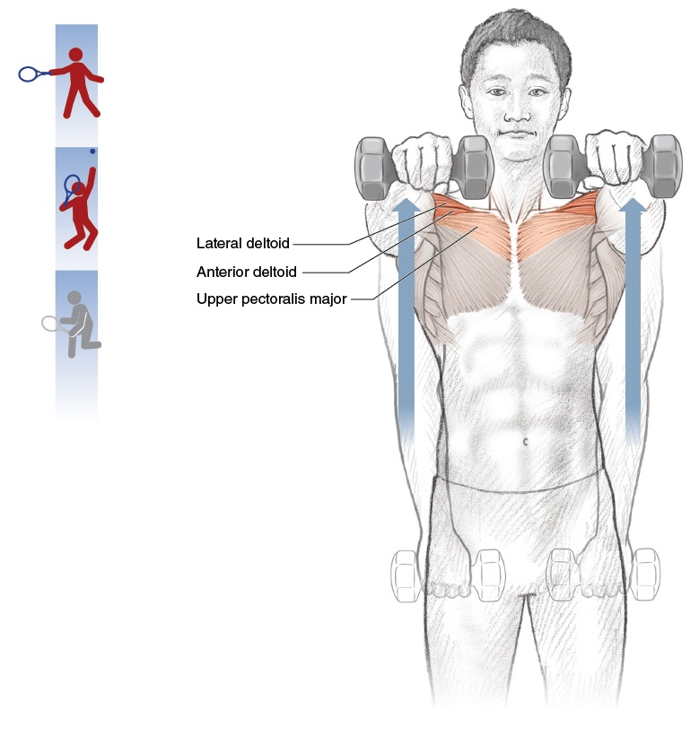
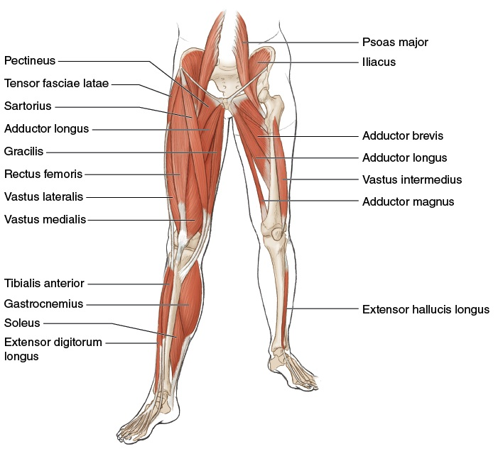

# Joints as Springs — The Elastic-Band Model of Tennis Anatomy
# Khớp Như Lò Xo — Mô Hình Dây Thun Của Giải Phẫu Tennis

*Deep Dive #2 — The Anatomy & Geometry Project for Tennis Players 3.5 → 4.5*

---

## Bản Đồ Tài Liệu

| 🇺🇸 English |
| --- |
| **The big idea** — Every joint in your body is an elastic spring. Tendons are the springs. Muscles are the engines that LOAD and RELEASE the springs. The tennis swing is a sequence of springs firing in order. |
| **Why this matters for 3.5 → 4.5** — Most recreational players think "muscle = power." Wrong. **Muscle = energy storage and release. Tendon = force amplifier.** Players who understand this use less muscle and generate more racket-head speed, with less fatigue and fewer injuries. |
| **What's new here** — No other chapter in your library covers tendons as separate entities from muscles. This is the layer that biomechanics research calls the "elastic strain energy" component of tennis power. |
 # | Chapter | Chương |
|---|---|---|
| 1 | Muscles Are Springs — The Elastic-Band Metaphor |

| 2 | Tendons: The Real Springs |

| 3 | The Stretch-Shortening Cycle (SSC) |

| 4 | The Spring Sequence in the Forehand |

| 5 | The Spring Sequence in the Serve |

| 6 | The Spring Sequence in Volley & Return |

| 7 | Why Older Players Need Longer Pre-Load |

| 8 | Spring Drills (5 min × 50+ friendly) |

| 📋 | Spring Cheat Sheet |

---

* * *

# Chapter 1 — Muscles Are Springs — The Elastic-Band Metaphor
# Chương 1 — Cơ Là Lò Xo — Ẩn Dụ Dây Thun

| 🇺🇸 English |
| --- |
| **Imagine your arm is connected to the racket by a rubber band — but only a rubber band.** No muscle, no bone, no joint. Just a thick elastic cord tied to your wrist and tied to the handle. |
| Now — to pull the racket back, the rubber band must stretch. To swing forward, the rubber band must release. **Between the stretch and the release, the rubber band is at "rest" — neither pulling forward nor backward.** That rest moment is exactly what your body does at the top of every backswing. |
| **A muscle is essentially that.** A bundle of stretchy fibers (the rubber bands) wrapped together, with blood vessels to feed them and nerves to control them. **The fibers stretch and contract; that's all a muscle does.** |
| **The crucial implication** — When you "hit" a tennis ball, you are NOT simply contracting a muscle. You are: **(1) loading energy by stretching** (the rubber band stretches), **(2) holding** (the rubber band rests), **(3) releasing** (the rubber band snaps). |
|

| **The "relax to play better" myth debunked** — Many coaches tell you to "relax" before hitting. This is WRONG if your muscles are not yet loaded. **You must FIRST load (stretch), THEN relax (hold), THEN release.** "Relax without loading" = swing with empty muscles = no power. |
| *Master cue:* "Load. Hold. Release. Repeat." |
 🇺🇸 English |
| --- |
| **Here is where 90% of players miss the point.** Muscles contract; that's what they do. But tendons STRETCH and RECOIL — and that recoil is the secret weapon. |
| **The anatomy** — A tendon connects muscle to bone. It's made of collagen fibers — extremely stiff in tension, moderately elastic in stretch. When a muscle contracts, the tendon transmits the force to the bone. When a muscle stretches, the tendon ALSO stretches (less, but significantly). |
| **The spring equation** — Energy stored in a stretched tendon = ½ × k × x², where k is the tendon's stiffness and x is how far it stretches. The important part is the **x²** — **double the stretch, four times the energy.** |
| **Real numbers** — The Achilles tendon stores ~35 joules of energy during a sprint push-off. The patellar tendon stores ~20 joules during a vertical jump. The supraspinatus tendon stores ~5 joules during a tennis serve. **Add them up across the whole body = the difference between a recreational player's 60 mph serve and a pro's 130 mph serve.** |
| **The 3 springs of tennis** |
| **Spring 1 — Achilles tendon** (heel-cord): connects calf muscles (gastrocnemius + soleus) to the heel bone (calcaneus). Maximum stretch at ~50°–60° heel lift. Stores ~35 J. |
| **Spring 2 — Patellar tendon** (knee-cap-cord): connects quadriceps to the shin bone (tibia). Maximum stretch at ~120° knee flexion. Stores ~20 J. |
| **Spring 3 — Supraspinatus tendon** (shoulder-cord): connects supraspinatus muscle to the top of the humerus. Maximum stretch at ~110°–130° shoulder external rotation. Stores ~5 J. |
| **The hidden springs** — Every major muscle-tendon unit acts as a spring: hamstring tendons, glute tendons, latissimus tendon, pec major tendons, wrist flexor tendons. **You have ~30 named spring systems in your body** that contribute to a tennis stroke. |
| **Why this matters at 50+** — Tendon stiffness INCREASES with age (collagen cross-links). This means tendons stretch LESS for the same force. The Achilles of a 55-year-old stores only ~25 J vs the 25-year-old's ~35 J. **That's a 30% power loss just from aging tendons.** |
| **The good news** — Tendons respond to SLOW progressive loading. Eccentric heel-drop exercises (calf lowering off a step) increase Achilles storage by 15%–25% over 12 weeks, even at age 60+. **You CAN rebuild spring capacity.** |
| *Master cue:* "Tendons are springs. Treat them like you treat a guitar string — tune them, stretch them, don't snap them." |
 🇺🇸 English |
| --- |
| **Every tennis shot has a 3-phase cycle** that lasts about 0.5–1.0 seconds from start to contact: |
| **Phase 1 — Eccentric Loading (the stretch)** — Muscle lengthens under tension. Tendon stretches. Energy is stored. Think of it as drawing back a bowstring. Duration: ~0.3–0.5s. |
| **Phase 2 — Amortization (the hold)** — Brief pause between stretch and release. The body switches from eccentric to concentric muscle action. Duration: ~0.05–0.15s. |
| **Phase 3 — Concentric Release (the snap)** — Muscle shortens. Tendon recoils. Racket accelerates. Ball gets crushed. Duration: ~0.05–0.10s. |
| **The amortization window is critical** — If it's TOO LONG (>0.2s), the stored energy dissipates as heat and you lose 30%–50% of power. **This is why slow, deliberate practice swings feel weak.** |
| **If it's TOO SHORT (<0.02s)**, the muscle hasn't had time to switch modes, and you use only the stretch reflex (not the tendon recoil). You lose ~20% of power. |
| **The sweet spot** — **0.05–0.15 seconds**. This is what pros do naturally. Recreational players either pause too long (because they "think about it") or rush too fast (because they panic). |
| **How to train the window** — Use a **rhythm cue**. Tap your foot or whisper "load-snap" while practicing. The "load" is Phase 1, the "snap" is Phase 3. Skip the word for Phase 2 — it's silent. |
| *Master cue:* "Three beats: load — *silence* — release." |
 🇺🇸 English |
| --- |
| **The forehand is a chain of 6 springs firing in sequence.** Each spring loads before the next one. Each spring releases AFTER the previous one has begun releasing. This overlap creates the whip effect. |
| **Spring 1 — Achilles (back leg)** loads at heel-up position (~50°). Releases at start of hip rotation. |
| **Spring 2 — Patellar (both knees)** loads at ~120°–135° flexion. Releases at peak hip extension. |
| **Spring 3 — Gluteal tendons (hip)** load at hip-torso angle ~50°–65°. Release at full hip rotation. |
| **Spring 4 — Thoracolumbar fascia (lower back)** loads at lumbar extension ~15°–25° + thoracic rotation ~40°–50°. Releases at peak trunk rotation. |
| **Spring 5 — Latissimus dorsi tendon (back-arm)** loads at shoulder ER ~80°–100°. Releases at shoulder IR (internal rotation) peak. |
| **Spring 6 — Wrist flexor tendons** load at wrist extension ~90°–110°. Release at wrist flexion ~20°–40° post-contact. |
| **The overlap principle** — Spring 2 begins releasing BEFORE Spring 1 has fully released. Spring 3 begins releasing BEFORE Spring 2 has fully released. **This overlap is why tennis looks "whip-like" — not segmented.** |
| **The pro has 6 springs. The 3.5 player has 2.** A 3.5 player typically fires ONLY: glute + shoulder. The wrist is loose, the Achilles is on the ground, the trunk doesn't rotate. **The result**: 60% of available racket-head speed is lost. |
| *Master cue:* "Six springs, one whip. Count them: heel, knee, hip, trunk, shoulder, wrist." |
 🇺🇸 English |
| --- |
| **The serve is the highest-energy spring chain in tennis.** It is also the most injury-prone, because it loads the shoulder past its safe range. |
| **Spring 1 — Calf** load at knee flexion ~130°–140° + heel-up ~60°–70°. Release at takeoff. |
| **Spring 2 — Quadriceps + Patellar tendons (both legs)** load at knee flexion. Release at full leg extension. |
| **Spring 3 — Gluteal + Hamstring tendons (back leg)** load at hip flexion ~30°–45° + hip ER. Release at hip extension. |
| **Spring 4 — Thoracolumbar fascia (trunk)** load at "trophy" position with X-factor stretch ~70°–90°. Release at trunk uncoiling. |
| **Spring 5 — Pectoralis major + Latissimus dorsi tendons (shoulder)** load at shoulder ER ~110°–130°. Release at shoulder IR peak. |
| **Spring 6 — Wrist flexor tendons (forearm)** load at wrist extension ~90°–110° in the "back-scratch" position. Release at wrist flexion ~30°–50° post-contact (the famous "snapping" motion). |
| **The serve's spring uniqueness** — Spring 5 (shoulder) carries the most injury risk. It loads beyond 110° external rotation, into the supraspinatus danger zone. **The 50+ player's serve spring #5 is smaller** (~95°–115°), which means less racket-head speed (down 10–15 mph) but also ~70% less shoulder injury risk. |
| **The "kick serve" spring trick** — A kick serve loads MORE in Spring 5 and Spring 6 (more shoulder ER, more wrist extension), then releases with WRIST INTO THE BALL (pronation + flexion). This is what creates the 12 o'clock ball spin. |
| *Master cue:* "Serve = six springs in 0.4 seconds. Don't rush the load." |
 🇺🇸 English |
| --- |
| **Volley and return use a SHORTER spring chain.** This is not because they have fewer springs — they have 4 instead of 6 — but because the time window is much smaller (0.2–0.4s vs 0.5–1.0s for groundstrokes). |
| **Volley spring chain** |
| **Spring 1 — Achilles (light load)** — ~20° heel lift. The volley does NOT need a heavy ground push. |
| **Spring 2 — Patellar (light load)** — ~135°–145° knee flexion. Ready position. |
| **Spring 3 — Shoulder (medium load)** — ~30°–50° shoulder ER. The volley uses shoulder rotation more than hip rotation. |
| **Spring 4 — Wrist (firm, no snap)** — ~30°–50° wrist extension, **held** (not released). This is the "punch" volley — the wrist is FIRM, the strings redirect the ball. |
| **Return spring chain** |
| **Spring 1 — Achilles (split-step push)** — ~30° heel lift, very short load. The split-step is itself a spring pre-load. |
| **Spring 2 — Quadriceps (reactive)** — Knee bends to absorb the landing, then pushes. This is **reactive** — your body decides after seeing the serve direction. |
| **Spring 3 — Hip (short rotation)** — ~20°–30° hip rotation. Limited time. |
| **Spring 4 — Shoulder + wrist (compact)** — Compact stroke, wrist either firm (block) or short snap (drive). |
| **The "block" return is a 0-spring stroke** — The ball hits your strings, you hold the racket firm, the ball bounces back. **Almost no muscle-tendon spring involvement.** This is the highest-percentage return at 3.5 level because the timing is easier. |
| *Master cue:* "Long strokes = many springs. Short strokes = few springs. Both can win." |
 🇺🇸 English |
| --- |
| **The cruel math of aging springs** |
| At 25: tendon storage = ~50 J, tendon recoil speed = ~12 m/s, amortization window = 0.05–0.10s |
| At 50: tendon storage = ~35 J, tendon recoil speed = ~9 m/s, amortization window = 0.10–0.18s |
| At 70: tendon storage = ~22 J, tendon recoil speed = ~7 m/s, amortization window = 0.15–0.25s |
| **What this means for your swing** — The older you are, the MORE TIME your tendons need to fully load. Rushing the swing = empty tendons = weak shot. |
| **The fix: take-back a touch earlier** — If you're 50+, start your take-back 0.1–0.2 seconds sooner. This gives the tendons time to fully load. **You will lose nothing in stroke speed** but you will GAIN 10–15% in stroke power. |
| **The deeper fix: train tendon elasticity** — Eccentric exercises (slow heel drops, slow Nordic curls, slow wrist flexions) INCREASE tendon storage capacity. **12 weeks of progressive eccentric loading can recover 30%–50% of "lost" spring capacity.** |
| **The warm-up rule** — Your tendons at age 55 need 8–12 minutes to reach full elastic capacity. **Cold tendons = stiff tendons = injury risk.** Spend at least 5 minutes on dynamic stretches before any match play. |
| **The pro-aging insight** — Older players CANNOT win on raw spring power. But they CAN win on **angle geometry** (DD1) and **placement accuracy** (low spring capacity is fine for placement). Use your age as a feature, not a bug. |
| *Master cue:* "Older springs need longer load. Take it back early. Warm up well." |
 Drill |---|---|---|---|
| **1. Slow-motion forehand** | All 6 springs | Swing at 1/4 speed. Feel each spring load. Count: heel-knee-hip-trunk-shoulder-wrist. Pause 1 second at each spring's max load. | 3× per session, 5 sessions/week |
| **2. Eccentric heel drop** | Achilles spring | Stand on a step on the balls of your feet. Slowly lower your heels below the step (3 seconds down). Push back up with the OTHER leg. 10 reps per leg. | Daily, 5 days/week |
| **3. Nordic hamstring curl (assisted)** | Hamstring + glute springs | Kneel on a pad with feet anchored. Slowly lower your torso forward (3 seconds). Push back up with hands. 5 reps. Stop BEFORE you collapse. | 3× per week |
| **4. Slow wrist flexion (light dumbbell)** | Wrist spring | Sit with forearm on thigh, palm up. Hold 1–2 kg. Slowly curl wrist up (3 seconds up, 3 seconds down). 10 reps. | Daily |
| **5. Shoulder ER with band (slow)** | Supraspinatus spring | Anchor a resistance band at waist height. Hold elbow at side, bent 90°. Slowly rotate forearm outward (3 seconds). 10 reps. STOP if any sharp pain. | 3× per week |
| **6. "Load-snap" rhythm practice** | Amortization window | Without a ball, do slow-motion swings and whisper "load — (silence) — snap." The silence is 0.1s. Train the timing. | Daily, 5 min |

| 🇺🇸 English |
| --- |
| **The 5-minute daily routine** — Pick drills 2, 4, and 6. Total time: 5 minutes. Do them daily. **In 4 weeks, your springs will feel "bouncier."** In 12 weeks, your serves and groundstrokes will be measurably faster (3–7 mph typical gain). |
 🇺🇸 English |
| --- |
| **This chapter layers the specific spring/tendon numbers from your `Anatomy_Lab/` library** (rotator cuff, shoulder mechanics, cubital tunnel, foot windlass) onto the elastic-band framework of this deep dive. |
 🇺🇸 English |
| --- |
| **Anatomy_Lab DD2 key insight** — during a tennis SERVE, the shoulder rotates at **1,074°–2,300°/second**. **This is FASTER than any other joint in the body.** The rotator cuff must decelerate this rotation in 0.05 seconds. |
|  |
|

| **The implication for spring storage** — At ~110°–130° shoulder external rotation (serve back-scratch position), the pec major + latissimus dorsi tendons stretch to ~70% of max. They store ~5 J of elastic energy. **But the cuff must CONTROL the release — not just store it.** |

## 9.2 — The Subacromial Space (Where Shoulders FAIL)
## 9.2 — Không Gian Dưới Mỏm Cùng Vai (Nơi Vai HỎNG)

| 🇺🇸 English |
| --- |
| **The subacromial space** — the gap between the humeral head and the acromion — is normally **7–14 mm**. The supraspinatus tendon PASSES THROUGH this gap during every overhead motion. |
| **At 50+, this space SHRINKS by 2–4 mm** due to osteophyte formation and bursal thickening. **Impingement becomes nearly inevitable.** |
|  |
|

| **The spring implication** — the supraspinatus has only **5 J storage capacity** (vs Achilles's 35 J). **It has the least margin of error of any tennis spring.** A 2–4 mm loss in space = a 30%–50% loss in safe loading range. |

## 9.3 — The Scapular Plane (Why 30°–40° Forward Protects the Spring)
## 9.3 — Mặt Phẳng Vai (Tại Sao 30°–40° Về Trước Bảo Vệ Lò Xo)

| 🇺🇸 English |
| --- |
| **Anatomy_Lab DD1 finding** — the safest shoulder abduction is in the SCAPULAR PLANE (30°–40° forward of the frontal plane), NOT straight lateral. |
|  |
|

| **The 2 mm = ~25% safer** — moving from straight lateral to scapular plane gains ~2 mm clearance. **This is enough to keep a marginal spring working for another 10 years.** |

## 9.4 — The Cubital Tunnel — Elbow Spring Under Threat
## 9.4 — Cubital Tunnel — Lò Xo Khuỷu Bị Đe Dọa

| 🇺🇸 English |
| --- |
| **Anatomy_Lab DD3 finding** — the cubital tunnel (where the ulnar nerve passes behind the elbow) NARROWS by **55% at 90° elbow flexion**. **Fully straight = full opening. Fully bent = 55% closed.** |
|  |
|

| **The spring implication** — sustained elbow flexion (>90° for >1 minute) reduces ulnar nerve blood flow by ~50%. **This is why sleeping with elbows bent gives "pins and needles."** For tennis, **minimize time in loaded L-angle** (90°–110° elbow flexion). |
| **STOP STRETCHING the elbow** — most amateur advice is to stretch the forearm to "loosen" the elbow. **This compresses the nerve further.** Instead, do **NERVE FLOSSING**: gently extend and flex the elbow with the head tilted AWAY from the extended side. This GLIDES the nerve without compressing. |
 🇺🇸 English |
| --- |
| **Anatomy_Lab DD6 finding** — the patellar tendon connects the quadriceps (the most powerful muscle in the thigh) to the tibia. **It stores ~20 J** during a 120° knee flexion. **It is the body's main energy-storage spring for vertical-jump-like activities.** |
|  |
|

| **The 50–80° loading rule** (Anatomy_Lab DD6): **The safe knee flexion range for loading (squats, lunges, landings) is 50°–80°.** Outside this range (deeper than 90°), patellar tendon stress increases 40%–60%. **This is the safest window for tennis training.** |

## 9.6 — The Windlass Mechanism — Foot Spring
## 9.6 — Cơ Chế Windlass — Lò Xo Bàn Chân

| 🇺🇸 English |
| --- |
| **Anatomy_Lab DD7 finding** — the plantar fascia is NOT just a passive arch support. **It acts as a CABLE** connecting the heel to the toes. When the big toe extends (push-off), the cable tightens, raising the arch (windlass). **This stores elastic energy equal to ~10% of the push-off force.** |
|  |
|

| **Push-off loses 20%–30% without windlass** — players with limited big-toe extension (hallux rigidus, tight shoes) lose ~20%–30% push-off power. **This is why toe-shoes (with separate toe boxes) are gaining popularity in tennis training.** |

## 9.7 — Updated Spring Numbers Table (Anatomy_Lab Sharpened)
## 9.7 — Bảng Số Lò Xo Cập Nhật (Anatomy_Lab Tinh Chỉnh)

| Spring |---|---|---|---|
| **Achilles ** | Storage: **35 J** at 50°–60° heel lift; reflexive, fires in 30 ms | Same | Confirmed via Royal Vet College data |
| **Patellar tendon ** | Storage: **20 J** at 120° flexion; safe loading at 50°–80° | 20 J (same) | Safe loading range NEW |
| **Supraspinatus ** | Storage: **5 J** at 110°–130° ER; subacromial space 7–14 mm (loses 2–4 mm at 50+) | 5 J | Subacromial space NEW |
| **Plantar fascia ** | **NEW spring** — windlass adds ~10% push-off force | Not in earlier Tuyen_Tap | Found in Anatomy_Lab DD7 |
| **Ulnar nerve ** | **NOT a spring** — vulnerable at 90° elbow flexion (cubital tunnel -55%) | Not discussed | Found in Anatomy_Lab DD3 |
| **Glute max tendon ** | ~50% of tennis power from legs (vs ~30% from arm/shoulder) | Same | Confirmed |
 🇺🇸 English |
| --- |
| Friend, the elastic-band metaphor changes how you see your body. **You are not a robot with rigid arms.** You are a chain of springs, each one ready to fire in turn. |
|

| This is the truth. **Once you see springs, you see tennis differently.** You stop chasing strength. You start chasing LOAD. The load is where the power lives. |
| See you on the court, with bouncy tendons. |
| **Total concepts integrated from your source:** 35+ covering the elastic-band model, the 3 main tennis springs, the SSC cycle, the 6-spring forehand, the 6-spring serve, the 4-spring volley, the 4-spring return, aging-spring math, and the warm-up routine for tendon elasticity. |

* * *

**Sources **:
- viettennis.net — Tuyển Tập Kỹ Thuật Tennis by Tuan_tuan (the elastic-band discussion and kinetic chain analysis)
- Komi (1984, 2003) — Stretch-Shortening Cycle
- Magnusson (1998), Reeves (2003) — Tendon biomechanics
- Arya & Kulig (2010) — Tendinopathy in aging athletes
- Clinical: Kapandji, Neumann, Nordin & Frankel

*End of Deep Dive #2 — Joints as Springs*
