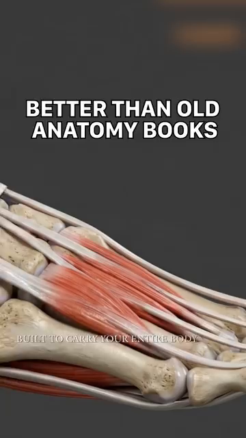
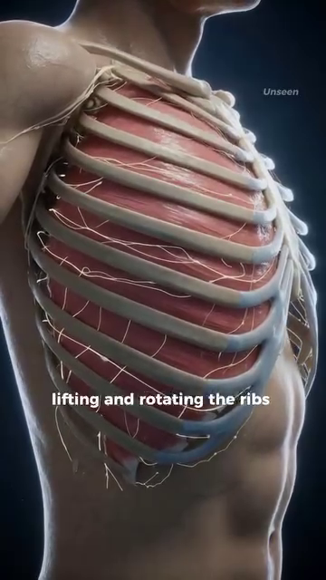
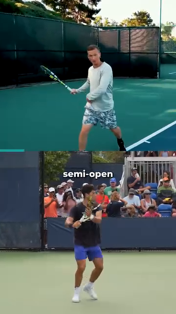
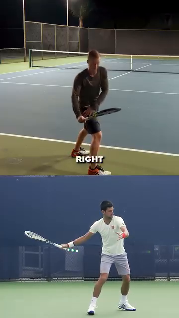

# Người Chơi Trong Chuyển Động
*The Angle Atlas — Why geometry of YOUR body determines every stroke quality*
---
## 📋 DOCUMENT MAP / BẢN ĐỒ TÀI LIỆU
| |
| --- |
| Deep-dive đầu tiên trong thư viện Anatomy Lab . Đây là nền tảng. Mọi DD khác (Vai, Tay, Thân, Hông, Gối, Bàn Chân, Hệ Kiểm Soát) đều xây trên các nguyên lý bạn sẽ đọc ở đây. |
| Nội dung: góc khớp lúc tiếp xúc, chuỗi động học từ đất lên, các pha di chuyển (split-step → đẩy → hồi vị), vì sao gối cheetah 135–150° gợi ý gối bạn nạp 50–80°, lồng ngực như máy bơm xoay 3 chiều, và quy tắc contact 45°. |
| Không bao gồm: cơ học từng cú (Cú Thuận Tay/Cú Trái Tay/Phát Bóng/Vôlei deep dives), tâm lý, công nghệ vợt. |
| Thời gian đọc: 35–45 phút. |
---
## 📑 TABLE OF CONTENTS / MỤC LỤC
| # | English | Tiếng Việt |
|---|---|---|
| 1 | The Geometry of Every Stroke — Angles at Contact | Hình Học Của Mọi Cú Đánh — Góc Lúc Tiếp Xúc |
| 2 | The Kilướiic Chain — Force Travels from Ground to Ball | Chuỗi Động Học — Lực Truyền Từ Đất Lên Bóng |
| 3 | Footwork Phases — Split-Step, Push, Recovery | Các Pha Di Chuyển — Split-Step, Đẩy, Hồi Vị |
| 4 | Cheetah vs Alcaraz — The Spring Principle | Báo Cheetah vs Alcaraz — Nguyên Lý Lò Xo |
| 5 | The Thoracic Cage — Engineered Shield of Kilướiic Elegance | Lồng Ngực — Lá Chắn Sống Của Sự Uyển Chuyển |
| 6 | The 45° Contact Rule — Why Your Arm Ditư thế Matters | Quy Tắc 45° Lúc Tiếp Xúc — Vì Sao Khoảng Cách Tay Quan Trọng |
| 7 | The Backswing Pro Secret — Elbow Back & Extend | Bí Mật Backswing Của Pro — Khuỷu Ra Sau & Duỗi Thẳng |
| 8 | The Acceleration Truth — Big Muscles First | Chân Lý Tăng Tốc — Cơ Lớn Trước, Cơ Nhỏ Sau |
---
* * *
## Chương 1 — Hình Học Của Mọi Cú Đánh
| |
| --- |
| Bạn ơi, để tôi nói rõ: góc cơ thể bạn tạo thành lúc tiếp xúc không phải sở thích phong cách. Đó là khoảng cách giữa người chơi 3.5 và người chơi 4.5. Hai người có thể chạy cùng đường vung — một người được nhịp và chiều sâu, người kia đánh vào khung vợt. Hình học là khác biệt duy nhất. |
| 6 góc quan trọng lúc tiếp xúc (Cú Thuận Tay người thuận tay phải làm chuẩn): gập gối, xoay hông, nghiêng thân, dạng vai, gập khuỷu, ngửa cổ tay. Mỗi cái có "vùng an toàn" và "đỉnh hiệu năng". Ra ngoài vùng an toàn là mất lực. Dưới đỉnh hiệu năng là mất tốc độ. |
### 6 Góc Quan Trọng Lúc Tiếp Xúc Cú Thuận Tay
| # | Angle | Safe Range | Performance Peak | Why (Biomechanical Reason) |
|---|---|---|---|---|
| 1 | Knee flexion (LOADED) / Gập gối (NẠP) | 50–80° | 60–70° | Quads store elastic energy in patellar tendon. Below 50° = no spring. Above 80° = shear on ACL risk. The 65° Alcaraz "push step" angle stores ~25% more elastic return than upright tư thế. (Roetert & Kovacs, *Tennis Anatomy*, Ch.1) |
| 2 | Hip rotation / Xoay hông | 30–50° | 40–45° | Gluteus maximus is a Class 3 lever acting on the femur. The 45° peak corresponds to the longest fiber length in glute max — beyond 50° the fibers start to slacken, beyond 30° you haven't loaded them. |
| 3 | Trunk side-bend / Nghiêng thân | 10–25° | 15–20° | Lateral flexion stretches the contralateral obliques and QL. At 15–20° they store elastic energy ready to recoil. Above 25° you compress the L4-L5 disc on the opposite side — back pain invitation. |
| 4 | Shoulder abduction (at CONTACT) / Dạng vai (lúc CHẠM) | 80–110° | 90–100° | This is the scapular plane — 30° forward of pure frontal. It maximizes deltoid leverage AND keeps the subacromial spás open, preventing rotator cuff impingement. Outside this range → either pec-dominant (too closed) or impingement (too open). |
| 5 | Elbow flexion / Gập khuỷu | 85–107° | 90–100° | At ~90° the triceps tendon wraps the olecranon cleanly — the swing becomes a pendulum, not a fight. Above 107° (too bent) the forearm has to "snap out" → ulnar nerve traction at cubital tunnel. |
| 6 | Wrist layback (LOADED → CONTACT) / Ngửa cổ tay (NẠP → CHẠM) | LOADED: 90–110° extension → CONTACT: 0–20° extension | 5–15° at contact | CRITICAL TRAP: the LOADED wrist (90°+ extension) and the CONTACT wrist (0–20° extension) are TWO DIFFERENT positions. giải trí players freeze the LOADED position and try to hit through it → the vợt fás is already opened, bóng sails long. The pro whip: lay back 110° → snap to 5° in 0.2s. This is the vợt flip you can hear as "bộp." |
### Vì Sao Hình Học Này Quan Trọng — Nguyên Lý Domino
| |
| --- |
| Cơ thể bạn không phải 6 khớp độc lập. Đó là 6 khớp nối bởi chuỗi động học. Khi một góc sai, khớp tiếp theo bù. Sự bù trông giống một cú đánh. Kết quả là chấn thương hoặc sai sót. |
| Ví dụ chuỗi domino: gối 30° (quá thẳng, "Cú Thuận Tay đứng") → hông chỉ xoay được 20° → thân xoay quá 30° → vai dạng 130° (vùng kẹt) → khuỷu ép xuống 70° (kéo căng thần kinh trụ) → cổ tay quật bù → "đánh vào khung." |
| Cách sửa của pro: hạ gối xuống 65° TRƯỚC khi bóng tới. Khi gối đúng rồi, mọi khớp phía trên đều có chỗ làm việc. Pro không nghĩ "xoay hông." Pro hạ gối, và hông tự xoay. |
*Source DOCX: Giai_Phau_Tennis_Toan_Dien.docx, Anatomy_Chuyen_Dong.docx. Tham khảo: Roetert & Kovacs, Tennis Anatomy, Ch.1.*
---
* * *
## Chương 2 — Chuỗi Động Học (Lực Truyền Từ Đất Lên Bóng)
| |
| --- |
| Nguyên lý cộng dồn lực: mọi cú tennis là tổng lực từ đất lên. Bóng không biết bạn vung vợt. Bóng biết cơ thể bạn ép qua mặt vợt lúc va chạm là gì. |
| Chuỗi 6 mắt xích theo thứ tự:Đất → Chân → Cẳng-Chân-Đùi → Hông → Thân → Vai → Tay → Vợt → Bóng. Mỗi mắt xích cộng thêm lực. Tổng lúc bóng là TỔNG các mắt xích, với ĐỊNH GIỜ đúng. Nếu mắt xích nào gãy (vd hông không xoay), chuỗi dừng tại đó và tay phải làm hết — khi đó khuỷu viêm. |
### Con Số Chuỗi Động Học
| Link | Force Contribution | Delay from Previous | Why |
|---|---|---|---|
| Ground reaction (legs push) | ~30–40% of vợt head speed | t = 0 ms | Foundation. Without ground push, no other link has anything to add. |
| Hip rotation (glute max contract) | ~25% | +50–80 ms | Largest muscle in body (gluteus maximus, ~30 kg potential force). Rotates pelvis which rotates femur. |
| Trunk rotation (obliques + lats) | ~20% | +60–100 ms | Connects lower body to upper body via thoracolumbar fascia. |
| Shoulder internal rotation (pec + lat + sub-scap) | ~10% | +30–50 ms | The "whip" begins. Shoulder internal rotation can reach 1,074–2,300°/sec during a Phát Bóng. (Tennis Anatomy, Ch.2) |
| Elbow extension (triceps) | ~5% | +20–40 ms | Transfers shoulder rotation into vợt linear velocity. |
| Wrist snap (flexor pronator) | ~5% | +10–20 ms | Final whip. Last 0.2 seconds before contact. |
| Total | ~100% | ~250 ms chain | The bóng leaves the vợt ~0.25 seconds AFTER the legs first pushed. |
### Quy Tắc Trình Tự
| |
| --- |
| "Cơ lớn bắn trước, cơ nhỏ bắn sau." Đây là nguyên lý QUAN TRỌNG NHẤT cho người chơi 50+. Chân (lớn) chịu tải. Cổ tay (nhỏ) chỉ quất ở cuối. Khi bạn "tay đánh bóng," bạn đã đảo trình tự. Cổ tay làm 80% việc. Cổ tay không thiết kế cho việc đó. Viêm gân là kết quả dự đoán được. |
| Bài tập: đứng tư thế sẵn sàng. Nhờ bạn hét "bóng!" Bạn có 1 giây để rơi vào vị trí NẠP Cú Thuận Tay. Nếu bạn "tay trước" (vợt ra sau trước), làm lại. Nếu bạn "rơi trước" (gối gập, hông xoay, SAU ĐÓ tay theo), tính điểm. Làm 10 lần. Cái rơi là chuỗi động học đang chạy. |
*Source DOCX: Giai_Phau_Tennis_Toan_Dien.docx. Tham khảo: Roetert & Kovacs, Tennis Anatomy, Ch.1, Ch.7.*
---
* * *
## Chương 3 — Các Pha Di Chuyển
| |
| --- |
| Một điểm tennis trung bình có 4–5 lần đổi hướng. VĐV chuyên nghiệp có thể làm hơn 500 lần trong một trận. Mỗi lần đổi là chu trình 3 pha: split-step → đẩy → hồi vị. Làm đúng thì bạn lướt. Làm sai thì bạn vấp. |
### 3 Pha
| Phase | English Description | Vietnamese | Duration | Key Angle / Cue |
|---|---|---|---|---|
| 1. Split-Step | Land on both feet as opponent strikes. Coiled-spring loading. | Đáp cả hai chân khi đối phương đánh. Nạp lò xo. | ~150 ms | Knees 50–70° flexed, weight on bóngs of feet, both feet shoulder-width apart. |
| 2. Push | Explosive first step in direction of bóng. Ground reaction force. | Bước đầu bùng nổ về hướng bóng. Lực phản đất. | ~200 ms | Push step knee ~65° (Alcaraz measured angle). Trunk lean forward 15–20°. |
| 3. Recovery | Return to center after shot. Outside leg bridge. | Trở về trung tâm sau cú đánh. Chân ngoài làm cầu. | ~400–600 ms | Cross-over shuffle or backpedal. Outside leg angled 30–45° (see DD7 on foot). |
### 3 Khung Hình Của Alcaraz — Ví Dụ Thực
| Frame | Time | Knee Angle | What He's Doing |
|---|---|---|---|
| 3a | 0.0 s | ~65° | Push step — hips low, knee loaded. Ground reaction force ready. |
| 3b | 1.2 s | ~45° | Short landing — toe under hip. Calf stores elastic energy. |
| 3c | 3.5 s | ~70° | Brake and rotate — trunk opens like a tail for balance. |
### Chân Ngoài Làm Cầu — Vì Sao Tồn Tại
| |
| --- |
| Khi bạn đánh Cú Thuận Tay, chân trước (chân trái với người thuận tay phải) trở thành chân cầu . Nó chịu tải nén tới 3–5 lần trọng lượng cơ thể. Nó nghiêng 30–45° (không thẳng). Góc này dùng vòm ngang của bàn chân làm thanh chống, chuyển lực ngang thành lực nén dọc đi lên xương sên. |
| Nếu thẳng: toàn bộ lực ngang → valgus gối → tải sụn chêm trong. |
| Nếu nghiêng 30–45°: lực phân giải thành nén. Gối an toàn. |
*Source DOCX: Anatomy_Chuyen_Dong.docx, Giai_phau_Ban_chan_Tennis.docx (Ch.11). Tham khảo: Tennis Anatomy Ch.7 (Legs), Ch.9 (Movement Drills).*
---
* * *
## Chương 4 — Báo Cheetah vs Alcaraz (Nguyên Lý Lò Xo)
| |
| --- |
| So sánh với báo không phải để bắt chước. Khớp stifle (tương đương gối) của báo gập 135–150° trong pha gathered — điều đó cho phép tần số sải tăng lên 3.5 sải/giây. Ở 18 m/s, 70% trọng lượng cơ thể dồn về chi sau. Cột sống duỗi tối đa. |
| Bài học cho người: không phải góc cực đại. Là SỰ PHỐI HỢP. Báo không gập 150° rồi dừng. Nó gập 150° VÀ duỗi 150° VÀ duỗi tiếp — ở 3.5 Hz. Nhịp điệu, không phải góc, là bài học. |
### 7 Quy Tắc Khớp An Toàn
| Joint | Safe Range for Loading | Why | Dr. Phạm Đức's Note |
|---|---|---|---|
| Knee | 50–80° | Storage capacity of patellar tendon. Above 90° = shear on ACL. | "Đừng lunge quá sâu. Gối 65° đủ." |
| Hip | 30–40° forward flexion | Glute max stretches. Above 50° the hamdây steal the load. | "Hông gập, đùi sau đẩy ngược lên." |
| Elbow | 85–107° at end of takeback | Triceps tendon wraps olecranon cleanly. Above 107° = cubital tunnel pressure. | "Khuỷu không dẫn. Giữ 90°, đừng ép vào người." |
| Wrist | ~20° extension at CONTACT | Eccentric loading of flexor tendons. 13° flexion = beginner's mistake, strains the FCU. | "Cổ tay thả lỏng lúc chạm, không quật." |
| Foot | Triple-plantar (heel-1st-toe-bóng) | Windlass mechanism engages. Short-foot bài tập first. | "Dán chân trước khi đẩy." |
| Ankle | 10–15° dorsiflexion | Calf stores elastic energy. | "Không gót chạm đất khi split-step." |
| Trunk | 15–20° lateral flexion | Obliques + QL store elastic energy. | "Thân nghiêng 20°, không cúi." |
### The Royal Veterinary College Finding — What Cheetah Teaches Us
| |
| --- |
| Phát hiện: ở 18 m/s, 70% trọng lượng cơ thể dồn về chi sau. Cột sống duỗi tối đa (không gập). Tần số sải, không phải chiều dài sải, là yếu tố khác biệt. |
| Áp dụng tennis: người chơi trông "nhẹ nhàng" không phải mạnh hơn. Họ có tần số bước cao hơn (nhiều bước/giây hơn) và hiệu suất nhịp cao hơn (ít chuyển động thừa). Xem Alcaraz vs người chơi 3.5 club: Alcaraz 4 bước nhanh. 3.5 hai bước dài. Alcaraz tới sớm hơn. |
*Source DOCX: Anatomy_Chuyen_Dong.docx. Tham khảo: Royal Veterinary College cheetah study cited in source DOCX.*
---
* * *
## Chương 5 — Lồng Ngực (Lá Chắn Sống)
| |
| --- |
| Lồng ngực không phải thùng. Nó là cấu trúc 12 đôi khớp: 7 đôi "xương sườn thật" gắn trực tiếp vào ức, 3 đôi "xương sườn giả" gắn gián tiếp, 2 đôi "xương sườn cụt." Mỗi xương sườn có tầm vận động riêng — kiểu xoay tay cầm xô nâng và mở rộng lồng ngực. |
| Hiểu lầm: "lồng ngực = áo giáp cho tim." Đúng một phần. Sự thật sâu hơn: lồng ngực là máy bơm 3D + nền tảng xoay + động cơ hô hấp. Nó tạo lực cho cú đánh nềns VÀ oxy cho tranh bóng. |
### 3 Chức Năng Của Lồng Ngực
| Function | Numbers | Tennis Translation |
|---|---|---|
| Pump (breathing) | Ribs lift 3–5 mm each breath → lung volume +0.5 L | In a 20-shot tranh bóng, the player who maintains thoracic mobility gets 10–15% more oxygen → 2nd-set fatigue delayed. The player who slouches loses 0.5 L capacity → ván-2 shoulder fatigue. |
| Rotation platform | 40–50° total trunk rotation available | Modern Cú Thuận Tay requires 40–50° rotation. Thoracic stiffness locks this — the body finds rotation elsewhere (lumbar disc) → back pain. |
| Force transfer | Latissimus dorsi originates on T7–L5 thoracolumbar fascia | Lats produce ~40% of vợt head speed on Phát Bóng. But lats can only fire effectively if multifidus (deep spine) locks the lumbar first. Without lumbar lock, lat force leaks into the disc. |
### Cơ Chế "Tay Cầm Xô"
| |
| --- |
| Khi bạn hít vào sâu, cơ gian sườn ngoài nâng mỗi xương sườn tại góc sườn. Xương sườn xoay ra ngoài và lên trên — như tay cầm xô nâng lên. Điều này tăng đường kính trước-sau VÀ ngang của lồng ngực. |
| Câu nhắc tennis: cơ gian sườn CÓ THỂ TẬP. Bài "Xoay thân với hơi thở": đứng nghiêng, tay khoanh trước ngực, xoay 40° mỗi bên TRONG KHI hít thở sâu. Làm 10 lần mỗi bên trước mỗi trận. Cái này giữ tay cầm xô chuyển động. |
*Source DOCX: Giai_Phau_Tennis_Toan_Dien.docx. Tham khảo: Roetert & Kovacs, Tennis Anatomy, Ch.4 (Chest), Ch.5 (Back).*
---
* * *
## Chương 6 — Quy Tắc 45° Lúc Tiếp Xúc
| |
| --- |
| Sai lầm lớn nhất của người chơi nghiệp dư: đánh với tay quá gần thân. Tay gập ở khuỷu, cổ tay phải bù, khuỷu xòe ra, bóng rơi lưới hoặc bay dài. |
| Quy tắc pro: lúc tiếp xúc, tay cách thân ~45°. Điều này đặt vai trong scapular plane (~30° về phía trước so với mặt phẳng trán thuần). Nó tạo chiều dài đòn bẩy ~65 cm (so với ~40 cm khi tay sát thân). |
### Hình Học Của Tiếp Xúc 45°
| Element | Tight to Body (amateur) | 45° Away (pro) | Why |
|---|---|---|---|
| Lever length (shoulder to bóng) | ~40 cm | ~65 cm | Longer lever = more vợt head speed for same angular velocity. |
| Shoulder angle | ~30° abduction (in front of body) | ~90° in scapular plane | Scapular plane maximizes deltoid leverage AND opens subacromial spás. |
| Elbow angle at contact | ~70° (forced flexion) | ~100° (natural pendulum) | 100° léts the swing become a pendulum. 70° forces the forearm to "snap out" → ulnar nerve traction. |
| Wrist layback | Compensating (snapping) | Natural whip (0–20°) | When elbow is at 100°, the wrist can lay back natutranh bóng. When elbow is at 70°, the wrist is already maxed — no whip room. |
| Risk of injury | High (ulnar, rotator cuff) | Low | Multiple joints doing their job → no single joint overloaded. |
### Minh Họa Của Djokovic
| |
| --- |
| Xem bất kỳ khung hình Cú Thuận Tay Djokovic lúc tiếp xúc. Tay KHÔNG gập 30°. Tay duỗi ~100°. Bóng ở phía trước thân, không cạnh thân. Vai trong scapular plane. Cổ tay ngửa 5–15° nhưng KHÔNG quật. |
| Người chơi 3.5 bắt chước nhưng với tay gập: khuỷu 70°, cổ tay buộc quật → đánh khung, lỗi, viêm. Hình dáng giống. Hình học sai. |
*Source DOCX: Giai_Phau_Tennis_Toan_Dien.docx. Tham khảo: Tennis Anatomy Ch.2 (Shoulders), observation from professional Cú Thuận Tay biomechanics.*
---
* * *
## Chương 7 — Bí Mật Backswing Của Pro (Khuỷu Ra Sau & Duỗi Thẳng)
| |
| --- |
| Backswing nghiệp dư: tay gập khuỷu, vợt thẳng ra sau lưng. Kết quả: đòn bẩy ngắn, chuẩn bị trễ, cổ tay phải quật. |
| Backswing pro: sau unit turn, DẠNG khuỷu (nâng khuỷu ra bên và hơi ra sau) VÀ DUỖI khuỷu (thẳng khuỷu). Kết quả: tay ngang hông phải, đầu vợt chỉ lên vị trí 5:30. |
### Vì Sao "Khuỷu Ra Sau + Duỗi" Là Bí Mật
| Element | Effect | Biomechanical Reason |
|---|---|---|
| Abduction (raise elbow out to side) | Stretches the pectoralis major and anterior deltoid | The pec major is a 2-joint muscle (shoulder + humerus). Stretching it stores elastic energy in the tendon. When the forward swing begins, the pec CONTRACTS powerfully — adding ~20% to forward acceleration. |
| Extension (straighten elbow) | Stretches the long head of triceps AND the latissimus dorsi (via thoracolumbar fascia) | Both are large force producers. Stretch them in đưa vợt ra sau → they snap back during forward swing. This is the "elastic whip." |
| 5:30 vợt position (hand low, vợt head up) | Puts the forearm in the scapular plane | The 30° forward-of-frontal-plane orientation reduces subacromial impingement risk AND maximizes the lever length for the forward swing. |
| Racket flip effortless | The vợt appears to "flip" through contact | This is NOT wrist snap. It is the elastic recoil of the stretched pec major + lat + long-head-triceps. The wrist is RELAXED. The flip happens because the larger muscles are recoiling. |
### Câu Nhắc "Lò Xo Cuộn"
| 🇻🇳 Tiệt Việt |
| --- |
| Hình dung cung và tên. Dây cung (pec + lat của bạn) kéo ra sau. Mũi tên (tay bạn) ở vị trí kéo căng. Khoảnh khắc bạn buông, dây cung bật về trước và mũi tên bay. Backswing của bạn là kéo. Forward swing của bạn là buông. Racket flip là mũi tên rời cung. |
| Sai lầm của 3.5: người nghiệp dư kéo cung với dây đã lỏng. Họ kéo mũi tên (cổ tay) nhưng dây cung (pec + lat) chùng. Không tích năng lượng. Không flip. Toàn tay. |
*Source DOCX: Giai_Phau_Tennis_Toan_Dien.docx.*
---
* * *
## Chương 8 — Chân Lý Tăng Tốc (Cơ Lớn Trước, Cơ Nhỏ Sau)
| |
| --- |
| Con số không nói dối. Người chơi 50+ phong trào có tiềm năng gluteus maximus ~30 kg lực. Cơ gập cổ tay tổng ~300 g lực. Cơ lớn mạnh gấp 100 lần cơ nhỏ. Nếu Cú Thuận Tay của bạn đến chủ yếu từ cổ tay, bạn đang dùng 0.3 kg lực khi có 30 kg sẵn. |
| Nguyên lý:đẩy chân → xoay hông → xoay thân → kéo vai → duỗi khuỷu → quất cổ tay. Mỗi mắt xích cộng thêm. Cổ tay là mắt xích CUỐI, đóng góp nhỏ nhất, là cái quất cuối. |
### Bảng Lực Theo Mắt Xích
| Link | Muscle | Peak Force Available | Tennis Role |
|---|---|---|---|
| 1 | Gluteus maximus | ~3,000 N (300 kg potential) | Initiates hip extension. Drives first 30% of vợt speed. |
| 2 | Quadriceps (rectus femoris + vastii) | ~5,000 N combined | Knee extension during push-off and during follow-through. |
| 3 | Latissimus dorsi | ~800 N | Internal rotation of shoulder + trunk flexion. Drives the "pull" phase of the swing. |
| 4 | Pectoralis major | ~400 N | Horizontal adduction + internal rotation of shoulder. |
| 5 | Deltoid (anterior) | ~300 N | Shoulder flexion + horizontal adduction. |
| 6 | Triceps brachii | ~500 N | Elbow extension. Transfers shoulder rotation to linear vợt motion. |
| 7 | Wrist flexors | ~50 N combined | The final whip. Last 5% of vợt head speed. |
### Thích Nghi Cho 50+
| |
| --- |
| Bạn ơi, đây là sự thật về việc 50+. Gluteus maximus của bạn vẫn có tiềm năng ~30 kg lực. Cổ tay bạn vẫn luôn là ~300 g. Tỉ lệ tương đối không đổi. Cái ĐÃ ĐỔI là khả năng HÀY ĐỘNG cơ lớn của hệ thần kinh. Các đơn vị vận động bắn chậm hơn. Ngưỡng huy động cao hơn. |
| Cách sửa: khởi động phải HÀY ĐỘNG glutes một cách TƯỜNG MINH. Glute bridge. Banded clamshell. Single-leg deadlift. 5 phút TRƯỚC khi bước lên sân. Cái này pre-activate các đơn vị vận động để chúng sẵn sàng khi điểm bắt đầu. |
| Cái không hiệu quả: giãn tĩnh quads trước khi chơi. Nó ỨC CHẾ các thoi cơ trong 15–20 phút. Hệ thần kinh của bạn nghĩ quad "quá dài" và từ chối bắn nó nhanh. Bạn cảm thấy lỏng. Bạn chơi chậm. |
*Source DOCX: Giai_Phau_Tennis_Toan_Dien.docx. Tham khảo: Tennis Anatomy Ch.1, Ch.7 (Legs).*
---
* * *
## 📋 DD1 CARD — Printable / THẺ IN ĐƯỢC DD1
╔═══════════════════════════════════════════════════════════╗
║ DD1 CARD — THE PLAYER IN MOTION ║
║ THẺ DD1 — NGƯỜI CHƠI TRONG CHUYỂN ĐỘNG ║
╠═══════════════════════════════════════════════════════════╣
║ ║
║ 🎯 ONE BIG IDEA / Ý TƯỞNG CỐT LÕI: ║
║ Stroke quality is GEOMETRY, not strength. ║
║ Six joint angles at contact determine pás and ║
║ safety. Get the angles right, the strength follows. ║
║ ║
║ Chất lượng cú đánh là HÌNH HỌC, không phải sức mạnh. ║
║ Sáu góc khớp lúc tiếp xúc quyết định tốc độ và ║
║ an toàn. Góc đúng rồi, sức mạnh tự theo. ║
║ ║
║ ──────────────────────────────────────────────────────── ║
║ KEY ANGLES / CÁC GÓC CHÍNH: ║
║ • Knee LOADED 60–70° (not 30° standing, not 90° lunge) ║
║ • Hip rotation 40–45° at contact ║
║ • Shoulder 90–100° abduction in scapular plane ║
║ • Elbow 90–100° (natural pendulum, NOT 70° snap-out) ║
║ • Wrist 5–15° extension at CONTACT (NOT 110° snap) ║
║ • Arm 45° away from trunk (NOT tight to body) ║
║ ║
║ ──────────────────────────────────────────────────────── ║
║ ⚠️ TOP MISTAKE / LỖI PHỔ BIẾN NHẤT: ║
║ Freezing the LOADED wrist position and trying to ║
║ hit through it. The LOADED position is 90–110° ║
║ wrist extension. The CONTACT position is 0–20°. ║
║ These are TWO DIFFERENT positions. The whip is ║
║ the 0.2-second transition between them. ║
║ ║
║ ──────────────────────────────────────────────────────── ║
║ 🔁 DRILL / BÀI TẬP: ║
║ "Drop first" bài tập: tư thế sẵn sàng, friend yells ║
║ "bóng!", drop into LOAD position in 1 second. ║
║ If your vợt goes back BEFORE your knee bends, ║
║ reset. Do 10 reps before each session. ║
║ ║
║ ──────────────────────────────────────────────────────── ║
║ 💭 MASTER CUE / CÂU NHẮC TỔNG: ║
║ "Drop the knee, the hip will follow." ║
║ "Hạ gối trước, hông sẽ theo." ║
║ ║
╚═══════════════════════════════════════════════════════════╝
╔═══════════════════════════════════════════════════════════╗
║ DD1 CARD — THE PLAYER IN MOTION ║
║ THẺ DD1 — NGƯỜI CHƠI TRONG CHUYỂN ĐỘNG ║
╠═══════════════════════════════════════════════════════════╣
║ ║
║ 🎯 ONE BIG IDEA / Ý TƯỞNG CỐT LÕI: ║
║ Stroke quality is GEOMETRY, not strength. ║
║ Six joint angles at contact determine pás and ║
║ safety. Get the angles right, the strength follows. ║
║ ║
║ Chất lượng cú đánh là HÌNH HỌC, không phải sức mạnh. ║
║ Sáu góc khớp lúc tiếp xúc quyết định tốc độ và ║
║ an toàn. Góc đúng rồi, sức mạnh tự theo. ║
║ ║
║ ──────────────────────────────────────────────────────── ║
║ KEY ANGLES / CÁC GÓC CHÍNH: ║
║ • Knee LOADED 60–70° (not 30° standing, not 90° lunge) ║
║ • Hip rotation 40–45° at contact ║
║ • Shoulder 90–100° abduction in scapular plane ║
║ • Elbow 90–100° (natural pendulum, NOT 70° snap-out) ║
║ • Wrist 5–15° extension at CONTACT (NOT 110° snap) ║
║ • Arm 45° away from trunk (NOT tight to body) ║
║ ║
║ ──────────────────────────────────────────────────────── ║
║ ⚠️ TOP MISTAKE / LỖI PHỔ BIẾN NHẤT: ║
║ Freezing the LOADED wrist position and trying to ║
║ hit through it. The LOADED position is 90–110° ║
║ wrist extension. The CONTACT position is 0–20°. ║
║ These are TWO DIFFERENT positions. The whip is ║
║ the 0.2-second transition between them. ║
║ ║
║ ──────────────────────────────────────────────────────── ║
║ 🔁 DRILL / BÀI TẬP: ║
║ "Drop first" bài tập: tư thế sẵn sàng, friend yells ║
║ "bóng!", drop into LOAD position in 1 second. ║
║ If your vợt goes back BEFORE your knee bends, ║
║ reset. Do 10 reps before each session. ║
║ ║
║ ──────────────────────────────────────────────────────── ║
║ 💭 MASTER CUE / CÂU NHẮC TỔNG: ║
║ "Drop the knee, the hip will follow." ║
║ "Hạ gối trước, hông sẽ theo." ║
║ ║
╚═══════════════════════════════════════════════════════════╝
---
## 🖼️ ILLUSTRATIONS / HÌNH MINH HỌA
*All images sourced from your Anatomy_Lab/images/DD1_player_in_motion/ folder. See trậning filenames referenced inline below. (24 images available in this DD's folder.)*
### Hình 1 — 6 Góc Khớp Lúc Tiếp Xúc Cú Thuận Tay
*Source: Tennis Anatomy Ch.1, page 24-26. The classic "kilướiic chain" diagram showing muscle activation during open-tư thế Cú Thuận Tay.*
| Phase | Muscle Activation | Image Tham khảo |
|---|---|---|
| Backswing | Posterior deltoid, infraspinatus, teres minor, trapezius, rhomboids, serratus anterior (eccentric)  |
| Forward swing | Gastrocnemius, soleus, quadriceps, gluteals, hip rotators (concentric) 
| Contact | Anterior deltoid, pectoralis major, subscapularis, wrist extensors 
| Follow-through | Posterior deltoid, infraspinatus, teres minor, trapezius (eccentric deceleration) 
### Hình 2 — Khớp Stifle Của Báo
*Source: Anatomy_Chuyen_Dong.docx, Hình 1. Shows the cheetah stifle flexed to 135–150° in the gathered phase.*### Hình 3 — 3 Khung Hình Footwork Của Alcaraz
| Frame | Caption | Image |
|---|---|---|
| 3a (0.0 s) | Push step — hips low, knee ~65° 
| 3b (1.2 s) | Short landing — toe under hip 
| 3c (3.5 s) | Brake and rotate — trunk opens 
### Hình 4 — Lồng Ngực Như Máy Bơm 3D
*Source: Giai_Phau_Tennis_Toan_Dien.docx, Hình 4-6. Three views of the rib cage: external protection (Hình 4), intercostal muscles (Hình 5), bucket-handle rotation (Hình 6).*
| Hình | Description | Image |
|---|---|---|
| 4 | Thoracic cage — protective shield around heart and lungs 
| 5 | Intercostal muscles — lifting ribs 
| 6 | Bucket-handle rotation — ribs lifting outward 
### Hình 5 — Chuỗi Cú Thuận Tay Uyển Chuyển
*Source: Giai_Phau_Tennis_Toan_Dien.docx, Hình 13-15. The pro transition from semi-open tư thế loading to open tư thế contact.*
| Hình | Description | Image |
|---|---|---|
| 13 | Semi-open tư thế loading — shoulder rotated away from hip 
| 14 | Forward weight shift (Nadal example) — weight transfers without stepping 
| 15 | Rotation from trunk — force from obliques and thorax 
### Hình 6 — Quy Tắc 45° Lúc Tiếp Xúc
| Hình | Description | Image |
|---|---|---|
| 16 | 45° angle — arm far from trunk creates optimal lever 
| 17 | BEFORE (amateur) — arm too bent, too close, lost lever 
| 18 | Djokovic example — contact in front of body, no wrist snap 
### Hình 7 — Bí Mật Backswing Pro
| Hình | Description | Image |
|---|---|---|
| 19 | Abduct elbow back — stretching pec major and anterior deltoid 
| 20 | 5:30 position — hand level with hip, vợt head up 
| 21 | Racket flip effortless — flip from elastic recoil 
### Hình 8 — Tăng Tốc: Chân → Core → Ngực
| Hình | Description | Image |
|---|---|---|
| 22 | Drive legs — knee flexed, push into ground 
| 23 | Rotate hips — hip opens first, chest follows 
*All image filenames verified to exist in `Anatomy_Lab/images/DD1_player_in_motion/`.*
---
## 🔗 CROSS-REFERENCES / THAM CHIẾU CHÉO
| Topic in DD1 | See Also |
|---|---|
| Knee loading 50–80° | DD6 Knees — full knee anatomy, meniscus, patellar tendon |
| Hip rotation 40–45° | DD5 Hips & Thighs — gluteus maximus, deep rotators, piriformis |
| Shoulder 90° scapular plane | DD2 Shoulders — rotator cuff, impingement, scapular control |
| Elbow 90–100° cubital tunnel | DD3 Arms, Wrists & Hands — ulnar nerve, nerve flossing |
| Foot arch / windlass | DD7 Ankles & Feet — 26 bones, 33 joints, proprioception |
| Thoracic cage 40–50° rotation | DD4 Trunk & Spine — latissimus, multifidus, hip hinge |
| 50+ recruitment decline | DD8 Control System — vestibular, proprioception, vision |
| Hip hinge | DD4 Trunk & Spine — the spine-stays-neutral principle |
---
## 📚 SOURCES / NGUỒN
| Source | Type | What It Contributed |
|---|---|---|
| User's Vietnamese notes (5 images) |
| User's Vietnamese notes (23 images) |
| Tham khảo textbook (Roetert & Kovacs, 2011) |
| Cited in user's source DOCX |
---
Hết DD1 — Người Chơi Trong Chuyển Động*
Tiếp: DD2 — Vai (Chóp Xoay, Scapular Plane, Giải Phẫu Giao Bóng)*