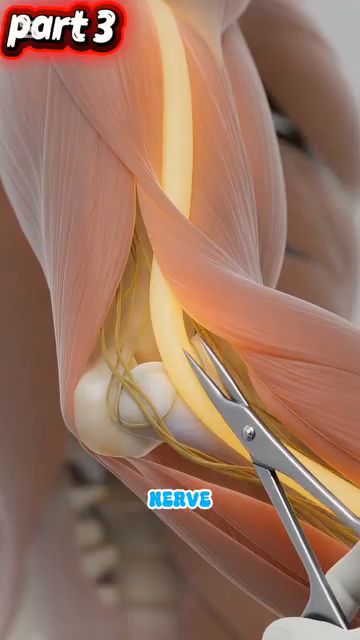
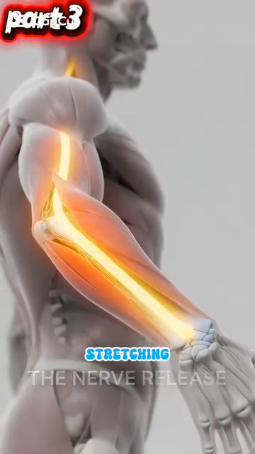
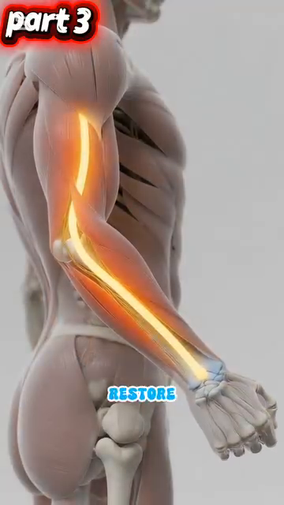
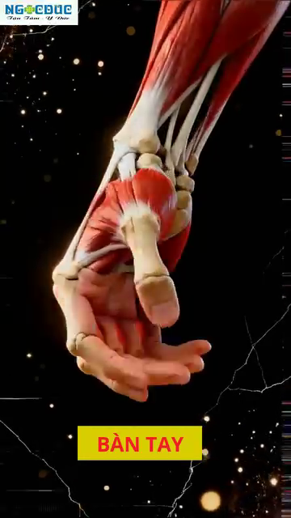
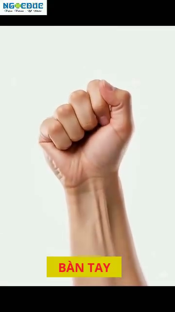
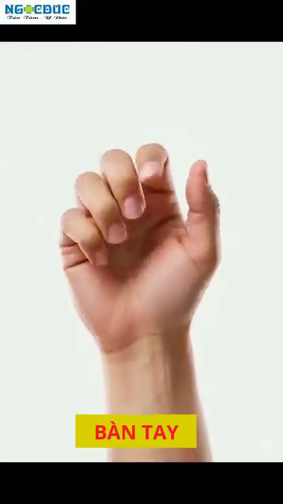

# Cánh Tay, Cổ Tay & Bàn Tay
*The 27 Bones of Your Hand, the Ulnar Nerve Trap, and Why Your Grip Pressure Matters*
---
## 📋 DOCUMENT MAP / BẢN ĐỒ TÀI LIỆU
| |
| --- |
| DD này bao gồm toàn bộ chuỗi cánh tay từ vai đến đầu ngón: humerus, khuỷu (cubital tunnel — nơi thần kinh trụ bị kẹt), cơ cẳng tay, 27 xương bàn tay, 8 xương cổ tay xếp 2 hàng, và 9 gân + thần kinh giữa của ống cổ tay. |
| Vì sao quan trọng cho người 50+: khuỷu và cổ tay là nơi hầu hết chấn thương tennis phong trào xuất hiện — tennis elbow (viêm lồi cầu ngoài), hội chứng cubital tunnel, hội chứng ống cổ tay, viêm bao gân De Quervain. Hầu hết do áp lực cách cầm vợt quá cao, quá thấp, hoặc giữ quá lâu. |
| Không bao gồm: vai (DD2), thần kinh cột sống cổ nuôi cánh tay (DD4), cơ học đánh (Cú Thuận Tay/Cú Trái Tay deep dives). |
| Thời gian đọc: 35–45 phút. |
---
## 📑 TABLE OF CONTENTS / MỤC LỤC
| # | English | Tiếng Việt |
|---|---|---|
| 1 | The Humerus, Radius, Ulna — Your Arm's 3 Bones | 3 Xương Cánh Tay: Humerus, Radius, Ulna |
| 2 | The Cubital Tunnel — The #1 Trap for Tennis Players | Cubital Tunnel — Cái Bẫy Số 1 Cho Người Chơi Tennis |
| 3 | The Ulnar Nerve Pathway — From Neck to Pinky | Đường Đi Thần Kinh Trụ — Từ Cổ Đến Ngón Út |
| 4 | STOP STRETCHING — The Nerve Flossing Solution | DỪNG KÉO GIÃN — Giải Pháp Trượt Thần Kinh |
| 5 | The 27 Bones of the Hand — A 3-Zone Machine | 27 Xương Bàn Tay — Cỗ Máy 3 Vùng |
| 6 | The Carpal Tunnel — Where 9 Tendons + 1 Nerve Live | Ống Cổ Tay — Nơi 9 Gân + 1 Thần Kinh Sống |
| 7 | Grip Pressure — The 3/10 to 7/10 Rule | Áp Lực Grip — Quy Tắc 3/10 Đến 7/10 |
| 8 | Tendon Gliding — Daily Maintenance for Tennis Hands | Trượt Gân — Bảo Dưỡng Hàng Ngày Cho Tay Tennis |
---
* * *
## Chương 1 — Humerus, Radius, Ulna (3 Xương Cánh Tay)
| |
| --- |
| Cánh tay là 3 xương nối bởi 3 khớp. Cánh tay trên = humerus (một xương). Cẳng tay = radius (bên ngón cái) và ulna (bên ngón út). Các khớp là vai, khuỷu, và cổ tay. |
| Khuỷu là khớp bản lề. Chỉ hai chuyển động — gập và duỗi. Nó không thể xoay. Xoay bạn cảm thấy ở khuỷu thực ra là RADIUS xoay quanh ULNA trong cẳng tay (gọi là pronation/supination). |
### 3 Xương — Nơi Chúng Gặp Nhau
| Bone | Location | Where It Meets Others | Tennis Role |
|---|---|---|---|
| Humerus | Upper arm, single long bone | Shoulder (with scapula), elbow (with radius + ulna) | Carries the elbow flexors (biceps, brachialis) and extensor (triceps). |
| Radius | Forearm, THUMB side | Elbow (with humerus), wrist (with scaphoid + lunate) | Rotates around ulna for pronation/supination. Cú Thuận Tay supination is critical. |
| Ulna | Forearm, PINKY side | Elbow (with humerus via olecranon), wrist (with triquetrum) | The "fixed" bone of the forearm. The olecranon forms the elbow tip. The ulnar nerve runs behind it. |
### 3 Khớp — Nơi Chúng Di Chuyển
| Joint | Type | Movement Range | Tennis Translation |
|---|---|---|---|
| Elbow | Hinge | 0° (extended) to ~145° (flexed) | Most strokes need 90–110°. Biceps curl = full flexion. Locked-out triceps = 0°. |
| Radioulnar (proximal + distal) | Pivot | ~150° pronation-supination | Cú Thuận Tay supination (palm up at contact) requires ~80–90° supination. Cú Trái Tay cắt uses ~30° pronation. |
| Wrist | Ellipsoid (modified bóng-and-socket) | Flexion ~80°, extension ~70°, radial deviation ~20°, ulnar deviation ~30° | The "fine adjustment" joint. The 70/30 rhythm of Cú Thuận Tay is wrist-cú đẩyn. |
### Cơ Cẳng Tay — Hơn 20 Cơ, 4 Chức Năng
| Function | Primary Muscles | Tennis Role |
|---|---|---|
| Elbow flexion | Biceps brachii, brachialis, brachioradialis | The "lift" of the vợt during đưa vợt ra sau. Brachialis is the true workhorse — biceps adds supination. |
| Elbow extension | Triceps brachii (3 heads), anconeus | The "push" through contact. Triceps fires concentrically in last 0.1 sec before bóng leaves vợt. |
| Pronation (palm down) | Pronator teres, pronator quadratus | Topspin Cú Thuận Tay uses 20–40° pronation during forward swing. |
| Supination (palm up) | Biceps brachii, supinator | Cú Thuận Tay Vôlei and cắt use full supination at contact. |
| Wrist flexion | Flexor carpi radialis, flexor carpi ulnaris, palmaris longus | The "lag" position before forward swing. Loaded flexors release during contact for whip. |
| Wrist extension | Extensor carpi radialis longus + brevis, extensor carpi ulnaris | The "layback" position in đưa vợt ra sau. Stretched extensors add 5–10% vợt head speed. |
| Wrist radial deviation | Extensor carpi radialis longus + brevis, flexor carpi radialis | Topspin Cú Thuận Tay uses ~10° radial deviation at contact. |
| Wrist ulnar deviation | Extensor carpi ulnaris, flexor carpi ulnaris | Cú Trái Tay uses ~15–20° ulnar deviation at contact. |
*Source: Roetert & Kovacs, Tennis Anatomy, Ch.3 pages 75–79.*
---
* * *
## Chương 2 — Cubital Tunnel (Cái Bẫy Số 1)
| |
| --- |
| Cubital tunnel là rãnh phía sau lồi cầu trong của humerus (cục "xương cười" ở mặt trong khuỷu). Thần kinh trụ đi qua nó, được giữ bởi dây chằng gọi là dây chằng Osborne. Khi khuỷu gập, hầm HẸP LẠI 55%. Áp lực trong hầm tăng vọt. |
| Đây là vị trí chèn ép thần kinh phổ biến nhất ở khuỷu. Triệu chứng: tê ngón áp út + ngón út, yếu cách cầm vợt, cảm giác "ngủ" khi cầm điện thoại. Ở người chơi tennis, Cú Trái Tay một tay là nguyên nhân số 1 — khuỷu gập quá 90° hàng trăm cú. |
### Con Số Cubital Tunnel
| Number | What It Means | Tennis Implication |
|---|---|---|
| 55% | Tunnel cross-section reduction when elbow flexes from 0° to 90° | One-handed Cú Trái Tay with elbow bent 90°+ = sustained 55% compression for entire stroke. |
| +50% | Increase in intraneural pressure at 90° flexion | The nerve is litetranh bóng being squeezed. Over hundreds of strokes → ischemia → nerve damage. |
| 7× | Repetition multiplier for Cú Trái Tay (vs other strokes) | 50 cú thuận tays vs 50 cú trái tays: Cú Trái Tay compresses the nerve 7× more cumulatively. |
| 2 compression sites | Cubital tunnel AND Guyon's canal (wrist) | Ulnar nerve has TWO compression sites on the path to the pinky. Either can fail. |
### Hiện Tượng Chèn Ép Kép
| |
| --- |
| Thần kinh trụ có thể bị chèn ép ở rễ thần kinh C8-T1 (cổ), ở cubital tunnel (khuỷu), VÀ ở Guyon's canal (cổ tay). Nếu chỉ một vị trí bị chèn ép nhẹ, thần kinh trở nên nhạy cảm. Vị trí chèn ép thứ hai — dù nhỏ — tạo triệu chứng quá mức. |
| Sự thật tennis: hầu hết người chơi phong trào bị "tennis elbow" dai dẳng thực ra có chèn ép KÉP — chèn ép cổ do tư thế xấu (DD4) CỘNG chèn ép cubital tunnel từ Cú Trái Tay một tay. Chỉ trị khuỷu mà bỏ sót cổ. |
| Chẩn đoán: bác sĩ thần kinh có thể lập bản đồ vị trí chèn ép bằng EMG/đo dẫn truyền thần kinh. Nếu bạn có triệu chứng dai dẳng dù đã trị tennis-elbow 6 tuần, HỎI về test thần kinh. |
*Source: Anatomy_Tay_Than_Kinh_Full.docx, Part I. Tennis Anatomy Ch.10 (Common Injuries) corroborates with cubital tunnel syndrome details.*
---
* * *
## Chương 3 — Đường Đi Thần Kinh Trụ (Từ Cổ Đến Ngón Út)
| |
| --- |
| Thần kinh trụ bắt đầu từ rễ thần kinh C8-T1 ở cổ dưới của bạn, đi xuống cánh tay, đi SAU lồi cầu trong ở khuỷu (cubital tunnel), rồi tiếp tục qua Guyon's canal ở cổ tay, và kết thúc ở ngón áp út và ngón út. Nó là thần kinh dài nhất không được bảo vệ trong cánh tay. |
| Nhiệm vụ: điều khiển flexor carpi ulnaris (cơ gập cổ tay bên ngón út), flexor digitorum profundus đến ngón áp út + ngón út, cơ nội tại bàn tay (interossei, lumbricals, hypothenar), và cảm giác cho ngón áp út + ngón út + nửa ulnar của lòng bàn tay. |
| Khi nó hỏng: biến dạng "bàn tay vuốt" (ngón áp út + ngón út không gập được ở MCP), teo vùng hypothenar, yếu cách cầm vợt (vì FDP đến 2 ngón cuối bị liệt). Người chơi tennis không cầm được vợt. |
### Đường Đi Thần Kinh Trụ — 5 Trạm
| Stop | Location | What Happens | Tennis Translation |
|---|---|---|---|
| 1 | C8-T1 nerve roots (lower neck) | Origin | Compression here = neck posture issue. See DD4. |
| 2 | Thoracic outlét (between collar bone and 1st rib) | Tight spás near scalenes | Rare tennis site. More common in swimmers. |
| 3 | Cubital tunnel (behind medial epicondyle at elbow) | The #1 trap. Tunnel narrows 55% at 90° flexion | One-handed Cú Trái Tay with elbow bent. |
| 4 | Forearm (between FCU muscle heads) | Less common compression | Repetitive cách cầm vợtping. |
| 5 | Guyon's canal (at wrist, between pisiform and hamate) | The #2 trap. Carpal-bone-defined tunnel | Grip pressure when wrist is ulnar-deviated. |
### 5 Dấu Hiệu Cảnh Báo (Khi Nào Đi Khám)
| Warning Sign | What It Means | Action |
|---|---|---|
| 1. Tingling in ring + pinky lasting >5 min after play | Acute nerve irritation | Reduce Cú Trái Tay volume, nerve floss 3×/day |
| 2. Dropping the vợt during play | Motor weakness — FDP failing | STOP PLAY. See neurologist. EMG/nerve conduction. |
| 3. Wasting of the hypothenar eminence | Visible hollow between pinky and wrist | URGENT neurology referral. Chronic compression. |
| 4. Claw hand posture at rest | Intrinsic muscle paralysis | URGENT. May need surgical decompression. |
| 5. Numbness that doesn't resolve in 24 hours | Persistent nerve ischemia | See neurologist within 48 hours. |
*Source: Anatomy_Tay_Than_Kinh_Full.docx, Part I, paragraphs 4-12. Tennis Anatomy Ch.10 corroborates.*
---
* * *
## Chương 4 — DỪNG KÉO GIÃN (Giải Pháp Trượt Thần Kinh)
| |
| --- |
| Lời khuyên phổ biến nhất cho "tennis elbow" SAI: giãn cẳng tay, giãn cổ tay, giãn khuỷu. Nhưng thần kinh trụ không muốn bị KÉO GIÃN. Kéo giãn tăng strain nội tại thần kinh >15%. Cái này giảm lưu lượng máu bên trong thần kinh (thiếu máu vi mạch). |
| Cách sửa là TRƯỢT THẦN KINH — còn gọi là nerve flossing. Thần kinh trượt qua lại giữa các điểm cuối. Bạn gập cổ tay trong khi duỗi khuỷu, rồi duỗi cổ tay trong khi gập khuỷu. Cái này tạo chuyển động ở thần kinh KHÔNG kéo giãn nó. |
### Kỹ Thuật Trượt Thần Kinh — Từng Bước
| Step | Position | Hold | Why |
|---|---|---|---|
| 1. Start | Elbow extended, wrist flexed (bent down), shoulder depressed (down) | 2 sec | Long nerve position. |
| 2. Slide | Slowly: elbow flexes (bend), wrist extends (bent up), shoulder elevated (up) | 2 sec | Nerve slides "up" toward the head. |
| 3. Return | Slowly: elbow extends, wrist flexes, shoulder depressed | 2 sec | Nerve slides "down" toward the fingers. |
| 4. Repeat | 10 slow reps, 3× per day | Before and after play | Restores nerve mobility, reduces intraneural pressure. |
### Quy Tắc "Trần Đau" — Dưới 3/10
| |
| --- |
| Trượt thần kinh phải ĐAU DƯỚI 3/10 trên thang 0–10. Nếu bạn cảm thấy tê, giật điện, hoặc đau >3/10, DỪNG. Bạn đang chèn ép hoặc kéo giãn quá thần kinh. Mục tiêu là chuyển động nhẹ nhàng, không phải kéo giãn mạnh. |
| Phác đồ cho 50+: 10 lần chậm vào buổi sáng (trước khi ngày làm cứng thần kinh), 10 lần giữa ngày (trung hòa tư thế bàn làm việc), 10 lần sau tennis (xóa viêm). Tổng: 30 lần/ngày, 3 phút. |
### 4 Sai Lầm Phổ Biến Với Trượt Thần Kinh
| # | Mistake | Why It's Wrong | Fix |
|---|---|---|---|
| 1 | Doing it too fast | Fast motion = stretch, not glide | Slow. 1 rep every 3 seconds. |
| 2 | Pulling hard on the head or fingers | This stretches the nerve | Move only at the wrist + elbow. Head and shoulders RELAXED. |
| 3 | Doing it when the nerve is acutely inflamed (>5/10 pain) | Flare-up risk | Wait until pain drops below 3/10. Use ice first. |
| 4 | Only doing it after symptoms appear | Reactive, not preventive | Make it a daily habit, like brushing teeth. |
*Source: Anatomy_Tay_Than_Kinh_Full.docx, Part I, paragraph 10-14. Tennis Anatomy Ch.10 corroborates.*
---
* * *
## Chương 5 — 27 Xương Bàn Tay (Cỗ Máy 3 Vùng)
| |
| --- |
| Bàn tay người có 27 xương, 27 khớp, 34 cơ (nội tại + ngoại lai), hơn 100 dây chằng, và 3 thần kinh chính (giữa, trụ, quay). Nó là cấu trúc cơ học phức tạp nhất cơ thể. Bàn tay chia 3 vùng: xương cổ tay (carpals), xương bàn tay (metacarpals), xương ngón tay (phalanges). |
### 3 Vùng Bàn Tay
| Zone | # Bones | Names | Tennis Role |
|---|---|---|---|
| Carpals (wrist) | 8 | Scaphoid, lunate, triquetrum, pisiform (proximal row); trapezium, trapezoid, capitate, hamate (distal row) | The wrist platform. Must absorb vợt vibration without damage. The "carpal boss" is a common tennis injury at the index CMC. |
| Metacarpals (palm) | 5 | Metacarpals I–V (thumb to pinky) | Form the palm. The 2nd and 3rd metacarpals are FIXED (immobile) — they form the rigid platform of the hand. |
| Phalanges (fingers + thumb) | 14 | 2 in thumb (proximal + distal), 3 in each finger (proximal + middle + distal) | The cách cầm vợtpers. Each finger has 3 joints (MCP, PIP, DIP) except thumb (2 joints: MCP, IP). |
### 8 Xương Cổ Tay Xếp 2 Hàng — Bản Đồ
| Row | Bones (lateral → medial) | Function |
|---|---|---|
| Proximal (closer to forearm) | Scaphoid, Lunate, Triquetrum, Pisiform | Articulate with radius. Form the wrist joint proper. Most wrist fractures happen here. |
| Distal (closer to fingers) | Trapezium, Trapezoid, Capitate, Hamate | Articulate with metacarpals. The hook of hamate + pisiform form Guyon's canal (ulnar nerve). |
### Ngón Cái — 50% Chức Năng Bàn Tay
| |
| --- |
| Ngón cái chiếm 50% tổng chức năng bàn tay. Đó là nhờ ĐỐI CHIẾU — khả năng đưa đệm ngón cái qua gặp đệm 4 ngón kia. Không ngón nào khác làm được. Mất đối chiếu = mất cách cầm vợt, mất vận động tinh tế. |
| Hệ quả tennis: vai trò ngón cái trong áp lực cách cầm vợt RẤT LỚN. Trong cách cầm vợt Eastern Cú Trái Tay, ngón cái đặt ở bevel 7 của cán vợt. Nó là lực đối chiếu ngược với các ngón. Nếu ngón cái cầm quá chặt (sai lầm phổ biến 3.5), thần kinh trụ bị ép ở Guyon's canal. |
| Viêm bao gân De Quervain: viêm gân APL (abductor pollicis longus) và EPB (extensor pollicis brevis). Chúng đi qua khoang 1 của cổ tay. Phổ biến ở người chơi tennis cách cầm vợt bằng ngón cái. Đau ở gốc ngón cái + cổ tay phía quay. |
*Source: Anatomy_Tay_Than_Kinh_Full.docx, Part II paragraphs 16-26. Tennis Anatomy Ch.3 (Arms and Wrists) and Ch.10 corroborate.*
---
* * *
## Chương 6 — Ống Cổ Tay (Nơi 9 Gân + 1 Thần Kinh Sống)
| |
| --- |
| Ống cổ tay là đường hầm hẹp ở mặt LÒNG BÀN TAY của cổ tay. Nó được giới hạn bởi xương cổ tay (sàn và tường) và flexor retinaculum (dây chằng ngang cổ tay) làm mái. Bên trong: 9 gân gập + thần kinh giữa. Tổng tiết diện: khoảng 2 cm². |
| Thần kinh giữa kiểm soát cảm giác ở ngón cái, ngón trỏ, ngón giữa, và nửa phía quay của ngón áp út. Nó cũng kiểm soát cơ thenar (đệm thịt ở gốc ngón cái). |
### Cái Gì Bên Trong Ống Cổ Tay
| # | Structure | Function |
|---|---|---|
| 1–4 | Flexor digitorum superficialis (4 tendons) | Flex PIP joints of fingers 2–5 |
| 5–8 | Flexor digitorum profundus (4 tendons) | Flex DIP joints of fingers 2–5 |
| 9 | Flexor pollicis longus (1 tendon) | Flex thumb IP joint |
| 10 | Median nerve | Sensation to thumb/index/middle/radial ring + thenar motor |
### Hội Chứng Ống Cổ Tay — Cái Kích Hoạt
| |
| --- |
| Bất kỳ cái gì TĂNG áp lực bên trong hầm 2 cm² đều gây triệu chứng. 9 gân sưng viêm → chiếm nhiều chỗ hơn → thần kinh giữa bị ép → tê ngón cái/trỏ/giữa. |
| Tác nhân tennis: (a) cách cầm vợt vợt chặt kéo dài, (b) gập cổ tay quá mức khi Vôlei thấp, (c) duỗi cổ tay quá mức khi giao bóng, (d) thời tiết lạnh (co mạch giảm không gian hầm). |
| Cách sửa: áp lực cách cầm vợt 3/10 (xem Ch.7). Cổ tay trung tính khi Vôlei và giao bóng. Khởi động trước khi chơi trời lạnh. Bài tập trượt gân (Ch.8). |
### Test Phalen — Tự Kiểm Tra
| |
| --- |
| Ấn mu hai tay vào nhau với cổ tay gập hoàn toàn (đầu ngón chỉ xuống). Giữ 60 giây. Nếu bạn cảm thấy tê ngón cái/trỏ/giữa trong 60 giây, thần kinh giữa đang bị chèn ép. |
| Nếu dương tính: trượt thần kinh 3 lần/ngày, giảm áp lực cách cầm vợt, cán vợt công thái học (cán nhỏ hơn nếu đau nặng), khám bác sĩ nếu dai dẳng. |
*Source: Anatomy_Tay_Than_Kinh_Full.docx, Part II paragraphs 18-24.*
---
* * *
## Chương 7 — Áp Lực Grip (Quy Tắc 3/10 Đến 7/10)
| |
| --- |
| Quy tắc 3/10 đến 7/10 là kỹ thuật tay quan trọng nhất tennis. Grip ở 3/10 khi chờ bóng (thả lỏng, vừa đủ giữ vợt khỏi rơi). Grip ở 7/10 lúc tiếp xúc (chắc, nhưng không siết trắng tay). Thả về 3/10 trong follow-through. |
| Sai lầm nghiệp dư: cách cầm vợt ở 8–9/10 TOÀN BỘ điểm — từ tư thế sẵn sàng đến follow-through. Đây là nguyên nhân chính của (a) tennis elbow, (b) hội chứng ống cổ tay, (c) hội chứng cubital tunnel, (d) mỏi cẳng tay. Grip phải là BỘ THAY ĐỔI TỐC ĐỘ, không phải lực không đổi. |
### Con Số Áp Lực — Chúng Có Nghĩa Gì
| Pressure | Sensation | What You're Doing | Risk |
|---|---|---|---|
| 1–2/10 | Racquet about to fall | Too loose. No control. | Shanked shots. |
| 3/10 | Hold a tube of toothpaste without squeezing | The "ready" pressure. Energy conphát bóngd. | None. |
| 5/10 | Hold a full coffee cup | Mid-range. OK during slow bóngs. | Cumulative fatigue if held long. |
| 7/10 | Squeeze someone's hand firmly | The "contact" pressure. Maximum useful. | OK if brief. |
| 8–10/10 | Crush a can / wring a towel | Over-cách cầm vợt. The amateur delỗi. | Tennis elbow, carpal tunnel, cubital tunnel. |
### Câu Nhắc Thời Điểm — Khi Nào Grip
| Phase | Pressure | Why |
|---|---|---|
| Ready position | 3/10 | Energy conservation. Fast hands. |
| Split-step → first step | 4/10 | Slight increase to "wake up" the forearm. |
| Unit turn (shoulder rotation) | 5/10 | Racquet is moving with the body. |
| Forward swing start (chest turns) | 6/10 | Begin loading the cách cầm vợt. |
| 0.2 sec before contact | 7/10 | The "squeeze" moment. |
| At contact | 7/10 | Maximum pressure. Brief. |
| 0.2 sec after contact | 5/10 | Release. |
| Follow-through | 3/10 | Back to relaxed. Ready for next bóng. |
### Thực Tế Grip Cho 50+ — Gân Cần Hồi Phục
| |
| --- |
| Gân cẳng tay ở người 50+ có ít máu cung cấp hơn so với 25 tuổi. Lành gân phụ thuộc vào cung cấp máu. Grip quá chặt tạo rách vi thể lành CHẬM HƠN so với 25 tuổi. Mức nền 3/10 quan trọng hơn nữa sau 50. |
| Bài tập: test "thả bóng." Cầm bóng tennis ở tay không thuận với áp lực 3/10. Đi bộ 1 phút. Nếu bạn cảm thấy cần cách cầm vợt chặt hơn, có lẽ bạn đang cách cầm vợt 6/10 hoặc hơn. Đặt lại 3/10. |
*Source: Anatomy_Tay_Than_Kinh_Full.docx, Part III paragraphs 28-32.*
---
* * *
## Chương 8 — Trượt Gân (Bảo Dưỡng Hàng Ngày Cho Tay Tennis)
| |
| --- |
| Bài tập trượt gân di chuyển mỗi gân qua toàn bộ tầm vận động. Mục tiêu là (a) ngăn dính giữa gân và bao gân, (b) duy trì dòng dịch khớp, (c) phát hiện sớm dấu hiệu viêm. Chúng mất 2 phút. Chúng là bảo dưỡng hàng ngày TỐT NHẤT cho tay tennis. |
| 5 vị trí trượt gân: thẳng → nắm móc → nắm đầy → tablétop → thẳng. Mỗi vị trí tác động các gân khác nhau. Toàn bộ chu trình mất 5 giây mỗi tay. |
### 5 Vị Trí Trượt Gân
| Position | Hand Shape | Tendons Stressed | Hold |
|---|---|---|---|
| 1. Straight | Fingers straight, palm down | All tendons in resting length | 1 sec |
| 2. Hook fist | DIP + PIP flexed, MCP straight | FDP (deep flexor) at maximum glide | 1 sec |
| 3. Full fist | All joints flexed | FDS + FDP together | 1 sec |
| 4. Tablétop | MCP flexed 90°, PIP + DIP straight | FDS at maximum glide, lumbricals active | 1 sec |
| 5. Straight (return) | Same as #1 | Synovial fluid redistribution | 1 sec |
### Trình Tự Trượt Riêng Cho Tennis — Khi Nào Dùng
| When | Sequence | Purpose |
|---|---|---|
| Morning | 10 reps each hand, slow | Restore overnight stiffness |
| Before play | 5 reps each hand, dynamic | Warm tendons, detect inflammation |
| During trận (changeover) | 5 reps each hand | Reduce cumulative tendon load |
| After play | 10 reps each hand, slow | Distribute synovial fluid, reduce adhesion |
| If any pain >3/10 | STOP. Ice 10 min. Glide gently after ice. | Don't glide into inflammation |
### 3 Dấu Hiệu Bạn Cần Hơn Là Trượt Gân
| Sign | What It Means | Action |
|---|---|---|
| 1. Pain during glide that wasn't there before | Acute inflammation | Ice + rest. See doctor if persists >3 days. |
| 2. A tendon "catches" or locks during glide | Stenosing tenosynovitis (trigger finger) | Stop gliding that tendon. Medical referral. |
| 3. Persistent morning stiffness >30 min | Rheumatoid or chronic inflammation | See rheumatologist. May need medication. |
*Source: Anatomy_Tay_Than_Kinh_Full.docx, Part III paragraph 32. Tennis Anatomy Ch.10 corroborates the tendon gliding protocol.*
---
* * *
## 📋 DD3 CARD — Printable / THẺ IN ĐƯỢC DD3
╔═══════════════════════════════════════════════════════════╗
║ DD3 CARD — ARMS, WRISTS & HANDS ║
║ THẺ DD3 — CÁNH TAY, CỔ TAY & BÀN TAY ║
╠═══════════════════════════════════════════════════════════╣
║ ║
║ 🎯 ONE BIG IDEA / Ý TƯỞNG CỐT LÕI: ║
║ The ulnar nerve has 2 trap sites (cubital tunnel + ║
║ Guyon's canal) and 27 bones form the hand. Grip ║
║ pressure is the master switch: 3/10 relaxed, 7/10 at ║
║ contact. Most tennis-arm injuries come from over-cách cầm vợt. ║
║ ║
║ Thần kinh trụ có 2 vị trí bẫy (cubital + Guyon) và ║
║ 27 xương tạo bàn tay. Áp lực cách cầm vợt là công tắc chính: ║
║ 3/10 thả lỏng, 7/10 lúc chạm. Hầu hết chấn thương ║
║ tay tennis đến từ cách cầm vợt quá chặt. ║
║ ║
║ ──────────────────────────────────────────────────────── ║
║ KEY NUMBERS / CÁC CON SỐ CHÍNH: ║
║ • Cubital tunnel narrows 55% at 90° elbow flexion ║
║ • 27 hand bones / 8 carpals / 14 phalanges / 5 metacarpals║
║ • Carpal tunnel cross-section: 2 cm² ║
║ • Grip pressure: 3/10 ready → 7/10 contact → 3/10 follow ║
║ • 9 tendons + 1 median nerve inside the carpal tunnel ║
║ ║
║ ──────────────────────────────────────────────────────── ║
║ ⚠️ TOP MISTAKE / LỖI PHỔ BIẾN NHẤT: ║
║ Gripping at 8–10/10 the entire điểm instead of ║
║ modulating between 3/10 (relaxed) and 7/10 (contact). ║
║ This causes tennis elbow, carpal tunnel syndrome, ║
║ and cubital tunnel syndrome — the three most common ║
║ tennis-arm injuries in 50+ players. ║
║ ║
║ ──────────────────────────────────────────────────────── ║
║ 🔁 DRILL / BÀI TẬP: ║
║ 1. Nerve flossing: 10 slow reps, 3×/day (page 4) ║
║ 2. Tendon gliding: 10 reps/hand, morning + after play ║
║ 3. Ball-drop test: walk with bóng at 3/10, reset if ║
║ you instinctively cách cầm vợt harder. ║
║ ║
║ ──────────────────────────────────────────────────────── ║
║ 💭 MASTER CUE / CÂU NHẮC TỔNG: ║
║ "Relaxed ready, firm contact, relaxed follow." ║
║ "Sẵn sàng thả lỏng, tiếp xúc chắc, follow-through ║
║ thả lỏng." ║
║ ║
╚═══════════════════════════════════════════════════════════╝
╔═══════════════════════════════════════════════════════════╗
║ DD3 CARD — ARMS, WRISTS & HANDS ║
║ THẺ DD3 — CÁNH TAY, CỔ TAY & BÀN TAY ║
╠═══════════════════════════════════════════════════════════╣
║ ║
║ 🎯 ONE BIG IDEA / Ý TƯỞNG CỐT LÕI: ║
║ The ulnar nerve has 2 trap sites (cubital tunnel + ║
║ Guyon's canal) and 27 bones form the hand. Grip ║
║ pressure is the master switch: 3/10 relaxed, 7/10 at ║
║ contact. Most tennis-arm injuries come from over-cách cầm vợt. ║
║ ║
║ Thần kinh trụ có 2 vị trí bẫy (cubital + Guyon) và ║
║ 27 xương tạo bàn tay. Áp lực cách cầm vợt là công tắc chính: ║
║ 3/10 thả lỏng, 7/10 lúc chạm. Hầu hết chấn thương ║
║ tay tennis đến từ cách cầm vợt quá chặt. ║
║ ║
║ ──────────────────────────────────────────────────────── ║
║ KEY NUMBERS / CÁC CON SỐ CHÍNH: ║
║ • Cubital tunnel narrows 55% at 90° elbow flexion ║
║ • 27 hand bones / 8 carpals / 14 phalanges / 5 metacarpals║
║ • Carpal tunnel cross-section: 2 cm² ║
║ • Grip pressure: 3/10 ready → 7/10 contact → 3/10 follow ║
║ • 9 tendons + 1 median nerve inside the carpal tunnel ║
║ ║
║ ──────────────────────────────────────────────────────── ║
║ ⚠️ TOP MISTAKE / LỖI PHỔ BIẾN NHẤT: ║
║ Gripping at 8–10/10 the entire điểm instead of ║
║ modulating between 3/10 (relaxed) and 7/10 (contact). ║
║ This causes tennis elbow, carpal tunnel syndrome, ║
║ and cubital tunnel syndrome — the three most common ║
║ tennis-arm injuries in 50+ players. ║
║ ║
║ ──────────────────────────────────────────────────────── ║
║ 🔁 DRILL / BÀI TẬP: ║
║ 1. Nerve flossing: 10 slow reps, 3×/day (page 4) ║
║ 2. Tendon gliding: 10 reps/hand, morning + after play ║
║ 3. Ball-drop test: walk with bóng at 3/10, reset if ║
║ you instinctively cách cầm vợt harder. ║
║ ║
║ ──────────────────────────────────────────────────────── ║
║ 💭 MASTER CUE / CÂU NHẮC TỔNG: ║
║ "Relaxed ready, firm contact, relaxed follow." ║
║ "Sẵn sàng thả lỏng, tiếp xúc chắc, follow-through ║
║ thả lỏng." ║
║ ║
╚═══════════════════════════════════════════════════════════╝
---
## 🖼️ ILLUSTRATIONS / HÌNH MINH HỌA
*Images from `Anatomy_Lab/images/DD3_arms_wrists_hands/` (20 total — 10 from user's Anatomy_Tay_Than_Kinh_Full.docx, 10 from Tennis Anatomy PDF Ch.3).*
### Hình 1 — Đường Đi Thần Kinh Trụ
*Shows the ulnar nerve as a yellow glowing line from neck → behind medial epicondyle → through Guyon's canal → ring + pinky.*
### Hình 2 — Cận Cảnh Cubital Tunnel
### Hình 3 — Cảnh Báo DỪNG KÉO GIÃN
*The critical message: stop passive stretching. Do nerve flossing instead.*
### Hình 4 — Viêm Quanh Khuỷu
### Hình 5 — Tư Thế Trượt Thần Kinh
*Shows the alternating wrist + elbow motion: extend elbow + flex wrist ↔ flex elbow + extend wrist.*
### Hình 6 — Cơ Duỗi Mu Tay
### Hình 7 — Khung Xương Tay Mở
*Shows all 27 bones of the hand: 8 carpals, 5 metacarpals, 14 phalanges.*
### Hình 8 — Mặt Cắt Ống Cổ Tay
*Shows the 9 flexor tendons + median nerve packed into the 2 cm² tunnel.*
### Hình 9 — Nắm Đấm — Khối Cơ Thenar
*Shows the thumb opposition mechanism. The thenar eminence = 50% of hand function.*
### Hình 10 — Gân Duỗi Riêng Ngón Trỏ
*The index finger has INDEPENDENT extensor control — important for delicate vợt fás adjustment.*
### Hình 11–20 — Biceps, Triceps, Cơ Cẳng Tay
| Figure | Description | Image |
|---|---|---|
| 11 | Biceps brachii, brachialis, brachioradialis | `DD3_arms_wrists_hands_01.png` (Tennis Anatomy Fig.3.1) |
| 12 | Triceps brachii (3 heads) | `DD3_arms_wrists_hands_02.png` (Fig.3.2) |
| 13 | Forearm muscles inside | `DD3_arms_wrists_hands_03.png` (Fig.3.3a) |
| 14 | Forearm muscles outside | `DD3_arms_wrists_hands_04.png` (Fig.3.3b) |
| 15 | Triceps Cable Push-Down | `DD3_arms_wrists_hands_05.png` (Fig.3.4) |
| 16 | Triceps Push-Down — end position | `DD3_arms_wrists_hands_06.png` (Fig.3.5) |
| 17 | Triceps Rope Push-Down variation | `DD3_arms_wrists_hands_07.png` (Fig.3.6) |
| 18 | Half Dip — start position | `DD3_arms_wrists_hands_08.png` (Fig.3.7) |
| 19 | Half Dip — bottom position | `DD3_arms_wrists_hands_09.png` (Fig.3.8) |
| 20 | Wrist Curl — forearm flexor work | `DD3_arms_wrists_hands_10.png` (Fig.3.9) |
*All image filenames verified to exist in `Anatomy_Lab/images/DD3_arms_wrists_hands/`.*
---
## 🔗 CROSS-REFERENCES / THAM CHIẾU CHÉO
| Topic in DD3 | See Also |
|---|---|
| Tennis elbow from over-cách cầm vợt | DD2 Shoulders — cuff vs deltoid imbalance, overuse patterns |
| Cubital tunnel / ulnar nerve | DD4 Trunk & Spine — C8-T1 nerve roots, neck posture |
| Wrist flexion / extension in stroke | DD1 Player in Motion — wrist angle at CONTACT (0–20° vs LOADED 90–110°) |
| Carpal tunnel in tennis players | DD8 Control System — proprioception decline, cách cầm vợt modulation |
| Triceps in Phát Bóng | DD2 Shoulders — triceps long head crosses the shoulder, deceleration |
| Forearm muscles in pronation/supination | DD1 Player in Motion — vợt fás control at contact |
---
## 📚 SOURCES / NGUỒN
| Source | Type | What It Contributed |
|---|---|---|
| User's Vietnamese notes (10 images) |
| Tham khảo textbook |
| Same PDF |
---
Hết DD3 — Cánh Tay, Cổ Tay & Bàn Tay*
Tiếp: DD4 — Thân & Cột Sống (L4-L5, Cơ Hình Lê, Lưng 3 Lớp, Hip Hinge)*