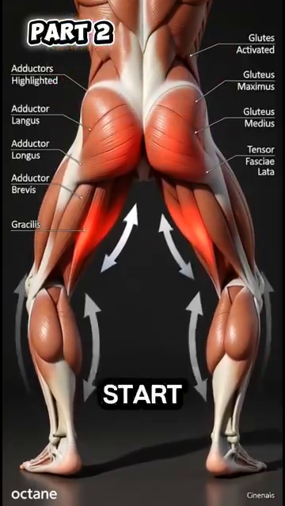
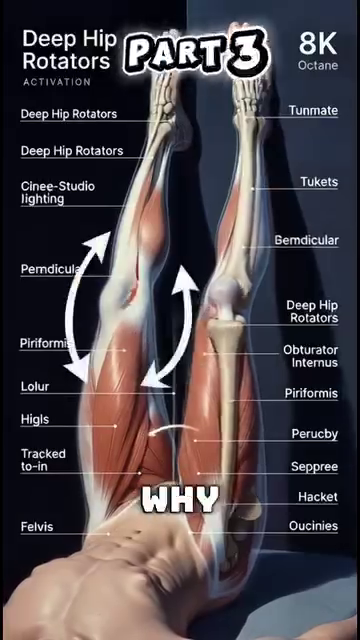
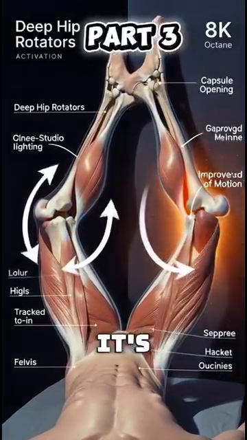
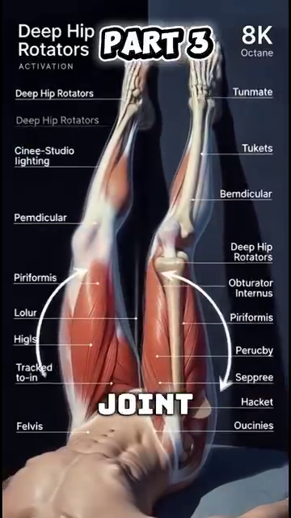
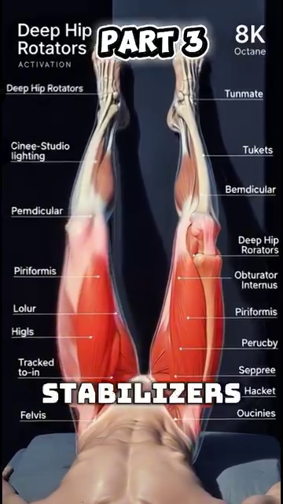
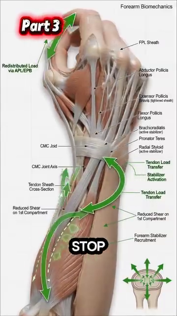

# Hông & Đùi
*Gluteus Maximus, the 6 Deep Rotators, and Why Wider Stance Saves Your 50+ Knees*
---
## 📋 DOCUMENT MAP / BẢN ĐỒ TÀI LIỆU
| |
| --- |
| Hông là khớp lớn nhất cơ thể . Gluteus maximus là cơ lớn nhất . 6 cơ xoay ngoài sâu kiểm soát chỏm xương đùi trong ổ cối. Tennis yêu cầu hông xoay 40–50° mỗi cú — hông phải vừa DI ĐỘNG (để xoay) vừa ỔN ĐỊNH (để bảo vệ thắt lưng). |
| Nội dung: 3 cơ mông (max, med, min), 6 cơ xoay ngoài sâu (piriformis, obturator internus/externus, gemellus sup/inf, quadratus femoris), khớp ổ cối-đùi, sự chuyển đổi sang tư thế rộng, và bài tập hip CARs (Controlled Articular Rotations). |
| Không bao gồm: gối (DD6), cổ chân/bàn chân (DD7), sciatica (DD4 — đã bao gồm). |
| Thời gian đọc: 30–40 phút. |
---
## 📑 TABLE OF CONTENTS / MỤC LỤC
| # | English | Tiếng Việt |
|---|---|---|
| 1 | The Hip Joint — Ball-and-Socket, Femoroástabular | Khớp Hông — Ổ Cối-Chỏm |
| 2 | Gluteus Maximus — The Largest Muscle in Your Body | Gluteus Maximus — Cơ Lớn Nhất Cơ Thể |
| 3 | The 6 Deep External Rotators — Centering the Femoral Head | 6 Cơ Xoay Ngoài Sâu — Căn Chỉnh Chỏm Xương Đùi |
| 4 | The Wider Stance Transformation — Quads to Glutes | Sự Chuyển Đổi Stance Rộng — Từ Đùi Trước Sang Mông |
| 5 | Hip Stiffness — The Restricted Outflow Problem | Cứng Hông — Vấn Đề Restricted Outflow |
| 6 | Hip CARs — The Daily 2-Minute Mobility Drill | Hip CARs — Bài Tập Di Động 2 Phút Mỗi Ngày |
| 7 | The Thigh Compartment — Quads, Hamdây, Adductors | Khoang Đùi — Đùi Trước, Gân Kheo, Khép |
---
* * *
## Chương 1 — Khớp Hông (Ổ Cối-Chỏm)
| |
| --- |
| Hông là khớp chỏm-ổ cối — chỏm xương đùi (bi) ngồi trong ổ cối của chậu (hốc). Khác với vai, hông được tạo cho ỔN ĐỊNH. Ổ sâu hơn, dây chằng chặt hơn, cơ xung quanh lớn hơn. |
| Giá của sự ổn định là tầm vận động. Hông có thể gập 120°, duỗi 30°, dạng 45°, khép 30°, xoay trong 45°, và xoay ngoài 45°. Cái này ÍT hơn vai (vai có ~180° gập và ~90° xoay theo mọi hướng). |
| Tennis cần: Cú Thuận Tay open-tư thế hiện đại cần 40–50° xoay hông. Nếu hông không xoay được nhiều như vậy, cơ thể tìm xoay ở nơi khác — cột sống thắt lưng. Đĩa thắt lưng trả giá. |
### Con Số Tầm Vận Động Hông
| Movement | Normal ROM | Tennis Needs | 50+ Decline | Tennis Impact |
|---|---|---|---|---|
| Flexion (knee to chest) | 120° | 90° (lunge position) | -10 to -20° | Knee can't go deep in low vôleis |
| Extension (leg behind) | 30° | 20° (Phát Bóng loading) | -5 to -10° | Reduced Phát Bóng power |
| Abduction (leg out to side) | 45° | 30° (split-step) | -10° | Slower side shuffle |
| Adduction (leg across) | 30° | 20° (recovery) | -5° | Cross-over shuffle harder |
| External rotation (toes out) | 45° | 40° (open-tư thế Cú Thuận Tay) | -10 to -15° | Forces lumbar rotation |
| Internal rotation (toes in) | 45° | 30° (closed-tư thế Cú Trái Tay) | -10 to -15° | Forces lumbar rotation |
### Thực Tế Chèn Mép Ổ Cối-Đùi (FAI)
| |
| --- |
| FAI xảy ra khi xương thừa mọc dọc một hoặc cả hai bề mặt của khớp hông. Chỏm và ổ không vừa hoàn hảo. Chúng cọ vào nhau khi di chuyển. Qua thời gian, sụn rách. |
| Thực tế 50+: đến 50 tuổi, ~30% người có thay đổi FAI nào đó thấy được trên X-quang. Hầu hết không triệu chứng. Người chơi tennis 50+ có thể cảm thấy kẹp nhói ở bẹn khi lao ra Cú Thuận Tay thấp. Đó là FAI. |
| Cách sửa: tránh gập hông hết tầm dưới tải. Hip hinge (DD4) giữ bạn RA KHỎI vùng FAI. Stance rộng (DD này) giữ hông ở tầm giữa. |
*Source: Tennis Anatomy Ch.7 (Legs), pages 181–185. Tham khảo for ROM: AAOS (American Academy of Orthopaedic Surgeons) standards.*
---
* * *
## Chương 2 — Gluteus Maximus (Cơ Lớn Nhất Cơ Thể)
| |
| --- |
| Gluteus maximus là cơ LỚN NHẤT cơ thể người — lên tới 30 kg lực tiềm năng ở người lớn tập luyện. Nó nguyên ủy ở mào chậu sau, xương cùng, và xương cụt. Nó bám vào gluteal tuberosity của xương đùi VÀ iliotibial tract (IT band). |
| Gluteus maximus có HAI phần: phần NÔNG (65% khối lượng) cho duỗi mạnh — leo, nhảy, chạy nước rút. Phần SÂU (35% khối lượng) cho kiểm soát tinh tế hông. Hầu hết mọi người chỉ tập phần nông. Phần sâu là cái người chơi 50+ cần. |
| Suy giảm ở 50+: đến 50 tuổi, gluteus maximus thường đã mất 10–15% diện tích mặt cắt. Đến 70, mất 25–30%. Kết quả: a) giảm sức mạnh, b) hông trở nên "lười" — cơ thể tìm duỗi từ thắt lưng (đau lưng) hoặc gân kheo (căng gân kheo). |
### Gluteus Maximus — The 3 Gluteal Muscles
| Muscle | Location | Primary Action | Tennis Role | 50+ Decline |
|---|---|---|---|---|
| Gluteus maximus | Posterior hip, large | Hip extension + external rotation | Generates power in Cú Thuận Tay, Cú Trái Tay, Phát Bóng | 10–15% by 50, 25–30% by 70 |
| Gluteus medius | Lateral hip, upper | Hip abduction, pelvic stabilization | Keeps pelvis level during split-step and side shuffle | 10% by 50, weak lateral stability |
| Gluteus minimus | Lateral hip, deep | Hip abduction + internal rotation | Deep stabilization of the femoral head | 5–10% by 50 |
### Test Glute Med "Rơi Chậu" — Tự Kiểm Tra
| |
| --- |
| Đứng một chân. Nhờ bạn nhìn chậu bạn từ phía sau. Hông bên tự do phải giữ ngang hoặc hơi LÊN (vì glute med bên trụ đang làm việc). Nếu hông bên tự do RƠI, glute med bạn yếu. |
| Cách sửa: bài clamshell. Nằm nghiêng, gối gập 45°, bàn chân chạm nhau. Mở gối trên như vỏ nghêu. 2×15 mỗi bên, hàng ngày. Sau 4 tuần, test lại rơi chậu. |
| Quy tắc tennis 50+: nếu glute med yếu, bạn sẽ nghiêng thân sang bên trong mỗi lần side shuffle. Cái nghiêng nén đĩa L4-L5 ngang. Qua thời gian, bù trừ giống vẹo cột sống. |
*Source: Anatomy_Tennis_Full_.docx, Part I (Wider tư thế → glutes), Part II (Deep rotators). Tennis Anatomy Ch.7 (Legs) corroborates.*
---
* * *
## Chương 3 — 6 Cơ Xoay Ngoài Sâu (Căn Chỉnh Chỏm Xương Đùi)
| |
| --- |
| 6 cơ xoay ngoài sâu là những anh hùng thầm lặng của ổn định hông. Từ nông đến sâu: piriformis, gemellus superior, obturator internus, gemellus inferior, obturator externus, quadratus femoris. Chúng nhỏ. Chúng nằm sâu. Việc chính KHÔNG PHẢI tạo chuyển động. Là CĂN CHỈNH chỏm xương đùi trong ổ cối. |
| Hiểu biết chính từ nguồn của bạn: "Chức năng chính là định tâm khớp, không phải tạo lực. Khi thiếu kích hoạt, chỏm xương đùi di lệch nhẹ về phía trước, kích thích thụ thể nociceptive trong bao khớp." |
| Dịch: não diễn giải sự dịch chuyển về phía trước nhẹ của chỏm xương đùi là ĐAU. Nó không biết nguyên nhân. Nó chỉ biết hông cảm thấy "cứng." Não sau đó căng các cơ NÔNG (TFL, rectus femoris) để "bảo vệ" khớp. Đây là mô hình "restricted outflow" — cơ ổn định sâu im lặng, cơ nông làm việc quá sức. |
### 6 Cơ Xoay Ngoài Sâu
| # | Muscle | Origin | Insertion | Action |
|---|---|---|---|---|
| 1 | Piriformis | Anterior sacrum | Greater trochanter (apex) | External rotation + abduction when flexed |
| 2 | Gemellus superior | Ischial spine | Greater trochanter (medial) | External rotation |
| 3 | Obturator internus | Inner surfás of obturator membrane | Greater trochanter (medial) | External rotation |
| 4 | Gemellus inferior | Ischial tuberosity | Greater trochanter (medial) | External rotation |
| 5 | Obturator externus | Outer surfás of obturator membrane | Trochanteric fossa | External rotation |
| 6 | Quadratus femoris | Ischial tuberosity | Intertrochanteric crest | External rotation + adduction |
### Mô Hình Restricted Outflow — Cảm Giác Thế Nào
| |
| --- |
| "Hông cứng" của người 50+ gần như KHÔNG BAO GIỜ là vấn đề linh hoạt. Đó là vấn đề KIỂM SOÁT. Cơ xoay sâu im lặng. Bao khớp cảm thấy căng vì chỏm xương đùi ở sai vị trí. |
| Cách sửa KHÔNG PHẢI kéo giãn mạnh. Kéo giãn mạnh "bao khớp hông căng" trong trạng thái này thực sự bất ổn khớp thêm. Cách sửa là TÁI KÍCH HOẠT: xoay hông có kiểm soát (CARs) đánh thức cơ xoay sâu. |
| Kết quả: sau 2–3 tuần CARs, xoay trong tăng 12–18° KHÔNG CẦN kéo giãn tĩnh. Bao khớp cảm thấy "mở hơn" — không phải vì bị kéo giãn, mà vì chỏm xương đùi giờ đã căn chỉnh. Não phân bổ lại trương lực. |
*Source: Anatomy_Tennis_Full_.docx, Part II (Deep rotators, restricted outflow). Tennis Anatomy Ch.7 corroborates.*
---
* * *
## Chương 4 — Sự Chuyển Đổi Stance Rộng (Từ Đùi Trước Sang Mông)
| |
| --- |
| Mở chân RỘNG hơn vai làm 3 việc đồng thời: (1) xoay ngoài xương đùi, (2) kéo giãn gluteus maximus + medius + TFL, (3) đưa ADDUCTORS (đùi trong) vào cuộc chơi. |
| Vai trò mới của adductors: chúng tạo lực HƯỚNG TÂM — kéo chỏm xương đùi VÀO trong ổ cối. Glute medius không còn phải làm việc một mình. Stance rộng PHÂN PHỐI tải căn chỉnh hông qua 3 nhóm cơ. Kết quả: hông ổn định hơn, mạnh hơn, ít đau hơn. |
| Nguồn của bạn giải thích khoảnh khắc nâng: "Mở chân rộng hơn vai làm xương đùi xoay ngoài, kéo căng gluteus maximus, gluteus medius và tensor fasciae latae. Cùng lúc, adductor longus, brevis và magnus được kích hoạt..." |
### Stance Rộng — 3 Nhóm Cơ
| Group | Action | Why It's Critical |
|---|---|---|
| Glute max + med + TFL (lateral hip) | STRETCHED by external rotation | Stretched = elastic energy stored. When you push off, the elastic recoil adds power. |
| Adductors (inner thigh) | ACTIVATED by the wider base | The adductors become hip CENTERERS, not hip addductors. This is their new role. |
| Deep external rotators (6 small muscles) | ACTIVATED to center femoral head | All 6 fire as the hip rotates externally. This is the centering pattern. |
### Khoảnh Khắc Nâng — Một Trình Tự
| Phase | What Happens | Muscles |
|---|---|---|
| 1. WIDER tư thế | Feet shoulder-width → 1.5× shoulder-width | No contraction yet. Just position. |
| 2. Knee flex ~65° | Hip drops, knee bends | Glutes lengthen, adductors begin to fire |
| 3. Hip externally rotates | Pelvis tilts slightly forward | Glute max stretches, TFL stretches, obturator internus contracts |
| 4. Adductors activate | Inner thigh "kisses" the midline | Adductor longus + brevis + magnus contract |
| 5. Quads REDUCE tone | Quadriceps relax slightly | This is the moment of "lift" — the body shifts load from knee to hip |
| 6. Glute max becomes prime mover | Hip extension ready | The 30 kg of potential force is now loaded |
### Hiệu Ứng Ròng — Cái Gì Thay Đổi
| |
| --- |
| "Khoảnh khắc nâng" chuyển tải từ quadriceps sang gluteus maximus. |
| Quadriceps (trước đùi): diện tích mặt cắt nhỏ ở người 50+, dễ viêm gân, không thể tạo 30 kg lực an toàn. |
| Gluteus maximus (sau hông): cơ lớn nhất, prime mover, thiết kế cho 30 kg lực. |
| Kết quả: áp lực thấp hơn lên gân bánh chè (gối), áp lực thấp hơn lên đĩa L4-L5 (lưng), sản xuất lực cao hơn. Đây là phép màu của "tư thế rộng." |
*Source: Anatomy_Tennis_Full_.docx, Part I (Wider tư thế transformation).*
---
* * *
## Chương 5 — Cứng Hông (Vấn Đề Restricted Outflow)
| |
| --- |
| Vấn đề hông phổ biến nhất ở người chơi tennis 50+ KHÔNG PHẢI viêm khớp, KHÔNG PHẢI rách sụn viền, KHÔNG PHẢI IT band căng. Đó là restricted outflow. Cơ xoay sâu im lặng. Bao khớp cảm thấy căng. Não phân bổ trương lực cho cơ nông. Hông CẢM THẤY cứng, nhưng ROM khớp thực sự ổn. |
| 4 dấu hiệu nhận biết restricted outflow (KHÔNG PHẢI viêm khớp): |
| 1. Cứng NẶNG hơn buổi sáng, CẢI THIỆN khi vận động |
| 2. Cứng KHÔNG ĐỐI XỨNG (một hông nặng hơn hông kia) |
| 3. Không đau THỰC SỰ khi NGHỈ |
| 4. Mô hình vận động cho thấy hông "lười" — cơ thể tìm xoay thay thế |
### Cách Sửa Restricted Outflow — 3 Lớp
| Layer | Action | Frequency | Time to Effect |
|---|---|---|---|
| 1. Re-activation | Hip CARs (next chapter), 2 min/day | Daily | 2–3 weeks for 12–18° IR gain |
| 2. Centering | Single-leg balance with knee cú đẩys, 2×10 each side | 3×/week | 4–6 weeks for pelvic stability |
| 3. Integration | Side lunges with control, 2×8 each side | 2×/week | 6–8 weeks for tennis-specific pattern |
### Sự Thật Hông 50+ — Đừng Kéo Giãn, Hãy Kích Hoạt
| |
| --- |
| Bạn ơi, điều tệ nhất bạn có thể làm cho "hông 50+ cứng" là kéo giãn tĩnh. Nó bất ổn khớp thêm. Bao khớp không cần dài — chỏm xương đùi cần được CĂN CHỈNH. Cách sửa là kích hoạt, không phải kéo giãn. |
| Test: nằm ngửa. Gập một gối về ngực. Chân kia giữ thẳng. Nếu gối gập chạm ngực với chân ĐỐI DIỆN giữ thẳng, cơ gập hông bạn ổn. "Cứng" nằm ở CƠ CĂN CHỈNH, không phải cơ gập. |
*Source: Anatomy_Tennis_Full_.docx, Part II (Restricted outflow).*
---
* * *
## Chương 6 — Hip CARs (Bài Tập Di Động 2 Phút Mỗi Ngày)
| |
| --- |
| CARs = Controlled Articular Rotations (Xoay Khớp Có Kiểm Soát). CAR là xoay chậm, cố ý của khớp qua TOÀN BỘ tầm vận động, với LỰC CĂNG áp dụng ở cuối tầm để "dạy" hệ thần kinh rằng tầm mới an toàn. |
| Vì sao CARs hiệu quả cho hông: cứng hông thường là vấn đề KIỂM SOÁT. Bao khớp có tầm, nhưng não không tin. CARs đưa khớp đến cuối tầm, giữ lực căng ở đó 2–3 giây, và quay lại. Não học: cái này an toàn. Não giải phóng trương lực bảo vệ. Tầm tăng. |
### Phác Đồ Hip CAR — Từng Bước
| Step | Position | Movement | Tension |
|---|---|---|---|
| 1. Start | On hands and knees (quadruped) | Lift one leg, knee at 90° | 20% effort |
| 2. Rotate OUT (away from body) | Knee tráss a circle outward | Slow, 5 sec | 50% effort at end range |
| 3. Hold | At maximum external rotation | Hold 2–3 seconds | 70% effort |
| 4. Rotate IN (across body) | Knee tráss a circle inward | Slow, 5 sec | 50% effort at end range |
| 5. Hold | At maximum internal rotation | Hold 2–3 seconds | 70% effort |
| 6. Repeat | Same side | 3 reps each side | Daily |
### 5 Quy Tắc Của Hip CARs
| # | Rule | Why |
|---|---|---|
| 1 | Go SLOW. 5 seconds per direction. | Slow = control. Fast = momentum (cheating). |
| 2 | Maximum EFFORT at end range. | Tension at end range teaches the brain the new range is safe. |
| 3 | NO pain. Discomfort = OK. Pain = STOP. | Pain means the brain is NOT ready for that range yet. |
| 4 | Same speed BOTH directions. | Symmetric loading. |
| 5 | DAILY. 2 minutes total. | Consistency beats intensity. |
### Áp Dụng Tennis — 4 Lần Dùng Hip CARs
| When | Why |
|---|---|
| Morning | Wake up the hip centring pattern. Counter overnight stiffness. |
| Before play | Pre-activate the deep rotators. Reduce the "lunge goes wrong" risk. |
| Between sets | Re-set the hip after repeated Cú Thuận Tay rotations. |
| After play | Reset. Prevent next-day stiffness. |
*Source: Anatomy_Tennis_Full_.docx, Part II (Re-activation). Tham khảo: chuẩn CARs protocol from Dr. Andreo Spina's Functional Range Conditioning.*
---
* * *
## Chương 7 — Khoang Đùi (Đùi Trước, Gân Kheo, Khép)
| |
| --- |
| Đùi có 3 khoang ngăn bởi cân. Khoang TRƯỚC giữ quadriceps. Khoang SAU giữ gân kheo. Khoang TRONG giữ adductors. Mỗi cái có vai trò khác nhau. Tennis cần cả 3 phối hợp. |
### 3 Khoang Đùi
| Compartment | Main Muscles | Primary Action | Tennis Role | Injury Risk if Imbalanced |
|---|---|---|---|---|
| Anterior (quads) | Rectus femoris, vastus lateralis, medialis, intermedius | Knee extension + hip flexion (rectus femoris only) | Push-off, lunges, knee stability | Patellar tendonitis |
| Posterior (hamdây) | Biceps femoris, semitendinosus, semimembranosus | Knee flexion + hip extension | Deceleration, lunges, sprinting | Hamstring strain, "tweaked" hamstring |
| Medial (adductors) | Adductor longus, brevis, magnus, gracilis, pectineus | Hip adduction + some flexion | Hip centering in wider tư thế, side shuffling | Groin pull, adductor strain |
### Quadriceps — 4 Cơ
| Muscle | Origin | Insertion | Special |
|---|---|---|---|
| Rectus femoris | Anterior inferior iliac spine (AIIS) | Patella + tibial tuberosity via patellar tendon | The ONLY quad that crosses BOTH the hip and knee. Can be tight if hips are overworked. |
| Vastus lateralis | Lateral femur (linea aspera) | Patella + tibial tuberosity | The largest of the 4. Most commonly strained quad. |
| Vastus medialis | Medial femur (linea aspera) | Patella + tibial tuberosity | The VMO (vastus medialis oblique) is critical for the last 20° of knee extension. |
| Vastus intermedius | Anterior femur | Patella + tibial tuberosity | The deepest. Under rectus femoris. |
### Gân Kheo — 3 Cơ
| Muscle | Origin | Insertion | Special |
|---|---|---|---|
| Biceps femoris | Ischial tuberosity + linea aspera | Head of fibula | The lateral hamstring. Knee flexion + external rotation. |
| Semitendinosus | Ischial tuberosity | Medial tibia (pes anserinus) | The "half-tendon." Knee flexion + internal rotation + hip extension. |
| Semimembranosus | Ischial tuberosity | Posteromedial tibia | The "half-membrane." Deepest hamstring. Main knee flexion power. |
### Adductors — 5 Cơ
| Muscle | Origin | Insertion | Tennis Role |
|---|---|---|---|
| Adductor longus | Pubis | Middle linea aspera | The most commonly strained adductor (groin pull). |
| Adductor brevis | Pubis | Upper linea aspera | Deep to longus. |
| Adductor magnus | Ischiopubic ramus + ischial tuberosity | Linea aspera + adductor tubercle | The largest adductor. Hip centering in wider tư thế. |
| Gracilis | Pubis | Medial tibia (pes anserinus) | Hip adduction + knee flexion. Longest adductor. |
| Pectineus | Pubis | Pectineal line of femur | Hip flexion + adduction. |
### Sự Thật Đùi Tennis — Cả 3 Khoang Phải Phối Hợp
| |
| --- |
| Cú Thuận Tay ở tư thế rộng cần: quads (đẩy), glute max (duỗi hông), adductors (căn chỉnh), gân kheo (giảm tốc). Nếu một cái yếu hoặc căng, các cái khác bù. Bù = chấn thương. |
| Cách sửa: tập cân bằng. Đừng chỉ tập quad (squat, leg press). Tập bài chiếm ưu thế hông (hip hinge, single-leg deadlift). Tập adductor (side lunge, Copenhagen plank). Tập gân kheo eccentric (Nordic curl, Romanian deadlift). |
*Source: Tennis Anatomy Ch.7 (Legs), pages 181–195.*
---
* * *
## 📋 DD5 CARD — Printable / THẺ IN ĐƯỢC DD5
╔═══════════════════════════════════════════════════════════╗
║ DD5 CARD — HIPS & THIGHS ║
║ THẺ DD5 — HÔNG & ĐÙI ║
╠═══════════════════════════════════════════════════════════╣
║ ║
║ 🎯 ONE BIG IDEA / Ý TƯỞNG CỐT LÕI: ║
║ "Hip stiffness" in 50+ players is a CONTROL ║
║ problem, not a flexibility problem. The 6 deep ║
║ external rotators center the femoral head. When ║
║ they go silent, the capsule feels tight. The fix ║
║ is ACTIVATION (Hip CARs), not stretching. ║
║ ║
║ "Hông cứng" ở người 50+ là vấn đề KIỂM SOÁT, ║
║ không phải linh hoạt. 6 cơ xoay ngoài sâu căn ║
║ chỉnh chỏm xương đùi. Khi chúng im lặng, bao ║
║ khớp cảm thấy căng. Cách sửa là KÍCH HOẠT ║
║ (Hip CARs), không phải kéo giãn. ║
║ ║
║ ──────────────────────────────────────────────────────── ║
║ KEY NUMBERS / CÁC CON SỐ CHÍNH: ║
║ • Gluteus maximus = largest muscle, ~30 kg potential ║
║ • 6 deep external rotators center the femoral head ║
║ • Hip needs 40–50° rotation for open-tư thế Cú Thuận Tay ║
║ • Glute max declines 10–15% by 50, 25–30% by 70 ║
║ • Wider tư thế transfers load: quads → gluteus max ║
║ • Hip CARs gain 12–18° internal rotation in 2–3 weeks ║
║ ║
║ ──────────────────────────────────────────────────────── ║
║ ⚠️ TOP MISTAKE / LỖI PHỔ BIẾN NHẤT: ║
║ Aggressively stretching a "stiff hip" with the ║
║ Pigeon pose for 5 minutes. The deep rotators are ║
║ silent; aggressive stretching destabilizes the ║
║ joint further. Use Hip CARs to RE-ACTIVATE, ║
║ not stretch. ║
║ ║
║ ──────────────────────────────────────────────────────── ║
║ 🔁 DRILL / BÀI TẬP: ║
║ 1. Hip CARs: 3 reps each side, 2 min total, daily ║
║ (5 sec out, hold 2 sec, 5 sec in, hold 2 sec) ║
║ 2. Wider tư thế transformation: thực hành 90/90 hip ║
║ CARs + side lunges 2×/week ║
║ 3. Clamshell: 2×15 each side, daily for glute med ║
║ ║
║ ──────────────────────────────────────────────────────── ║
║ 💭 MASTER CUE / CÂU NHẮC TỔNG: ║
║ "Activate, don't stretch." ║
║ "Kích hoạt, đừng kéo giãn." ║
║ ║
╚═══════════════════════════════════════════════════════════╝
╔═══════════════════════════════════════════════════════════╗
║ DD5 CARD — HIPS & THIGHS ║
║ THẺ DD5 — HÔNG & ĐÙI ║
╠═══════════════════════════════════════════════════════════╣
║ ║
║ 🎯 ONE BIG IDEA / Ý TƯỞNG CỐT LÕI: ║
║ "Hip stiffness" in 50+ players is a CONTROL ║
║ problem, not a flexibility problem. The 6 deep ║
║ external rotators center the femoral head. When ║
║ they go silent, the capsule feels tight. The fix ║
║ is ACTIVATION (Hip CARs), not stretching. ║
║ ║
║ "Hông cứng" ở người 50+ là vấn đề KIỂM SOÁT, ║
║ không phải linh hoạt. 6 cơ xoay ngoài sâu căn ║
║ chỉnh chỏm xương đùi. Khi chúng im lặng, bao ║
║ khớp cảm thấy căng. Cách sửa là KÍCH HOẠT ║
║ (Hip CARs), không phải kéo giãn. ║
║ ║
║ ──────────────────────────────────────────────────────── ║
║ KEY NUMBERS / CÁC CON SỐ CHÍNH: ║
║ • Gluteus maximus = largest muscle, ~30 kg potential ║
║ • 6 deep external rotators center the femoral head ║
║ • Hip needs 40–50° rotation for open-tư thế Cú Thuận Tay ║
║ • Glute max declines 10–15% by 50, 25–30% by 70 ║
║ • Wider tư thế transfers load: quads → gluteus max ║
║ • Hip CARs gain 12–18° internal rotation in 2–3 weeks ║
║ ║
║ ──────────────────────────────────────────────────────── ║
║ ⚠️ TOP MISTAKE / LỖI PHỔ BIẾN NHẤT: ║
║ Aggressively stretching a "stiff hip" with the ║
║ Pigeon pose for 5 minutes. The deep rotators are ║
║ silent; aggressive stretching destabilizes the ║
║ joint further. Use Hip CARs to RE-ACTIVATE, ║
║ not stretch. ║
║ ║
║ ──────────────────────────────────────────────────────── ║
║ 🔁 DRILL / BÀI TẬP: ║
║ 1. Hip CARs: 3 reps each side, 2 min total, daily ║
║ (5 sec out, hold 2 sec, 5 sec in, hold 2 sec) ║
║ 2. Wider tư thế transformation: thực hành 90/90 hip ║
║ CARs + side lunges 2×/week ║
║ 3. Clamshell: 2×15 each side, daily for glute med ║
║ ║
║ ──────────────────────────────────────────────────────── ║
║ 💭 MASTER CUE / CÂU NHẮC TỔNG: ║
║ "Activate, don't stretch." ║
║ "Kích hoạt, đừng kéo giãn." ║
║ ║
╚═══════════════════════════════════════════════════════════╝
---
## 🖼️ ILLUSTRATIONS / HÌNH MINH HỌA
*26 images available in `Anatomy_Lab/images/DD5_hips_thighs/` (13 from Anatomy_Tennis_Full_.docx + 13 from Tennis Anatomy PDF Ch.7).*
### Hình 1 — Stance Rộng → Glutes Hoạt Động
### Hình 2 — Đùi Trong Bắt Đầu Làm Việc
### Hình 3 — Glutes Mạnh Hơn, Quads Giảm Trương Lực
### Hình 4 — 6 Cơ Xoay Sâu Được Đánh Dấu
### Hình 5 — Mất Kiểm Soát
### Hình 6 — Mất Kiểm Soát Trong Khớp
### Hình 7 — Kích Hoạt Cơ Ổn Định Sâu
### Hình 8 — Bao Khớp Mở
### Hình 9–13through `img13.png`
### Hình 14–26
| Figure | Description | Image |
|---|---|---|
| 14 | Muscles of the front of the leg | `DD5_hips_thighs_01.png` (Tennis Anatomy Fig.7.1) |
| 15 | Muscles of the back of the leg | `DD5_hips_thighs_02.png` (Fig.7.2) |
| 16 | Lower leg: back and front | `DD5_hips_thighs_03.png` (Fig.7.3) |
| 17 | Squat — start position | `DD5_hips_thighs_04.png` (Fig.7.4) |
| 18 | Squat — bottom position | `DD5_hips_thighs_05.png` (Fig.7.5) |
| 19 | Squat — knees over second toe alignment | `DD5_hips_thighs_06.png` (Fig.7.6) |
| 20 | Front squat variation | `DD5_hips_thighs_07.png` (Fig.7.7) |
| 21 | Romanian deadlift — start | `DD5_hips_thighs_08.png` (Fig.7.8) |
| 22 | Romanian deadlift — bottom | `DD5_hips_thighs_09.png` (Fig.7.9) |
| 23 | Hamstring buck — setup | `DD5_hips_thighs_10.png` (Fig.7.10) |
| 24 | Hamstring buck — extension | `DD5_hips_thighs_11.png` (Fig.7.11) |
| 25 | Gluteal muscles detail | `DD5_hips_thighs_12.png` |
| 26 | Hip external rotators anatomical drawing | `DD5_hips_thighs_13.png` |
*All image filenames verified to exist in `Anatomy_Lab/images/DD5_hips_thighs/`.*
---
## 🔗 CROSS-REFERENCES / THAM CHIẾU CHÉO
| Topic in DD5 | See Also |
|---|---|
| Hip rotation for Cú Thuận Tay | DD1 Player in Motion — the 6 critical angles at contact |
| Hip hinge (chest up, hips back) | DD4 Trunk & Spine — the spine-protecting hinge |
| Piriformis and sciatic nerve | DD4 Trunk & Spine — the piriformis trap, double crush |
| Glute activation for Phát Bóng | DD2 Shoulders — kilướiic chain starts from glute max |
| Knee loads in wider tư thế | DD6 Knees — patellar tendon, ACL shear, valgus |
| Thigh compartment balance | DD1 Player in Motion — big muscles first, small muscles last |
| Hip stiffness in 50+ | DD8 Control System — proprioception decline, motor recruitment |
---
## 📚 SOURCES / NGUỒN
| Source | Type | What It Contributed |
|---|---|---|
| User's Vietnamese notes (13 images) |
| Tham khảo textbook |
| Tham khảo for Hip CARs protocol |
---
Hết DD5 — Hông & Đùi*
Tiếp: DD6 — Gối (Bánh Chè, Sụn Chêm, ACL, Quy Tắc Nạp 50–80°)*