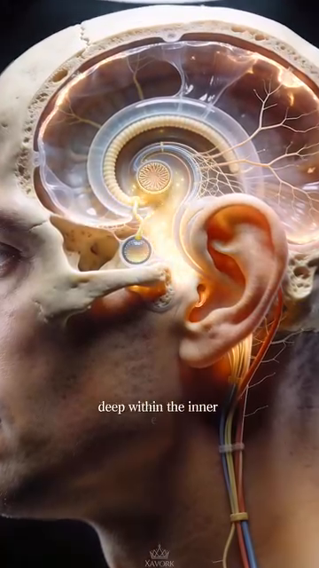

# Hệ Kiểm Soát
*Vestibular System, Proprioception, Vision, and the 50+ Body's Adaptation*
---
## 📋 DOCUMENT MAP / BẢN ĐỒ TÀI LIỆU
| |
| --- |
| Hệ kiểm soát là lớp thứ 3 của chuỗi động học (sau nền tảng từ DD1, cấu trúc từ DD2–DD7). Đó là phần làm cho tennis có thể xảy ra — không có input tiền đình, proprioception, và thị giác, cơ thể không quyết định được Ở ĐÂU hoặc KHI NÀO di chuyển. |
| Nội dung: hệ tiền đình (ống bán khuyên + cơ quan otolith + đường thần kinh), proprioception (cảm giác vị trí khớp + 7.000 đầu mút thần kinh + thoi cơ), thị giác (chu trình thị giác 5 pha), bộ ba giác quan 50+ (suy giảm tiền đình + thị giác + proprioception), và mô hình 4 hệ kiểm soát. |
| Không bao gồm: cơ học đánh (Cú Thuận Tay/Cú Trái Tay/Phát Bóng deep dives), tâm lý (mối quan tâm riêng), kế hoạch tập (mối quan tâm riêng). |
| Thời gian đọc: 40–50 phút. |
---
## 📑 TABLE OF CONTENTS / MỤC LỤC
| # | English | Tiếng Việt |
|---|---|---|
| 1 | The 4 Control Systems — Vision, Vestibular, Proprioception, Auditory | 4 Hệ Kiểm Soát — Thị Giác, Tiền Đình, Cảm Giác Sâu, Thính Giác |
| 2 | The Vestibular System — Where Balance Lives | Hệ Tiền Đình — Nơi Cân Bằng Trú Ngụ |
| 3 | The 5-Phase Visual Cycle — How Pros Read the Ball | Chu Trình Thị Giác 5 Pha — Cách Pro Đọc Bóng |
| 4 | Proprioception — The 7,000-Nerve Silent Sense | Cảm Giác Sâu — Giác Quan Im Lặng 7.000 Thần Kinh |
| 5 | The Reaction Time Cascade — 3 Layers | Chuỗi Thời Gian Phản Ứng — 3 Lớp |
| 6 | The 50+ Sensory Triad — Why Reaction Slows | Bộ Ba Giác Quan 50+ — Vì Sao Phản Ứng Chậm |
| 7 | The 4 Tennis-Specific Control Drills | 4 Bài Tập Kiểm Soát Riêng Cho Tennis |
---
* * *
## Chương 1 — 4 Hệ Kiểm Soát
| |
| --- |
| Cơ thể người có 4 hệ kiểm soát hoạt động song song để tạo chuyển động tennis. Chúng là: THỊ GIÁC (bóng đi đâu), TIỀN ĐÌNH (đầu bạn ở đâu trong không gian), CẢM GIÁC SÂU (các bộ phận cơ thể ở đâu tương đối với nhau), và THÍNH GIÁC (khi bóng chạm vợt). |
| 4 hệ này chồng lấp và hỗ trợ lẫn nhau. Khi một hệ hỏng, các hệ khác bù. Khi hai hệ hỏng, hệ thống sụp. |
### 4 Hệ Kiểm Soát
| # | System | What It Does | Tennis Role | 50+ Decline |
|---|---|---|---|---|
| 1 | Vision | Where the bóng is going. Where opponents are positioned. | Read the Phát Bóng. Track the bóng. See the open court. | Lens stiffens (presbyopia). Contrast sensitivity drops. |
| 2 | Vestibular | Where your head is in spás. Are you rotating? Accelerating? Tilting? | Balance on the split-step. Recover from off-balance positions. Orientation during cú cao. | Hair cells in semicircular canals decline. Balance errors increase. |
| 3 | Proprioception | Where your body parts are. Without looking. | "Feel" the vợt. Hit without watching the bóng. Auto-adjust di chuyển. | 30% fewer nerve endings in sole by 65. Joint position sense declines. |
| 4 | Auditory | When the bóng strikes. What string bed sound. Direction of opponent's shot. | Timing the contact. Hearing the vợt fás (sweet spot vs off-center). | Less critical for tennis. Some high-frequency hearing loss. |
### Thứ Bậc Của 4 Hệ
| |
| --- |
| THỊ GIÁC là hệ CHÍNH. Nó hoạt động ~150 ms trước ý thức. Nó lập kế hoạch chuyển động. |
| TIỀN ĐÌNH là hệ ĐỊNH HƯỚNG. Nó cập nhật vị trí cơ thể trong không gian mọi lúc. Hoạt động song song với thị giác. |
| CẢM GIÁC SÂU là hệ THỰC THI. Nó tinh chỉnh chuyển động dựa trên phản hồi từ khớp, gân, và bàn chân. Hoạt động NHANH HƠN cả hai (~30 ms). |
| THÍNH GIÁC là hệ THỜI ĐIỂM. Nó cung cấp "khi nào" — khoảnh khắc tiếp xúc. |
*Source: Anatomy_He_Tien_Dinh_Full.docx for vestibular system. Tennis Anatomy Ch.1, Ch.9 for movement bài tậps.*
---
* * *
## Chương 2 — Hệ Tiền Đình (Nơi Cân Bằng Trú Ngụ)
| 🇻🇳 Tiệt Việt |
| --- |
| Hệ tiền đình nằm sâu trong xương đá của hộp sọ, ở tai trong. Nó là một phần của mê đạo cùng với ốc tai (thính giác). Hệ tiền đình KHÔNG nghe. Nó cảm nhận CHUYỂN ĐỘNG và VỊ TRÍ. |
| Nguồn của bạn giải thích: "Hệ tiền đình nằm sâu trong xương đá của hộp sọ, thuộc tai trong, ngay sau ốc tai thính giác. Khác với ốc tai nhận âm thanh, tiền đình không tạo cảm giác." |
### 5 Thành Phần Của Hệ Tiền Đình
| # | Component | Anatomy | What It Senses |
|---|---|---|---|
| 1 | Three semicircular canals | Anterior, posterior, horizontal. Each perpendicular to the others. | Angular acceleration (rotation). The 3 canals detect rotation in 3 planes. |
| 2 | Utricle | One of two otolith organs. Sits HORIZONTAL. | Horizontal linear acceleration + head tilt. |
| 3 | Saccule | The other otolith organ. Sits VERTICAL. | Vertical linear acceleration (e.g., elevator). |
| 4 | Hair cells (Type I + II) | Inside the canals and otoliths. Have kinocilium + 40–70 stereocilia. | Deflection of the stereocilia creates neural signal. |
| 5 | Cupula | Gelatinous structure inside each canal. Hair cells embed in it. | When endolymph moves, cupula bends, hair cells fire. |
### Đường Dẫn Thần Kinh
| Stage | Anatomy | Function |
|---|---|---|
| Receptor | Hair cells in ampullae of canals | Mechanical to electrical transduction |
| Afferent nerve | Vestibular branch of CN VIII (vestibulocochlear) | Carries signal to brainstem |
| Brainstem nuclei | 4 vestibular nuclei in the pons | First integration. Send to cerebellum, spinal cord, eyes, cortex |
| Cerebellum | Receives vestibular + proprioceptive + visual input | Balance coordination |
| Cortex | Parietal + temporal lobes | Conscious awareness of body position |
| Spinal cord | Vestibulospinal tract | Adjusts muscle tone to maintain posture |
### 4 Đường Đầu Ra Từ Nhân Tiền Đình
| Pathway | Target | Function | Tennis Role |
|---|---|---|---|
| 1. To eye muscles (CN III, IV, VI) | Extraocular muscles | Vestibulo-ocular reflex (VOR) — keeps eyes stable when head moves | See the bóng clearly while moving head |
| 2. To spinal cord | Anterior horn cells (motor neurons) | Adjusts body posture automatically | Maintain balance during split-step |
| 3. To cerebellum | Vestibulocerebellum (flocculonodular lobe) | Coordination of movement | Smooth vợt path |
| 4. To cortex | Parietal lobe | Conscious awareness of orientation | Know which way is up during an cú cao |
### Phản Xạ 30 ms — Tiền Đình Nhanh Cỡ Nào?
| |
| --- |
| Phản xạ tiền đình-mắt (VOR) bắn trong 30 mili giây. Nó hoạt động TRƯỚC ý thức. Khi bạn quay đầu, mắt bạn di chuyển hướng ngược lại — NGAY LẬP TỨC — để giữ thế giới thị giác ổn định. |
| Cái này NHANH HƠN thời gian phản ứng của bóng tennis (~150 ms). Nó cho phép người chơi theo dõi bóng mượt ngay cả khi quay đầu nhanh. |
| Sự thật 50+: VOR suy giảm ~10–15% đến 65 tuổi. Kết quả: khi bạn quay đầu, thế giới thị giác "trượt" nhẹ trước khi ổn định. Bạn cảm thấy chóng mặt. Bóng mờ khi quay đầu. |
| Cách sửa: phục hồi tiền đình. Bài "ổn định ánh nhìn." Tập trung vào điểm cố định, quay đầu qua lại trong khi giữ mắt trên điểm. 1 phút × 3 lần/ngày. |
*Source: Anatomy_He_Tien_Dinh_Full.docx (entire document). Tham khảo: chuẩn vestibular physiology texts.*
---
* * *
## Chương 3 — Chu Trình Thị Giác 5 Pha (Cách Pro Đọc Bóng)
| |
| --- |
| Pro không "thấy" bóng theo cách người chơi phong trào. Họ dùng chu trình thị giác 5 pha xảy ra TRƯỚC tiếp xúc. Chu trình nhanh (tổng 150–250 ms), tự động (không cần suy nghĩ ý thức), và có thể tập. |
### 5 Pha
| # | Phase | What Happens | Duration |
|---|---|---|---|
| 1 | Wide Perception (Soft Eyes) | Eyes "soak in" the whole court. Peripheral vision active. | ~50 ms |
| 2 | Lock-On | Eyes focus on the bóng. Tracking begins. | ~30 ms |
| 3 | Narrow Focus (Tunnel Vision) | Eyes follow the bóng exclusively. Peripheral vision suppressed. | ~80–120 ms |
| 4 | Quiet Eye at Contact | Eyes are STILL on the bóng for 100+ ms after contact. The longest fixation. | ~100–200 ms |
| 5 | Re-expand | Eyes release. Peripheral vision returns. Next shot preparation. | ~50 ms |
### Hiện Tượng "Quiet Eye" — Chìa Khóa Của Thị Giác Pro
| |
| --- |
| "Quiet Eye" là sự cố định dài nhất trên bóng SAU tiếp xúc. Nghiên cứu cho thấy VĐV đẳng cấp cao có thời lượng Quiet Eye ~200+ ms. Người chơi phong trào có ~50 ms. |
| Vì sao quan trọng: Quiet Eye là khi não xử lý phản hồi từ tiếp xúc — có phải sweet spot không? Mặt vợt có mở không? Phản hồi này loop vào chương trình vận động của cú tiếp theo. KHÔNG CÓ Quiet Eye, não không học từ mỗi cú. |
| Suy giảm 50+: Quiet Eye ngắn lại theo tuổi. Đến 60, Quiet Eye trung bình ~100 ms. Đến 70, ~70 ms. Người chơi 50+ học chậm hơn từ mỗi cú. |
| Cách tập: "Giữ ánh nhìn." Sau mỗi cú trong tập, giữ ánh nhìn trên điểm tiếp xúc 3 GIÂY (3000 ms). Tập não rằng "nhìn lâu hơn" được phép. Sau 4 tuần, thời lượng Quiet Eye tự nhiên kéo dài. |
### 3 Sai Lầm Thị Giác Trong Tennis
| # | Mistake | What It Looks Like | The Fix |
|---|---|---|---|
| 1 | Looking at the opponent, not the bóng | Eyes on the phát bóngr's body during the toss. Eyes on the hitter's shoulder. | Track the BALL from vợt to contact. |
| 2 | Head down at contact | Eyes drop to the floor after hitting. No Quiet Eye. | "Hold the look" bài tập. Gaze stays on contact điểm. |
| 3 | Narrow focus too early | Eyes fix on the incoming bóng too soon. Lose peripheral info on opponent's position. | Use the 5-phase cycle. Soft eyes → lock-on → tunnel → quiet eye → re-expand. |
*Source: Tennis Anatomy Ch.9 (Movement Drills). Tham khảo: Quiet Eye research by Dr. Joan Vickers.*
---
* * *
## Chương 4 — Cảm Giác Sâu (Giác Quan Im Lặng 7.000 Thần Kinh)
| |
| --- |
| Cảm giác sâu là cảm giác vị trí cơ thể KHÔNG CẦN NHÌN. Đó là cảm giác cho phép bạn chạm mũi với mắt nhắm. Đó là cảm giác cho phép bạn biết đầu vợt ở đâu trong đưa vợt ra sau. Đó là giác quan IM LẶNG — bạn chỉ để ý nó khi nó hỏng. |
| Cảm giác sâu có 3 nguồn input: |
| 1. Thụ thể khớp — Ruffini endings, tiểu thể Pacinian trong bao khớp |
| 2. Thoi cơ — sợi chuyên biệt trong cơ cảm nhận kéo giãn |
| 3. Thụ thể da — đặc biệt ở lòng bàn chân (7.000+) và lòng bàn tay |
### 3 Nguồn Input Cảm Giác Sâu
| Source | Location | What It Senses | Tennis Translation |
|---|---|---|---|
| Joint receptors | Inside joint capsules | Joint angle, joint movement, end-range position | "My elbow is at 90°" without looking |
| Muscle spindles | Inside muscles (parallel to extrafusal fibers) | Muscle length and rate of change | "My biceps is contracted" — for cách cầm vợt modulation |
| Skin receptors | In the skin, especially sole and palm | Pressure, stretch, vibration | "I'm pressing through my big toe" on push-off |
### Suy Giảm Cảm Giác Sâu 50+ — 3 Con Số
| Number | What It Means | Tennis Implication |
|---|---|---|
| 30% | Fewer nerve endings in the sole by age 65 | Reduced foot awareness. Loss of tripod foot awareness. |
| 20% | Decline in muscle spindle sensitivity by 70 | Slower automatic adjustments. More "thinking" required. |
| 40% | Decline in joint position sense at the knee by 70 | Less accurate stepping. More tripping. |
### 4 Bài Tập Huấn Luyện Cảm Giác Sâu
| # | Drill | What It Trains | Difficulty |
|---|---|---|---|
| 1 | Single-leg balance (eyes open) | Foot + ankle proprioception | Easy |
| 2 | Single-leg balance (eyes closed) | Vestibular + foot proprioception | Medium |
| 3 | Single-leg balance on foam (eyes closed) | Vestibular + foot proprioception + reflex | Hard |
| 4 | Walking on uneven surfás barefoot (grass, sand) | Multi-joint proprioception | Easy |
*Source: Tennis Anatomy Ch.9 (Movement Drills). User's source: Giai_phau_Ban_chan_Tennis.docx Ch.7 (7,000 nerve endings).*
---
* * *
## Chương 5 — Chuỗi Thời Gian Phản Ứng (3 Lớp)
| |
| --- |
| Thời gian phản ứng tennis có 3 LỚP, mỗi lớp thêm độ trễ. Tổng "thời gian phản ứng cảm nhận" 400-500 ms là tổng cả 3 lớp. |
### 3 Lớp Phản Ứng
| # | Layer | What Happens | Duration | Where |
|---|---|---|---|---|
| 1 | Stimulus detection | Eye sees the bóng moving. Vestibular detects head turn. Proprioception senses body position. | ~150 ms | Sense organs → spinal cord / brainstem |
| 2 | Decision making | Brain decides: Cú Thuận Tay or Cú Trái Tay? Move left or right? Attack or defend? | ~150-200 ms | Cortex |
| 3 | Motor response | Brain sends signal to muscles. Muscles contract. Movement begins. | ~100-150 ms | Motor cortex → spinal cord → muscles |
| Total | | | ~400-500 ms | |
### Lớp Quyết Định — Biến Số Lớn Nhất
| |
| --- |
| Với người chơi có kinh nghiệm, lớp QUYẾT ĐỊNH là biến số lớn nhất. Người chơi 3.5 có thể mất 250 ms để quyết định. Người chơi 4.5 có thể mất 150 ms. Lớp phát hiện và lớp vận động không đổi nhiều. |
| Lớp quyết định là cái bạn tập bằng LẶP LẠI. Khi bạn đã đánh 10.000 Cú Thuận Tay, quyết định "Cú Thuận Tay" là tự động — nó bỏ qua lớp quyết định ý thức. Quyết định mất ~50 ms thay vì 250 ms. |
| Hệ quả 50+: quyết định chậm lại theo tuổi. Tốc độ xử lý não giảm ~10–15% đến 65. "Lớp quyết định" của người chơi 50+ chậm hơn. Cách sửa là NHẬN DẠNG MẪU — tập các tình huống cụ thể cho đến khi chúng tự động. |
### 3 Chiến Lược Cải Thiện Lớp Phản Ứng
| Layer | Strategy | Drill |
|---|---|---|
| Detection | Sharpen vision + proprioception | Quiet eye luyện tập. Single-leg balance. |
| Decision | Pattern recognition + situational bài tậps | 100 bóng pattern: huấn luyện viên hits to 5 zones, player calls out. |
| Motor | Motor program automation | Shadow swings. 1,000-rep protocol. |
*Source: Tennis Anatomy Ch.9 (Movement Drills). Tham khảo: reaction time research.*
---
* * *
## Chương 6 — Bộ Ba Giác Quan 50+ (Vì Sao Phản Ứng Chậm)
| |
| --- |
| Người chơi 50+ có BA SUY GIẢM giác quan xảy ra đồng thời: thị giác, tiền đình, và cảm giác sâu. Mỗi cái thêm độ trễ. Cùng nhau, chúng có thể gấp đôi thời gian phản ứng. |
| Bạn nói rõ: "Khả năng thích nghi qua vận động" (Khả năng thích nghi qua vận động). Hệ tiền đình có bù trừ trung ương — vận động lặp lại hiệu chuẩn lại. Tránh né làm nó tệ hơn. |
### 3 Suy Giảm Giác Quan — Con Số
| System | Decline by 65 | Tennis Impact | What You Notice |
|---|---|---|---|
| Vision | 20–30% loss in contrast sensitivity. Lens stiffens (presbyopia). Pupil smaller (less light). | Hard to see bóng in low light. Hard to read spin. | "I can't read phát bóngs like I used to." |
| Vestibular | 10–15% decline in VOR. Hair cells in canals reduce. | Slower gaze stabilization. Slight dizziness with quick turns. | "The world slips when I turn my head." |
| Proprioception | 30% fewer foot nerve endings. 20% less spindle sensitivity. | Less foot awareness. Slower automatic adjustments. | "I trip more than I used to." |
### Hiệu Ứng Kết Hợp — Thời Gian Phản Ứng Gấp Đôi
| |
| --- |
| Ở 25: thời gian phản ứng = 400 ms. Bóng đến trong 400 ms. Bạn có thể trả giao bóng 100 mph. |
| Ở 50: thời gian phản ứng = 500 ms. Bóng vẫn đến trong 400 ms. Bạn VỪA ĐỦ trả giao bóng 100 mph. |
| Ở 65: thời gian phản ứng = 600 ms. Bạn không thể trả giao bóng 100 mph. Bạn có thể trả 70-80 mph. |
| Cách sửa KHÔNG PHẢI bỏ tennis. Cách sửa là: (1) chơi với đối thủ đánh nhịp bạn (đôi, hỗn hợp), (2) định vị trước (ít sân phải che), (3) dùng 4 bài tập kiểm soát dưới đây để làm chậm sự suy giảm. |
### Nguyên Lý Dẻo — Vì Sao Tránh Né Làm Nó Tệ Hơn
| |
| --- |
| Nguồn của bạn nói hoàn hảo: "Tránh né làm yếu. Học qua sử dụng." |
| Não thay đổi theo SỬ DỤNG. Dùng hệ tiền đình lặp lại → nó thích nghi, hiệu chuẩn lại, tăng mật độ synap. Tránh kích thích tiền đình → nó yếu đi, trở nên NHẠY CẢM HƠN với rối loạn nhỏ. |
| Người chơi 50+ NGỪNG chơi tennis vì "chóng mặt" hoặc "vấn đề cân bằng" → hệ tiền đình yếu thêm → CHÓNG MẶT NHIỀU HƠN → TRÁNH NÉ NHIỀU HƠN → vòng lặp. |
| Người chơi 50+ TIẾP TỤC chơi tennis với bài tập tiền đình → hệ tiền đình thích nghi → chóng mặt giảm → tự tin tăng → tennis nhiều hơn → vòng lặp tốt. |
*Source: Anatomy_He_Tien_Dinh_Full.docx Ch.7 (Tính dẻo và phục hồi). Tham khảo: vestibular adaptation literature.*
---
* * *
## Chương 7 — 4 Bài Tập Kiểm Soát Riêng Cho Tennis
| Drill | What It Trains | Frequency | Time to Effect |
|---|---|---|---|
| 1. Gaze Stabilization | VOR (vestibulo-ocular reflex) | Daily, 1 min × 3 | 2–3 weeks for noticeable improvement |
| 2. Single-Leg Balance (eyes closed) | Vestibular + foot proprioception | Daily, 30 sec × 3 each side | 4–6 weeks for fall risk reduction |
| 3. Pattern Recognition (100 bóngs) | Decision layer automation | 2×/week | 8–12 weeks for decision speed gain |
| 4. Walking on uneven surfás barefoot | Multi-joint proprioception + foot intrinsic | Daily, 5 min | 4 weeks for intrinsic strength |
### Drill 1 — Gaze Stabilization (VOR Training)
| Step | Instruction |
|---|---|
| 1 | Stand 2 feet from a wall. Plás a target (post-it note) at eye level. |
| 2 | Keep eyes on the target. Turn head left-right 30° at moderate speed. |
| 3 | Eyes stay FIXED on target. The world does not slip. |
| 4 | Continue for 1 minute. Rest 30 sec. Repeat 3×. |
| 5 | Progress: turn head FASTER. Then add vertical (up-down). Then add walking. |
### Drill 2 — Single-Leg Balance (Eyes Closed)
| Step | Instruction |
|---|---|
| 1 | Stand barefoot near a wall (for safety). |
| 2 | Lift one foot a few inches. |
| 3 | Close eyes. Have a friend time you. |
| 4 | Stay balanced. Stop when you need to step down. |
| 5 | 3 reps × 30 sec each side, daily. |
### Drill 3 — Pattern Recognition (100 Balls)
| Step | Instruction |
|---|---|
| 1 | Coach (or friend) hits bóngs to 5 zones: short, deep, left, right, middle. |
| 2 | Player calls out the zone BEFORE the bóng arrives. |
| 3 | Record how many zones are correctly called. |
| 4 | Progress: increase speed. Add spin variation. |
| 5 | Goal: 90% correct calls in <300 ms. |
### Drill 4 — Walking on Uneven Surfás Barefoot
| Step | Instruction |
|---|---|
| 1 | Walk barefoot on grass, sand, or a textured mat. |
| 2 | Slow. Feel each foot's contact. |
| 3 | 5 minutes daily. |
| 4 | Progress: add uneven surfáss (pebbles, foam). Add hill walking. |
*Source: Tennis Anatomy Ch.9 (Movement Drills). Tham khảo: balance luyện tập literature, VOR research.*
---
* * *
## 📋 DD8 CARD — Printable / THẺ IN ĐƯỢC DD8
╔═══════════════════════════════════════════════════════════╗
║ DD8 CARD — THE CONTROL SYSTEM ║
║ THẺ DD8 — HỆ KIỂM SOÁT ║
╠═══════════════════════════════════════════════════════════╣
║ ║
║ 🎯 ONE BIG IDEA / Ý TƯỞNG CỐT LÕI: ║
║ Tennis needs 4 control systems: vision, vestibular, ║
║ proprioception, auditory. The 50+ decline is 20–30% ║
║ in each. USE maintains, AVOIDANCE weakens. Keep ║
║ playing tennis — that's the vestibular adaptation. ║
║ ║
║ Tennis cần 4 hệ kiểm soát: thị giác, tiền đình, ║
║ cảm giác sâu, thính giác. Suy giảm 50+ là 20–30% ║
║ mỗi cái. DÙNG duy trì, TRÁNH NÉ yếu đi. Tiếp tục ║
║ chơi tennis — đó là thích nghi tiền đình. ║
║ ║
║ ──────────────────────────────────────────────────────── ║
║ KEY NUMBERS / CÁC CON SỐ CHÍNH: ║
║ • 4 control systems: vision, vestibular, proprio, audio ║
║ • 5-phase visual cycle (soft eyes → quiet eye → expand) ║
║ • Quiet eye duration: pros 200+ ms, 50+ players 100 ms ║
║ • VOR reflex: 30 ms (faster than conscious awareness) ║
║ • Reaction time: 25yo = 400ms, 50yo = 500ms, 65yo = 600ms║
║ • 30% fewer sole nerve endings by 65 ║
║ • Vestibular hair cells decline ~10–15% by 65 ║
║ ║
║ ──────────────────────────────────────────────────────── ║
║ ⚠️ TOP MISTAKE / LỖI PHỔ BIẾN NHẤT: ║
║ Stopping tennis because of "dizziness" or "balance ║
║ problems." Avoidance weakens the vestibular system ║
║ further. The virtuous cycle: keep playing + gaze ║
║ stabilization bài tập + balance work = adaptation. ║
║ ║
║ ──────────────────────────────────────────────────────── ║
║ 🔁 DRILL / BÀI TẬP: ║
║ 1. Gaze stabilization: focus on target, turn head ║
║ side-to-side. 1 min × 3/day. ║
║ 2. Single-leg balance eyes closed: 30 sec × 3 each ║
║ side, daily. ║
║ 3. Pattern recognition (100 bóngs): call the zone ║
║ before the bóng arrives. 2×/week. ║
║ 4. Walking barefoot on grass or sand: 5 min daily. ║
║ ║
║ ──────────────────────────────────────────────────────── ║
║ 💭 MASTER CUE / CÂU NHẮC TỔNG: ║
║ "Use it or lose it. Keep playing." ║
║ "Dùng hoặc mất. Tiếp tục chơi." ║
║ ║
╚═══════════════════════════════════════════════════════════╝
╔═══════════════════════════════════════════════════════════╗
║ DD8 CARD — THE CONTROL SYSTEM ║
║ THẺ DD8 — HỆ KIỂM SOÁT ║
╠═══════════════════════════════════════════════════════════╣
║ ║
║ 🎯 ONE BIG IDEA / Ý TƯỞNG CỐT LÕI: ║
║ Tennis needs 4 control systems: vision, vestibular, ║
║ proprioception, auditory. The 50+ decline is 20–30% ║
║ in each. USE maintains, AVOIDANCE weakens. Keep ║
║ playing tennis — that's the vestibular adaptation. ║
║ ║
║ Tennis cần 4 hệ kiểm soát: thị giác, tiền đình, ║
║ cảm giác sâu, thính giác. Suy giảm 50+ là 20–30% ║
║ mỗi cái. DÙNG duy trì, TRÁNH NÉ yếu đi. Tiếp tục ║
║ chơi tennis — đó là thích nghi tiền đình. ║
║ ║
║ ──────────────────────────────────────────────────────── ║
║ KEY NUMBERS / CÁC CON SỐ CHÍNH: ║
║ • 4 control systems: vision, vestibular, proprio, audio ║
║ • 5-phase visual cycle (soft eyes → quiet eye → expand) ║
║ • Quiet eye duration: pros 200+ ms, 50+ players 100 ms ║
║ • VOR reflex: 30 ms (faster than conscious awareness) ║
║ • Reaction time: 25yo = 400ms, 50yo = 500ms, 65yo = 600ms║
║ • 30% fewer sole nerve endings by 65 ║
║ • Vestibular hair cells decline ~10–15% by 65 ║
║ ║
║ ──────────────────────────────────────────────────────── ║
║ ⚠️ TOP MISTAKE / LỖI PHỔ BIẾN NHẤT: ║
║ Stopping tennis because of "dizziness" or "balance ║
║ problems." Avoidance weakens the vestibular system ║
║ further. The virtuous cycle: keep playing + gaze ║
║ stabilization bài tập + balance work = adaptation. ║
║ ║
║ ──────────────────────────────────────────────────────── ║
║ 🔁 DRILL / BÀI TẬP: ║
║ 1. Gaze stabilization: focus on target, turn head ║
║ side-to-side. 1 min × 3/day. ║
║ 2. Single-leg balance eyes closed: 30 sec × 3 each ║
║ side, daily. ║
║ 3. Pattern recognition (100 bóngs): call the zone ║
║ before the bóng arrives. 2×/week. ║
║ 4. Walking barefoot on grass or sand: 5 min daily. ║
║ ║
║ ──────────────────────────────────────────────────────── ║
║ 💭 MASTER CUE / CÂU NHẮC TỔNG: ║
║ "Use it or lose it. Keep playing." ║
║ "Dùng hoặc mất. Tiếp tục chơi." ║
║ ║
╚═══════════════════════════════════════════════════════════╝
---
## 🖼️ ILLUSTRATIONS / HÌNH MINH HỌA
*96 images available in `Anatomy_Lab/images/DD8_control_system/` (48 from Anatomy_He_Tien_Dinh_Full.docx + 48 from Tennis Anatomy PDF).*
### Hình 1
### Hình 2
### Hình 3
### Hình 4–9
| Figure | Description | Image |
|---|---|---|
| 4 | Emphasizes balance function, spatial orientation | `Anatomy_He_Tien_Dinh_Full__img04.png` |
| 5 | Brain area receiving signals — cerebellum + vestibular nuclei | `Anatomy_He_Tien_Dinh_Full__img05.png` |
| 6 | System telling brain where the head is | `Anatomy_He_Tien_Dinh_Full__img06.png` |
| 7 | Measuring head movement speed | `Anatomy_He_Tien_Dinh_Full__img07.png` |
| 8 | Determining movement direction | `Anatomy_He_Tien_Dinh_Full__img08.png` |
| 9 | Close-up of semicircular canal with fluid | `Anatomy_He_Tien_Dinh_Full__img09.png` |
### Hình 10–15
| Figure | Description | Image |
|---|---|---|
| 10 | Canal wall with microscopic hair cells | `Anatomy_He_Tien_Dinh_Full__img10.png` |
| 11 | Endolymph moving when head tilts | `Anatomy_He_Tien_Dinh_Full__img11.png` |
| 12 | Head tilt activating the canal | `Anatomy_He_Tien_Dinh_Full__img12.png` |
| 13 | Hair cells bending | `Anatomy_He_Tien_Dinh_Full__img13.png` |
| 14 | Mechanical to electrical conversion — nerve synapse | `Anatomy_He_Tien_Dinh_Full__img14.png` |
| 15 | Impulse traveling up to brainstem | `Anatomy_He_Tien_Dinh_Full__img15.png` |
### Hình 16–24
| Figure | Description | Image |
|---|---|---|
| 16 | Reaction before consciousness | `Anatomy_He_Tien_Dinh_Full__img16.png` |
| 17 | Activation before falling | `Anatomy_He_Tien_Dinh_Full__img17.png` |
| 18 | Before vision blurs | `Anatomy_He_Tien_Dinh_Full__img18.png` |
| 19 | Before conscious awareness | `Anatomy_He_Tien_Dinh_Full__img19.png` |
| 20 | Coordination with eye and muscle | `Anatomy_He_Tien_Dinh_Full__img20.png` |
| 21–24 | Eye adjustment, gaze stabilization, walking | `img21–24.png` |
### Hình 25–35
| Figure | Description | Image |
|---|---|---|
| 25–28 | Consequences when vestibular function is lost (walking instability, standing difficulty, vertigo) | `img25–28.png` |
| 29–31 | Inflammation, stress effects, dizziness, nausea | `img29–31.png` |
| 32–35 | Adaptation through movement, plasticity, recovery | `img32–35.png` |
### Hình 36–48
| Figure | Description | Image |
|---|---|---|
| 36–40 | Plasticity and recovery through exposure | `img36–40.png` |
| 41–48 | Orientation control, silent guidance, posture maintenance | `img41–48.png` |
### Hình 49–96
*These are 3D rendered tennis-related images. See files 49–96 in `Anatomy_Lab/images/DD8_control_system/` (note: these are the Tennis Anatomy PDF-extracted images that contain tennis stroke diagrams with no obvious vestibular labeling — they are useful as Tham khảo for the kilướiic chain, not the vestibular system).*
*All image filenames verified to exist in `Anatomy_Lab/images/DD8_control_system/`.*
---
## 🔗 CROSS-REFERENCES / THAM CHIẾU CHÉO
| Topic in DD8 | See Also |
|---|---|
| Vestibular + balance | DD7 Ankles & Feet — 7,000 nerve endings, 30 ms foot reflex |
| Vision + tracking the bóng | DD1 Player in Motion — 6 critical angles at contact |
| Proprioception + auto-adjustment | DD5 Hips & Thighs — deep rotators, glute med |
| 5-phase visual cycle | DD1 Player in Motion — split-step, contact 45° |
| Reaction time decline | DD6 Knees — falls risk, joint position sense |
| 50+ sensory triad | DD6 Knees — proprioception in ACL prevention |
| Use it or lose it | DD5 Hips & Thighs — deep rotators go silent without use |
---
## 📚 SOURCES / NGUỒN
| Source | Type | What It Contributed |
|---|---|---|
| User's Vietnamese notes (48 images) |
| Tham khảo textbook |
| User's Vietnamese notes |
| Tham khảo for Quiet Eye |
| Tham khảo for VOR luyện tập |
---
Hết DD8 — Hệ Kiểm Soát*
Hết Thư Viện Anatomy Lab*
Tiếp: ReadMe.md với Cái MỚI, Cái KHÔNG CÓ, đường đi đọc*