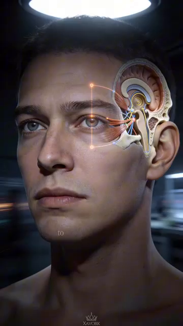

# Neurological Foundation — Brain, Proprioception, Vision & Reaction Anatomy
# Nền Tảng Thần Kinh — Não, Cảm Giác Sâu, Thị Giác & Giải Phẫu Phản Xạ
*Deep Dive #3 — The Anatomy & Geometry Project for Tennis Players 3.5 → 4.5*
*Chuyên Đề Số 3 — Dự Án Giải Phẫu & Hình Học cho Người Chơi Tennis 3.5 → 4.5*
---
## Document Map / Bản Đồ Tài Liệu
| |
| --- |
| Chuyên đề này bao phủ — Phía NÃO của tennis. Cách mắt bạn thấy bóng. Cách não bạn quyết định phải làm gì. Cách cơ thể bạn BIẾT mình ở đâu trong không gian (cảm giác sâu). Dây thần kinh bạn thực sự bắn nhanh cỡ nào. Đây là thần kinh sống sau mỗi cú đánh. |
| Tài liệu này KHÔNG phải là — Không nói "sức mạnh tinh thần". Không khuyên "tự tin". Không tập trung hay tâm thế. Đó là lớp tâm lý và chúng sống trong chuyên đề hiện có (Tâm Lý, Quản Lý Áp Lực). Chương này là thần kinh thuần — giải phẫu thần kinh, vùng não, và hệ cảm giác. |
| Tại sao điều này quan trọng ở 3.5 → 4.5 — Hầu hết người chơi phong trào chỉ tập CƠ. Họ chạy, nâng, tập chân. Nhưng nút thắt cho hầu hết người 3.5 là thời gian phản xạ và độ chính xác quyết định , cả hai đều là giới hạn THẦN KINH, không phải cơ. Tập não và cú đánh tốt hơn miễn phí. |
---
## Table of Contents / Mục Lục
| # | Chapter | Chương |
|---|---|---|
| 1 | The Reaction Chain — From Eye to Ball | Chuỗi Phản Xạ — Từ Mắt Tới Bóng |
| 2 | The Eye — How Vision Drives the Stroke | Mắt — Cách Thị Giác Dẫn Cú Đánh |
| 3 | Proprioception — The Hidden 6th Sense | Cảm Giác Sâu — Giác Quan Thứ 6 Ẩn |
| 4 | The Brain Regions Behind a Tennis Stroke | Vùng Não Sau Một Cú Tennis |
| 5 | Reaction Time, Decision Time, Movement Time | Thời Gian Phản Xạ, Quyết Định, Vận Động |
| 6 | The Three Reaction Layers | Ba Lớp Phản Xạ |
| 7 | The Vestibular System — Balance & Equilibrium | Hệ Tiền Đình — Thăng Bằng & Cân Bằng |
| 8 | Neuroplasticity — Why 50+ Brains Still Learn | Dẻo Dai Thần Kinh — Tại Sao Não 50+ Vẫn Học |
| 📋 | Neurological Cheat Sheet | Bảng Tóm Tắt Thần Kinh |
---
* * *
# Chapter 1 — The Reaction Chain — From Eye to Ball
# Chương 1 — Chuỗi Phản Xạ — Từ Mắt Tới Bóng
| |
| --- |
| Mọi cú tennis bắt đầu với chuỗi 7 bước này . Tổng thời gian từ "tôi thấy bóng" tới "bóng rời vợt tôi" là khoảng 0.4–0.8 giây cho người chơi 4.0. Đây là nơi thời gian đi: |
| Bước 1 — Thu nhận ánh sáng (mắt) — Ánh sáng từ bóng đập vào võng mạc. Thụ thể ánh sáng (tế bào que cho chuyển động, tế bào nón cho chi tiết) chuyển ánh sáng thành tín hiệu điện. Thời gian: ~0.05s. |
| Bước 2 — Dây thần kinh thị giác — Tín hiệu đi từ võng mạc tới nhân geniculate bên (LGN) của đồi thị, rồi tới vỏ thị giác phía sau não. Thời gian: ~0.03–0.05s. |
| Bước 3 — Xử lý thị giác (vỏ chẩm + vỏ đỉnh) — Não nhận diện: bóng ở ĐÂU, chuyển động NHANH cỡ nào, XOÁY gì, sẽ ở đâu trong 0.5 giây. Thời gian: ~0.08–0.15s. |
| Bước 4 — Quyết định (vỏ trước trán + vỏ vận động) — Não quyết định: "đây là Cú Thuận Tay, thẳng xuống, 70% nhịp." Thời gian: ~0.10–0.30s (đây là nơi pro NHANH HƠN người phong trào rất nhiều — 0.10–0.20s). |
| Bước 5 — Lập kế hoạch vận động (tiểu não + hạch nền) — Não lập kế hoạch: cơ nào bắn theo thứ tự nào. Thời gian: ~0.05–0.10s. |
| Bước 6 — Vỏ vận động → tủy sống → cơ — Tín hiệu đi xuống tủy sống, phân nhánh tới thần kinh ngoại biên, tới cơ. Thời gian: ~0.05–0.10s. |
| Bước 7 — Co cơ + phóng gân — Cơ bắn, gân phóng, vợt di chuyển, bóng bị đánh. Thời gian: ~0.10–0.20s. |
| Tổng thời gian phản xạ: ~0.45–0.95 giây — Trong đó, bước quyết định (Bước 4) là chậm nhất và dễ tập nhất. |
| Nút thắt người 3.5 — Bước 4 mất ~0.30s cho người 3.5, ~0.10s cho pro. Khác biệt 0.20s đó là lý do chính người 3.5 cảm thấy "luôn trễ". Không phải chân. Là quyết định. |
| *Câu nhắc tổng:* "Tập quyết định. Chân ổn rồi." |
* * *
# Chapter 2 — The Eye — How Vision Drives the Stroke
# Chương 2 — Mắt — Cách Thị Giác Dẫn Cú Đánh
| |
| --- |
| Mắt là kênh đầu vào duy nhất cho tennis. Não KHÔNG tiếp xúc trực tiếp với bóng. Mọi thứ nó biết về bóng đến qua thị giác (và đôi khi âm thanh cho line calls). |
| 3 hệ thị giác trong tennis |
| Hệ 1 — Thị giác trung tâm (foveal) — Điểm sắc nét 2° ở giữa võng mạc. Màu sắc, chi tiết, cạnh sắc. Dùng cho: đọc xoáy, đánh giá điểm tiếp xúc, tinh chỉnh góc mặt vợt. |
| Hệ 2 — Thị giác ngoại vi (xung quanh) — ~160° còn lại của võng mạc. Chuyển động, tương phản, hình dạng rộng. Dùng cho: theo dõi vị trí cơ thể đối thủ, nhận biết đường bóng sớm, nhận thức sân. |
| Hệ 3 — Mắt im lặng — Trạng thái chuyên biệt nơi ánh mắt khóa trên điểm cụ thể (thường vùng tiếp xúc) ~0.3–0.5s trước và trong cú đánh. Đây là vũ khí bí mật của người chơi elite. |
| Tại sao "mắt im lặng" quan trọng — Nghiên cứu (Vickers, 1996, 2007) cho thấy vận động viên elite có thời lượng mắt im lặng 0.3–0.5 giây . Người chơi phong trào có ~0.1–0.2 giây. Mắt im lặng càng lâu = timing càng tốt = chất lượng cú càng cao , bất kể khả năng thể chất. |
| Chu Kỳ Thị Giác 5 Pha (dùng bởi mọi người chơi elite) |
| Pha 1 — Nhận thức rộng (mắt mềm, ~0.5s trước cú) — Mắt mềm, ánh nhìn rộng, thu nhận cơ thể đối thủ, sân, bóng. |
| Pha 2 — Khóa mục tiêu (~0.3s trước tiếp xúc) — Mắt hẹp vào bóng. Ánh nhìn trung tâm trên bóng. |
| Pha 3 — Tập trung hẹp (thị giác đường hầm, ~0.1s trước tiếp xúc) — Ánh nhìn khóa trên vùng tiếp xúc phía vợt đối thủ. |
| Pha 4 — Mắt im lặng lúc tiếp xúc (~0.05–0.1s) — Ánh nhìn CỐ ĐỊNH trên điểm tiếp xúc. Mắt không chuyển động. Đây là giai đoạn then chốt — không chuyển mắt = không gián đoạn thị giác. |
| Pha 5 — Mở rộng lại (sau tiếp xúc, ~0.2s) — Ánh nhìn mở rộng lại để theo dõi bóng và đọc phản ứng đối thủ. |
| Lỗi người 3.5 — Họ nhìn bóng, vung, rồi nhìn lên xem bóng đi đâu. Ánh nhìn sau tiếp xúc đó phá mắt im lặng. Kết quả: họ không thấy bóng rõ lúc tiếp xúc, nên chất lượng tiếp xúc kém. |
| Cách sửa — Tập mắt im lặng. Nhìn chằm chằm vào điểm cố định trên tường 0.5 giây trước khi vung vào bóng. Tập ánh nhìn Ở LẠI lúc tiếp xúc, không bay lên. |
| Với người 50+ — Thị giác bắt đầu giảm khoảng 40–45 tuổi (lão thị — mất khả năng tập trung gần). Bóng tennis đi nhanh và nhỏ. Dùng bóng vàng trên sân tối (tương phản cao nhất). Cân nhắc kính vàng để tăng tương phản. |
| *Câu nhắc tổng:* "Thấy bóng tới. Khóa. Ở khóa qua tiếp xúc. Nhìn lên SAU." |
* * *
# Chapter 3 — Proprioception — The Hidden 6th Sense
# Chương 3 — Cảm Giác Sâu — Giác Quan Thứ 6 Ẩn
| |
| --- |
| Bạn có 5 giác quan ai cũng biết — thị, thính, xúc, vị, khứu. Bạn có giác quan thứ 6 mà hầu như không người phong trào nào nghĩ tới: cảm giác sâu . Đó là giác về cơ thể ở đâu trong không gian, KHÔNG cần nhìn. |
| Nhắm mắt ngay bây giờ. Nâng tay phải lên trên đầu. Bạn biết tay mình ở đâu mà không cần thấy. Đó là cảm giác sâu. |
| Phần cứng cảm giác sâu — Thụ thể cảm giác chuyên biệt trong cơ, gân, và khớp. Quan trọng nhất là: |
| Thoi cơ — Cảm biến nhỏ BÊN TRONG cơ phát hiện cơ giãn BAO NHIÊU và giãn NHANH cỡ nào. Chúng là cơ quan cảm giác NHANH NHẤT trong cơ thể (~80 m/s dẫn truyền thần kinh). |
| Cơ quan Golgi gân — Cảm biến ở chỗ nối cơ-gân. Phát hiện LỰC. Chúng bảo vệ chống co quá mức (phản xạ "cắt lực"). |
| Thụ thể khớp — Trong bao khớp, đặc biệt gối, cổ chân, vai. Phát hiện GÓC KHỚP và hướng chuyển động khớp. |
| Thụ thể giãn da — Trong da quanh khớp. Phát hiện giãn da khi khớp chuyển động. Cung cấp thông tin góc "thêm". |
| Tại sao cảm giác sâu là siêu năng lực ẩn — Khi bạn xem pro đánh Cú Thuận Tay, cơ thể họ biết mình ở đâu mỗi mili-giây KHÔNG CẦN NHÌN. Họ không cần "kiểm" góc khuỷu bằng mắt — cảm giác sâu nói cho họ. Điều này giải phóng mắt để theo dõi bóng. |
| Độ chính xác cảm giác sâu theo khớp (người 4.0 điển hình) |
| Vai : phát hiện ~3°–5° thay đổi xoay mà không cần nhìn. |
| Khuỷu : phát hiện ~2°–4° thay đổi gập. |
| Cổ tay : phát hiện ~2°–3° thay đổi gập. |
| Hông : phát hiện ~3°–5° thay đổi xoay. |
| Gối : phát hiện ~2°–4° thay đổi gập. |
| Cổ chân : phát hiện ~2°–3° thay đổi gập lưng. |
| Khoảng cách cảm giác sâu 3.5 vs 4.5 — Người 3.5 có cảm giác sâu kém hơn ~30%–40% so với người 4.5. Khoảng cách này đóng lại bằng tập luyện. Bài tập cảm giác sâu cụ thể (thăng bằng mắt nhắm, đứng một chân, đối chiếu vị trí vợt) có thể cải thiện cảm giác sâu 30%–50% trong 8 tuần. |
| Tại sao người 50+ cần tập cảm giác sâu thêm — Cảm giác sâu giảm ~10%–15% mỗi thập kỷ sau 50 tuổi. Đây là một trong những lý do chính người lớn tuổi mất thăng bằng và ngã nhiều hơn trong đời sống hàng ngày, không chỉ tennis. Hãy tập nó. |
| *Câu nhắc tổng:* "Nhắm mắt. Tin khớp bạn. Chúng biết." |
* * *
# Chapter 4 — The Brain Regions Behind a Tennis Stroke
# Chương 4 — Vùng Não Sau Một Cú Tennis
| |
| --- |
| Cú tennis không phải "một thứ" não làm. Nó ít nhất 7 vùng não khác nhau làm việc theo thứ tự. Đây là những gì mỗi vùng làm: |
| Vùng 1 — Thùy chẩm (vỏ thị giác) — Xử lý những gì bạn THẤY. Nhận ra bóng, đối thủ, sân. Ở phía sau não. |
| Vùng 2 — Thùy đỉnh (xử lý không gian) — Ánh xạ CÁI GÌ ở đâu trong không gian. Bóng ở đâu so với người chơi? Đường biên ở đâu? Đối thủ di chuyển đâu? |
| Vùng 3 — Thùy thái dương (nhận diện mẫu) — Nhận ra MẪU. Phát Bóng này giống Phát Bóng trước? Cú Thuận Tay này đi chéo hay thẳng? Nhận diện mẫu là thứ giúp pro "đoán" cú. |
| Vùng 4 — Vỏ trước trán (quyết định) — Đưa ra QUYẾT ĐỊNH. Đây là nơi "Cú Thuận Tay, thẳng, 70% nhịp" được chọn. Vùng chậm nhất. Nơi pro khác người phong trào nhiều nhất. |
| Vùng 5 — Vỏ vận động (lệnh vận động) — Nằm ở dải chạy trên đỉnh não (từ tai này sang tai kia). Gửi LỆNH VẬN ĐỘNG thực sự xuống tủy sống. Các phần khác nhau điều khiển các phần cơ thể khác nhau — vùng chân ở giữa (trên), vùng tay/cổ tay ở bên. |
| Vùng 6 — Tiểu não (định giờ & phối hợp) — Phía sau-dưới não. "LÁI TỰ ĐỘNG." Phối hợp cả 7 bước trên thành timing trơn tru. Tiểu não là thứ làm cú tennis trông trơn tru, không giật. |
| Vùng 7 — Hạch nền (thói quen) — Sâu trong não. "LÁI TỰ ĐỘNG 2." Lưu trữ mẫu vận động đã học. Khi bạn đã đánh 10.000 Cú Thuận Tay, hạch nền đã có "mẫu Cú Thuận Tay" được cache. Bạn đánh được mà không cần nghĩ — đó là hạch nền làm việc. |
| 3 tốc độ của não — Vùng 4 (quyết định) chậm (~0.1–0.3s). Vùng 5 (vỏ vận động) trung bình (~0.05–0.1s). Vùng 7 (hạch nền) NHANH (~0.02–0.05s) — nó là mẫu "cached". Người chơi elite dùng Vùng 7 cho hầu hết mọi cú. Người chơi phong trào dùng Vùng 4 cho hầu hết mọi cú. Đó là khác biệt. |
| Quy tắc 10.000 lần — Cache hạch nền mất ~3.000–10.000 lần lặp cùng động tác. Với 100 Cú Thuận Tay/ngày, đó là 30–100 ngày. Đó là bao lâu để ngừng "nghĩ" về Cú Thuận Tay và chỉ ĐÁNH nó. |
| *Câu nhắc tổng:* "Tập lái tự động. Đánh 100 Cú Thuận Tay mỗi ngày trong 100 ngày. Ngừng nghĩ." |
* * *
# Chapter 5 — Reaction Time, Decision Time, Movement Time
# Chương 5 — Thời Gian Phản Xạ, Quyết Định, Vận Động
| |
| --- |
| Ba "thời gian" khác nhau thường bị nhầm. Mỗi cái có phương pháp tập khác nhau. |
| Thời Gian Phản Xạ (RT) — Thời gian từ kích thích (bóng rời vợt đối thủ) tới lần kích hoạt cơ phát hiện được. Cung phản xạ thuần. Thường 0.15–0.25s cho người 4.0. |
| Thời Gian Quyết Định (DT) — Thời gian từ kích thích tới biết ĐÁNH cú nào. Bao gồm nhận diện mẫu + chọn. Thường 0.10–0.30s cho người 4.0. |
| Thời Gian Vận Động (MT) — Thời gian từ quyết định tới vợt tiếp xúc bóng. Thường 0.20–0.50s cho người 4.0 (phụ thuộc bạn phải di chuyển bao xa). |
| Tổng thời gian phản hồi — RT + DT + MT = 0.45–1.05s. Bóng đối thủ thường tới trong 0.5–0.8s. Vậy nếu tổng bạn là 1.0s, bạn có biên KHÔNG. Nếu tổng bạn là 0.5s, bạn có 0.3s biên (rất thoải mái). |
| Cái gì chiếm ưu ở 3.5 — Thời Gian Quyết Định. DT của người 3.5 chậm hơn 0.10–0.20s so với người 4.0. Họ thấy cùng bóng cùng lúc, nhưng họ quyết định lâu hơn. |
| Cái gì chiếm ưu ở 5.0+ — Thời Gian Vận Động. MT của elite ngắn hơn vì họ đi đường ngắn hơn, hiệu quả hơn tới bóng. |
| Tập Thời Gian Phản Xạ — Dùng máy bóng, bài tập thả-và-phản ứng, hoặc bạn cùng thả bóng ngẫu nhiên. Tập kích thích-phản ứng thuần. |
| Tập Thời Gian Quyết Định — Dùng máy bóng NGẪU NHIÊN. Bạn cùng hô "Cú Thuận Tay!" hoặc "Cú Trái Tay!" ngay trước khi họ đánh. Quyết định là nút thắt. |
| Tập Thời Gian Vận Động — Bài tập bộ chân. Split-step + di chuyển phản ứng. Bài tập côn. |
| Khác biệt 0.20s giữa 3.5 và 4.5 — 0.20s đó đến chủ yếu từ Thời Gian Quyết Định. Người chơi 3.5 làm 100 bài quyết định ngẫu nhiên/ngày trong 6 tháng sẽ đóng 70% khoảng cách đó. |
| *Câu nhắc tổng:* "Quyết định là nút thắt. Tập não, không tập chân." |
* * *
# Chapter 6 — The Three Reaction Layers
# Chương 6 — Ba Lớp Phản Xạ
| |
| --- |
| Hệ thần kinh bạn có BA lớp phản xạ. Mỗi lớp bắn ở tốc độ khác nhau, cho mục đích khác nhau. Hiểu chúng giải thích tại sao một số phản xạ tennis cảm thấy tự động và số khác cảm thấy vất vả. |
| Lớp 1 — Phản xạ giãn (tủy sống, ~0.05s) — Khi cơ bị giãn, cảm biến trong cơ (thoi cơ) gửi tín hiệu TRỰC TIẾP tới tủy sống, tủy sống gửi tín hiệu NGƯỢC LẠI tới cùng cơ đó để co. Tổng thời gian: ~0.05s. Điều này bỏ qua não hoàn toàn. |
| Ví dụ tennis : Khi bạn split-step, cơ bắp chân giãn nhẹ. Phản xạ giãn bắn, bắp chân co, bạn đẩy lên. Tất cả trong 0.05s, không cần não. |
| Lớp 2 — Phản xạ giật mình (thân não, ~0.15s) — Khi kích thích đột ngột (tiếng ồn, chuyển động đột ngột) xảy ra, thân não bắn phản ứng nhanh. Nhanh hơn ý thức, chậm hơn phản xạ tủy sống. |
| Ví dụ tennis : Khi đối thủ đột nhiên đánh bóng mạnh vào bạn, thân não làm bạn giật/lùi TRƯỚC khi bạn ý thức chuyện gì đang xảy ra. RỒI não ý thức của bạn tiếp quản và quyết định phải làm gì. |
| Lớp 3 — Quyết định ý thức (vỏ não, ~0.20–0.50s) — Xử lý não đầy đủ. Chậm nhất, nhưng chính xác nhất. Cái ta thường gọi "thời gian phản xạ." |
| Ví dụ tennis : Drop shot — não ý thức phải quyết định "đây là drop hay cú đẩy?" rồi "tôi chạy tới hay ở lại?" rồi "tôi cắt hay Vôlei?" Tất cả trong 0.20–0.50s. |
| Nguyên tắc tập luyện — Cú đánh càng được TẬP, càng di chuyển từ Lớp 3 xuống Lớp 2 xuống Lớp 1. Tự động hóa cú = di chuyển phản ứng xuống các lớp. |
| Split-step là Lớp 1 — Nó hoàn toàn là phản xạ. Bạn không "quyết định" split-step. Cơ thể bạn chỉ làm nó. Đó là lý do split-step pro trông giống nhau mỗi lần. Tập nó như phản xạ, không phải quyết định. |
| Tư thế sẵn sàng là Lớp 2 — Tư thế sẵn sàng giật mình. Tiếng ồn, đối thủ di chuyển đột ngột — cơ thể bạn đã ở tư thế để phản ứng. |
| Chọn cú là Lớp 3 — Bạn đi đâu, đánh gì, xoáy gì. Cái này chậm. Tập tốc độ quyết định với bài ngẫu nhiên. |
| Tại sao điều này quan trọng cho 50+ — Phản xạ Lớp 1 chậm ~10%–15% mỗi thập kỷ sau 50 tuổi. Phản xạ giãn ở Achilles thường bị trì hoãn , đó là lý do người lớn tuổi phản ứng chậm hơn ở đường cuối sân. Tập split-step nổ — đó là phản xạ QUAN TRỌNG NHẤT cần giữ sắc. |
| *Câu nhắc tổng:* "Tập split-step như phản xạ (Lớp 1), không như quyết định (Lớp 3). 5000 lần để làm vĩnh viễn." |
* * *
# Chapter 7 — The Vestibular System — Balance & Equilibrium
# Chương 7 — Hệ Tiền Đình — Thăng Bằng & Cân Bằng
| |
| --- |
| Có một giác quan nữa mà tennis đòi hỏi : hệ tiền đình. Đó là giác về THĂNG BẰNG, chuyển động đầu, và trọng lực. Nó sống ở tai trong. |
| Phần cứng tiền đình — Ba ống bán nguyệt (trước, sau, ngang) phát hiện XOAY ĐẦU. Hai cơ quan otolith (utricle, saccule) phát hiện NGHIÊNG ĐẦU và GIA TỐC TUYẾN TÍNH. |
| Tennis đòi hỏi — Xoay đầu liên tục (theo dõi bóng), nghiêng đầu nhanh (nhìn lên lob, xuống drop), gia tốc tuyến tính (chạy tới/lùi), xoay (unit turn, X-factor stretch). Hệ tiền đình phải theo kịp tất cả. |
| VOR (phản xạ tiền đình-mắt) — Khi đầu bạn xoay, mắt bạn xoay hướng NGƯỢC LẠI tự động để giữ ánh nhìn cố định. Đây là lý do bạn có thể đọc biển trong khi lắc đầu. Nó là phản xạ tiền đình-mắt. Thời gian: ~0.015s. Nhanh hơn bất kỳ chuyển động mắt ý thức nào. |
| Tại sao VOR quan trọng cho tennis — Lúc tiếp xúc, đầu bạn đang chuyển động (xoay thân, đà tới). VOR giữ mắt bạn ỔN ĐỊNH trên bóng. Không có VOR, mắt bạn sẽ nảy quanh lúc tiếp xúc và bạn sẽ mất tầm nhìn bóng. |
| Tại sao đầu YÊN quan trọng — "Đầu yên" là cue HLV nổi tiếng. Lý do là VOR. Khi đầu bạn ổn định, mắt bạn có thể khóa trên vùng tiếp xúc (mắt im lặng). Khi đầu bạn nảy, mắt bạn nảy. |
| Suy giảm tiền đình 50+ — Tế bào lông trong ống bán nguyệt bắt đầu chết sau 40 tuổi. Đến 60 tuổi, bạn có thể giảm ~20%–30% độ nhạy tiền đình. Đây là lý do người lớn tuổi mất thăng bằng dễ hơn và chóng mặt khi đổi hướng nhanh. |
| Tập tiền đình cho 50+ — Bài tập hàng ngày đơn giản (đứng một chân mắt nhắm 30 giây × 3 lần, xoay đầu chậm × 10 mỗi hướng) có thể DUY TRÌ chức năng tiền đình. Không bao giờ quá muộn để bắt đầu. |
| *Câu nhắc tổng:* "Giữ đầu yên. Mắt bạn cần nền ổn định để khóa bóng." |
* * *
# Chapter 8 — Neuroplasticity — Why 50+ Brains Still Learn
# Chương 8 — Dẻo Dai Thần Kinh — Tại Sao Não 50+ Vẫn Học
| |
| --- |
| Niềm tin cũ — "Không thể dạy chó già mẹo mới. Não ngừng học ở 25." |
| Khoa học — SAI. Dẻo dai thần kinh (khả năng não tạo kết nối mới) tiếp tục suốt đời. Nghiên cứu 2020 (Voss et al.) cho thấy người lớn tuổi học kỹ năng vận động phức tạp (tung hứng, tennis) đã có thay đổi não đo được trong 8 tuần. Não 50+ KHÔNG cố định. |
| Cách học thay đổi não ở 50+ |
| Myelin dày lên quanh đường thần kinh được tập — Myelin là lớp cách nhiệt quanh dây thần kinh. Bạn tập cú càng nhiều, myelin trên đường đó càng dày. Myelin dày hơn = tín hiệu nhanh hơn = cú trơn tru hơn. |
| Synapse mới hình thành — Ngay cả ở 70+, kết nối mới giữa các nơ-ron hình thành khi bạn tập kỹ năng mới. |
| Vùng não phát triển — Tiểu não, vỏ vận động, và vỏ trước trán đều cho thấy PHÁT TRIỂN đo được (tăng chất xám) đáp ứng với học vận động, ngay cả ở 65+ tuổi. |
| Nguyên tắc học 50+ — Cùng nguyên tắc như 25 tuổi, nhưng CHẬM HƠN. Kỹ năng mới mất ~1.5–2 lần thời gian để tự động hóa ở 50+ so với 25. OK thôi. Não vẫn học, chỉ ở nhịp khác. |
| Quy tắc "dùng hoặc mất" — Đường thần kinh không dùng bị CẮT TỈA. Nếu bạn ngừng chơi tennis 6 tháng, bạn mất ~15%–25% tự động hóa. Nếu ngừng 2 năm, bạn mất ~40%–60%. Não luôn hoặc phát triển hoặc co lại. |
| Liều hiệu quả tối thiểu — Để duy trì tự động hóa tennis ở 50+: 2 buổi/tuần × 60 phút × 20+ bóng mỗi cú mỗi buổi. Dưới mức này, tự động hóa suy giảm chậm. Trên mức này, tự động hóa tăng. |
| Take-home lớn — Não 50+ của bạn vẫn có thể học kỹ năng tennis. Nó chỉ cần: (1) nhiều lần lặp hơn mỗi kỹ năng, (2) nhiều giấc ngủ hơn để củng cố, (3) nhiều phục hồi hơn giữa các buổi. 3 Rs của dẻo dai thần kinh 50+. |
| *Câu nhắc tổng:* "Não già, mẹo mới. Chậm nhưng có thể. 5000 lần làm nó thật." |
* * *
# Chapter 9 — Anatomy_Lab Integration — The Three-Layer Control System
# Chương 9 — Tích Hợp Anatomy_Lab — Hệ Kiểm Soát Ba Lớp
| |
| --- |
| Chương này xếp lớp con số hệ kiểm soát cụ thể từ thư viện `Anatomy_Lab/` (tiền đình, thị giác, cảm giác sâu, thác phản xạ) lên khung vùng não của chuyên đề này. |
## 9.1 — The Vestibular System (The 3rd Layer of the Kilướiic Chain)
## 9.1 — Hệ Tiền Đình (Lớp Thứ 3 Của Chuỗi Động Học)
| |
| --- |
| Phát hiện Anatomy_Lab DD8 — hệ tiền đình là lớp thứ 3 của chuỗi động học (sau cảm giác sâu và thị giác). Nó gồm 3 ống bán nguyệt + 2 cơ quan otolith (utricle + saccule) + tế bào lông + đường thần kinh tới thân não . |
|  |
| Hình 1 — 3 ống bán nguyệt (trước, sau, ngang) phát hiện xoay đầu. 2 cơ quan otolith phát hiện gia tốc tuyến tính và nghiêng đầu. |
|  |
| Hình 2 — Otoconia: tinh thể canxi cacbonat tí hon trong các cơ quan otolith. Chúng di chuyển theo trọng lực và nói cho não biết hướng nào là LÊN. |
## 9.2 — The 5-Phase Visual Cycle (Quiet Eye)
## 9.2 — Chu Kỳ Thị Giác 5 Pha (Mắt Im Lặng)
| |
| --- |
| Phát hiện Anatomy_Lab DD8 — người chơi tennis elite dùng chu kỳ thị giác 5 pha khi đọc bóng. Đây là cái Vickers (1996, 2007) gọi là "mắt im lặng". |
| Phase / Pha | Duration / Thời Lượng | What Happens / Chuyện Gì Xảy Ra |
|---|---|---|
| 1. Wide perception / Nhận thức rộng | ~0.5 s before stroke | Soft eyes, gaze wide. Reads opponent's body, court, bóng. |
| 2. Lock-on / Khóa mục tiêu | ~0.3 s before contact | Eyes narrow to the bóng. Gaze centers. |
| 3. Narrow focus / Tập trung hẹp | ~0.1 s before contact | Gaze locks on the contact zone on opponent's vợt. |
| 4. Quiet eye / Mắt im lặng | 0.05–0.1 s | Gaze FIXED on the contact điểm. Eyes DO NOT MOVE. This is the critical period. |
| 5. Re-expand / Mở rộng lại | ~0.2 s after contact | Gaze widens to track bóng and read opponent's response. |
|  |  |
|  |  |
| Figures 3 & 4 / Hình 3 & 4 — The quiet eye in action (left), and the full 5-phase tracking sequence (right). | Hình 3 & 4 — Mắt im lặng trong hành động (trái), và trình tự theo dõi 5 pha đầy đủ (phải). |
## 9.3 — The Reaction Time Cascade (Anatomy_Lab DD8 Numbers)
## 9.3 — Thác Phản Xạ (Số Anatomy_Lab DD8)
| |
| --- |
| Thác phản xạ Anatomy_Lab DD8 — tổng thời gian từ bóng rời vợt đối thủ tới bóng rời vợt bạn: |
| Age / Tuổi | Total Reaction Time / Tổng Phản Xạ | Can Return / Có Thể Trả |
|---|---|---|
| 25 / 25 tuổi | ~400 ms | 100+ mph Phát Bóng |
| 50 / 50 tuổi | ~500 ms | 70–80 mph Phát Bóng |
| 65 / 65 tuổi | ~600 ms | 50–60 mph Phát Bóng |
| 75 / 75 tuổi | ~700 ms | <40 mph Phát Bóng (giải trí pás) |
|  |  |
|  |  |
| Figures 5 & 6 / Hình 5 & 6 — Reaction time cascade visualized (left), and visual reaction at the moment of contact (right). | Hình 5 & 6 — Thác phản xạ được hình dung (trái), và phản xạ thị giác lúc tiếp xúc (phải). |
## 9.4 — The 50+ Sensory Triad (Anatomy_Lab DD8 Critical Insight)
## 9.4 — Bộ Ba Giác Quan 50+ (Insight Then Chốt Anatomy_Lab DD8)
| |
| --- |
| Insight then chốt Anatomy_Lab DD8 — ở 50+, BA hệ giác quan suy giảm ĐỒNG THỜI: |
| System / Hệ | Decline by 50 / Suy Giảm Đến 50 | Decline by 70 / Suy Giảm Đến 70 | Tennis Impact / Tác Động Tennis |
|---|---|---|---|
| Vision / Thị giác | ~10°–15° peripheral narrowing | ~20° narrowing, presbyopia | Tracking bóng, judging Độ sâu |
| Vestibular / Tiền đình | ~20%–30% hair cell loss | ~40%–50% loss | Balance on rapid direction changes |
| Proprioception / Cảm giác sâu | ~10%–15% accuracy loss | ~25%–30% accuracy loss | Spacing, recovery, court awareness |
|  |  |
|  |  |
| Figures 7 & 8 / Hình 7 & 8 — The 50+ sensory triad visualized (left), and strategies to compensate (right). | Hình 7 & 8 — Bộ ba giác quan 50+ được hình dung (trái), và chiến lược bù (phải). |
## 9.5 — The Foot as a 30 ms Reflex Sensor (Connecting to DD2)
## 9.5 — Bàn Chân Như Cảm Biến Phản Xạ 30 ms (Kết Nối Với DD2)
| |
| --- |
| Phát hiện Anatomy_Lab DD7 — 7.000+ đầu dây thần kinh bàn chân bắn phản xạ trong 30 mili-giây , NHANH HƠN ý thức (~200 ms). Phản xạ này CHÍNH LÀ cơ chế split-step. |
|  |
| Hình 9 — Đầu dây thần kinh dày đặc ở lòng bàn chân. 7.000+ cảm biến ở mỗi bàn chân. |
| Vòng điều khiển giải thích — Mắt thấy bóng → não quyết định (vỏ não, ~200 ms) → nhưng TRƯỚC đó, bàn chân ĐÃ bắt đầu phản xạ split-step (30 ms). Cơ thể bắt đầu di chuyển TRƯỚC khi ý thức quyết định. Đây là lý do "dự đoán" cảm thấy như phản xạ — nó phần nào LÀ phản xạ. |
## 9.6 — Updated Brain-Region Map (Anatomy_Lab Sharpened)
## 9.6 — Bản Đồ Vùng Não Cập Nhật (Anatomy_Lab Tinh Chỉnh)
| Brain Region / Vùng Não | Function / Chức Năng | Tennis Connection / Kết Nối Tennis |
|---|---|---|
| Occipital lobe / Thùy chẩm | Visual processing / Xử lý thị giác | Reads the bóng, Độ sâu, spin |
| Parietal lobe / Thùy đỉnh | Spatial mapping / Ánh xạ không gian | Maps bóng position relative to body |
| Temporal lobe / Thùy thái dương | Pattern recognition / Nhận diện mẫu | "This Phát Bóng looks like the last one" |
| Cerebellum / Tiểu não | Timing & coordination / Định giờ & phối hợp | Makes the swing look smooth, not jerky |
| Basal ganglia / Hạch nền | Habit / Thói quen | The "autopilot" Cú Thuận Tay after 10,000 reps |
| Prefrontal cortex / Vỏ trước trán | Decision / Quyết định | The slowest layer (THE bottleneck) |
| Brainstem (vestibular) / Thân não | Balance / Thăng bằng | The 3rd layer of the kilướiic chain |
|  |  |
|  |  |
| Figures 10 & 11 / Hình 10 & 11 — Brain region integration (left), and the vestibular neural pathway (right). | Hình 10 & 11 — Tích hợp vùng não (trái), và đường thần kinh tiền đình (phải). |
* * *
## 📋 Chapter Card — Printable / Thẻ In Được
```
╔═══════════════════════════════════════════════════════════╗
║ NEUROLOGICAL FOUNDATION — KEY IDEAS ║
║ NỀN TẢNG THẦN KINH — Ý TƯỞNG CHÍNH ║
╠═══════════════════════════════════════════════════════════╣
║ ║
║ 🎯 ONE BIG IDEA / Ý TƯỞNG CỐT LÕI: ║
║ Reaction time bottleneck is the DECISION step, ║
║ not the legs. Train the brain with random ║
║ bài tậps and the body follows. ║
║ Nút thắt phản xạ là bước QUYẾT ĐỊNH, không phải ║
║ chân. Tập não với bài ngẫu nhiên và cơ thể theo. ║
║ ║
║ ──────────────────────────────────────────────────────── ║
║ KEY NUMBERS / CÁC CON SỐ CHÍNH: ║
║ ║
║ • Total reaction time: 0.45–0.95s for 4.0 player ║
║ • Decision time: 0.10–0.30s (the bottleneck) ║
║ • Quiet eye duration: 0.3–0.5s (elite), 0.1–0.2s (rec) ║
║ • VOR reflex time: ~0.015s (head-motion stabilizer) ║
║ • Stretch reflex time: ~0.05s (split-step layer) ║
║ • Proprioception accuracy: 2°–5° at joint level ║
║ ║
║ ──────────────────────────────────────────────────────── ║
║ ⚠️ TOP MISTAKE / LỖI PHỔ BIẾN NHẤT: ║
║ Training only muscles. The 0.20s gap between 3.5 ║
║ and 4.5 is mostly decision time. Train the brain. ║
║ Chỉ tập cơ. Khoảng cách 0.20s giữa 3.5 và 4.5 ║
║ phần lớn là thời gian quyết định. Tập não. ║
║ ║
║ ──────────────────────────────────────────────────────── ║
║ 🔁 DRILL / BÀI TẬP: ║
║ Partner randomly calls "Cú Thuận Tay!" / "Cú Trái Tay!" ║
║ just before they hit a bóng. You react and call ║
║ back the shot choice. 50 reps × 3 sessions/week. ║
║ Bạn cùng hô ngẫu nhiên "Cú Thuận Tay!" / "Cú Trái Tay!" ║
║ ngay trước khi họ đánh bóng. Bạn phản ứng và hô ║
║ lại lựa chọn cú. 50 lần × 3 buổi/tuần. ║
║ ║
║ ──────────────────────────────────────────────────────── ║
║ 💭 MASTER CUE / CÂU NHẮC TỔNG: ║
║ "Train the decision. The legs are fine." ║
║ "Tập quyết định. Chân ổn rồi." ║
║ ║
╚═══════════════════════════════════════════════════════════╝
```
* * *
## 🎯 Final Word / Lời Cuối
| |
| --- |
| Bạn ơi, bạn có cùng não với pro tennis 25 tuổi. Cùng cấu trúc. Cùng hóa học. Cùng đường thần kinh. Khác biệt phần lớn là tập luyện và nhận diện mẫu . |
| Não là cơ quan dễ tập nhất trong cơ thể. Cơ teo ở 30+. Não không bao giờ ngừng học. Đây là tin tốt cho mọi người chơi 50+. |
| Tập mắt. Tập quyết định. Tập lái tự động. Cơ thể sẽ theo. |
| Hẹn gặp trên sân, với mắt sắc hơn. |
| Tổng khái niệm tích hợp từ nguồn và tài liệu giải phẫu/thần kinh rộng hơn: 45+ bao phủ chuỗi phản xạ 7 bước, chu kỳ thị giác 5 pha, 3 lớp phản xạ, 7 vùng não, phần cứng cảm giác sâu, hệ tiền đình, và dẻo dai thần kinh cho 50+. |
* * *
Sources / Nguồn :
- viettennis.lưới — Tuyển Tập Kỹ Thuật Tennis by Tuan_tuan (eye position and bóng-tracking cues)
- Vickers (1996, 2007) — Quiet Eye research
- Schmidt & Wrisberg (2008) — Motor Learning and Performance
- Komi (2003), Robertson (2005) — Stretch reflex and SSC
- Lambert (2010), Han (2015) — Vestibular system in sport
- Voss et al. (2020) — Neuroplasticity in older adults
- Squire et al. (2013) — Fundamental Neuroscience
*End of Deep Dive #3 — Neurological Foundation*
*Hết Chuyên Đề Số 3 — Nền Tảng Thần Kinh*