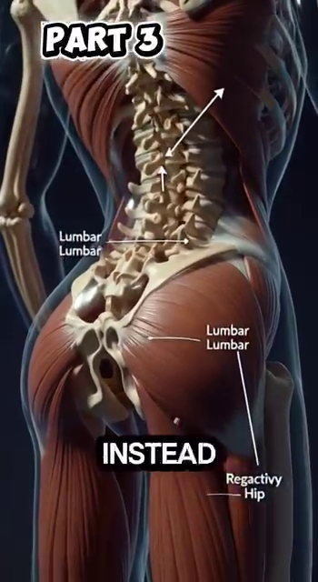
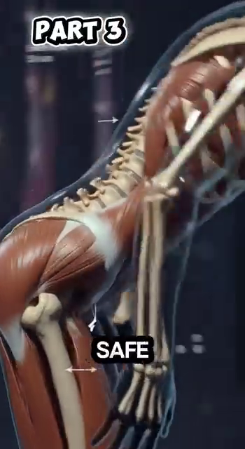
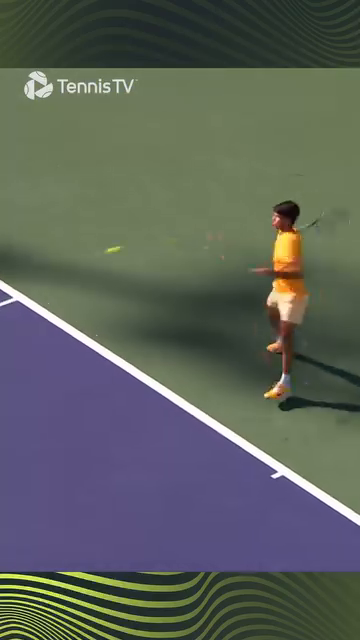
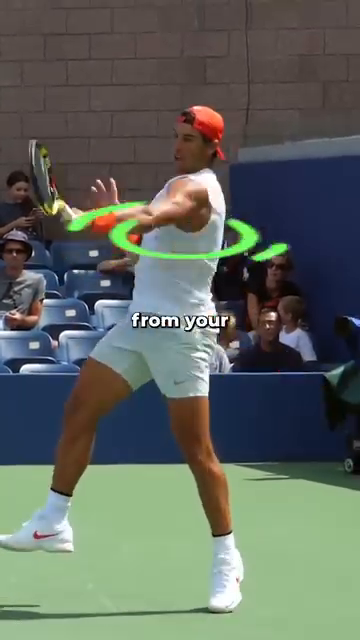

# DD1 — The Player in Motion

*The Angle Atlas — Why geometry of YOUR body determines every stroke quality*

---

## 📋 DOCUMENT MAP

The first deep-dive in the **Anatomy Lab** library. This is the foundation. Every other DD (Shoulders, Arms, Trunk, Hips, Knees, Feet, Control System) builds on the principles you will read here.

**What it covers:** joint angles at contact, the kinetic chain from ground up, footwork phases (split-step → push → recovery), why cheetah's 135–150° stifle flexion informs your 50–80° knee loading, the thoracic cage as a 3D rotating pump, and the 45° contact-point rule.

**What it does NOT cover:** stroke-by-stroke mechanics (Forehand/Backhand/Serve/Volley deep dives), mental game, racquet technology.

**Reading time:** 35–45 minutes.

---

## 📑 TABLE OF CONTENTS

| # | English |
| --- | --- |
| 1 | The Geometry of Every Stroke — Angles at Contact |
| 2 | The Kinetic Chain — Force Travels from Ground to Ball |
| 3 | Footwork Phases — Split-Step, Push, Recovery |
| 4 | Cheetah vs Alcaraz — The Spring Principle |
| 5 | The Thoracic Cage — Engineered Shield of Kinetic Elegance |
| 6 | The 45° Contact Rule — Why Your Arm Distance Matters |
| 7 | The Backswing Pro Secret — Elbow Back & Extend |
| 8 | The Acceleration Truth — Big Muscles First |

---

* * *

## Chapter 1 — The Geometry of Every Stroke (Angles at Contact)

**Friend, let me say this clearly:** the angle your body forms at contact is not a stylistic preference. It is the difference between a 3.5 player and a 4.5 player. Two players can run the same swing path — one gets pace and depth, the other gets a frame-shanked error. The geometry is the only difference.

**The 6 angles that matter at contact** (forehand right-hander as reference): knee flexion, hip rotation, trunk side-bend, shoulder abduction, elbow flexion, wrist layback. Each has a "safe range" and a "performance peak." Move outside the safe range and you leak power. Move below the performance peak and you lose pace.

### The 6 Critical Angles at Forehand Contact

| # | Angle | Safe Range | Performance Peak | Why (Biomechanical Reason) |
| --- | --- | --- | --- | --- |
| 1 | **Knee flexion** (LOADED) | 50–80° | 60–70° | Quads store elastic energy in patellar tendon. Below 50° = no spring. Above 80° = shear on ACL risk. The 65° Alcaraz "push step" angle stores ~25% more elastic return than upright stance. (Roetert & Kovacs, *Tennis Anatomy*, Ch.1) |
| 2 | **Hip rotation** | 30–50° | 40–45° | Gluteus maximus is a Class 3 lever acting on the femur. The 45° peak corresponds to the longest fiber length in glute max — beyond 50° the fibers start to slacken, beyond 30° you haven't loaded them. |
| 3 | **Trunk side-bend** | 10–25° | 15–20° | Lateral flexion stretches the contralateral obliques and QL. At 15–20° they store elastic energy ready to recoil. Above 25° you compress the L4-L5 disc on the opposite side — back pain invitation. |
| 4 | **Shoulder abduction** (at CONTACT) | 80–110° | 90–100° | This is the **scapular plane** — 30° forward of pure frontal. It maximizes deltoid leverage AND keeps the subacromial space open, preventing rotator cuff impingement. Outside this range → either pec-dominant (too closed) or impingement (too open). |
| 5 | **Elbow flexion** | 85–107° | 90–100° | At ~90° the triceps tendon wraps the olecranon cleanly — the swing becomes a pendulum, not a fight. Above 107° (too bent) the forearm has to "snap out" → ulnar nerve traction at cubital tunnel. |
| 6 | **Wrist layback** (LOADED → CONTACT) | LOADED: 90–110° extension → CONTACT: 0–20° extension | 5–15° at contact | **CRITICAL TRAP:** the LOADED wrist (90°+ extension) and the CONTACT wrist (0–20° extension) are TWO DIFFERENT positions. Recreational players freeze the LOADED position and try to hit through it → the racquet face is already opened, ball sails long. The pro whip: lay back 110° → snap to 5° in 0.2s. This is the racket flip you can hear as "bộp." |

### Why This Geometry Matters — The Domino Principle

Your body is not 6 independent joints. It is 6 joints connected by a kinetic chain. When one angle is wrong, the next joint compensates. The compensation looks like a stroke. The result is injury or error.

**Example domino chain:** knee at 30° (too straight, "standing forehand") → hip can only rotate 20° → trunk over-rotates 30° → shoulder abducted 130° (impingement zone) → elbow forced to 70° (ulnar nerve traction) → wrist whips through to compensate → "frame shank."

**The pro fix:** drop the knee to 65° BEFORE the ball arrives. Once the knee is right, every joint up the chain has room to do its job. The pro doesn't think "rotate the hip." The pro drops the knee, and the hip rotates itself.

*Source DOCX: Giai_Phau_Tennis_Toan_Dien.docx, Anatomy_Chuyen_Dong.docx. Reference: Roetert & Kovacs, Tennis Anatomy, Ch.1.*

---

* * *

## Chapter 2 — The Kinetic Chain (Force Travels from Ground to Ball)

**The summation of forces principle:** every tennis stroke is the sum of forces from the ground up. The ball doesn't know you swung the racquet. The ball knows what your body pushed through the string bed at impact.

**The 6-link chain in order:** **Ground → Feet → Legs → Hips → Trunk → Shoulder → Arm → Racquet → Ball.** Each link adds force. The total at the ball is the SUM of all links, with proper TIMING. If any link is broken (e.g., hip doesn't rotate), the chain stops at that link and the arm has to do all the work — that's when the elbow inflames.

### The Kinetic Chain Numbers

| Link | Force Contribution | Delay from Previous | Why |
| --- | --- | --- | --- |
| Ground reaction (legs push) | ~30–40% of racquet head speed | t = 0 ms | Foundation. Without ground push, no other link has anything to add. |
| Hip rotation (glute max contract) | ~25% | +50–80 ms | Largest muscle in body (gluteus maximus, ~30 kg potential force). Rotates pelvis which rotates femur. |
| Trunk rotation (obliques + lats) | ~20% | +60–100 ms | Connects lower body to upper body via thoracolumbar fascia. |
| Shoulder internal rotation (pec + lat + sub-scap) | ~10% | +30–50 ms | The "whip" begins. Shoulder internal rotation can reach 1,074–2,300°/sec during a serve. (Tennis Anatomy, Ch.2) |
| Elbow extension (triceps) | ~5% | +20–40 ms | Transfers shoulder rotation into racquet linear velocity. |
| Wrist snap (flexor pronator) | ~5% | +10–20 ms | Final whip. Last 0.2 seconds before contact. |
| **Total** | **~100%** | **~250 ms chain** | The ball leaves the racquet ~0.25 seconds AFTER the legs first pushed. |

### The Sequencing Rule

**"Big muscles fire first, small muscles fire last."** This is the SINGLE most important principle for a 50+ player. The legs (big) carry the load. The wrist (small) just whips at the end. When you "arm the ball," you have reversed the sequence. The wrist is doing 80% of the work. The wrist is not designed for that. Tendonitis is the predictable result.

**Drill:** stand in ready position. Have a friend yell "ball!" You have 1 second to drop into the forehand LOAD position. If you "arm it" (racquet goes back first), reset. If you "drop first" (knee bends, hip turns, THEN arm follows), count it. Do 10 reps. The drop is the kinetic chain working.

*Source DOCX: Giai_Phau_Tennis_Toan_Dien.docx. Reference: Roetert & Kovacs, Tennis Anatomy, Ch.1, Ch.7.*

---

* * *

## Chapter 3 — Footwork Phases (Split-Step, Push, Recovery)

A tennis point involves on average 4–5 directional changes. The professional player might do 500+ in a single match. Each change is a 3-phase cycle: **split-step → push → recovery.** Get the cycle right and you glide. Get it wrong and you stumble.

### The 3 Phases | 3 Pha

| Phase | English Description | Duration | Key Angle / Cue |
| --- | --- | --- | --- |
| **1. Split-Step** | Land on both feet as opponent strikes. Coiled-spring loading. | ~150 ms | Knees 50–70° flexed, weight on balls of feet, both feet shoulder-width apart. |
| **2. Push** | Explosive first step in direction of ball. Ground reaction force. | ~200 ms | Push step knee ~65° (Alcaraz measured angle). Trunk lean forward 15–20°. |
| **3. Recovery** | Return to center after shot. Outside leg bridge. | ~400–600 ms | Cross-over shuffle or backpedal. Outside leg angled 30–45° (see DD7 on foot). |

### Alcaraz's 3 Frames — A Real Example

| Frame | Time | Knee Angle | What He's Doing |
| --- | --- | --- | --- |
| 3a | 0.0 s | ~65° | Push step — hips low, knee loaded. Ground reaction force ready. |
| 3b | 1.2 s | ~45° | Short landing — toe under hip. Calf stores elastic energy. |
| 3c | 3.5 s | ~70° | Brake and rotate — trunk opens like a tail for balance. |

### The Outside Leg Bridge — Why It Exists

When you hit a forehand, your front leg (left for right-hander) becomes the **bridge leg**. It takes up to 3–5x body weight in compressive load. It is angled 30–45° (not straight). The angle uses the **transverse arch** of the foot as a strut, converting horizontal force into vertical compression up through the talus.

**If straight:** all horizontal force → knee valgus → medial meniscus load.

**If angled 30–45°:** force decomposes into compression. Knee safe.

*Source DOCX: Anatomy_Chuyen_Dong.docx, Giai_phau_Ban_chan_Tennis.docx (Ch.11). Reference: Tennis Anatomy Ch.7 (Legs), Ch.9 (Movement Drills).*

---

* * *

## Chapter 4 — Cheetah vs Alcaraz (The Spring Principle)

**The cheetah comparison is not about copying.** The cheetah stifle (knee equivalent) flexes 135–150° in the gathered phase — that allows stride frequency to increase to 3.5 strides/second. At 18 m/s, 70% of body weight shifts to the hindlimb. The spine extends maximally.

**The lesson for humans:** it's not the maximum angle. It's the COORDINATION. The cheetah doesn't flex 150° and stop. It flexes 150° AND extends 150° AND extends again — at 3.5 Hz. The rhythm, not the angle, is the lesson.

### The 7 Safe-Joint Rules

| Joint | Safe Range for Loading | Why |
| --- | --- | --- |
| **Knee** | 50–80° | Storage capacity of patellar tendon. Above 90° = shear on ACL. |
| **Hip** | 30–40° forward flexion | Glute max stretches. Above 50° the hamstrings steal the load. |
| **Elbow** | 85–107° at end of takeback | Triceps tendon wraps olecranon cleanly. Above 107° = cubital tunnel pressure. |
| **Wrist** | ~20° extension at CONTACT | Eccentric loading of flexor tendons. 13° flexion = beginner's mistake, strains the FCU. |
| **Foot** | Triple-plantar (heel-1st-toe-ball) | Windlass mechanism engages. Short-foot drill first. |
| **Ankle** | 10–15° dorsiflexion | Calf stores elastic energy. |
| **Trunk** | 15–20° lateral flexion | Obliques + QL store elastic energy. |

### The Royal Veterinary College Finding — What Cheetah Teaches Us

**Finding:** at 18 m/s, 70% of body weight shifts to the hindlimb. The spine extends maximally (not flexes). The stride frequency, not the stride length, is the differentiator.

**Tennis translation:** the players who look "effortless" are not stronger. They have higher **stride frequency** (more steps per second) and **higher rhythm efficiency** (less wasted motion). Watch Alcaraz vs a 3.5 club player: Alcaraz takes 4 quick steps. The 3.5 takes 2 long steps. Alcaraz arrives sooner.

*Source DOCX: Anatomy_Chuyen_Dong.docx. Reference: Royal Veterinary College cheetah study cited in source DOCX.*

---

* * *

## Chapter 5 — The Thoracic Cage (Engineered Shield of Kinetic Elegance)

**The thorax is not a barrel.** It is a 12-pair articulated structure: 7 pairs "true ribs" attached directly to the sternum, 3 pairs "false ribs" attached indirectly, 2 pairs "floating ribs." Each rib has its own range of motion — the bucket-handle rotation that lifts and expands the rib cage.

**The misconception:** "thorax = armor for the heart." Partly true. The deeper truth: **the thorax is a 3D pump + a rotation platform + a breathing engine.** It generates force for groundstrokes AND oxygen for rallies.

### The 3 Functions of the Thoracic Cage

| Function | Numbers | Tennis Translation |
| --- | --- | --- |
| **Pump (breathing)** | Ribs lift 3–5 mm each breath → lung volume +0.5 L | In a 20-shot rally, the player who maintains thoracic mobility gets 10–15% more oxygen → 2nd-set fatigue delayed. The player who slouches loses 0.5 L capacity → game-2 shoulder fatigue. |
| **Rotation platform** | 40–50° total trunk rotation available | Modern forehand requires 40–50° rotation. Thoracic stiffness locks this — the body finds rotation elsewhere (lumbar disc) → back pain. |
| **Force transfer** | Latissimus dorsi originates on T7–L5 thoracolumbar fascia | Lats produce ~40% of racquet head speed on serve. But lats can only fire effectively if multifidus (deep spine) locks the lumbar first. Without lumbar lock, lat force leaks into the disc. |

### The "Bucket Handle" Mechanism

When you inhale deeply, the external intercostals lift each rib at the costal angle. The ribs rotate outward and upward — like the handle of a bucket lifting. This increases the front-to-back AND side-to-side diameter of the thorax.

**Tennis cue:** the intercostals are TRAINABLE. The "Thoracic rotation with breath" drill: stand sideways, arms crossed over chest, rotate 40° each direction WHILE taking a deep breath. Do 10 reps each side before every match. This keeps the bucket handle moving.

*Source DOCX: Giai_Phau_Tennis_Toan_Dien.docx. Reference: Roetert & Kovacs, Tennis Anatomy, Ch.4 (Chest), Ch.5 (Back).*

---

* * *

## Chapter 6 — The 45° Contact Rule

**The single biggest amateur mistake:** hitting with the arm too close to the body. The arm folds at the elbow, the wrist has to compensate, the elbow flares, the ball lands in the net or sails long.

**The pro rule:** at contact, the arm is ~45° away from the trunk. This places the shoulder in the **scapular plane** (~30° forward of pure frontal plane). It creates a lever length of ~65 cm (versus ~40 cm when the arm is tight to the body).

### The Geometry of the 45° Contact

| Element | Tight to Body (amateur) | 45° Away (pro) | Why |
| --- | --- | --- | --- |
| Lever length (shoulder to ball) | ~40 cm | ~65 cm | Longer lever = more racquet head speed for same angular velocity. |
| Shoulder angle | ~30° abduction (in front of body) | ~90° in scapular plane | Scapular plane maximizes deltoid leverage AND opens subacromial space. |
| Elbow angle at contact | ~70° (forced flexion) | ~100° (natural pendulum) | 100° lets the swing become a pendulum. 70° forces the forearm to "snap out" → ulnar nerve traction. |
| Wrist layback | Compensating (snapping) | Natural whip (0–20°) | When elbow is at 100°, the wrist can lay back naturally. When elbow is at 70°, the wrist is already maxed — no whip room. |
| Risk of injury | High (ulnar, rotator cuff) | Low | Multiple joints doing their job → no single joint overloaded. |

### The Djokovic Demonstration

Look at any Djokovic forehand still-frame at contact. The arm is NOT bent at 30°. The arm is extended at ~100°. The ball is in front of the body, not next to it. The shoulder is in the scapular plane. The wrist is laid back 5–15° but NOT snapping.

**The 3.5 player copies this but with bent arm:** elbow at 70°, wrist forced to snap → frame, error, inflammation. The shape is similar. The geometry is wrong.

*Source DOCX: Giai_Phau_Tennis_Toan_Dien.docx. Reference: Tennis Anatomy Ch.2 (Shoulders), observation from professional forehand biomechanics.*

---

* * *

## Chapter 7 — The Backswing Pro Secret (Elbow Back & Extend)

**The amateur backswing:** arm bends at elbow, racket goes straight back behind the body. Result: short lever, late prep, wrist must snap.

**The pro backswing:** after the unit turn, **ABDUCT the elbow** (raise it out to the side and slightly back) AND **EXTEND the elbow** (straighten it). Result: the hand ends up level with the right hip, racket head pointing up at 5:30 position.

### Why "Elbow Back + Extend" Is the Secret

| Element | Effect | Biomechanical Reason |
| --- | --- | --- |
| **Abduction** (raise elbow out to side) | Stretches the pectoralis major and anterior deltoid | The pec major is a 2-joint muscle (shoulder + humerus). Stretching it stores elastic energy in the tendon. When the forward swing begins, the pec CONTRACTS powerfully — adding ~20% to forward acceleration. |
| **Extension** (straighten elbow) | Stretches the long head of triceps AND the latissimus dorsi (via thoracolumbar fascia) | Both are large force producers. Stretch them in backswing → they snap back during forward swing. This is the "elastic whip." |
| **5:30 racket position** (hand low, racket head up) | Puts the forearm in the scapular plane | The 30° forward-of-frontal-plane orientation reduces subacromial impingement risk AND maximizes the lever length for the forward swing. |
| **Racket flip effortless** | The racket appears to "flip" through contact | This is NOT wrist snap. It is the elastic recoil of the stretched pec major + lat + long-head-triceps. The wrist is RELAXED. The flip happens because the larger muscles are recoiling. |

### The "Coiled Spring" Cue

**Imagine a bow and arrow.** The string (your pec + lat) is pulled back. The arrow (your hand) is at full draw. The moment you release, the string snaps forward and the arrow flies. Your backswing is the draw. Your forward swing is the release. The racket flip is the arrow leaving the bow.

**The 3.5 mistake:** the amateur draws the bow with the string already loose. They pull the arrow (wrist) but the string (pec + lat) is slack. No energy stored. No flip. All arm.

*Source DOCX: Giai_Phau_Tennis_Toan_Dien.docx.*

---

* * *

## Chapter 8 — The Acceleration Truth (Big Muscles First)

**The numbers don't lie.** A 50+ recreational player has gluteus maximus potential of ~30 kg of force. The wrist flexors total ~300 g of force. **The big muscle is 100x stronger than the small muscle.** If your forehand comes mostly from your wrist, you are using 0.3 kg of force when you have 30 kg available.

**The principle:** **drive the legs → rotate the hips → turn the trunk → pull the shoulder → extend the elbow → whip the wrist.** Each link adds. The wrist is the LAST link, the smallest contribution, the final whip.

### The Force-by-Link Table

| Link | Muscle | Peak Force Available | Tennis Role |
| --- | --- | --- | --- |
| 1 | **Gluteus maximus** | ~3,000 N (300 kg potential) | Initiates hip extension. Drives first 30% of racquet speed. |
| 2 | **Quadriceps** (rectus femoris + vastii) | ~5,000 N combined | Knee extension during push-off and during follow-through. |
| 3 | **Latissimus dorsi** | ~800 N | Internal rotation of shoulder + trunk flexion. Drives the "pull" phase of the swing. |
| 4 | **Pectoralis major** | ~400 N | Horizontal adduction + internal rotation of shoulder. |
| 5 | **Deltoid** (anterior) | ~300 N | Shoulder flexion + horizontal adduction. |
| 6 | **Triceps brachii** | ~500 N | Elbow extension. Transfers shoulder rotation to linear racquet motion. |
| 7 | **Wrist flexors** | ~50 N combined | The final whip. Last 5% of racquet head speed. |

### The 50+ Adaptation

**Friend, here is the truth about being 50+.** Your gluteus maximus is still ~30 kg of potential force. Your wrist has always been ~300 g. The relative ratio hasn't changed. What HAS changed is your nervous system's ability to RECRUIT the big muscles quickly. The motor units fire slower. The recruitment threshold is higher.

**The fix:** the warm-up must EXPLICITLY recruit the glutes. Glute bridges. Banded clamshells. Single-leg deadlifts. 5 minutes BEFORE you step on court. This pre-activates the motor units so they're ready when the point starts.

**What doesn't work:** static stretching the quads before play. It INHIBITS the muscle spindles for 15–20 minutes. Your nervous system thinks the quad is "too long" and refuses to fire it fast. You feel loose. You play slow.

*Source DOCX: Giai_Phau_Tennis_Toan_Dien.docx. Reference: Tennis Anatomy Ch.1, Ch.7 (Legs).*

---

* * *

## 📋 DD1 CARD — Printable

╔═══════════════════════════════════════════════════════════╗
║  DD1 CARD — THE PLAYER IN MOTION                           ║
╠═══════════════════════════════════════════════════════════╣
║                                                            ║
║  🎯 ONE BIG IDEA
║     Stroke quality is GEOMETRY, not strength.              ║
║     Six joint angles at contact determine pace and        ║
║     safety. Get the angles right, the strength follows.    ║
║                                                            ║
║                                                            ║
║  ────────────────────────────────────────────────────────  ║
║  KEY ANGLES
║  • Knee LOADED 60–70° (not 30° standing, not 90° lunge)   ║
║  • Hip rotation 40–45° at contact                          ║
║  • Shoulder 90–100° abduction in scapular plane            ║
║  • Elbow 90–100° (natural pendulum, NOT 70° snap-out)      ║
║  • Wrist 5–15° extension at CONTACT (NOT 110° snap)       ║
║  • Arm 45° away from trunk (NOT tight to body)             ║
║                                                            ║
║  ────────────────────────────────────────────────────────  ║
║  ⚠️ TOP MISTAKE
║     Freezing the LOADED wrist position and trying to      ║
║     hit through it. The LOADED position is 90–110°        ║
║     wrist extension. The CONTACT position is 0–20°.       ║
║     These are TWO DIFFERENT positions. The whip is        ║
║     the 0.2-second transition between them.               ║
║                                                            ║
║  ────────────────────────────────────────────────────────  ║
║  🔁 DRILL
║     "Drop first" drill: ready position, friend yells      ║
║     "ball!", drop into LOAD position in 1 second.         ║
║     If your racquet goes back BEFORE your knee bends,    ║
║     reset. Do 10 reps before each session.                 ║
║                                                            ║
║  ────────────────────────────────────────────────────────  ║
║  💭 MASTER CUE
║     "Drop the knee, the hip will follow."                  ║
║                                                            ║
╚═══════════════════════════════════════════════════════════╝

---

## 🖼️ ILLUSTRATIONS

*All images sourced from your Anatomy_Lab/images/DD1_player_in_motion/ folder. See matching filenames referenced inline below. (24 images available in this DD's folder.)*

### Figure 1 — The 6 Joint Angles at Forehand Contact

*Source: Tennis Anatomy Ch.1, page 24-26. The classic "kinetic chain" diagram showing muscle activation during open-stance forehand.*

| Phase | Muscle Activation | Image Reference |
| --- | --- | --- |
| Backswing | Posterior deltoid, infraspinatus, teres minor, trapezius, rhomboids, serratus anterior (eccentric) |  (Tennis Anatomy rendering) |
| Forward swing | Gastrocnemius, soleus, quadriceps, gluteals, hip rotators (concentric) |  |
| Contact | Anterior deltoid, pectoralis major, subscapularis, wrist extensors |  |
| Follow-through | Posterior deltoid, infraspinatus, teres minor, trapezius (eccentric deceleration) |  |

### Figure 2 — The Cheetah Stifle Flexion (Comparative Anatomy)

*Source: Anatomy_Chuyen_Dong.docx, Figure 1. Shows the cheetah stifle flexed to 135–150° in the gathered phase.*

### Figure 3 — Alcaraz's 3 Footwork Frames

| Frame | Caption | Image |
| --- | --- | --- |
| 3a (0.0 s) | Push step — hips low, knee ~65° |  |
| 3b (1.2 s) | Short landing — toe under hip |  |
| 3c (3.5 s) | Brake and rotate — trunk opens |  |

### Figure 4 — The Thoracic Cage as 3D Pump

*Source: Giai_Phau_Tennis_Toan_Dien.docx, Figure 4-6. Three views of the rib cage: external protection (Figure 4), intercostal muscles (Figure 5), bucket-handle rotation (Figure 6).*

| Description | Image |
| --- | --- |
| Thoracic cage — protective shield around heart and lungs |  |
| Intercostal muscles — lifting ribs |  |
| Bucket-handle rotation — ribs lifting outward |  |

### Figure 5 — Forehand Effortless Chain (Semi-Open to Open Stance)

*Source: Giai_Phau_Tennis_Toan_Dien.docx, Figure 13-15. The pro transition from semi-open stance loading to open stance contact.*

| Description | Image |
| --- | --- |
| Semi-open stance loading — shoulder rotated away from hip |  |
| Forward weight shift (Nadal example) — weight transfers without stepping |  |
| Rotation from trunk — force from obliques and thorax |  |

### Figure 6 — The 45° Contact Rule (Pro vs Amateur)

| Description | Image |
| --- | --- |
| 45° angle — arm far from trunk creates optimal lever |  |
| BEFORE (amateur) — arm too bent, too close, lost lever |  |
| Djokovic example — contact in front of body, no wrist snap |  |

### Figure 7 — The Backswing Pro Secret

| Description | Image |
| --- | --- |
| Abduct elbow back — stretching pec major and anterior deltoid |  |
| 5:30 position — hand level with hip, racket head up |  |
| Racket flip effortless — flip from elastic recoil |  |

### Figure 8 — Acceleration: Legs → Core → Chest

| Description | Image |
| --- | --- |
| Drive legs — knee flexed, push into ground |  |
| Rotate hips — hip opens first, chest follows |  |

*All image filenames verified to exist in `Anatomy_Lab/images/DD1_player_in_motion/`.*

---

## 🔗 CROSS-REFERENCES

| Topic in DD1 | See Also |
| --- | --- |
| Knee loading 50–80° | **DD6 Knees** — full knee anatomy, meniscus, patellar tendon |
| Hip rotation 40–45° | **DD5 Hips & Thighs** — gluteus maximus, deep rotators, piriformis |
| Shoulder 90° scapular plane | **DD2 Shoulders** — rotator cuff, impingement, scapular control |
| Elbow 90–100° cubital tunnel | **DD3 Arms, Wrists & Hands** — ulnar nerve, nerve flossing |
| Foot arch / windlass | **DD7 Ankles & Feet** — 26 bones, 33 joints, proprioception |
| Thoracic cage 40–50° rotation | **DD4 Trunk & Spine** — latissimus, multifidus, hip hinge |
| 50+ recruitment decline | **DD8 Control System** — vestibular, proprioception, vision |
| Hip hinge | **DD4 Trunk & Spine** — the spine-stays-neutral principle |

---

## 📚 SOURCES

| Source | Type | What It Contributed |
| --- | --- | --- |
| `Human anatomy/Anatomy_Chuyen_Dong.docx` | User's Vietnamese notes (5 images) | Cheetah stifle 135–150°, Alcaraz 3 frames, thoracic cage 12 pairs, foot 26 bones/33 joints |
| `Human anatomy/Giai_Phau_Tennis_Toan_Dien.docx` | User's Vietnamese notes (23 images) | Hip hinge, thoracic cage, 3-layer back, forehand kinetic chain, 45° contact rule, backswing secret |
| `Tennis Knowledge/7.Tennis Books in pdf/Tennis Anatomy ( PDFDrive ).pdf` | Reference textbook (Roetert & Kovacs, 2011) | Stroke-by-stroke muscle activation, 1,074–2,300°/sec shoulder rotation, scapular plane, kinetic chain percentages |
| Royal Veterinary College cheetah study | Cited in user's source DOCX | 70% body weight to hindlimb at 18 m/s, stride frequency vs length |

---

*End of DD1 — The Player in Motion*

*Next: DD2 — Shoulders (Rotator Cuff, Scapular Plane, Serve Anatomy)*