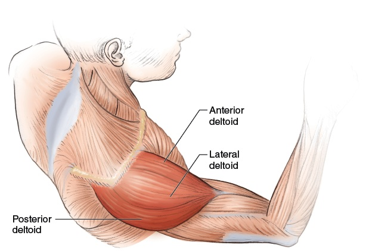
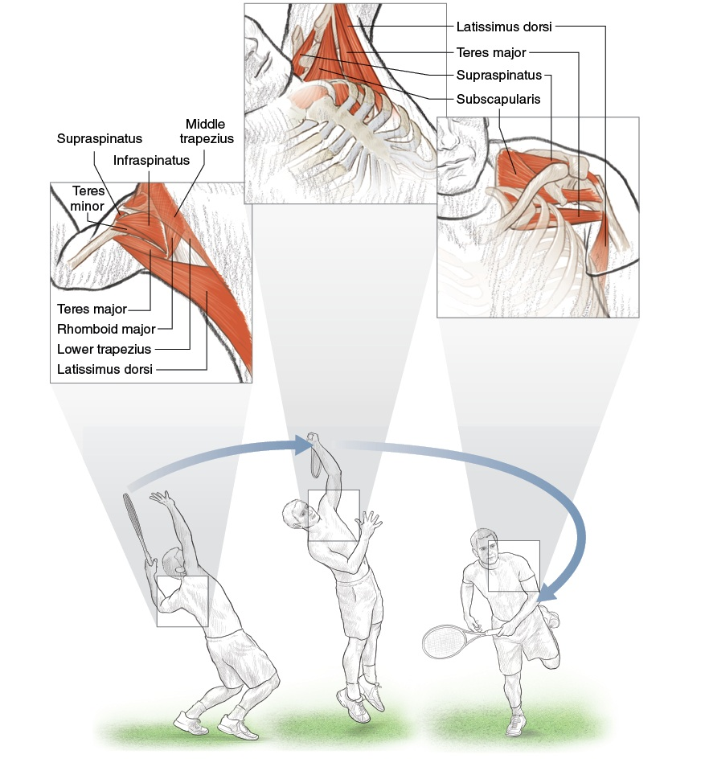

# DD2 — Shoulders | Vai

*Rotator Cuff, Scapular Plane, and Why the Serve Owns Your Shoulder*

---

## 📋 DOCUMENT MAP

The shoulder is **the most mobile AND the most injured** joint in tennis. This DD explains why: the anatomy that gives you 180°+ of arm motion is the SAME anatomy that gives you impingement, rotator cuff tears, and biceps tendinitis.

**What it covers:** the 4-joint shoulder complex, the 4 rotator cuff muscles + their tendons, scapular plane vs frontal plane, why the serve stresses the shoulder 7× more than groundstrokes, shoulder rotation speeds (1,074–2,300°/sec), impingement prevention, and the 6 shoulder exercises the pros use.

**What it does NOT cover:** the arm/wrist/hand (DD3), upper-back muscle balance (DD4), or hitting mechanics (Forehand/Backhand deep dives).

**Reading time:** 30–40 minutes.

---

## 📑 TABLE OF CONTENTS

| # | English |
| --- | --- |
| 1 | The 4-Joint Shoulder Complex |
| 2 | The Rotator Cuff — 4 Small Muscles, Big Job |
| 3 | Scapular Plane vs Frontal Plane — Why 30° Forward Matters |
| 4 | The Serve Anatomy — Why It Owns Your Shoulder |
| 5 | Impingement — The Most Common Tennis Shoulder Injury |
| 6 | The 6 Pro Exercises for Shoulder Longevity |

---

* * *

## Chapter 1 — The 4-Joint Shoulder Complex

**Friend, the "shoulder" you think of is actually 4 joints working together.** Each joint moves slightly differently. Together they give you the largest range of motion in the body. Alone, each joint has limited motion.

**The 4 joints:** sternoclavicular (collarbone–breastbone), acromioclavicular (collarbone–shoulder blade tip), glenohumeral (upper arm ball–shoulder socket), scapulothoracic (shoulder blade sliding on rib cage). The glenohumeral alone only gives ~120° of arm elevation. The scapulothoracic adds another ~60°. Without scapular motion, you can't raise your arm fully.

### The 4-Joint Shoulder Anatomy

| Joint | Bones | Main Movement | Tennis Role |
| --- | --- | --- | --- |
| **Sternoclavicular** (SC) | Clavicle + Sternum | Elevation/depression, protraction/retraction, rotation | First link in kinetic chain. SC retraction + depression starts the backswing. |
| **Acromioclavicular** (AC) | Clavicle + Acromion | Elevation/depression, gliding | Links clavicle to scapula. AC joint stress = "shoulder separation" injury. |
| **Glenohumeral** (GH) | Humerus + Glenoid fossa | Flexion/extension, abduction/adduction, internal/external rotation, circumduction | The "main" shoulder joint. Ball-and-socket. Most mobile, least stable joint in body. |
| **Scapulothoracic** (ST) | Scapula + Rib cage | Elevation/depression, protraction/retraction, upward/downward rotation | Adds 60° to arm elevation. The "platform" for the GH joint. |

### The Scapulohumeral Rhythm — A Key Number

**The normal ratio is 2:1.** For every 3° of arm elevation, 2° comes from the glenohumeral joint and 1° comes from scapulothoracic upward rotation. So at 90° arm elevation: ~60° from GH + ~30° from ST. At 180° (arm straight up): ~120° from GH + ~60° from ST.

**The tennis trap:** if the scapula doesn't rotate (weak serratus anterior, tight pec minor), the glenohumeral joint has to make up the difference. The humerus jams into the acromion → impingement.

**The drill:** wall slides. Stand with back to wall, arms in "goalpost" position. Slide arms up overhead maintaining wall contact. If you can't keep contact, your scapula isn't rotating → serratus weakness.

*Source: Roetert & Kovacs, Tennis Anatomy, Ch.2 (Shoulders). All 4 joints and the 2:1 rhythm are detailed in Ch.2 pages 44–50.*

---

* * *

## Chapter 2 — The Rotator Cuff (4 Small Muscles, Big Job)

**The rotator cuff is 4 small muscles whose tendons wrap around the head of the humerus.** They are not power producers. They are STABILIZERS. They keep the ball of the humerus centered in the socket during every stroke.

**The mnemonic SITS:** **S**upraspinatus (top), **I**nfraspinatus (back), **T**eres minor (back, lower), **S**ubscapularis (front). Each has a specific job. Together they form a "cuff" around the humeral head.

### The 4 Rotator Cuff Muscles

| # | Muscle | Location | Primary Action | Tennis Role |
| --- | --- | --- | --- | --- |
| 1 | **Supraspinatus** | Top of scapula, above spine | Initiates arm abduction (first 15°) | First muscle to fire on any overhead motion. Most commonly torn in tennis. |
| 2 | **Infraspinatus** | Back of scapula, below spine | External rotation of shoulder | Critical for deceleration after forehand and serve follow-through. |
| 3 | **Teres minor** | Lower back of scapula | External rotation (with infraspinatus) | Assists infraspinatus. Smaller contribution. |
| 4 | **Subscapularis** | Front of scapula (under surface) | Internal rotation of shoulder | Active during serve acceleration phase. Strongest internal rotator. |

### The Injury Hierarchy — Which One Goes First?

| Order | Muscle | Why First | Typical Tennis Story |
| --- | --- | --- | --- |
| 1 | **Supraspinatus** | Passes through narrow subacromial space (7 mm). Any inflammation → impingement. | "I reached for an overhead and felt a sharp pain." |
| 2 | **Infraspinatus** | Eccentrically loaded during deceleration. Over time, micro-tears accumulate. | "My shoulder aches after long forehand sessions." |
| 3 | **Subscapularis** | Compressed during cocking phase of serve. Repetitive compression → tendinopathy. | "I feel a deep ache in the front of my shoulder after serving." |
| 4 | **Teres minor** | Less commonly injured. Same role as infraspinatus. | Usually injured WITH infraspinatus, not alone. |

### The "Cuff vs Deltoid" Partnership — A 50+ Warning

**The deltoid is the BIG muscle** that produces arm motion. It can produce up to 300 N of force. The rotator cuff TOTAL produces only ~80 N. So the deltoid is 3–4× stronger than the cuff.

**If the cuff is weak:** the deltoid pulls the humerus UP. Without cuff opposition, the humerus translates up, jams into the acromion → impingement → tear. The 50+ cuff is naturally weaker (motor unit loss + sarcopenia). The deltoid is also weaker — but not as much. The ratio shifts.

**The fix:** BEFORE you strengthen the deltoid with overhead pressing, strengthen the cuff. Otherwise the deltoid wins the tug-of-war. Always: cuff first, deltoid second.

*Source: Roetert & Kovacs, Tennis Anatomy, Ch.2 (Shoulders), pages 44–47. Supraspinatus impingement anatomy on page 48.*

---

* * *

## Chapter 3 — Scapular Plane vs Frontal Plane (Why 30° Forward Matters)

**Pure frontal plane (arm straight out to the side, 90° abduction)** is the WRONG position for hitting tennis strokes. It puts the humerus in direct conflict with the acromion — impingement waiting to happen.

**Scapular plane** is the position ~30° forward of pure frontal. It is the natural alignment of the glenoid fossa. The humerus sits in the socket with the least bony stress.

### The Plane Comparison

| Plane | Arm Position | Glenohumeral Stress | Tennis Reality |
| --- | --- | --- | --- |
| **Frontal plane** | Arm 90° straight out to side | Maximum — humerus compressed against acromion | Bad. Impingement risk. |
| **Scapular plane (30° forward)** | Arm 90° out and slightly forward | Minimum — natural alignment of socket | The IDEAL position for all overhead tennis motions. |
| **Sagittal plane** | Arm straight forward | Moderate — natural for serve toss and follow-through | Used in serving but not in groundstrokes. |

### The Scapular Plane Cue

**Imagine you're holding a tray of drinks.** Your arms are out in front of you, hands at 11 and 1 o'clock positions. That's roughly the scapular plane — 30° forward of pure frontal. This is where your arm wants to be for any overhead motion.

**The amateur mistake:** the recreational player reaches overhead with the arm in pure frontal plane. The shoulder hurts within 10 shots. The fix: rotate the body so the arm is 30° forward. This is what the pros do naturally.

### The "Scaption" Exercise — Training the Plane Right

| Detail | Description |
| --- | --- |
| **What** | Raise arm in scapular plane (thumb up) instead of pure frontal (palm down). |
| **Why** | Scapular plane recruits middle deltoid AND supraspinatus with minimum impingement. Pure frontal plane over-recruits anterior deltoid, under-recruits supraspinatus. |
| **How** | Hold light dumbbell (<5 lb / 2.3 kg). Raise to shoulder height in 30° forward position. Lower slowly. 2 sets × 12 reps. |
| **Cue** | "Thumb pointing up, lead with the elbow, not the hand." |

*Source: Roetert & Kovacs, Tennis Anatomy, Ch.2 pages 47–48 and exercises on page 50 onward.*

---

* * *

## Chapter 4 — The Serve Anatomy (Why It Owns Your Shoulder)

**The serve is the most demanding stroke in tennis for the shoulder.** It is the only stroke that starts from a stationary position. It combines maximal external rotation (the "loading" phase), explosive internal rotation (the "acceleration" phase), and eccentric deceleration (the "follow-through" phase).

**The shoulder rotation speed in a serve is 1,074 to 2,300 degrees per second.** That's faster than any other human joint motion in sport. After contact, the cuff must eccentrically decelerate this rotation. If the cuff is weak, the deceleration fails → micro-tears → tendinopathy → tear.

### The 3 Phases of the Serve — Muscle Activity

| Phase | Shoulder Position | Primary Muscles Active | % MVC* |
| --- | --- | --- | --- |
| **Loading (preparation)** | Maximal external rotation, abduction ~110°, elbow flexed | Supraspinatus, infraspinatus, subscapularis, biceps brachii, serratus anterior | 50–70% |
| **Acceleration (drive to contact)** | Rapid internal rotation, shoulder extension | Pectoralis major, subscapularis, latissimus dorsi, serratus anterior | 70–90% |
| **Follow-through (deceleration)** | Across body, internal rotation completing | Posterior deltoid, infraspinatus, teres minor, trapezius, biceps, latissimus dorsi | 60–80% (eccentric) |

*MVC = Maximum Voluntary Contraction. Numbers from Tennis Anatomy Ch.2 page 47.*

### The Biceps Brachii's Hidden Role

**The long head of biceps brachii** crosses the shoulder joint AND the elbow joint. It originates on the supraglenoid tubercle of the scapula (above the socket). It inserts on the radial tuberosity (below the elbow). When the arm is loaded in external rotation, the long head of biceps is stretched. It provides anterior stability to the shoulder.

**Tennis implication:** the biceps is not just an elbow flexor. It is a shoulder stabilizer. Heavy biceps curls do NOT substitute for shoulder-specific stabilization work. The "External Rotation" exercise (page 61) is more specific.

### The 3 Numbers Every Server Should Know

| Number | What It Means | Why It Matters |
| --- | --- | --- |
| **1,074 °/sec** | Average professional serve shoulder rotation speed | If your internal rotation falls below this, your serve has noticeably less pace. |
| **2,300 °/sec** | Top professional serve shoulder rotation speed | The upper limit. Most recreational players max at ~600–800 °/sec. |
| **0.2 sec** | The contact-to-follow-through window | The cuff has 0.2 sec to decelerate the rotation. Any weakness in infraspinatus/teres minor → micro-tear accumulation. |

*Source: Roetert & Kovacs, Tennis Anatomy, Ch.2 pages 47–48. The 1,074–2,300°/sec range is from biomechanical studies cited in Ch.2.*

---

* * *

## Chapter 5 — Impingement (The Most Common Tennis Shoulder Injury)

**Impingement = the supraspinatus tendon gets pinched between the humeral head and the acromion.** The subacromial space is normally 7–14 mm wide. Any inflammation reduces it. Repetitive overhead motions (serves, overheads, high volleys) push the humerus up into the acromion.

**The pain pattern:** sharp pain on overhead reaches, aching after long sessions, pain lying on the affected side at night. The "painful arc" — pain between 60° and 120° of arm elevation — is the classic sign.

### The 5 Causes of Impingement (and the 50+ Reality)

| # | Cause | Mechanism | 50+ Reality |
| --- | --- | --- | --- |
| 1 | **Weak rotator cuff** | Deltoid pulls humerus up; cuff can't oppose | Cuff motor units decline 30–50% by age 70. The 50+ cuff is naturally weaker. |
| 2 | **Tight pectoralis minor** | Pulls scapula forward and down; reduces ST rotation | Sitting at desk all day → pec minor shortens. Worse after 50. |
| 3 | **Poor scapular control** | Scapula doesn't upward-rotate; humerus jams | Serratus anterior weakness. Common in recreational players. |
| 4 | **Subacromial bursitis** | Inflammation of bursa (lubricating sac); takes up space | Repetitive overhead → bursitis → less space → impingement. |
| 5 | **Acromion shape** | Type III "hooked" acromion reduces subacromial space | Genetic. Cannot be changed. Manage around it. |

### The Neer Test — A Simple Self-Check

**Stand facing a mirror. Raise your affected arm overhead in the scapular plane (30° forward). Have someone press down on your arm just above the elbow while you resist.** Pain = positive test.

**If positive:** don't panic. Impingement is reversible in most cases. The fix is NOT to stop playing. The fix is to (a) strengthen the cuff, (b) stretch the pec minor, (c) train serratus anterior. 6–12 weeks of consistent work usually resolves it.

### The 50+ Impingement Truth — Don't Reach Up Like a 25-Year-Old

**Your subacromial space narrows with age** because the supraspinatus tendon degenerates and the bursa thickens. A 60-year-old shoulder has 2–4 mm less clearance than a 25-year-old shoulder.

**The implication:** the high overhead serve that worked at 25 may cause impingement at 60. The fix is NOT to give up the overhead. The fix is to (a) warm up the cuff specifically before serving, (b) reduce the number of serves per session, (c) use a kick serve instead of a flat serve (less shoulder stress), (d) strengthen the cuff between sessions.

*Source: Roetert & Kovacs, Tennis Anatomy, Ch.10 (Common Tennis Injuries), page 263 onward.*

---

* * *

## Chapter 6 — The 6 Pro Exercises for Shoulder Longevity

**These are the 6 exercises from Tennis Anatomy Chapter 2 that the pros use to keep the shoulder healthy.** They focus on cuff strength, scapular control, and balanced front/back development.

**The principle:** the shoulder is balanced when (a) cuff is 70–80% as strong as deltoid, (b) scapular stabilizers can hold the scapula still against perturbation, (c) external rotators (infraspinatus + teres minor) match internal rotators (subscapularis + pec). Most recreational players have over-strong pec and under-strong external rotators. This ratio is the seed of impingement.

### The 6 Pro Shoulder Exercises

| # | Exercise | Target | Tennis Role | How To |
| --- | --- | --- | --- | --- |
| **1** | **Front Raise** | Anterior deltoid + lateral deltoid | Forehand acceleration, high balls | Stand, dumbbells (<10 lb / 4.5 kg), palms down. Raise to shoulder height. Hold 2 sec. 2×12 reps. |
| **2** | **Lateral Raise** | Lateral deltoid | Backhand groundstroke acceleration, serve backswing | Stand, palms facing thighs. Raise arms out to sides to shoulder height. Hold 2 sec. 2×12 reps. |
| **3** | **Bent-Over Rear Raise** | Posterior deltoid + teres major + rhomboids | DECELERATION after every stroke | Bend at waist, back straight. Raise forearms with 90° elbow to shoulder height. Hold 2 sec. 2×12 reps. |
| **4** | **Elbow-to-Hip Scapular Retraction** | Trapezius + infraspinatus + rhomboids | Scapular stability for ALL strokes | Arms at 90°/90°. Slowly lower elbows to hips by squeezing shoulder blades together. Hold 2–4 sec. 2×12 reps. |
| **5** | **External Rotation** | Infraspinatus + teres minor (CUFF) | DECELERATION, forehand backswing | Tubing, elbow at side at 90°. Rotate forearm outward against resistance. Hold 2 sec. 2×10–12 reps each side. |
| **6** | **Low Row** | Posterior deltoid + rhomboids + lower trapezius | One-handed backhand, posture, deceleration | Tubing attached low. Push hands back keeping arms straight, squeeze shoulder blades. Hold 2 sec. 2×12 reps. |

### The Critical 50+ Progression — Cuff First

**The order of exercises MATTERS.** If you do Front Raise (#1) and Lateral Raise (#2) BEFORE you do External Rotation (#5), the deltoid fatigue will inhibit the cuff. The cuff needs to be fresh when you train it.

**The 50+ recommended order:** (5) External Rotation → (4) Elbow-to-Hip → (3) Bent-Over Rear Raise → (6) Low Row → (2) Lateral Raise → (1) Front Raise. Cuff work FIRST, then scapular, then posterior, then anterior.

**Frequency:** 2 sessions per week. NOT 5. The cuff is small. It needs 48–72 hours to recover. Train it too often → it gets weaker, not stronger.

### The 5-Color Tagging for Shoulder Health

| Color | Tag | Meaning | Action |
| --- | --- | --- | --- |
| 🔴 | **Cuff strength** | The 4 small muscles working | Train 2×/week, External Rotation first |
| 🟠 | **Scapular control** | Serratus anterior + lower trapezius | Elbow-to-Hip, wall slides daily |
| 🟡 | **Posterior deltoid** | The "brake" muscle | Bent-Over Rear Raise, Low Row |
| 🟢 | **Anterior deltoid + pec** | The "gas pedal" muscle | Front Raise, last in the routine |
| 🔵 | **Thoracic mobility** | The bucket-handle rotation | Thoracic rotation drill before serving |

*Source: Roetert & Kovacs, Tennis Anatomy, Ch.2 pages 50–73. The 6 exercises are from pages 50 (Front Raise), 53 (Lateral Raise), 56 (Bent-Over Rear Raise), 59 (Elbow-to-Hip), 61 (External Rotation), 71 (Low Row).*

---

* * *

## 📋 DD2 CARD — Printable

DD2 CARD — SHOULDERS

<strong>🎯 ONE BIG IDEA</strong>

The shoulder is the most mobile AND the most injured joint. The 4 rotator cuff muscles stabilize the humeral head during every stroke. Train the cuff BEFORE the deltoid, and you'll play pain-free past 70.

<strong>KEY NUMBERS</strong>
<ul>
<li>Scapulohumeral rhythm 2:1 (GH:ST ratio for elevation)</li>
<li>Subacromial space 7–14 mm (50+ reduces by 2–4 mm)</li>
<li>Shoulder rotation 1,074–2,300°/sec in serve</li>
<li>Deltoid:Cuff force ratio 3–4:1 (must keep cuff &gt;70%)</li>
<li>Scapular plane = 30° forward of pure frontal plane</li>
</ul>

<strong>⚠️ TOP MISTAKE</strong>

Training the deltoid (Front Raise, Overhead Press) BEFORE the cuff (External Rotation). The deltoid pulls the humerus up; if the cuff can't oppose it, the humerus jams into the acromion → impingement.

<strong>🔁 DRILL</strong>
<ul>
<li>The "50+ Cuff-First" routine (2×/week):</li>
<li>External Rotation with tubing, 2×12 each arm</li>
<li>Elbow-to-Hip scapular retraction, 2×12</li>
<li>Bent-Over Rear Raise, 2×12</li>
<li>Low Row, 2×12</li>
<li>Lateral Raise, 2×12</li>
<li>Front Raise, 2×12 Always cuff first (5→4→3→6→2→1).</li>
</ul>

<strong>💭 MASTER CUE</strong>

"Cuff first, deltoid second."

---

## 🖼️ ILLUSTRATIONS

*All 20 images sourced from the Tennis Anatomy PDF (Roetert & Kovacs, 2011), Chapter 2: Shoulders. Located in `Anatomy_Lab/images/DD2_shoulders/`.*

### Figure 1 — Muscles of the Scapula and Rotator Cuff

*Shows the 4 rotator cuff muscles (supraspinatus, infraspinatus, teres minor, subscapularis) and surrounding scapular muscles.*

 (Tennis Anatomy Ch.2, Figure 2.1)

### Figure 2 — Deltoid Muscle (Anterior, Lateral, Posterior Heads)

 (Figure 2.2)

### Figure 3 — Changes in Humeral Head Position During Serve

*Critical image — shows how the humeral head translates UP if the cuff is weak, JAMMING into the acromion. This is impingement visualized.*

 (Figure 2.3)

### Figures 4–20 — Exercise Demonstrations

| Exercise | Image | Tennis Anatomy Figure |
| --- | --- | --- |
| Front Raise (anterior deltoid) | `DD2_shoulders_pdf04.jpeg` | Figure 2.4 |
| Front Raise — step-by-step | `DD2_shoulders_pdf05.jpeg` | Figure 2.5 |
| Lateral Raise (lateral deltoid) | `DD2_shoulders_pdf06.jpeg` | Figure 2.6 |
| Lateral Raise — arm position | `DD2_shoulders_pdf07.jpeg` | Figure 2.7 |
| Bent-Over Rear Raise | `DD2_shoulders_pdf08.jpeg` | Figure 2.8 |
| Bent-Over Rear Raise — elbows at 90° | `DD2_shoulders_pdf09.jpeg` | Figure 2.9 |
| Elbow-to-Hip Scapular Retraction | `DD2_shoulders_pdf10.jpeg` | Figure 2.10 |
| Elbow-to-Hip — squeezing shoulder blades | `DD2_shoulders_pdf11.jpeg` | Figure 2.11 |
| External Rotation with tubing | `DD2_shoulders_pdf12.jpeg` | Figure 2.12 |
| External Rotation — full extension | `DD2_shoulders_pdf13.jpeg` | Figure 2.13 |
| External Rotation with towel between elbow and side | `DD2_shoulders_pdf14.jpeg` | Figure 2.14 (variation) |
| 90/90 External Rotation With Abduction | `DD2_shoulders_pdf15.jpeg` | Figure 2.15 |
| 90/90 External Rotation — end range | `DD2_shoulders_pdf16.jpeg` | Figure 2.16 |
| 90/90 Internal Rotation With Abduction | `DD2_shoulders_pdf17.jpeg` | Figure 2.17 |
| 90/90 Internal Rotation — start position | `DD2_shoulders_pdf18.jpeg` | Figure 2.18 |
| Low Row (posterior deltoid + rhomboids) | `DD2_shoulders_pdf19.jpeg` | Figure 2.19 |
| Low Row — end position | `DD2_shoulders_pdf20.jpeg` | Figure 2.20 |

*All image filenames verified to exist in `Anatomy_Lab/images/DD2_shoulders/`.*

---

## 🔗 CROSS-REFERENCES

| Topic in DD2 | See Also |
| --- | --- |
| Shoulder abduction 90° in scapular plane | **DD1 Player in Motion** — the 6 critical angles at contact |
| Biceps brachii shoulder stabilization | **DD3 Arms, Wrists & Hands** — cubital tunnel, ulnar nerve, tennis elbow |
| Scapular control / serratus anterior | **DD4 Trunk & Spine** — latissimus dorsi originates on T7–L5 |
| Thoracic rotation for serve | **DD4 Trunk & Spine** — 3-layer back, hip hinge |
| Serve deceleration stress | **DD1 Player in Motion** — kinetic chain, follow-through phase |
| Impingement after 50 | **DD8 Control System** — proprioception decline, vision changes |
| Wall slides for scapular control | **DD4 Trunk & Spine** — thoracic rotation drill |

---

## 📚 SOURCES

| Source | Type | What It Contributed |
| --- | --- | --- |
| `Tennis Knowledge/7.Tennis Books in pdf/Tennis Anatomy ( PDFDrive ).pdf` | Primary reference (Roetert & Kovacs, 2011) | Ch.2 entire content: 4-joint anatomy, SITS mnemonic, scapulohumeral rhythm 2:1, subacromial space 7–14 mm, 1,074–2,300°/sec, 6 exercises, all 20 illustrations |
| `Tennis Knowledge/7.Tennis Books in pdf/Tennis Anatomy ( PDFDrive ).pdf` Ch.10 (Injuries) | Same PDF | Impingement pathology, subacromial bursitis, cuff tears |

---

*End of DD2 — Shoulders*

*Next: DD3 — Arms, Wrists & Hands (Grip Anatomy, Ulnar Nerve, 27 Hand Bones)*