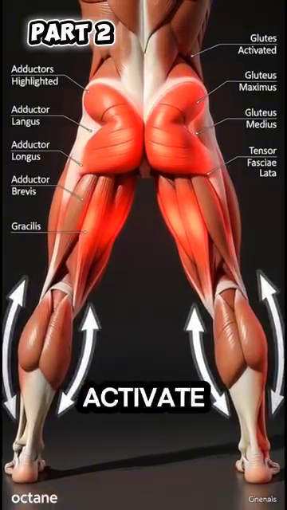
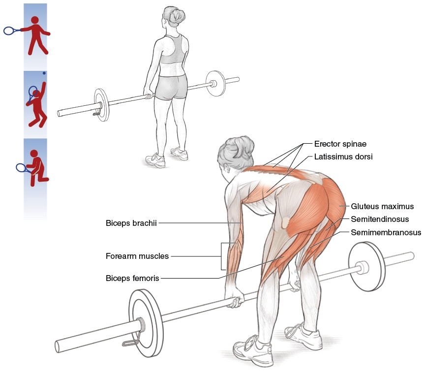

# Muscle Hierarchy — Which Muscles Fire When, Segment by Segment

*Deep Dive #4 — The Anatomy & Geometry Project for Tennis Players 3.5 → 4.5*

---

## Document Map

**What this deep dive covers** — A segment-by-segment tour of every muscle that matters in tennis. For each muscle, you get: name, location, when it fires during each stroke, why it fires, what happens if it doesn't fire, and a 50+ awareness note.

**What this is NOT** — Not a stroke-mechanics manual. Not an anatomy textbook. Not a workout guide. **This is the layer between the ANGLE (DD1) and the SPRING (DD2) — the actual muscles that move the angles and load the springs.**

**Why this matters at 3.5 → 4.5** — Most players know "use your legs." Few know that the gluteus maximus fires 0.1s BEFORE the quadriceps during a forehand. **Knowing which muscles fire in which order is the difference between "trying hard" and "shooting with precision."**

---

## Table of Contents

| # | Chapter |
| --- | --- |
| 1 | The Source's Big Insight — Muscle Strength ≠ Muscle Order |
| 2 | The Lower-Body Segment — Hip, Knee, Ankle |
| 3 | The Trunk Segment — Core Muscles |
| 4 | The Shoulder Segment — Rotator Cuff & Deltoids |
| 5 | The Arm Segment — Biceps, Triceps, Forearm |
| 6 | The Wrist & Hand Segment |
| 7 | The Stroke-by-Stroke Muscle Sequence |
| 8 | Why Muscles Fail in Different Ways at 50+ |
| 📋 | Muscle Map Cheat Sheet |

---

* * *

# Chapter 1 — The Source's Big Insight — Muscle Strength ≠ Muscle Order

**The source document has a powerful insight** that almost no tennis coach teaches: **muscle strength is not the most important factor — muscle activation ORDER is.**

The source says (paraphrased): *"Cấu trúc cơ thể phân bố các cơ mạnh yếu không đều nhau, và các nhóm cơ này cũng không phải tham gia bằng nhau trong lúc đánh bóng. Mỗi khi động tác của chúng ta đi đến một vùng giới hạn nào đó của cơ thể, thì nhóm lực mạnh ban đầu lại trở nên yếu đi, và sẽ có một nhóm cơ tiếp quản nguồn lực mạnh này (nếu ta biết cách sử dụng)."*

**Translation** — The body has a hierarchy of muscles. Strong muscles start the motion. When they reach their range limit, weaker-but-faster muscles take over. **The tennis swing is a relay race** — strong-to-fast, segment by segment.

**The relay sequence in tennis**

**1st leg — Strong, slow** (glute max, quadriceps, latissimus dorsi, pectoralis major). Big muscles, slow to fire (~0.10–0.15s delay), but produce the most force.

**2nd leg — Medium, medium** (deltoids, abdominals, hamstrings). Mid-size, mid-speed (~0.05–0.10s delay).

**3rd leg — Small, fast** (rotator cuff, wrist flexors/extensors, intrinsic hand muscles). Small, fast (~0.02–0.05s delay), produce fine adjustment.

**The "strong muscle in wrong position" mistake** — Many recreational players try to use their STRONG muscles (deltoid, biceps) to HIT the ball. But the deltoid has only ~70° of useful rotation. **Past 70°, the deltoid is mechanically weak.** That's where the SMALL FAST muscles take over — the rotator cuff.

**The implication for training** — Don't just train STRONG muscles. Train the RELAY — the sequencing. **Slow heavy lifting** (squats, bench press) trains the strong muscles. **Fast coordination drills** (medicine ball throws, racket flicks) train the relay timing.

*Master cue:* "Strong to fast, segment by segment. Don't let one muscle do the whole relay."

* * *

# Chapter 2 — The Lower-Body Segment — Hip, Knee, Ankle

**Hip muscles** (the engines of every stroke)

**Gluteus maximus** — The biggest, strongest muscle in the body. Primary hip EXTENSOR (moves thigh backward). Fires during forehand load (stretches) and contact (contracts explosively). **Activation: ~30%–50% of max during forehand, ~50%–70% during serve.**

**Gluteus medius** — Side of the hip. Hip ABDUCTOR (moves thigh outward). Critical for lateral stability during split-step and side-steps. **Activation: ~40%–60% during split-step, ~30%–40% during forehand.**

**Psoas major + Iliacus** — The hip FLEXORS (move thigh forward). Fire during recovery (after contact) to bring the leg back. Also fire during the LOAD phase of a backhand (stretching the hip into extension). **Activation: ~20%–30% during forehand, ~50%–70% during sprint recovery.**

**The 6 deep hip rotators** (piriformis, gemellus superior, gemellus inferior, obturator internus, obturator externus, quadratus femoris). Rotate the thigh OUTWARD. **Critical for hip rotation during forehand load (~60°).** Small muscles, but essential.

**Knee muscles** (the transmission system)

**Quadriceps** (4 muscles: rectus femoris, vastus lateralis, vastus medialis, vastus intermedius). The knee EXTENSORS. Fire during the second half of knee extension (the propulsive phase). **Activation: ~30%–50% during serve jump, ~50%–80% during split-step landing.**

**Hamstrings** (3 muscles: biceps femoris, semitendinosus, semimembranosus). The knee FLEXORS and hip EXTENSORS. Fire during knee flexion in split-step AND during hip extension in groundstrokes. **Activation: ~40%–60% during split-step, ~30%–50% during forehand.**

**Ankle + foot muscles**

**Gastrocnemius + Soleus** — The calf muscles. The PLANTAR FLEXORS (point the toes). Fire during heel-up (load) and during push-off (release). **Activation: ~50%–80% during serve takeoff, ~40%–60% during split-step.**

**Tibialis anterior** — The front of the shin. The DORSIFLEXOR (pulls toes up). Fires when the foot needs to land softly. **Activation: ~30%–50% during landing from split-step or jump.**

**Intrinsic foot muscles** — 20+ small muscles in the foot itself. They create the ARCH, distribute weight, and provide fine balance. **Activation: ~10%–30% constantly, much higher during balance-challenged shots.**

* * *

# Chapter 3 — The Trunk Segment — Core Muscles

**The "core" is not one muscle**. It is at least 12 muscles working together. The core's job in tennis is to TRANSMIT force from the legs to the arms. **If the core fails, the kinetic chain breaks.**

**The 4 abdominal muscles**

**Rectus abdominis** — The "six-pack." Trunk FLEXOR (bends trunk forward). Fires during the second half of the forehand (the follow-through). **Activation: ~20%–40% during forehand, ~40%–60% during serve.**

**External oblique** — Side of the abdomen. Trunk ROTATOR (twists the trunk) and lateral flexor. **THE primary trunk rotator in tennis. Activation: ~40%–60% during forehand, ~50%–70% during serve.**

**Internal oblique** — Deeper than external, runs the OPPOSITE diagonal direction. Works WITH external oblique to rotate the trunk. **Activation: ~40%–60% during forehand.**

**Transversus abdominis** — Deepest abdominal. Acts as a CORSET around the trunk. **Stabilizes the spine during all rotational movements.** Fires before any limb motion — it's the "pre-activation" muscle. **Activation: ~10%–30% constantly, ~30%–50% during serve.**

**The back muscles**

**Erector spinae** (3 columns: iliocostalis, longissimus, spinalis). Run along the spine. Trunk EXTENSOR (keeps trunk upright) and ROTATOR (in thoracic spine). Fires during forehand LOAD to keep trunk upright, and during release to power the trunk forward. **Activation: ~30%–50% during forehand, ~50%–70% during serve.**

**Multifidus** — Deep back muscles. Spinal SEGMENTAL stabilizers. Each multifidus controls 1–2 vertebrae. Critical for preventing back injury during rotation. **Activation: constant low-level, ~20%–40% during rotation.**

**Quadratus lumborum** — Side of the lower back. LATERAL FLEXOR (bends trunk sideways). Fires during forehand with side-bend to add topspin. **Activation: ~30%–50% during forehand, ~40%–60% during serve.**

**The hip-trunk connector**

**Latissimus dorsi** — The "lat." Runs from the lower back to the upper arm. Connects the trunk to the arm. **Both a trunk muscle AND an arm muscle**. Fires during the backhand to pull the arm across the body. **Activation: ~40%–60% during backhand, ~50%–70% during serve.**

* * *

# Chapter 4 — The Shoulder Segment — Rotator Cuff & Deltoids

**The shoulder is the most complex joint** in the body, with 9 muscles crossing it. Each has a specific role.

**The 4 rotator cuff muscles** (the SHOULDER'S LIGAMENTS)

**Supraspinatus** — Top of the shoulder. Initiates arm ABDUCTION (first 15°–30° of lifting). Also STABILIZES the humeral head in the socket. **The most commonly injured tennis muscle.** Activation: ~30%–50% during forehand, ~50%–70% during serve.

**Infraspinatus** — Back of the shoulder. EXTERNAL ROTATOR (rotates arm outward). Fires during forehand LOAD (preparing for external rotation) and during serve back-scratch position. **Activation: ~40%–60% during forehand load, ~60%–80% during serve load.**

**Teres minor** — Lower back of shoulder. Assists infraspinatus in external rotation. Smaller, less force. **Activation: ~20%–40% during external rotation.**

**Subscapularis** — Front of the shoulder (you can't see it from outside). INTERNAL ROTATOR (rotates arm inward). Fires during forehand CONTACT to whip the racket through. **Activation: ~50%–70% during forehand contact, ~60%–80% during serve contact.**

**The 3 deltoid parts**

**Anterior deltoid** — Front of shoulder. ARM FORWARD FLEXION (lifting arm forward). Primary muscle for volleys. **Activation: ~50%–70% during volley, ~30%–50% during forehand.**

**Middle deltoid** — Side of shoulder. ARM ABDUCTION (lifting arm sideways). Primary muscle for shoulder height. **Activation: ~40%–60% during forehand, ~50%–70% during serve.**

**Posterior deltoid** — Back of shoulder. ARM EXTENSION (pulling arm backward). Fires during serve back-scratch to position the racket behind the head. **Activation: ~30%–50% during serve load.**

**The big movers around the shoulder**

**Pectoralis major** — The chest. ARM HORIZONTAL ADDUCTION (pulling arm across body). THE primary muscle of the backhand and serve whip. **Activation: ~60%–80% during backhand, ~70%–90% during serve.**

**Latissimus dorsi** (counted in trunk too). The "lat." ARM EXTENSION + ADDUCTION + INTERNAL ROTATION. Works with pec major to whip the arm. **Activation: ~50%–70% during backhand, ~60%–80% during serve.**

**The 50+ shoulder warning** — The supraspinatus tendon has a POOR blood supply. **After age 50, it degenerates ~1% per year even without injury.** Combined with the repetitive serving motion, this is why serving-related shoulder injuries spike after 50. **The fix**: warm up the rotator cuff specifically (band exercises, 5 min minimum).

* * *

# Chapter 5 — The Arm Segment — Biceps, Triceps, Forearm

**Biceps brachii** — Front of upper arm. ELBOW FLEXOR (bends elbow) + FOREARM SUPINATOR (twists palm up). Fires during the takeback to bend the elbow. **Activation: ~20%–30% during forehand load, ~10%–20% during contact.**

**The source's important note** — Biceps is NOT a primary power muscle in tennis. It bends the elbow, but the elbow is mostly straightening (triceps) during the swing. **Use biceps during takeback; release it before contact.**

**Brachialis** — Deep to biceps. The "pure" elbow flexor. Used when palm is in neutral position. Activation similar to biceps but slightly higher during neutral grip swings.

**Triceps brachii** — Back of upper arm. ELBOW EXTENSOR (straightens elbow). **The primary muscle of the swing itself.** Fires from mid-swing to contact, straightening the arm through the ball. **Activation: ~30%–50% during forehand contact, ~50%–70% during serve contact.**

**Triceps = the SWING muscle. Biceps = the PREP muscle.** This is the simple summary.

**Forearm muscles** (the levers and fine-tuners)

**Brachioradialis** — Top of forearm (thumb side). Elbow flexor when forearm is in neutral. Helps during the early swing phase. **Activation: ~20%–30% during takeback, ~10%–20% during contact.**

**Pronator teres + Pronator quadratus** — Front of forearm. PRONATE the forearm (twist palm down). Fire during the downswing of forehand to close the racket face. **Activation: ~30%–50% during forehand contact.**

**Supinator** — Deep in forearm. SUPINATES the forearm (twist palm up). Fires during backhand to open the face. **Activation: ~30%–50% during backhand contact.**

* * *

# Chapter 6 — The Wrist & Hand Segment

**The wrist has ~15 small muscles crossing it**. They are the LAST muscles to fire in the chain. **They fine-tune the racket face angle at contact.**

**Wrist flexor group** (5 muscles on the palm side)

**Flexor carpi radialis** — WRIST FLEXION + RADIAL DEVIATION. The primary muscle that SNAPS the wrist through contact for topspin. **Activation: ~50%–70% during topspin forehand post-contact.**

**Flexor carpi ulnaris** — WRIST FLEXION + ULNAR DEVIATION. Works with flexor carpi radialis during the wrist snap.

**Palmaris longus** — WRIST FLEXION + skin tension. Assists in gripping. About 11% of people don't have this muscle (anatomical variant — no problem).

**Flexor digitorum superficialis + profundus** — FINGER FLEXORS (bend the fingers). Fire during grip maintenance. Critical for not losing the racket during the swing. **Activation: ~30%–50% constant grip, ~50%–70% during contact.**

**Wrist extensor group** (4–5 muscles on the back of the forearm)

**Extensor carpi radialis longus + brevis** — WRIST EXTENSION + RADIAL DEVIATION. **The primary muscle that COCKS the wrist back during the takeback.** Activation: ~50%–70% during takeback.

**Extensor carpi ulnaris** — WRIST EXTENSION + ULNAR DEVIATION. Assists with the takeback wrist cock.

**Extensor digitorum** — FINGER EXTENSORS (straighten the fingers). Fire when you relax grip between shots. Helps hand recover.

**Hand intrinsic muscles** (20+ tiny muscles in the hand itself)

**Thenar muscles** (3 muscles at the base of the thumb). Control the THUMB pressure on the grip.

**Hypothenar muscles** (3 muscles at the base of the little finger). Control the LITTLE FINGER pressure.

**Lumbricals + Interossei** (10+ muscles between the metacarpals). Fine-control of finger positions on the grip.

**The 50+ hand warning** — Hand intrinsic muscles lose ~15% of mass after age 60. **This is why grip strength drops.** It also reduces fine-control of the racket face angle. **Train with grip strengtheners + rice bucket** to maintain.

* * *

# Chapter 7 — The Stroke-by-Stroke Muscle Sequence

**Here is the muscle sequence for each stroke**, from load through contact to follow-through. This is the master map that ties DD1 (angles), DD2 (springs), and DD4 (muscles) together.

| Phase / Pha | Forehand (topspin) | Backhand 2H | Serve | Volley | Return |
| --- | --- | --- | --- | --- | --- |
| **Load (eccentric, ~0.3–0.5s)** | Glute max (stretch), Quadriceps (stretch), Erector spinae (hold), Supraspinatus (load), Infraspinatus (load), Flexor carpi radialis (stretch), Tibialis anterior (controlled) | Glute max (stretch), Hamstring (stretch), Erector spinae (hold), Latissimus dorsi (load), Pectoralis major (load), Flexor carpi radialis (stretch) | Gastrocnemius + Soleus (load), Quadriceps (load), Glute max (load), Erector spinae (hold), Latissimus dorsi (load), Pectoralis major (load), Infraspinatus (load), Supraspinatus (load) | Tibialis anterior (controlled), Gastrocnemius (light load), Quadriceps (light load), Anterior deltoid (hold), Biceps (light load) | Gastrocnemius + Soleus (push), Quadriceps (absorb landing), Psoas + Iliacus (reactive), Glute medius (lateral stability), Anterior deltoid (rack position) |
| **Release (concentric, ~0.05–0.10s)** | Glute max (fire), Quadriceps (fire), External oblique (fire), Internal oblique (fire), Multifidus (fire), Subscapularis (fire), Pectoralis major (fire), Triceps (fire), Pronator teres (fire), Flexor carpi radialis (snap) | Glute max (fire), Hamstring (fire), External oblique (fire), Latissimus dorsi (fire), Pectoralis major (fire), Triceps (fire), Pronator quadratus (fire, opposite), Flexor carpi radialis (snap) | Gastrocnemius + Soleus (push), Quadriceps (extend), Glute max (extend), External oblique (rotate), Multifidus (rotate), Subscapularis (fire), Pectoralis major (fire), Triceps (extend), Pronator teres (snap) | Anterior deltoid (fire), Pectoralis major (light), Biceps (isometric hold), Triceps (extend, small) | Glute max (fire), External oblique (fire), Latissimus dorsi OR Pectoralis major (depends), Triceps (fire), Flexor digitorum (grip firm) |
| **Follow-through** | External oblique (continue), Latissimus dorsi (decelerate arm), Flexor carpi ulnaris (decelerate wrist), Multifidus (decelerate trunk) | Latissimus dorsi (continue), Pectoralis major (decelerate), Quadratus lumborum (lateral stabilize) | External oblique (continue), Rectus abdominis (continue), Multifidus (decelerate) | Anterior deltoid (hold), Wrist flexors (firm grip) | Triceps (decelerate), External oblique (decelerate) |

**How to read this table** — Each row is a phase. Each column is a stroke. Each cell lists the **primary muscles firing in that phase**.

**The "big muscle first" rule** — In every stroke, the **first muscle to fire is a BIG, SLOW muscle** (glute, quad, pec, lat). The **last muscle to fire is a SMALL, FAST muscle** (wrist flexor, intrinsic hand). **Never reverse this order.** The big ones come first to load; the small ones come last to fine-tune.

**The "missing muscle" check** — If a muscle in the table above doesn't fire when you do a stroke, you have a hole in your kinetic chain. **You will lose power equal to that muscle's contribution.** A missing glute max = 30% power loss. A missing pec major in backhand = 50% power loss.

* * *

# Chapter 8 — Why Muscles Fail in Different Ways at 50+

**Muscle loss with age (sarcopenia)** — After 30, you lose ~3%–8% of muscle mass per decade. **By 50, you've lost ~10%–15% of your 30-year-old muscle.** By 70, ~30%–40%. This is the main reason recreational tennis slows down at 50+.

**BUT — not all muscles lose equally**

**Type I (slow-twitch) muscles lose LESS** — These are the endurance muscles (soleus, postural muscles). They retain ~85%–90% of mass at 70. **This is why your standing and walking stay strong.**

**Type II (fast-twitch) muscles lose MORE** — These are the power muscles (gluteus maximus, gastrocnemius, pectoralis major). They lose ~30%–50% by age 70. **This is why your SERVE loses pace and your sprint slows.**

**The implication** — Your STRENGTH-ENDURANCE ratio changes with age. You become more "marathon runner, less sprinter." **Train your fast-twitch muscles specifically** (jumps, sprints, plyometrics — adapted for 50+).

**Why older muscles take longer to activate** — Older Type II fibers have slower calcium release and slower cross-bridge cycling. **Activation time goes from 0.05s at 25 to 0.10–0.15s at 60.** This is the "I'm always late" feeling.

**The "anticipatory muscle firing" trick** — Older players can compensate for slower activation by **pre-firing the next muscle slightly earlier.** This is a learned skill. Train with random-ball drills where you anticipate the next shot.

**Connective tissue changes** — Tendons, ligaments, and joint capsules all become STIFFER with age (collagen cross-links increase). **Stiffer tendons = less elastic storage = less spring power.** Already covered in DD2.

**The 50+ muscle training principle** — Use **lighter loads, more repetitions, slower tempos** to train the slow-twitch fibers you still have, while GENTLY maintaining the fast-twitch. **Heavy lifting (above 80% 1RM) is risky** for untrained 50+ players.

*Master cue:* "Type I (slow) keeps you playing. Type II (fast) keeps you winning. Train both, differently."

* * *

# Chapter 9 — Anatomy_Lab Integration — The Segment-by-Segment Muscle Numbers

**This chapter layers the specific muscle-segment numbers from your `Anatomy_Lab/` library** (glute max, 6 deep rotators, hip CARs, ulnar nerve, hand intrinsics) onto the muscle-hierarchy framework of this deep dive.

## 9.1 — Gluteus Maximus — The Largest Muscle (50% of Tennis Power)

**Anatomy_Lab DD5 finding** — gluteus maximus is the **largest muscle in the human body**. It can produce ~30 kg of potential force. **Approximately 50% of tennis power comes from the legs**, and glute max is the dominant leg muscle.


**Figure 1 / Figure 1** — Gluteus maximus from posterior view. Largest muscle in the body.

**The wider-stance transformation** — A standard tennis stance (feet ~shoulder-width) loads mostly the QUADRICEPS. **A wider stance (1.5× shoulder-width) loads the GLUTE MAX** by ~30%–40% more. This is the Anatomy_Lab insight: wider stance = more glute = more power + less knee stress.

## 9.2 — The 6 Deep Hip Rotators (The "Hip Centering" System)

**Anatomy_Lab DD5 finding** — there are **6 deep external rotators** of the hip (piriformis, gemellus superior, gemellus inferior, obturator internus, obturator externus, quadratus femoris). Their job is **NOT to produce force** — they **CENTER the femoral head** in the acetabulum (hip socket).



**Figure 2 / Figure 2** — The 6 deep hip rotators seen from posterior. They wrap around the femoral neck.

**The implication** — "Hip stiffness" is usually NOT a flexibility problem. **It's a CONTROL problem** — the 6 rotators are not firing in the right sequence to center the hip. **Hip CARs (Controlled Articular Rotations) restore the control in 12–18° IR gain in 2–3 weeks.**

## 9.3 — Hip CARs (The Activation Drill, Not a Stretch)

**Anatomy_Lab DD5 protocol** — Hip CARs are the **ACTIVATION** answer to hip stiffness. Not stretching.


**Figure 3 / Figure 3** — Hip CARs: slowly rotate the hip joint through its FULL available range, with control, both directions. **The end-range positions matter most** — that's where the rotators fire hardest.

**The protocol** — 5 reps × 2 directions × 2 sets × daily. After 2–3 weeks, hip internal rotation gains 12°–18° WITHOUT any static stretching. **This is what "activated, not stretched" means.**

## 9.4 — The Back: 3 Layers (40+ Muscles)

**Anatomy_Lab DD4 finding** — the back is NOT one muscle. It has **3 layers totaling 40+ muscles**:

|  |
|  |
|  |
|  |
|  |

|  |
| --- |
| **Figures 4 & 5 |

**The multifidus rule** — **Multifidus atrophies 10% in just 24 hours after acute back pain.** The brain "forgets" how to activate it. **You don't need general exercise — you need SPECIFIC re-activation of multifidus.** This is why back pain becomes chronic: the stabilizer is off, but most therapy targets the big movers.

**The "Bird Dog" drill** is the canonical multifidus re-activation: opposite arm + opposite leg extension, hold 5 seconds, repeat 10× each side. Daily.

## 9.5 — The Quadriceps (4 Muscles, 50–80° Loading Rule)

**Anatomy_Lab DD6 finding** — the quadriceps is actually 4 muscles (rectus femoris, vastus lateralis, vastus medialis, vastus intermedius). The rectus femoris is the only one that crosses BOTH the hip and knee (it can flex the hip AND extend the knee).


**Figure 6 / Figure 6** — Quadriceps: rectus femoris (middle) + 3 vastus muscles.

**The 50–80° safe loading rule** — patellar tendon stress is MINIMAL at 50°–80° knee flexion. **Below 50° (leg too straight):** patellar tendon is slack, no force. **Above 80°:** stress climbs rapidly. **Above 90°:** stress increases 40%–60% and patellar tendonitis risk jumps.

## 9.6 — Eccentric Squats Fix Patellar Tendonitis (Not Rest!)

**Anatomy_Lab DD6 finding** — patellar tendonitis (jumper's knee) is fixed by **ECCENTRIC squats on a 25° decline board**, 3 sets × 15 reps, 3 days/week, for 12 weeks. **REST does NOT fix tendon micro-tears.** Eccentric loading stimulates collagen remodeling.



**Figure 7 / Figure 7** — Eccentric squat on a 25° decline board. The decline shifts load to the patellar tendon.

**Protocol from Purdam 2009** — 3×15 reps, 3 days/week, 12 weeks, eccentric only (lower slowly under load, use both legs to come up). Success rate: ~80% return to play.

## 9.7 — The Hand: 27 Bones, 8 Carpals, 9 Tendons

**Anatomy_Lab DD3 finding** — the hand has **27 bones** (8 carpals + 5 metacarpals + 14 phalanges). The **carpal tunnel** has cross-section area of just **~2 cm²** but contains **9 flexor tendons + 1 median nerve**.


**Figure 8 / Figure 8** — The 27 bones of the hand. 8 carpals in 2 rows, 5 metacarpals, 14 phalanges.


**Figure 9 / Figure 9** — The carpal tunnel cross-section: 9 tendons + 1 median nerve packed into 2 cm².

**The grip pressure rule** — **3/10 at rest → 7/10 at contact → 3/10 at follow-through.** Most recreational players grip 8/10 continuously. **The result is forearm fatigue and loss of fine racket-face control.**

* * *

## 📋 Chapter Card — Printable

```
╔═══════════════════════════════════════════════════════════╗
║  MUSCLE HIERARCHY — KEY IDEAS                             ║
╠═══════════════════════════════════════════════════════════╣
║                                                            ║
║  🎯 ONE BIG IDEA
║     Strong muscles fire FIRST, fast muscles fire LAST.    ║
║     The tennis swing is a RELAY: slow-strong → fast-small. ║
║                                                            ║
║  ────────────────────────────────────────────────────────  ║
║  KEY MUSCLES PER STROKE
║                                                            ║
║  Forehand: Glute max, External oblique, Pectoralis major, ║
║            Triceps, Flexor carpi radialis                  ║
║  Backhand: Pectoralis major, Latissimus dorsi, External   ║
║            oblique, Triceps, Flexor carpi radialis         ║
║  Serve:    Gastrocnemius, Quadriceps, Pectoralis major,   ║
║            Lat dorsi, Triceps, Flexor carpi radialis      ║
║  Volley:   Anterior deltoid, Biceps (hold), Triceps       ║
║                                                            ║
║  ────────────────────────────────────────────────────────  ║
║  ⚠️ TOP MISTAKE
║     Trying to use ARM muscles for groundstroke power.     ║
║     Arms are 3rd-leg muscles (small/fast). Legs and core  ║
║     are 1st-leg (big/strong). Use the relay.              ║
║                                                            ║
║  ────────────────────────────────────────────────────────  ║
║  🔁 DRILL
║     Slow-motion forehand with audio cue. Say muscle       ║
║     names out loud as you swing: "glute, oblique, pec,    ║
║     triceps, wrist." 20 reps daily.                       ║
║                                                            ║
║  ────────────────────────────────────────────────────────  ║
║  💭 MASTER CUE
║     "Strong to fast, segment by segment."                 ║
║                                                            ║
╚═══════════════════════════════════════════════════════════╝
```

* * *

## 🎯 Final Word

Friend, your body has ~640 named muscles. Tennis uses about **80 of them in a meaningful way**. Knowing which 80 — and in what order they fire — turns "exercise" into "tennis."

The source said it best: **the body has a hierarchy of muscles, and they don't participate equally.** Strong muscles start, weak muscles finish. The tennis swing is a relay — and a relay has a sequence. **Know the sequence.**

* * *

**Sources**:
- Behnke (2006) — Kinetic Anatomy
- Calais-Germain (2012) — Anatomy of Movement
- Knudson (2013) — Biomechanics of Tennis
- Lieber (2009) — Skeletal Muscle Structure and Function
- Faulkner et al. (2007) — Aging and skeletal muscle

*End of Deep Dive #4 — Muscle Hierarchy*