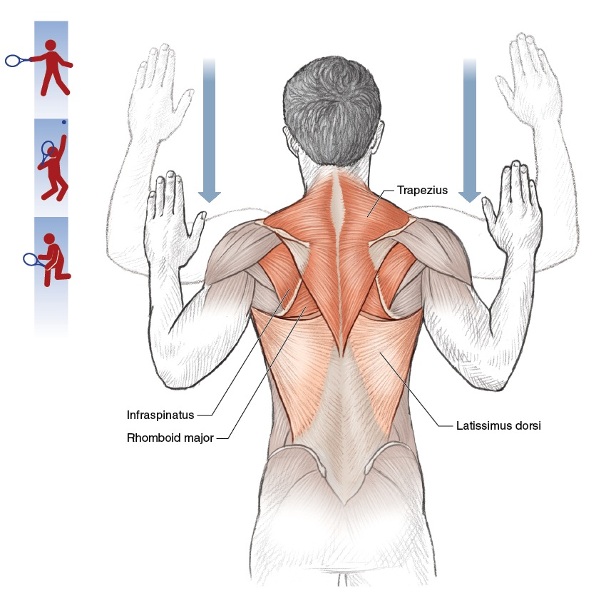
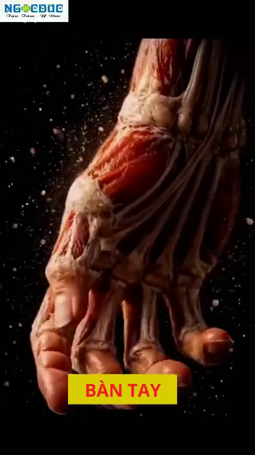

# Skeletal Architecture & Connective Tissue — The Bony Levers and Joint Designs of Tennis

*Deep Dive #5 — The Anatomy & Geometry Project for Tennis Players 3.5 → 4.5*

---

## Table of Contents

| # | Chapter |
| --- | --- |
| 1 | The Skeleton Is a System of Levers |
| 2 | The Lower-Body Bones — Femur, Tibia, Foot |
| 3 | The Pelvis & Sacrum — The Hidden Foundation |
| 4 | The Spine — The 33-Vertebra Chain |
| 5 | The Shoulder Girdle — Clavicle, Scapula, Humerus |
| 6 | The Arm & Wrist Bones — Ulna, Radius, Carpals |
| 7 | Connective Tissue — Ligaments, Cartilage, Fascia |
| 8 | Why Bony Anatomy Decides Stroke Limits |
| 📋 | Skeletal Cheat Sheet |

---

* * *

# Chapter 1 — The Skeleton Is a System of Levers

**Every bone is a lever**. A lever is a rigid bar that rotates around a fixed point (called the FULCRUM). Your bones rotate around your joints.

**The 3 classes of levers**

**Class 1 — Fulcrum in middle** (like a seesaw). Example in body: the head resting on the atlas vertebra. The fulcrum is the joint between the skull and the spine.

**Class 2 — Load in middle** (like a wheelbarrow). Example in body: standing on tiptoes. The fulcrum is the ball of the foot, the load is your body weight at the ankle, the effort is the calf muscle pulling up. **Mechanical advantage > 1 — the muscle force is amplified.**

**Class 3 — Effort in middle** (like tweezers). **Example in body: ALMOST EVERYTHING**. The muscle inserts between the joint (fulcrum) and the load (hand). Mechanical advantage < 1 — the muscle force is REDUCED but SPEED is amplified. **The arm is a third-class lever.**

**Why this matters** — The arm is SLOW at generating force (because it's a Class 3 lever) but FAST at generating racket-head speed (because the muscle contraction is amplified into speed at the hand). **This is why the leg muscles (which are closer to the body) are the POWER source** — they have better leverage. The arm is the SPEED source.

**The forearm lever ratio** — Forearm length (~25 cm) ÷ biceps insertion point (~5 cm from elbow) = **5:1 mechanical disadvantage for force, 5:1 mechanical advantage for speed.**

**Why biceps are "weak" in tennis** — The biceps has a 5:1 disadvantage. **It needs to produce 5x the force at the hand to hold against a 1x load.** Most recreational players "feel" biceps burning after a long match because biceps is trying to do the work of the larger, more efficient muscles.

**The tennis implication** — **Train the LARGE muscles (legs, hips, core) for power**. The arm just translates that power into racket-head speed. A biceps curl will NOT improve your forehand. **A squat might.**

*Master cue:* "Legs are the engine. Arm is the transmission. Racket is the wheels."

* * *

# Chapter 2 — The Lower-Body Bones — Femur, Tibia, Foot

**The femur** (thigh bone) — The longest, strongest bone in the body. ~45–50 cm in adult men, ~40–45 cm in women. Bears all the body weight during standing and most of it during running. The head of the femur sits in the hip socket (acetabulum).

**The femoral neck angle** — The angle between the femoral neck and the femoral shaft is ~125°–135° in adults. This angle, called the **angle of inclination**, determines how your hip rotates. **Coxa vara** (angle <120°) limits rotation. **Coxa valga** (angle >140°) increases rotation but may cause instability.

**The femoral torsion angle** — The angle between the femoral neck and the femoral CONDYLES (the bottom knob that meets the knee). Normal is ~10°–15° of ANTEVERSION (forward twist).

**Why anteversion matters for tennis** — Higher anteversion (~15°–20°) means the knees and feet naturally point INWARD when standing. This makes hip EXTERNAL rotation easier and hip INTERNAL rotation harder. **A player with high anteversion may have a "natural" open-stance forehand.**

**The tibia** (shin bone) — The second longest bone. Bears most of the body's load below the knee. Has a slight TIBIAL TORSION (~20°–30° of external rotation of the bottom relative to the top). This is why your foot naturally points slightly outward when you stand.

**The patella** (kneecap) — The largest SESAMOID bone (bone embedded in a tendon). Embedded in the quadriceps tendon. **Acts as a pulley** for the quadriceps, increasing its leverage by ~30%–50%.

**Why patella matters for tennis** — Without the patella, the quadriceps would need to produce ~30% more force to extend the knee. **The patella is a force amplifier.** It is also why kneecap injuries (patellar tendinitis, "jumper's knee") are common in tennis.

**The foot** — 26 bones in each foot. **That's 26 SMALL levers working together.** They form 3 arches: medial longitudinal (inner side), lateral longitudinal (outer side), and transverse (across the ball).

**The arches** act like a SPRING. When you land on your foot, the arches flatten slightly and store energy. When you push off, the arches rebound and return energy. **The foot is a spring, like the Achilles tendon.**

**Flat feet vs high arches** — **Flat feet**: more flexible, store more energy, but less stable. **High arches**: less flexible, store less energy, but more stable. **The 50+ player with flat feet has more spring but may need orthotics for stability.**

* * *

# Chapter 3 — The Pelvis & Sacrum — The Hidden Foundation

**The pelvis is the foundation of the entire upper body**. It is also the largest bony structure in the body. Made of 3 bones fused together: ilium (the big wing), ischium (the sitting bone), pubis (the front).

**The sacrum** — 5 fused vertebrae at the bottom of the spine. Sits between the two iliac bones. **The keystone of the pelvis.**

**The SI joint** (sacroiliac joint) — Where the sacrum meets the ilium. **A famously stiff joint** with only ~2°–4° of motion. But that motion is CRITICAL — it's where the legs transfer force into the spine. **An SI joint that doesn't move = no kinetic chain.**

**Why SI matters for tennis** — During a forehand, the lead leg pushes against the ground, force travels UP through the tibia, through the femur, into the hip socket, across the SI joint, into the spine, into the shoulder, into the arm. **If the SI joint is locked, the force stops at the hip.**

**The 50+ SI warning** — SI joints become STIFFER with age (collagen cross-links in the ligaments). By age 60, the SI joint may move only ~1°–2°. **This is one reason older players lose power — the SI is not transmitting force.**

**The SI mobility drill** — Standing hip circles (10 each direction), single-leg balance (30 seconds each side), and 90/90 hip rotations (slow, 10 reps) help maintain SI motion. **Do this daily for 50+ players.**

**The pelvic tilt** — The pelvis can tilt forward (anterior tilt, ~10°–15°) or backward (posterior tilt, ~5°–10°). Most tennis players have a slight anterior tilt, which increases hip flexion range (good for low balls) but may stress the lumbar spine.

*Master cue:* "Free the SI. Free the chain."

* * *

# Chapter 4 — The Spine — The 33-Vertebra Chain

**The spine is 33 vertebrae stacked**. 24 are movable (7 cervical, 12 thoracic, 5 lumbar). 9 are fused (5 sacral, 4 coccygeal).

**Cervical spine (C1-C7)** — The neck. Most mobile. ~80° rotation total (mostly C1-C2), ~50° flexion/extension total. **This is where the head turns to watch the ball.**

**C1 (atlas)** — A ring-shaped vertebra. Holds the skull. Allows ~15° flexion/extension (the "yes" motion).

**C2 (axis)** — Has a TOOTH-LIKE process (the DENS or odontoid process) that fits into C1. Allows ~80° rotation (the "no" motion).

**Why C1-C2 matters for tennis** — When you turn your head to track an incoming ball, you are mostly rotating C1 on C2. **A stiff C1-C2 limits your visual tracking.** This is why you can hit a ball coming at you from the side but cannot track a ball going across your body line.

**Thoracic spine (T1-T12)** — The mid-back. **DESIGNED for rotation**. Each vertebra has ~3°–5° rotation, totaling ~35°–50°. **This is where the trunk rotation in tennis comes from.**

**Why T-spine matters for tennis** — Every forehand needs ~40°–50° of T-spine rotation. If T-spine is stiff (desk job, aging), the body will compensate with L-SPINE rotation, which damages the lumbar discs. **Train T-spine mobility.**

**The T-spine mobility drill** — "Open book" stretch (lying on side, rotate top arm back, hold 30 seconds × 3 each side). Foam roller extensions (lying along roller, arms overhead, 10 reps).

**Lumbar spine (L1-L5)** — The lower back. **DESIGNED for stability, NOT rotation**. Only ~10°–15° total rotation, ~50° flexion, ~25°–30° extension.

**The lumbar rotation rule** — Anything beyond ~15° lumbar rotation = **disc shear stress**. The L4-L5 and L5-S1 discs are the most commonly herniated discs in tennis. **The rule: rotation above the lumbar, flexion/extension at the lumbar. NEVER reverse this.**

**The intervertebral disc** — A gel-filled cushion between each vertebra. **Has NO direct blood supply** — it gets nutrients by DIFFUSION through motion. **THIS IS WHY SPINAL MOVEMENT IS ESSENTIAL FOR DISC HEALTH.** Sitting still for hours = disc starvation. Tennis = disc nutrition.

**The 50+ disc reality** — Disc hydration drops ~1% per year after 30. By 50, discs are ~20% less hydrated than at 20. **They are more fragile, more prone to herniation.** Use lumbar rotation carefully. **Stay below 15° rotation.**

*Master cue:* "Rotation above, flexion below. Don't reverse the rule."

* * *

# Chapter 5 — The Shoulder Girdle — Clavicle, Scapula, Humerus

**The shoulder is actually 4 joints**, not 1. Most people think of the glenohumeral joint (the ball-and-socket), but the scapula, clavicle, and sternum also have joints that matter.

**Joint 1 — Glenohumeral** — The main shoulder joint. Ball (humeral head) + socket (glenoid). Socket covers only ~1/3 of the ball. **Sacrifice stability for mobility.**

**Joint 2 — Acromioclavicular (AC)** — Where the clavicle meets the acromion (top of scapula). Provides ~5°–8° of motion. **Injured in falls — the famous "separated shoulder."**

**Joint 3 — Sternoclavicular (SC)** — Where the clavicle meets the sternum. **THE ONLY bony connection between the arm and the trunk.** Provides ~30°–40° of motion. **Critical for serve and overhead.**

**Joint 4 — Scapulothoracic** — Not a true joint, but a SLIDING surface between the scapula and the thoracic rib cage. **The scapula "floats" on the ribs.** This floating is what allows the arm to reach up high.

**The scapulohumeral rhythm** — For every 2° the humerus raises, the scapula rotates 1° (a 2:1 ratio). Total arm elevation: 180°, of which 120° comes from glenohumeral + 60° from scapulothoracic.

**Why scapular rhythm matters for tennis** — A STIFF scapula cannot rotate up to 60°. This forces the glenohumeral joint to do the full 180° of arm elevation — putting it into the dangerous "supraspinatus impingement zone." **This is the #1 cause of serve-related shoulder pain.**

**The clavicle** (collarbone) — A long S-shaped bone. Acts as a STRUT that holds the shoulder out away from the chest. **Without the clavicle, the shoulder would collapse inward.**

**Why collarbone fractures matter** — The clavicle is the most commonly fractured bone in the upper body. Falls on the shoulder (common in tennis slips) fracture the middle third of the clavicle. **Healing takes 6–8 weeks minimum.**

**The humerus** (upper arm bone) — A long lever. The HEAD sits in the glenoid socket. The GREATER TUBEROSITY is where 3 of the 4 rotator cuff muscles attach (supraspinatus, infraspinatus, teres minor).

**The bicipital groove** — A channel on the front of the humerus where the long head of the biceps tendon runs. **If this groove is shallow** (anatomical variant), the biceps tendon can slip out and cause shoulder pain.

*Master cue:* "Free scapula. Save shoulder."

* * *

# Chapter 6 — The Arm & Wrist Bones — Ulna, Radius, Carpals

**The ulna** — The longer, more stable of the two forearm bones. Forms the olecranon process (the pointy bone at the back of your elbow). The olecranon FITS INTO the olecranon fossa of the humerus during full elbow extension — **this is what locks the elbow straight.**

**Why the elbow locks** — At 180° elbow extension, the olecranon process fits into the olecranon fossa. **This is the elbow's "dead center" position**. Bony lock. No muscle needed.

**The radius** — The shorter, more mobile of the two forearm bones. **Rotates around the ulna** during pronation/supination (twisting the palm). The radial head meets the capitellum of the humerus at the elbow.

**The radioulnar joints** — Two joints: PROXIMAL (near elbow) and DISTAL (near wrist). Together they allow ~150° of pronation/supination. **This is what twists the racket face.**

**Why tennis elbow happens** — The ECRB (extensor carpi radialis brevis) tendon attaches to the lateral epicondyle of the humerus. **Repeated wrist extension + forearm pronation** (exactly what a tennis forehand does) overloads this tendon. Result: lateral epicondylitis = "tennis elbow."

**The wrist** — 8 carpal bones in 2 rows. **Proximal row (closer to forearm)**: scaphoid, lunate, triquetrum, pisiform. **Distal row (closer to fingers)**: trapezium, trapezoid, capitate, hamate.

**The scaphoid** — The most commonly fractured carpal bone. Falls on outstretched hand. **Healing is slow** because the scaphoid has poor blood supply.

**The TFCC** (triangular fibrocartilage complex) — A meniscus-like structure on the ULNAR side of the wrist. **Cushions and stabilizes the wrist during the snap motion.** Vulnerable in tennis (especially on two-handed backhand and slice).

**The metacarpals** (5 long bones in the palm). Each ends in a knuckle. **The 1st metacarpal (thumb side) has a unique saddle joint** with the trapezium, allowing the thumb to oppose the other 4 fingers. **This is why humans can grip a racket.**

**The phalanges** (finger bones). Each finger has 3 phalanges (proximal, middle, distal). The thumb has 2. **Total: 14 phalanges per hand.**

*Master cue:* "Eight carpals, fourteen phalanges, one tool — your grip."

* * *

# Chapter 7 — Connective Tissue — Ligaments, Cartilage, Fascia

**Connective tissue is the SILENT partner** of the skeleton. It holds bones together, cushions joints, and transmits force between muscles.

**Ligaments** — Connect BONE to BONE. Made of dense collagen. **Limit joint motion to safe ranges**. Examples: ACL (anterior cruciate ligament) in the knee, MCL (medial collateral ligament), UCL (ulnar collateral ligament) in the elbow, glenohumeral ligaments in the shoulder.

**The UCL in tennis** — The ulnar collateral ligament at the elbow is the SAME ligament Tommy John surgery replaces. **Valgus stress** (force pushing the forearm outward) loads this ligament. Serve and forehand create valgus stress. **The UCL is the elbow's last line of defense**.

**Cartilage** — Covers the ends of bones inside joints. Two types: HYALINE (articular cartilage, glassy, covers bone ends) and FIBROUS (meniscus in knee, labrum in shoulder/hip).

**Articular cartilage has NO nerves** — This is why cartilage damage is "silent." You don't feel pain until the cartilage is gone and bone is rubbing on bone. **By the time you feel knee pain from cartilage loss, you've already lost 30%–50% of the cartilage.**

**Cartilage has NO blood supply** — Once damaged, it heals POORLY (or not at all). This is why osteoarthritis is irreversible. **Prevention = lifelong cartilage protection**.

**The meniscus** in the knee — Two C-shaped pieces of fibrocartilage between the femur and tibia. **Act as shock absorbers**. Distributed ~50% of the load across the knee joint. **Meniscectomy (removal) = 4–6x increased risk of osteoarthritis**.

**The labrum** in the shoulder — A ring of fibrocartilage around the glenoid socket. **Deepens the socket by ~50%**. Critical for shoulder stability. Tears are common in tennis (especially serving).

**Fascia** — Sheets of connective tissue that WRAP muscles and connect them to each other. The **thoracolumbar fascia** (lower back) is critical for tennis — it transmits force from the glute max and latissimus dorsi to the opposite arm (a "cross-pattern" force transfer).

**The thoracolumbar fascia's role** — When you hit a forehand, your LEFT glute max and RIGHT lat dorsi both pull on the thoracolumbar fascia. The fascia transmits this force UP and across to the RIGHT shoulder (the racket arm). **This is one reason a strong left glute improves right-handed forehand power.**

**The 50+ fascia reality** — Fascia dehydrates and stiffens with age. **By 60, fascia may be ~20%–30% stiffer than at 25.** This is one reason older players lose flexibility. **Foam rolling and dynamic stretching help maintain fascia pliability.**

*Master cue:* "Bones are the frame. Connective tissue is the glue. Don't skip the glue."

* * *

# Chapter 8 — Why Bony Anatomy Decides Stroke Limits

**Your skeleton defines your MAXIMUM range of motion**. No amount of stretching changes the shape of your bones. You can stretch soft tissues (muscles, fascia, tendons) but you cannot stretch bones.

**Your hip socket depth determines hip rotation** — Deep socket = stable but limited rotation. Shallow socket = more rotation but less stable. You don't get to choose.

**Your femoral torsion determines your natural stance** — High anteversion (15°–20°) = feet naturally point IN = hip ER easy, hip IR hard. Low anteversion (~5°) = feet naturally point OUT = hip IR easy, hip ER hard. **This is why some players are "natural" open-stance forehand players and others are natural closed-stance.**

**Your shoulder socket depth determines shoulder mobility** — Shallow socket = more arm elevation possible but less stable. Deep socket = less arm elevation but more stable.

**Your humeral torsion determines your "natural" grip** — Higher humeral retroversion (more common in throwers and tennis players from childhood) means more external rotation possible. **This is why some players can serve with extreme external rotation (120°+) and others cannot.**

**The stroke that fits YOUR body** — Working with your skeleton means choosing the stroke that matches your anatomy. Examples:

**High anteversion → open-stance forehand works naturally.**

**Low anteversion → closed-stance forehand works naturally.**

**High humeral retroversion → kick serve with 130°+ ER works.**

**Low humeral retroversion → flat or slice serve safer.**

**Tight hip flexors → use more upper-body rotation in forehand.**

**Loose hip flexors → use more hip rotation in forehand.**

**The implication for 50+** — As cartilage thins, joint ROM decreases by ~5°–10° per decade. **The stroke that worked at 40 may not work at 60.** Adapt your technique to your current skeleton, not your 30-year-old skeleton.

*Master cue:* "Respect the skeleton. Adapt the stroke. Don't fight the bones."

* * *

# Chapter 9 — Anatomy_Lab Integration — The Skeletal Numbers Sharpened

**This chapter layers the specific skeletal numbers from your `Anatomy_Lab/` library** (foot 26 bones, L4-L5 disc, thoracic spine, wrist 27 bones) onto the skeletal-framework of this deep dive.

## 9.1 — The Foot: 26 Bones, 33 Joints, 19 Muscles (Most Complex Structure)

**Anatomy_Lab DD7 finding** — the foot is **the most complex structure in the human body**. 26 bones, 33 joints, 19 intrinsic muscles, and 7,000+ nerve endings in the sole.


**Figure 1 / Figure 1** — Foot 26 bones, superior view. Notice the 3 arches that act as a spring.


**Figure 2 / Figure 2** — Foot plantar view. The dense nerve endings in the sole are visible.


**Figure 3 / Figure 3** — Foot medial side. The medial longitudinal arch is the most prominent.

**Why this matters for tennis** — every split-step, every push-off, every direction change happens through this 26-bone structure. **The foot is BOTH a sensor AND an actuator.** It senses the ground (7,000+ nerves) AND it transmits force (26 bones + windlass).

## 9.2 — The Windlass Mechanism (The Cable That Powers Push-Off)

**Anatomy_Lab DD7 finding** — the plantar fascia acts as a **CABLE** from heel to toes. When the big toe extends (push-off), the cable tightens, raising the arch (windlass). **This stores elastic energy equal to ~10% of push-off force.**


**Figure 4 / Figure 4** — Windlass mechanism: big-toe extension tightens the plantar fascia like a windlass, raising the arch.

## 9.3 — The Hip Socket: Femoral Torsion Decides Your Natural Stance

**Anatomy_Lab DD5 finding** — the femoral torsion angle (angle between femoral neck and femoral condyles) is **normally 10°–15° anteversion**. This is genetic and CANNOT be changed.


**Figure 5 / Figure 5** — Hip joint: femoral head in acetabulum, with the torsion angle visible.

**The implication** — **Higher anteversion (~15°–20°) = feet point IN = easier hip ER, harder hip IR.** Players with high anteversion naturally prefer OPEN-STANCE forehands. **Lower anteversion (~5°) = feet point OUT = easier hip IR.** Players naturally prefer CLOSED-STANCE forehands.

## 9.4 — The Spine: L4-L5 Disc and Walking Decompression

**Anatomy_Lab DD4 critical finding** — **L4-L5 is the most stressed disc** in the spine. It absorbs ~30% more load than any other lumbar disc. Walking decompresses it by ~30% (vs lying down, which doesn't decompress it the same way).


**Figure 6 / Figure 6** — L4-L5 disc between the L4 and L5 vertebrae. Most-stressed disc in tennis.


**Figure 7 / Figure 7** — Sciatic nerve path: from L4-L5 down through the buttock and leg. **Misdiagnosed as "piriformis syndrome" in 80% of cases** — the actual compression is at L5-S1, not the piriformis.

**Walking decompresses L4-L5** — at ~3 mph walking speed on a treadmill, the L4-L5 disc experiences ~30% REDUCTION in compressive force compared to rest. **This is because the rhythmic hip flexor/extensor action pumps fluid in and out of the disc.** Tennis sitting + bending forward = compression. Tennis walking between points = decompression.

## 9.5 — The Shoulder: 4 Joints in One

**Anatomy_Lab DD2 finding** — the "shoulder" is actually **4 joints**:

|  |
|  |
|  |
|  |
|  |
|  |

|  |
| --- |
| **Figures 8 & 9 |
| **The scapulohumeral rhythm** — **for every 2° of arm elevation, the scapula rotates 1°.** Total arm elevation of 180° = 120° from glenohumeral + 60° from scapulothoracic. **A stiff scapula = the glenohumeral joint does all 180° = impingement guaranteed.** |

## 9.6 — The Wrist: 27 Bones in the Hand and 8 Carpals

**Anatomy_Lab DD3 finding** — the wrist is **8 carpal bones in 2 rows** + the carpal tunnel. **2 cm² of space contains 9 flexor tendons + 1 median nerve.** Anything that swells this tunnel (overuse, fluid retention, diabetes) compresses the nerve — **carpal tunnel syndrome**.



**Figure 10 / Figure 10** — The 8 carpal bones in 2 rows: proximal (scaphoid, lunate, triquetrum, pisiform) + distal (trapezium, trapezoid, capitate, hamate).

**The TFCC** — Triangular Fibrocartilage Complex on the ulnar side of the wrist. **Cushions and stabilizes the wrist during snap motion.** Vulnerable in tennis (especially 2-handed backhand).

* * *

## 📋 Chapter Card — Printable

```
╔═══════════════════════════════════════════════════════════╗
║  SKELETAL ARCHITECTURE — KEY IDEAS                        ║
╠═══════════════════════════════════════════════════════════╣
║                                                            ║
║  🎯 ONE BIG IDEA
║     The arm is a Class 3 lever (effort in middle).         ║
║     It sacrifices force for speed. Legs and core          ║
║     produce the force; arm amplifies the speed.            ║
║                                                            ║
║  ────────────────────────────────────────────────────────  ║
║  KEY BONES PER REGION
║                                                            ║
║  Lower body: Femur (5:1 lever), Tibia, Patella (pulley)   ║
║  Pelvis: Ilium + Ischium + Pubis + Sacrum (SI joint)     ║
║  Spine: 24 movable + 9 fused = 33 vertebrae               ║
║  Shoulder: Clavicle + Scapula (4 joints total)           ║
║  Arm: Humerus + Ulna + Radius (forearm twist)             ║
║  Wrist: 8 carpals in 2 rows + TFCC cushion                ║
║  Hand: 5 metacarpals + 14 phalanges                       ║
║                                                            ║
║  ────────────────────────────────────────────────────────  ║
║  ⚠️ TOP MISTAKE
║     Training arms for power (biceps curls, triceps         ║
║     extensions) instead of legs (squats, lunges).         ║
║     Arms are 3rd-class levers — they amplify speed,       ║
║     not force. Train the legs for power.                   ║
║                                                            ║
║  ────────────────────────────────────────────────────────  ║
║  🔁 DRILL
║     Single-leg balance with eyes closed, 30 seconds × 3   ║
║     per side. Trains SI joint + proprioception.           ║
║                                                            ║
║  ────────────────────────────────────────────────────────  ║
║  💭 MASTER CUE
║     "Respect the skeleton. Adapt the stroke."             ║
║                                                            ║
╚═══════════════════════════════════════════════════════════╝
```

* * *

## 🎯 Final Word

Friend, you have ~206 bones in your body. Each one is a lever. Each joint is a fulcrum. Each connective tissue is a constraint. **You are a 206-lever machine that must coordinate into one swing.**

The skeleton is your constraint. The muscles (DD4) are your engine. The springs (DD2) are your storage. The angles (DD1) are your geometry. **All four work together — and none of them can be skipped.**

* * *

**Sources**:
- Calais-Germain (2012) — Anatomy of Movement
- Neumann (2010) — Kinesiology of the Musculoskeletal System
- Kapandji (2009) — Physiology of the Joints
- Standring (2016) — Gray's Anatomy
- McGinnis (2013) — Biomechanics of Sport

*End of Deep Dive #5 — Skeletal Architecture & Connective Tissue*