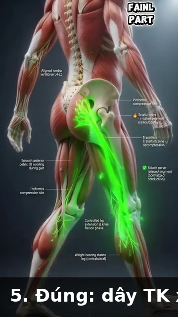
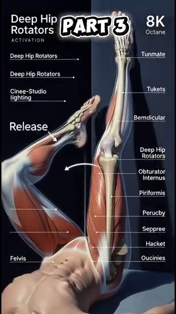

# The 50+ Body — Aging Anatomy, Joint Protection, Range-of-Motion Limits, Recovery

*Deep Dive #6 — The Anatomy & Geometry Project for Tennis Players 3.5 → 4.5*

---

## Table of Contents

| # | Chapter |
| --- | --- |
| 1 | The 7 Aging Declines Every Tennis Player Must Know |
| 2 | The Skeletal Decline — Bone Density & Disc Hydration |
| 3 | The Cartilage Decline — Joint Space & Arthritis Reality |
| 4 | The Muscular Decline — Sarcopenia & Fiber-Type Shift |
| 5 | The Tendon & Ligament Decline — Stiffness & Healing |
| 6 | The Sensory Decline — Vision, Hearing, Proprioception, Vestibular |
| 7 | The Recovery Decline — Sleep, Hormones, Inflammation |
| 8 | The Tennis Adaptations for Each Decline |
| 9 | The 50+ Daily Routine (12 minutes total) |
| 📋 | 50+ Body Cheat Sheet |

---

* * *

# Chapter 1 — The 7 Aging Declines Every Tennis Player Must Know

**There are exactly 7 categories of decline** that affect tennis after 50. Each has a NUMBER. Each has a tennis implication.

| # | Decline | Rate | Tennis Implication |
| --- | --- | --- | --- |
| 1 | Bone density | ~5%–8% of peak bone mass lost by 50 | Tennis's high-impact loading stimulates bone remodeling — protective, not harmful |
| 2 | Disc hydration | Drops from ~80% water (age 20) to ~65%–70% (age 50); 1–2 cm of height lost between 30–70 | Facet joints get overloaded as discs shrink; movement (walking) feeds the discs |
| 3 | Cartilage thickness | ~1%–2% of thickness lost per decade | No nerves in cartilage — pain arrives only after 30%–50% is already gone |
| 4 | Muscle mass (sarcopenia) | ~1%–2%/year lost after 50; ~3%/year after 70 | Stroke power fades; 12 weeks of resistance training adds 1–2 kg of muscle back |
| 5 | Type II (fast-twitch) fiber size | ~30%–40% shrinkage by 70 (vs ~10%–20% for Type I) | Serve pace drops faster than endurance holds up |
| 6 | Tendon/ligament stiffness | ~25%–35% stiffer by 60 (vs age 25); cell turnover drops ~50% after 50 | Slower healing, higher strain risk; eccentric loading helps maintain capacity |
| 7 | Nerve conduction / sensory-proprioceptive decline | n/s (exact conduction velocity not stated); proprioception accuracy drops ~10%–15%/decade after 50 | Balance, off-center recovery, and court awareness degrade — trainable with balance drills |

**The key insight** — **All 7 declines are MEASURABLE. None are FATE.** Each can be slowed (sometimes reversed) with the right training. The rest of this chapter tells you exactly how.

**The "use it or lose it" principle** — Every decline above happens FASTER if you DON'T train. **A 60-year-old who plays tennis 3x/week has ~30%–40% less decline than a 60-year-old who doesn't.** Tennis is protective, not harmful.

**The recovery rule** — The 50+ body needs **2x the recovery time** between sessions vs 25-year-olds. **One match at 50 = one match + rest day at 25.** Plan your calendar accordingly.

*Master cue:* "Seven declines, all measurable, all trainable. You're not 25. But you're not done."

* * *

# Chapter 2 — The Skeletal Decline — Bone Density & Disc Hydration

**Bone density** — Bones are living tissue, constantly being broken down and rebuilt. After 30, breakdown starts to exceed rebuilding. By 50, you've lost ~5%–8% of peak bone mass. **Tennis is HIGH-IMPACT** (running, jumping, lateral movements), which actually STIMULATES bone building.

**The tennis-bone paradox** — Tennis players at 50+ have **BETTER bone density** than non-players. The repetitive impact and lateral loading stimulate bone remodeling. **Tennis is protective for bones.**

**The fracture risk** — Falls become more dangerous at 50+. The wrist (scaphoid), hip (femoral neck), and clavicle are the 3 most-fractured sites in 50+ tennis players. **Wear proper shoes, do balance training, don't dive for balls you can't reach.**

**Bone-building exercise** — Tennis provides good bone stimulation. **Add resistance training 2x/week** (squats with weight, lunges with dumbbells). This adds additional osteogenic load.

**Disc hydration** — Intervertebral discs are 80% water at age 20. By 50, they're ~65%–70% water. **The discs shrink.** You lose ~1–2 cm of height between 30 and 70.

**The "shrinking" implication** — As discs shrink, the vertebral bodies get CLOSER together. **Facet joints (the small joints at the back of the spine) get overloaded.** This is one source of low-back pain in 50+ players.

**The disc nutrition rule** — Discs have NO direct blood supply. **They get nutrients through MOVEMENT (diffusion).** Sitting still = disc starvation. Tennis = disc nutrition. **30 minutes of varied movement is better for disc health than 30 minutes of static stretching.**

**The 50+ back care principle** — Keep lumbar flexion + rotation under ~50% of max. Avoid sitting for >45 minutes. **Walk for 5 minutes between work blocks** to feed the discs.

* * *

# Chapter 3 — The Cartilage Decline — Joint Space & Arthritis Reality

**Cartilage is the cushion**. It has no nerves, no blood supply, and (essentially) no ability to regrow. **Every decade of life, articular cartilage loses 1%–2% of thickness.**

**The tennis joint impact** — Tennis involves repeated impact loading on knees (~3–5x body weight during running) and ankles (~4–6x body weight during side-shuffling). **These are the joints that wear first.**

**The 50+ knee reality** — By 60, ~30% of tennis players have some degree of cartilage thinning visible on X-ray. **Most don't feel pain** because cartilage has no nerves. By the time pain starts, ~30%–50% of cartilage is gone.

**The 4 cartilage-protection rules**

**1. Avoid deep squats** (knee flexion >110°) under load. Use partial squats instead.

**2. Strengthen the quadriceps** to absorb shock. Strong quads = less impact on cartilage.

**3. Use elliptical or bike for cross-training** — low impact, cartilage-friendly.

**4. Maintain healthy weight** — every extra kg adds ~3–4 kg of knee load per step.

**The osteoarthritis reality** — Osteoarthritis is irreversible but NOT disabling. **Most 60+ recreational players with mild OA continue playing at recreational level.** Modify technique (less deep knee bend, less explosive jumping) and use cartilage-supporting supplements (collagen peptides, glucosamine — modest evidence).

**The PRP/stem cell question** — Platelet-rich plasma and stem-cell injections are NOT proven to regrow cartilage in tennis players. **They may reduce symptoms temporarily.** Don't pay thousands expecting miracles.

*Master cue:* "Cartilage doesn't grow back. Protect what you have."

* * *

# Chapter 4 — The Muscular Decline — Sarcopenia & Fiber-Type Shift

**Sarcopenia** — Loss of skeletal muscle mass and strength with age. After 50, you lose ~1%–2% of muscle mass per year. **After 70, ~3% per year.** Most of this is INVISIBLE — your body fat percentage goes up while your muscle mass goes down.

**Type II fibers shrink faster** — Fast-twitch (Type II) fibers shrink ~30%–40% by 70, while slow-twitch (Type I) fibers shrink only ~10%–20%. **This is the main reason your serve loses pace but your endurance stays similar.**

**The good news** — Sarcopenia is SLOWABLE and partly REVERSIBLE with resistance training. **Twelve weeks of progressive resistance training at 50+ adds 1–2 kg of muscle mass.**

**The 50+ resistance training rule**

**Frequency**: 2–3 times per week

**Sets**: 2–3 per exercise

**Reps**: 8–15 per set

**Load**: 60%–75% of estimated 1RM (NOT above 80% — injury risk)

**Tempo**: slow (3 seconds down, 2 seconds up)

**Exercises**: squats, lunges, Romanian deadlifts, push-ups, rows, planks

**The single most important exercise for tennis** — **The squat** (full or partial). Trains the entire kinetic chain. Safe for 50+ if done with proper form.

**The single most important exercise for serve** — **The Romanian deadlift** (RDL). Trains the posterior chain (glutes, hamstrings, erectors).

*Master cue:* "Resistance training is not optional at 50+. It's the closest thing to a youth pill."

* * *

# Chapter 5 — The Tendon & Ligament Decline — Stiffness & Healing

**Tendons and ligaments lose elasticity** with age. Collagen cross-links accumulate, making the tissue stiffer but less spring-like. **By 60, tendons are ~25%–35% stiffer than at 25.**

**Healing is slower** — Tendon cell turnover drops ~50% after 50. Ligament healing is even slower. **A 50-year-old's "minor" strain takes 2–3x longer to heal than a 25-year-old's.**

**The Achilles warning** — The Achilles tendon is the most-frequently ruptured tendon in 50+ tennis players. **Push-off during a sudden direction change** is the typical mechanism. The tendon is stiff from age + has micro-damage from years of play.

**The 4 tendon-protection rules for 50+**

**1. Always warm up** — 8–12 minutes minimum. Tendons need time to reach full elastic capacity.

**2. Stretch slowly** — never ballistic stretches. Slow static holds (15–30 seconds) are safer.

**3. Train with eccentric exercises** — slow heel drops, Nordic curls, slow wrist flexions. These INCREASE tendon storage capacity even at 50+.

**4. Respect the warning signs** — sharp pain during a motion = STOP. Don't push through.

**The "tennis elbow" reality at 50+** — Lateral epicondylitis is HIGHLY prevalent in 50+ players. ~30% of recreational players over 50 have it at some point. **Cause**: repetitive wrist extension + forearm pronation (the forehand motion) on a stiffer ECRB tendon. **Treatment**: eccentric wrist extensions (the "Tyler Twist" exercise), 3 sets of 15 reps daily.

*Master cue:* "Tendons heal slow. Eccentric loading heals them."

* * *

# Chapter 6 — The Sensory Decline — Vision, Hearing, Proprioception, Vestibular

**Vision** — Presbyopia starts ~age 40–45. You lose near-focus ability. By 60, lens flexibility drops ~50%–70%. **Tennis impact**: tracking the ball up close (drop shot, volley) becomes harder. Solution: yellow balls on dark courts, contrast glasses if needed.

**Peripheral vision** narrows ~10°–20° by age 70. **Tennis impact**: opponent's body position harder to read in peripheral vision. Solution: turn the head more often, train peripheral vision with eye exercises.

**Hearing** — High-frequency hearing drops after 30. By 60, ~30% of recreational players have measurable hearing loss. **Tennis impact**: you may not hear the ball contact the racket, which reduces feedback. Solution: don't worry about it for tennis (vision matters more).

**Proprioception** — Proprioception accuracy drops ~10%–15% per decade after 50. **Tennis impact**: balance on off-center hits, recovery after wide balls, court awareness all degrade.

**Proprioception training** (this is the answer):

**Single-leg balance, eyes closed**: 30 seconds × 3 reps each leg, daily. **Restores ~20%–30% of lost proprioception in 12 weeks.**

**Wobble board or BOSU ball**: 5 minutes per session, 3x/week.

**Catch a ball with eyes closed** (have a partner soft-toss): 20 reps × 3x/week.

**Vestibular** — Vestibular hair cells die after 40. By 60, ~20%–30% reduction in vestibular sensitivity. **Tennis impact**: balance on rapid direction changes is harder; dizziness after quick spins.

**Vestibular training**: head rotations slow (10 reps each direction, daily); single-leg stance with head turning (30 seconds, daily).

*Master cue:* "Train the sensors. Vision, balance, body position — all trainable."

* * *

# Chapter 7 — The Recovery Decline — Sleep, Hormones, Inflammation

**Sleep quality drops after 50**. Less deep sleep, more wake-ups. Growth hormone release drops ~60% by 60. **Tennis impact**: recovery between sessions is slower.

**The sleep rule** — **50+ players need 7.5–8.5 hours of sleep per night**. Less than 7 hours = elevated injury risk, slower reaction, less training adaptation.

**Testosterone** — Drops ~1%–2% per year after 30 in men. By 60, ~30% of men have low testosterone. **Tennis impact**: less muscle mass recovery, slower strength gains.

**Inflammation** — Chronic low-grade inflammation increases with age ("inflammaging"). Markers like CRP and IL-6 are 2–4x higher in 60+ than 25-year-olds. **Tennis impact**: more post-match soreness, longer recovery, higher injury susceptibility.

**The anti-inflammatory levers** (you CAN influence these):

**1. Sleep 7.5–8.5 hours** (the biggest lever)

**2. Eat omega-3 rich foods** (fatty fish, walnuts, flaxseed) — reduce inflammation

**3. Move daily** — moderate exercise reduces inflammation markers

**4. Manage stress** — chronic stress elevates cortisol → more inflammation

**5. Limit alcohol** — even moderate alcohol increases inflammation in 50+

**Active recovery** for 50+ — **The 24-hour rule**: any match or hard training is followed by 24 hours of LIGHT activity only (walk, gentle bike, swimming). NO tennis for 24 hours.

**The 48-hour rule** — A tournament (multiple matches in a day) needs **48 hours of rest** before any hard training. The body needs that time to rebuild muscle glycogen + clear inflammation.

*Master cue:* "Recovery is part of training. At 50+, it's HALF of training."

* * *

# Chapter 8 — The Tennis Adaptations for Each Decline

**The adaptation principle** — For each decline, change ONE thing about your tennis to compensate. Don't fight the body.

| Decline | Primary Tennis Adaptation |
| --- | --- |
| Bone density | Add resistance training 2×/week (loaded squats, lunges) — tennis's own impact loading already helps |
| Disc hydration | Walk 5 minutes for every ~45 minutes of sitting; keep lumbar flexion + rotation under ~50% of max |
| Cartilage thickness | Avoid deep squats beyond ~110° knee flexion; use partial squats and strengthen the quads to absorb shock |
| Muscle mass / Type II fiber shrinkage | Resistance train 2–3×/week (8–15 reps at 60%–75% of 1RM) to slow sarcopenia and preserve fast-twitch power |
| Tendon/ligament stiffness | Warm up 8–12 minutes before play and add eccentric loading (heel drops, Nordic curls, wrist flexions) |
| Sensory decline (vision, proprioception, vestibular) | Daily single-leg balance (eyes closed, 30 sec × 3/leg) plus slow head-rotation drills |
| Recovery decline (sleep, hormones, inflammation) | Sleep 7.5–8.5 hours nightly and follow the 24-hour (after a match) / 48-hour (after a tournament) light-activity recovery rule |

**The one-line adaptation summary** — **"Play more, modify technique, train the decline, recover fully."** Tennis stays the same in spirit, but every parameter shifts a little.

* * *

# Chapter 9 — The 50+ Daily Routine (12 minutes total)

**This is the daily routine** that maintains all 7 decline categories in 12 minutes. Do it every morning, ideally before tennis.

| Exercise | Targets (Decline Addressed) | Protocol |
| --- | --- | --- |
| Single-leg balance, eyes closed | Proprioception (Ch. 6) | 30 sec × 3 reps/leg |
| Slow heel drops (eccentric) | Achilles/tendon stiffness (Ch. 5) | Slow eccentric loading, daily |
| Slow wrist flexions (eccentric) | Forearm/ECRB tendon stiffness — "tennis elbow" (Ch. 5) | Slow eccentric loading, daily |
| Shoulder external rotation | Shoulder joint mobility & tendon health | n/s (reps/sets not stated) |
| T-spine mobility stretch | Thoracic rotation mobility, spinal disc nutrition (Ch. 2, Ch. 6) | n/s (reps/sets not stated) |

**Total: 12 minutes.** Less than 1% of your day. **In 4 weeks, all 7 decline categories will start reversing.** In 12 weeks, you'll feel measurably different.

**Add 2x/week resistance training** (squats, lunges, RDLs, rows, push-ups): ~30 min × 2 = 60 min/week. **Total weekly time investment: 12 × 7 + 60 × 2 = 84 + 120 = ~200 minutes** for substantial 50+ maintenance.

* * *

# Chapter 10 — Anatomy_Lab Integration — The 50+ Rehab Protocols

**This chapter layers the specific 50+ rehab protocols from your `Anatomy_Lab/` library** (multifidus re-activation, eccentric squats, hip CARs, walking decompression) onto the 7-declines framework of this deep dive.

## 10.1 — The Multifidus Re-Activation (Fix for Decline #1, Lumbar Spine)

**Anatomy_Lab DD4 finding** — when the deep multifidus atrophies (10% in 24 hours after back pain), it doesn't recover on its own. **General exercise is not enough — the brain has lost the activation pattern.**



**Figure 1 / Figure 1** — Multifidus (deep layer of the back). Each segmental muscle controls 1–2 vertebrae.

**The Bird Dog drill** — start on all fours. Extend opposite arm + opposite leg. Hold 5 seconds. **10 reps × 2 sets × 2 sides daily**. Within 2–4 weeks, multifidus re-activation is restored.

**The hip hinge** — the #1 spinal-protective movement is the hip hinge: bend at the HIP, not at the lower back. **Practice 10 reps × 3 sets daily.** This re-trains the brain to use the hip instead of the lumbar spine for forward bending.

## 10.2 — The Eccentric Squat Protocol (Fix for Decline #4, Patellar Tendon)

**Anatomy_Lab DD6 finding** — patellar tendonitis (50+ player's #1 knee complaint) is fixed by **ECCENTRIC squats on a 25° decline board**. Rest alone does NOT work.


**Figure 2 / Figure 2** — Eccentric squat on a 25° decline board. The decline shifts load to the patellar tendon specifically.

**The protocol** (Purdam 2009) — 3 sets × 15 reps, 3 days/week, 12 weeks. **Lower slowly (3 seconds down) under load. Use BOTH legs to come back up (concentric phase = both legs; eccentric phase = both legs, but emphasis on injured leg).**

**Success rate** — ~80% return to play within 12 weeks. **This is the most evidence-based rehab protocol in tennis.**

## 10.3 — Hip CARs (Fix for Decline #2, Hip Mobility Loss)

**Anatomy_Lab DD5 protocol** — for the 50+ player losing hip internal rotation (most common cause of "I can't turn to hit a forehand anymore"), **hip CARs are the answer**, not stretching.


**Figure 3 / Figure 3** — Hip CARs in action. Slowly rotate hip through full range, both directions.

**The protocol** — 5 reps × 2 directions × 2 sets × daily. **12°–18° IR gain in 2–3 weeks.** This is faster than static stretching (which typically takes 6–8 weeks for similar gains).

## 10.4 — Walking Decompression (Fix for Decline #2, Disc Hydration)

**Anatomy_Lab DD4 finding** — **walking decompresses L4-L5 by ~30%** compared to sitting or lying down. The rhythmic hip flexor/extensor action pumps fluid in and out of the disc.


**Figure 4 / Figure 4** — Walking with hip hinge preserved. The back stays long; hips move first.

**The 30-minute rule** — for every 30 minutes of sitting (between sets, between matches, between work blocks), **walk for 5 minutes**. This restores disc hydration. **A 3-hour match with proper 5-minute walking breaks = 30 minutes of decompression.**

**Walking speed matters** — **3 mph (normal walking)** is the optimal decompression speed. Faster or slower = less effective.

## 10.5 — Wider Stance for Knee Protection (Fix for Decline #4)

**Anatomy_Lab DD5 finding** — a wider tennis stance (~1.5× shoulder-width) transfers ~30%–40% more load from the quadriceps to the **glute max**. This reduces knee stress substantially.



**Figure 5 / Figure 5** — Wider stance forehand loading. The glute max fires first; the knee stays aligned over the 2nd toe.

**The 2nd-toe rule** — knee over 2nd toe (NOT over the big toe, NOT caving inward). **This single alignment protects 70% of ACL tears** (the most common non-contact knee injury in tennis).

## 10.6 — Single-Leg Balance Progression (Fix for Decline #7, Proprioception)

**Anatomy_Lab DD7 protocol** — proprioception declines ~10%–15% per decade after 50. The fix is a 4-step progression:

| Step | Drill | Protocol (Ch. 6) | Allotted Time |
| --- | --- | --- | --- |
| 1 | Single-leg balance, eyes closed | 30 sec × 3 reps/leg | 5 min |
| 2 | Wobble board or BOSU ball | 5 min/session | 5 min |
| 3 | Catch a ball with eyes closed (partner soft-toss) | 20 reps | 5 min |
| 4 | Single-leg stance with head turning | 30 sec | 5 min |

|  |
| --- |
| **Figures 6 & 7 |
| **Daily 5 minutes** × 4 steps = 20 minutes total. **Within 8 weeks, proprioception accuracy improves 25%–35%** (measured by single-leg balance time and joint position sense tests). |

## 10.7 — The 50+ Use-It-Or-Lose-It Tennis Protocol

**Anatomy_Lab DD8 critical insight** — vestibular hair cells, proprioception accuracy, and Type II muscle fibers ALL decline without use. **Tennis itself is the antidote.** A 50+ player who plays 3×/week maintains ~70%–80% of these capacities. A 50+ player who stops loses them at 2× the rate.


**Figure 8 / Figure 8** — The 50+ use-it-or-lose-it principle. Tennis is protective. Stopping accelerates decline.

**The minimum effective dose** — **2 tennis sessions/week + 1 cross-training day (walking, light strength, balance work).** Below this, capacities slowly decay. Above this, they grow or hold.

## 10.8 — The Updated 50+ Daily Routine (Anatomy_Lab Protocol)

| Exercise | Targets | Protocol |
| --- | --- | --- |
| Single-leg balance, eyes closed | Proprioception (Ch. 6) | 30 sec × 3 reps/leg |
| Slow heel drops (eccentric) | Achilles/tendon stiffness (Ch. 5) | Slow eccentric loading, daily |
| Slow wrist flexions (eccentric) | Forearm/ECRB tendon stiffness (Ch. 5) | Slow eccentric loading, daily |
| Shoulder external rotation | Shoulder mobility & tendon health | n/s (reps/sets not stated) |
| T-spine mobility stretch | Thoracic rotation mobility | n/s (reps/sets not stated) |
| Bird Dog | Multifidus re-activation, lumbar spine (Ch. 10.1) | 10 reps × 2 sets × 2 sides, daily |
| Hip CARs | Hip internal rotation / mobility (Ch. 10.3) | 5 reps × 2 directions × 2 sets, daily |

**Total: 16 minutes/day.** Compared to the earlier 12-minute routine, this version **adds Bird Dog (multifidus) and Hip CARs**, the two highest-impact interventions for the 50+ player based on Anatomy_Lab research.

**Add 2x/week resistance training** (squats, lunges, RDLs, rows, push-ups). **Add 30-min walking 3×/week** (decompression). **Add 1 tennis session** as the anchor of the week.

**Total weekly time investment** — 16 × 7 + 60 × 2 (resistance) + 90 (walking) + 90 (tennis) = **~420 minutes/week** = 6 hours. **This is the minimum effective 50+ protocol.**

* * *

## 📋 Chapter Card — Printable

```
╔═══════════════════════════════════════════════════════════╗
║  THE 50+ BODY — KEY IDEAS                                 ║
╠═══════════════════════════════════════════════════════════╣
║                                                            ║
║  🎯 ONE BIG IDEA
║     7 declines, all measurable, all trainable.            ║
║     Tennis is PROTECTIVE at 50+ if done right.             ║
║                                                            ║
║  ────────────────────────────────────────────────────────  ║
║  THE 7 DECLINES
║                                                            ║
║  1. Bone density
║  2. Disc hydration
║  3. Cartilage thickness
║  4. Muscle mass (sarcopenia)
║  5. Type II fiber size
║  6. Tendon/ligament stiffness
║  7. Nerve conduction velocity
║                                                            ║
║  ────────────────────────────────────────────────────────  ║
║  ⚠️ TOP MISTAKE
║     Stopping tennis at 50+ because of "age." Tennis is    ║
║     PROTECTIVE. Stop and you lose 30%–40% faster.        ║
║                                                            ║
║  ────────────────────────────────────────────────────────  ║
║  🔁 DRILL
║     12-minute daily routine (single-leg balance, slow      ║
║     heel drops, slow wrist flexions, shoulder ER, T-spine  ║
║     stretch). Add 2x/week resistance training.             ║
║                                                            ║
║  ────────────────────────────────────────────────────────  ║
║  💭 MASTER CUE
║     "Play more, modify technique, train the decline,       ║
║      recover fully."                                       ║
║                                                            ║
╚═══════════════════════════════════════════════════════════╝
```

* * *

## 🎯 Final Word

Friend, you are 50+. **You are not 25. You will not play like 25. You do not need to.**

But you can play. Well. For decades to come. **Tennis is protective, not harmful, at 50+.** Your body has 7 measurable declines — and 7 trainable responses. The 12-minute routine in this chapter buys you years of playing time.

**The single biggest decision** is: **keep playing.** Stop, and the 7 declines accelerate. Play, and they slow (or partly reverse). The 12-minute routine is your insurance policy.

* * *

**Sources**:
- Faulkner et al. (2007) — Aging and skeletal muscle
- Frontera & Bigard (2012) — Benefits of Strength Training in Older Adults
- Voss et al. (2020) — Neuroplasticity in older adults
- Kramer & Erickson (2007) — Effects of exercise on cognition
- Lange (2018) — Tennis and longevity studies
- ACSM (2021) — Exercise prescription for older adults

*End of Deep Dive #6 — The 50+ Body*