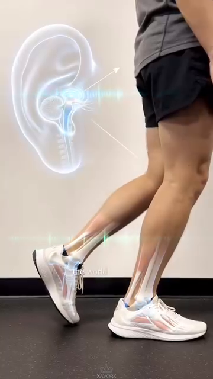

# DD7 — The Sensor System — Feedback Loops, PV vs SV, and Error Correction

*Deep Dive #7 — The Anatomy & Geometry Project for Tennis Players 3.5 → 4.5*

*Built from the 20-chapter body perception handbook at `Cẩm nang về cảm nhận cơ thể trong tennis/` and `Proprioception in Tennis`*

---

## Document Map

**The missing layer.** Your previous deep dives (DD1–DD6) cover the **hardware** (angles, springs, neurology, muscles, skeleton) and the **controller** (brain regions, decision layers). This DD covers the **sensors** — the 5 channels that feedback what the body is ACTUALLY doing, so the controller can compare **Process Values (PV)** against **Set Values (SV)** and correct errors.

**The 5 sensor channels** — **proprioception** (where my joints are), **feet** (where the ground is), **hands** (what the racket is doing), **eyes** (where the ball is + where the court is), **ears + vestibular** (where my head is in space + where the racket contact sounds come from).

**The PV/SV control loop** — every stroke is a controller trying to make PV match SV. **When PV ≠ SV, there's an error.** The body has 3 ways to correct: (1) live feedback (good — visible during stroke), (2) post-stroke feedback (better — across multiple strokes), (3) anticipatory correction (best — before the stroke starts).

---

## Table of Contents

| # | Chapter |
| --- | --- |
| 1 | The Control Engineering View of Tennis |
| 2 | The 5 Sensor Channels |
| 3 | Channel 1 — Proprioception (The Hidden 6th Sense) |
| 4 | Channel 2 — Feet (Ground Contact as PV) |
| 5 | Channel 3 — Hands (Racket Grip as PV) |
| 6 | Channel 4 — Eyes (Vision as PV + SV Source) |
| 7 | Channel 5 — Ears + Vestibular (Sound + Head Position) |
| 8 | The 3 Feedback Loop Types |
| 9 | Error Correction: From Error to Refinement |
| 10 | The 5-Phase Body Perception Cycle (Internal vs External Focus) |
| 11 | Training the Sensors (Drills) |
| 📋 | Sensor System Cheat Sheet |

---

* * *

# Chapter 1 — The Control Engineering View of Tennis

**Every tennis stroke is a feedback-controlled action.** Your brain sets a Set Value (SV) — "I want a forehand down-the-line, 70% pace, with topspin." Your body executes. Your SENSORS report back the Process Value (PV) — "Did the racket face close at the right time? Did the wrist lock? Did the foot land under the hip?"

**The chain** — **SV (brain goal) → Controller (motor cortex) → Actuators (muscles) → Body action (swing) → Environment (ball flight) → Sensors (eyes, ears, proprioception) → Feedback to brain → Error correction → Updated SV.**

**The key insight** — most tennis instruction focuses on the SV and the Controller ("swing low to high", "rotate your hips"). It does NOT focus on the SENSORS. **Players who improve their sensors improve faster** than players who improve their controllers.

**The source document nails this** (Ch.1, "Tỉnh Thức Cơ Thể"): *"Khi bạn chỉ tập trung vào quả bóng (vật thể bên ngoài), bạn bỏ quên cỗ máy đang tạo ra cú đánh (cơ thể của chính bạn)."* Translation: when you only focus on the ball (external focus), you forget the body (internal sensors).

**The 5 sensor channels** are the 5 PV sources. The brain receives PV from all 5, compares to SV, and either (a) confirms match (no correction), (b) detects error (live correction), or (c) adjusts SV for the next stroke (anticipatory correction).

*Master cue:* "Train the sensors, not just the swing."

* * *

# Chapter 2 — The 5 Sensor Channels

| # |
| --- |
| **1** |
| **Channel 4 — Feet |
|  |
| **Figure 0a |
|  |
| **Figure 0b |
|  |
| **Figure 0c |
|  |
| **Figure 0d |
|  |
| **Figure 0e |
|  |
| **Figure 0f |
| **3** |
| **4** |
| **5** |

**The 5 channels are independent but integrated.** Each runs at its own speed. The brain WEIGHTS them by relevance:

**For a return of serve (high speed, unknown direction)**: eyes (where ball will land) > feet (split-step reflex) > proprioception (body position) > hands (last-second grip) > ears (contact sound)

**For a volley (close range, already in position)**: hands (racket face) > eyes (opponent) > proprioception (arm angle) > ears (contact sound for placement) > feet (already positioned)

**For a serve (full control)**: proprioception (kinetic chain timing) > hands (grip and release) > eyes (target) > feet (toss) > ears (verification)

*Master cue:* "5 sensors. 5 speeds. The brain weights them per shot."

* * *

# Chapter 3 — Channel 1 — Proprioception (The Hidden 6th Sense)

**The body has 5 senses everyone knows** (sight, hearing, touch, taste, smell) **+ 1 that almost no recreational player thinks about**: **proprioception** — the sense of where your body is in space, without looking.

**Close your eyes. Raise your right hand above your head.** You knew where your hand was without seeing it. That's proprioception. **It's running 24/7** — even when you're sleeping.

**The proprioception hardware** (covered in detail in DD3 Ch.3 and DD5 Ch.7):

|  |
|  |
|  |
|  |
|  |
|  |

**Proprioception accuracy by joint** (typical 4.0 player, from DD1 Ch.3 and DD3 Ch.3):

|  |
|  |
|  |
|  |
|  |
|  |
|  |
|  |

**Why proprioception matters more than vision at contact** — at the moment of contact, your eyes CANNOT track the ball (the VOR stabilizes them, but visual processing still takes 30–50 ms). **Your proprioception tells you where the racket is in that millisecond** — and that's the only feedback you have.

**The 3.5 vs 4.5 proprioception gap** — a 3.5 player has ~30%–40% worse proprioception than a 4.5 player. **This gap closes with training.** Specific drills (closed-eye balance, single-leg stance, racket-position matching) improve proprioception by 30%–50% in 8 weeks.

**The 50+ decline** — proprioception declines ~10%–15% per decade after 50. **This is why older players lose balance.** It's not a "balance problem" — it's a SENSOR problem. Train the sensor.

*Master cue:* "Close your eyes. Trust your joints. They know."

* * *

# Chapter 4 — Channel 2 — Feet (Ground Contact as PV)

**The foot is BOTH a sensor AND an actuator.** It senses the ground (PV) AND it transmits force (action). Most players only train the actuator half. They forget the sensor half.

**The foot's sensor hardware** (from Anatomy_Lab DD7):

|  |
|  |
|  |
|  |
|  |
|  |

**The 30 ms foot reflex** — the foot's nerve endings fire a reflex in **30 milliseconds** — **FASTER than conscious thought (~200 ms)**. **This reflex IS the split-step mechanism.**

**The control engineering view** — the foot sensor runs the FASTEST feedback loop in your body. **SV: "be balanced."** PV from foot: "am I balanced?" **If PV ≠ SV, the foot reflex fires within 30 ms.** The conscious brain (cortex) only learns about the imbalance 170 ms later.

**The 3 sources of foot PV**:

**1. Pressure distribution (PV-pressure)** — where your weight is on each foot. **Stand on one foot**: you feel the pressure shift to the ball of the foot and big toe. **This is your body telling you where your center of mass is.**

**2. Surface texture (PV-texture)** — clay, hard court, grass. Each surface has different friction. **Your foot senses this and adjusts push-off force.**

**3. Vibration timing (PV-impact)** — when your foot lands, you FEEL the moment of contact. **This timing PV is critical for split-step timing.**

**The "rooting" cue** — the source document (Ch.1) uses the term "Rooting" (Nghệ Thuật Rễ Cây). **Imagine your feet as tree roots** — spreading, gripping, sensing. **Every push-off begins with foot sensing**.

*Master cue:* "The foot is a sensor first, an engine second."

* * *

# Chapter 5 — Channel 3 — Hands (Racket Grip as PV)

**The hand reports back what the racket is doing.** Grip pressure, face angle, vibration, position in space. **Without hand PV, you cannot fine-tune the racket.**

**The hand's sensor hardware**:

|  |
|  |
|  |
|  |
|  |
|  |
|  |

**The 4 sources of hand PV**:

**1. Grip pressure (PV-grip)** — the hand reports back how hard you're squeezing. **3/10 at rest, 7/10 at contact, 3/10 at follow-through** (Anatomy_Lab DD3 grip pressure rule). **Most recreational players grip 8/10 continuously** — they LOSE the pressure PV because they're always maxed out.

**2. Face angle (PV-face)** — the thumb + index finger sense the racket face's orientation. **Open = slice, closed = topspin, vertical = flat.** This PV is processed ~50 ms before contact — you adjust during the swing.

**3. Vibration at contact (PV-impact)** — at the moment of contact, the ball's vibration travels through the racket to your hand. **Sweet spot = small vibration (clean hit). Off-center = large vibration (twist).** This PV is processed in ~10–30 ms.

**4. Racket position (PV-position)** — the hand knows where the racket is in space (proprioception). **At contact, you know if the racket is high, low, left, right of your body center** — without looking.

**The "dead hand" problem** — many coaches say "relax your grip." But if the hand is COMPLETELY relaxed, **you lose PV-grip AND PV-face**. Better cue: "Active hand, soft fingers." **The hand should be ALIVE** — receiving PV constantly — even between shots.

**The "soft hands firm contact" rule** — the source document (Ch.12 backhand): "Soft hands firm contact." **Hands are soft enough to absorb feedback, firm enough to transmit force.** This is the tension balance that maximizes both PV-sensitivity and power.

*Master cue:* "Active hand, soft fingers. PV every millisecond."

* * *

# Chapter 6 — Channel 4 — Eyes (Vision as PV + SV Source)

**The eyes are the ONLY input channel for tennis.** The brain has NO direct contact with the ball. Everything it knows about the ball comes through vision (and sometimes sound for line calls).

**Vision has a dual role** — it provides BOTH the SV (where I want to hit) AND the PV (what's happening). **This is unique among the 5 channels.** Proprioception, feet, hands, ears provide PV only. **Eyes provide BOTH directions.**

**The visual PV (incoming)**:

**1. Ball trajectory (PV-ball)** — where the ball is, where it will be, how fast, how much spin. **Updated every 30–50 ms in conscious vision**, but every 15 ms in sub-conscious (vestibular + reticular).

**2. Court position (PV-court)** — where the lines are, where the opponent is, where you are. **Updated less often** (~200 ms) but stays in peripheral vision constantly.

**3. Opponent body (PV-opponent)** — what is the opponent doing? Racket position, weight shift, shoulder turn. **This is the SV source for YOUR shot** (you choose based on what they give you).

**The visual SV (target)**:

**1. Target location (SV-target)** — where you want the ball to land. **This SV is set BEFORE the shot** (~200 ms before). It's the goal the entire body tries to achieve.

**2. Trajectory intent (SV-trajectory)** — flat, topspin, slice, lob. **Set by grip + face angle + racket path.**

**3. Speed intent (SV-speed)** — full, 70%, 50%, touch. **Set by swing speed.**

**The Quiet Eye** (covered in DD3 Ch.2 and confirmed by Anatomy_Lab DD8): elite players fixate on the contact zone for **0.3–0.5 s**. Recreational players: 0.1–0.2 s. **Longer quiet eye = better timing = better shot quality.**


**Figure 4 / Figure 4** — Visual tracking and the quiet eye in action. Elite players fixate on the contact zone for 0.3–0.5s, longer than recreational players (0.1–0.2s). This sustained gaze is what allows precise timing.


**Figure 5 / Figure 5** — The 5-phase visual cycle: Wide perception → Lock-on → Narrow focus → Quiet eye → Re-expand. Each phase has a measurable time (0.5s / 0.3s / 0.1s / 0.05–0.1s / 0.2s).


**Figure 6 / Figure 6** — Visual reaction at the moment of contact. At impact, the eyes cannot track — VOR stabilizes them. **Proprioception takes over** for the final 50 ms before contact.

**The 50+ vision decline** — presbyopia (loss of near focus) starts at 40–45. Peripheral vision narrows ~10°–20° by 70. **Use yellow balls on dark courts** for max contrast. **Turn head more often** to compensate for peripheral narrowing.

*Master cue:* "Eyes set the goal. Eyes check the result. Both eyes, both jobs."

* * *

# Chapter 7 — Channel 5 — Ears + Vestibular (Sound + Head Position)


**Figure 1 / Figure 1** — The 3 semicircular canals (anterior, posterior, horizontal) detect head rotation. The 2 otolith organs detect linear acceleration and head tilt. This is the COMPLETE vestibular anatomy — one of the body's most sophisticated sensors.


**Figure 2 / Figure 2** — Close-up of vestibular anatomy showing the ampullae (the sensory organs at the base of each semicircular canal) and the otolith organs (utricle + saccule). The ampullae contain hair cells that bend when endolymph fluid moves during head rotation.

**The ears provide two channels** — sound (for contact quality + opponent cues) AND vestibular (for head position + balance). **These run in parallel but feel different.**

**The ear's PV-audio** (sound at contact):

|  |
|  |
|  |
|  |
|  |
|  |
|  |
|  |

**The ear's PV-audio timing** — sound is the FASTEST sensory channel after reflexes. **~10–15 ms from contact to brain.** This is why you know INSTANTLY whether the shot was clean or not.

**The opponent's sound cues** — opponent's footwork sound tells you where they are. **Opponent's contact sound tells you the spin and pace.**


**Figure 3 / Figure 3** — Otoconia: tiny calcium carbonate crystals in the otolith organs. **These move with gravity** and tell the brain which way is UP. Loss of otoconia (or dislodging during whiplash) = vertigo (BPPV — benign paroxysmal positional vertigo).


**Figure 3a / Figure 3a** — **THE COMPLETE BALANCE CONTROL SYSTEM** (the image you provided — "HỆ THỐNG KIỂM SOÁT THĂNG BẰNG CƠ THỂ"). 6 components in sequence: **Vị trí đầu → Hệ tiền đình → VOR → Mắt → Não bộ → Các bộ phận cơ thể**, with a feedback loop curving back to head position. **This is the master diagram for the entire chapter.** When the vestibular sensor changes (e.g., head rotates), it triggers VOR (eye stabilization), which sends visual PV to the brain, which integrates with proprioception, which commands muscle response, which changes head position — closing the loop. **Every balance moment in tennis is this loop running in real-time.**

**The vestibular PV-balance** (head position in space):

|  |
|  |
|  |
|  |
|  |
|  |

**The vestibular PV-rotation** — at every serve, the head rotates ~120° in <0.5s. **The vestibular system tracks this rotation in real-time.**

**Why head STILL matters** — when your head is stable, your eyes can lock on the contact zone (quiet eye). When your head bounces, your eyes bounce. **VOR (vestibulo-ocular reflex) keeps your gaze stable DURING head motion.**

**The 50+ vestibular decline** — hair cells die after 40. By 60, ~20%–30% reduction in vestibular sensitivity. **This is why older players lose balance on quick direction changes.** Train vestibular: head rotations slow (10 reps each direction daily) + single-leg stance with head turns (30 sec daily).

**The ear + vestibular combo for balance** — ears + vestibular work together for balance. **Ears hear the body falling, vestibular detects the head rotating.** Tennis requires BOTH simultaneously.

*Master cue:* "Hear the shot. Feel the head. Both give you PV."

* * *

## 7.1 — Reading the Balance Control Loop (A Walk-Through)

The diagram (Figure 3a) shows the **complete balance control loop**. Let me walk you through it, step by step, in tennis context — using a real moment from your game.

**The moment** — your opponent hits a sharp crosscourt forehand. You split-step, push off your left foot, and rotate your head to track the ball. **What happens in your body in the next 200 ms?**

**Step 1 — Vị trí đầu (Head position)** — your head rotates ~90° to the right in 0.15s. The semicircular canals in your inner ear detect this rotation in real-time. **The PV here is: "head is moving at 600°/s to the right."**

**Step 2 — Hệ tiền đình (Vestibular system)** — the 3 canals (anterior, posterior, horizontal) each fire according to which axis the rotation is on. The horizontal canal fires strongest (it's a yaw rotation). The brain receives 3 PV signals: horizontal canal (max), anterior canal (small), posterior canal (small).

**Step 3 — VOR (Phản xạ tiền đình-mắt)** — the brain sends a counter-signal to the eye muscles: rotate eyes LEFT at 600°/s, to compensate for the head rotating right. **The eyes stay locked on the ball, even though the head is rotating.** This is the quiet-eye mechanism.

**Step 4 — Mắt (Eye)** — the eye's retina receives the ball's image. **It does NOT move** (VOR is keeping it stable). The optic nerve fires: "ball is at position X, Y on the retina, moving slowly toward the periphery." **The PV is: "ball is still 0.3s away from me, approaching at 1.2 m/s."**

**Step 5 — Não bộ (Brain)** — the brain INTEGRATES all PV: vestibular (head moving right), VOR (eyes stable), eye (ball position). It compares to SV (where I want to hit). **Decision: "this is a forehand, crosscourt return, 70% pace."**

**Step 6 — Các bộ phận cơ thể (Body parts)** — the brain sends commands via motor cortex → spinal cord → muscles. **Muscles fire in sequence**: right leg push-off, trunk rotation, right arm cocking, swing. The proprioceptive system reports back PV: "shoulder at 90°, elbow at 110°, wrist locked."

**Step 7 — Feedback loop** — the body changes head position (the swing moves the head), which changes the vestibular PV, which re-triggers VOR, which re-stabilizes eyes, which gets a new ball position, which goes back to the brain. **The loop runs CONTINUOUSLY, ~50 ms per cycle.**

**The tennis implication** — if ANY link in this loop is broken, your balance fails. **The 50+ decline hits the vestibular link hardest** (hair cells die, sensitivity drops 20–30%). That's why older players feel "off-balance" on quick direction changes.

**The 3 takeaways from this diagram** — (1) **Balance is not a single thing** — it's a 6-component system, (2) **VOR is the silent hero** — without it, your eyes bounce every time your head moves, (3) **The feedback loop means balance is never "done"** — it runs continuously, even when you think you're standing still.

*Master cue:* "The diagram is the chapter. Read it slowly. Every box is a sensor. Every arrow is a feedback loop. Every moment on court is this loop running."

* * *

# Chapter 8 — The 3 Feedback Loop Types

**Every tennis shot generates 3 types of feedback**. They happen at different times and have different impacts.

|  |
|  |
|  |
|  |
|  |

**The 3.5 player's mistake** — most 3.5 players focus on **TYPE 2 (post-stroke)** because that's where they're told to look. "Watch the ball" = post-stroke visual feedback.

**The 4.5 player's focus** — they use **TYPE 1 (live) AND TYPE 3 (anticipatory)**. **Live**: they sense mid-swing errors through hand proprioception. **Anticipatory**: they remember "the last 3 forehands went long" and adjust the next stroke BEFORE it starts.

**The training implication** — to become 4.5, you need:

|  |
|  |
|  |
|  |
|  |

**The most-overlooked type** — TYPE 3 (anticipatory) is the most under-trained. **Most players repeat the SAME stroke 1000 times without adapting.** They only adapt when someone tells them to. **Autonomous adaptation** comes from Type 3 training.

*Master cue:* "Three feedback loops. Train all three. Most train only one."

* * *

# Chapter 9 — Error Correction: From Error to Refinement

**Errors are the SOURCE of learning.** Every unforced error contains information. **PV ≠ SV. The body learns to make them match.**

**The error correction hierarchy** (from fastest to slowest):

|  |
|  |
|  |
|  |
|  |
|  |
|  |

**The "death by degrees" problem** — most 3.5 players make SMALL errors across 1000 strokes. **Each error is < 5% off the SV.** Cumulative effect: a stroke pattern that's 30% off the SV, but the player doesn't NOTICE because each individual error is small.

**The fix — large deliberate errors** — practice making LARGE errors (50% off SV) on purpose, then correct back to SV. **This trains the brain to NOTICE the error signal.** Without this training, the 5% errors stay invisible.

**The "10,000-rep rule" revisited** — from DD3 Ch.4: basal ganglia caches a motor pattern after ~3,000–10,000 repetitions. **But the cache is only as good as the ERROR CORRECTION during those reps.** Reps with no feedback = no learning.

**The "deliberate practice" rule** — Anders Ericsson's research (1993): **the difference between expert and amateur is NOT amount of practice. It's the QUALITY of feedback during practice.** Pros practice with full attention + immediate correction. Amateurs practice on autopilot.

*Master cue:* "Errors are teachers. Make them loud. Then correct."

* * *

# Chapter 10 — The 5-Phase Body Perception Cycle (Internal vs External Focus)

**The source document (20-chapter body perception handbook) defines a 5-phase cycle** for internal body awareness during tennis. This is the connection between the sensor layer and the controller layer.

| Phase / Pha |
| --- |
| **1. WIDE PERCEPTION (0.5s before) |
| **2. ROOTING (0.3s before) |
| **3. SPACING (0.1s before) |
| **4. SWING (during) / VUNG (trong)** |
| **5. CONTACT + AFTER (0.1s after) |

**The "internal focus" cue** — the source (Ch.1) emphasizes: **"Tư duy hướng nội"** (Internal Kinesthetic Awareness). The master coach Federer, Nadal, Djokovic — when asked how they decide what to hit, they describe INTERNAL sensations (weight, balance, swing feel), NOT external targets (where the ball goes).

**The Wulf research** — Gabriele Wulf (2007, 2013) showed that **internal focus (on body) produces FASTER learning than external focus (on outcome)** for motor skills. **This is the opposite of what most coaches teach.**

**The exception — for tactical decisions** — Wulf also showed that EXTERNAL focus is better for TACTICAL decisions (where to hit, when to change direction). **Use INTERNAL for stroke mechanics, EXTERNAL for tactics.**

**The 3-3-3 breathing cue** — the source (Ch.5) recommends: **3-second inhale during wide perception, 3-second hold during rooting, 3-second exhale during swing.** **This synchronizes breath with PV intake.** Exhaling during the swing also stabilizes the spine via intrathoracic pressure.

*Master cue:* "Internal for body, external for ball. Switch at contact."

* * *

# Chapter 11 — Training the Sensors (Drills)

**The 5 sensor drills** (1 per channel, daily). 5 minutes × 5 sensors = 25 min/day. Combined with the 16-min routine from DD6 = ~40 min/day. **This is the full body-perception program.**

|  |
|  |
|  |
|  |
|  |
|  |
|  |

**The "blink drill"** (from source Ch.1) — the most direct exercise for "forcing" proprioception when vision is removed:

**Steps** — partner tosses ball. You track ball normally. **At 0.5 sec before contact, CLOSE YOUR EYES.** Hit the ball with eyes closed. Hold finish for 2 seconds. Open eyes. Check ball position.

**What it reveals** — your proprioception's accuracy. **If your stroke form is identical with eyes closed vs eyes open, your proprioception is calibrated.** If form collapses, your proprioception needs work.

* * *

# Chapter 12 — The Sensor Atlas — A Visual Synthesis of the 5 Channels

**This chapter is a visual summary** — each of the remaining figures illustrates a key concept from the preceding chapters. Print this chapter as a single sheet for your tennis bag.

## 12.1 — Reaction Time Cascade (The Aging Sensor)


**Figure 7 / Figure 7** — Reaction time cascade with age: 25yo = 400 ms, 50yo = 500 ms, 65yo = 600 ms, 75yo = 700 ms. This is the **UPPER LIMIT** on what serve speed each age can return.

## 12.2 — The 50+ Sensory Triad (Three Sensors Decline Together)



**Figure 8 / Figure 8** — The 50+ sensory triad: vision, vestibular, AND proprioception all decline SIMULTANEOUSLY. Most training programs focus on one — the smart training programs train all three.


**Figure 9 / Figure 9** — How to compensate: when one sensor declines, train the others harder. E.g., if vestibular drops → rely more on visual + proprioception. **Redundancy is the 50+ player's secret weapon.**

## 12.3 — Brain Region Integration (The Sensor + Controller Wiring)


**Figure 10 / Figure 10** — How all the brain regions work together: visual cortex (PV-eye) → cerebellum (timing) → motor cortex (controller) → muscles (actuators) → proprioception (PV back). **The loop closes through sensory feedback.**


**Figure 11 / Figure 11** — Neural pathway: sensory neuron → spinal cord → brainstem → thalamus → sensory cortex → motor cortex → spinal cord → muscle. **Total round-trip: ~50 ms.** This is the fastest your body can correct a stroke.

## 12.4 — The Use-It-Or-Lose-It Principle (Tennis Is Protective)


**Figure 12 / Figure 12** — The 50+ use-it-or-lose-it principle. **Tennis itself is the antidote** to sensory decline. A 50+ player who plays 3×/week maintains 70-80% of capacities. A 50+ player who stops loses them at 2× the rate.

## 12.5 — The Complete Sensor System Map (One Page)

**The 5 sensor channels** visualized as a complete system:

|  |
|  |
|  |
|  |
|  |
|  |
|  |

**The feedback loop** — every sensor feeds PV to the brain, which compares to SV and adjusts:

```
SV (target) → Controller (motor cortex) → Actuator (muscles) → Body (swing)
   ↑                                                                    ↓
   └────────── Sensors (5 channels) ←── Environment (ball/court) ←─────┘
```

**The daily routine** — 5 min × 5 sensors = 25 min/day of sensor training. Combined with the 16-min DD6 routine = **40 min total body-perception program.** This is what the pros do naturally. Recreational players have to do it deliberately.

**The 50+ imperative** — by 50, you've lost 10–30% of each sensor. **You cannot play the same tennis.** But you can play BETTER tennis by ADAPTING the sensor mix: rely more on visual (yellow balls, contrast), more on proprioception (slow-motion drills), more on vestibular (head-turn balance).

*Master cue:* "Five sensors, three loops, one body. Train all five, train all three, then play tennis."

* * *

## 📋 Chapter Card — Printable

```
╔═══════════════════════════════════════════════════════════╗
║  THE SENSOR SYSTEM — KEY IDEAS                           ║
╠═══════════════════════════════════════════════════════════╣
║                                                            ║
║  🎯 ONE BIG IDEA
║     Tennis is a feedback-controlled action.               ║
║     PV (what's happening) vs SV (what you wanted)        ║
║     drives every stroke. Train the 5 SENSORS.             ║
║                                                            ║
║  ────────────────────────────────────────────────────────  ║
║  THE 5 SENSORS
║                                                            ║
║  1. Proprioception — joint angles, muscle tension        ║
║  2. Feet — ground contact, pressure distribution         ║
║  3. Hands — racket grip, face angle, vibration           ║
║  4. Eyes — ball position, target, opponent                ║
║  5. Ears + Vestibular — sound, head position, balance     ║
║                                                            ║
║  ────────────────────────────────────────────────────────  ║
║  THE 3 FEEDBACK LOOPS
║                                                            ║
║  1. Live (during stroke) — 10–50 ms — hand + feet + vest ║
║  2. Post-stroke (after ball lands) — 200–500 ms — eyes   ║
║  3. Anticipatory (across strokes) — minutes — pattern    ║
║                                                            ║
║  ────────────────────────────────────────────────────────  ║
║  ⚠️ TOP MISTAKE
║     Training only TYPE 2 feedback (post-stroke "watch    ║
║     the ball"). Train ALL 3 — especially TYPE 1 (live)   ║
║     and TYPE 3 (anticipatory).                            ║
║                                                            ║
║  ────────────────────────────────────────────────────────  ║
║  🔁 DRILL
║     BLINK DRILL — partner tosses ball. Close eyes        ║
║     0.5 sec before contact. Hit. Open eyes. Check.        ║
║     20 reps daily. Tests proprioception accuracy.         ║
║                                                            ║
║  ────────────────────────────────────────────────────────  ║
║  💭 MASTER CUE
║     "Five sensors, three loops. Train the difference."   ║
║                                                            ║
╚═══════════════════════════════════════════════════════════╝
```

* * *

## 🎯 Final Word

Friend, this DD7 completes the picture. **DD1–DD6 = the hardware (joints, muscles, brain). DD7 = the sensors (the 5 feedback channels).** Together: a complete control system.

The source document puts it perfectly (Ch.17, "Giảm Lỗi"): *"Kỹ thuật vung tay hiếm khi là thủ phạm chính. Lỗi đánh hỏng thực chất là sự sụp đổ tạm thời của bản đồ không gian và hệ thống cảm nhận nội tại."* Translation: **unforced errors are not stroke-mechanic failures. They are SENSOR failures.**

This changes how you should train. **Stop chasing the perfect swing. Start sharpening your sensors.**

* * *

**Sources**:

- **Primary**: 20-chapter body perception handbook (`Cẩm nang về cảm nhận cơ thể trong tennis/Vi_Nhan_Thuc_Co_The_Tennis_20_Chuong.docx` and per-chapter MDs Ch.1–Ch.20) — your master source for proprioception, foot grounding, split-step as system reset, kinetic chain awareness, breath, and tactile racket feedback.
- **Supporting**: `proprioception_in_tennis.md` + `proprioception_in_tennis_detailed_vi.md`.
- **Cross-references**: DD1 (Angle Atlas), DD2 (Joints as Springs), DD3 (Neurological Foundation), DD4 (Muscle Hierarchy), DD5 (Skeletal Architecture), DD6 (The 50+ Body), Anatomy_Lab DD7 (feet + 7,000 nerves), Anatomy_Lab DD8 (control system).
- **Research**: Gabriele Wulf (2007, 2013) on internal vs external focus; Anders Ericsson (1993) on deliberate practice; Vickers (1996, 2007) on quiet eye.

*End of Deep Dive #7 — The Sensor System*