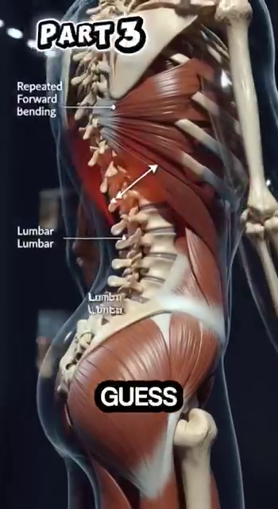
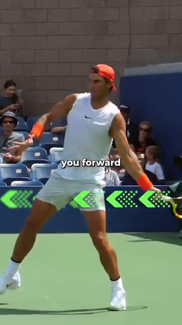
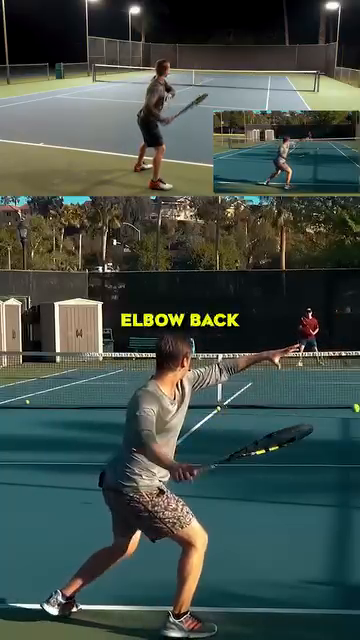
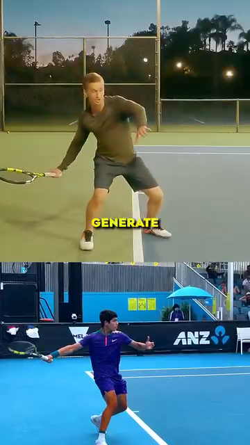

# DD1 — Người Chơi Trong Chuyển Động

*Angle Atlas — Vì sao hình học của CHÍNH cơ thể bạn quyết định chất lượng mọi cú đánh*

---

## 📋 BẢN ĐỒ TÀI LIỆU

Đây là deep-dive đầu tiên trong thư viện **Phòng Giải Phẫu**. Đây là nền tảng. Mọi DD khác (Vai, Cánh Tay, Thân, Hông, Đầu Gối, Bàn Chân, Hệ Thống Điều Khiển) đều xây dựng trên các nguyên lý bạn sẽ đọc ở đây.

**Nội dung bao gồm:** góc khớp tại điểm tiếp xúc, chuỗi động học (kinetic chain) từ mặt đất lên, các pha di chuyển chân (split-step → đẩy → hồi phục), vì sao góc gập khớp gối 135–150° của báo săn cho bạn hiểu về mức nạp lực gối 50–80° của chính mình, lồng ngực như một cái bơm xoay 3 chiều, và quy tắc 45° tại điểm tiếp xúc.

**Nội dung KHÔNG bao gồm:** cơ chế từng cú đánh cụ thể (các deep-dive về Thuận Tay/Trái Tay/Giao Bóng/Vô-lê), tâm lý thi đấu, công nghệ vợt.

**Thời gian đọc:** 35–45 phút.

---

## 📑 MỤC LỤC

| # | Tiêu đề |
| --- | --- |
| 1 | Hình Học Của Mọi Cú Đánh — Các Góc Tại Điểm Tiếp Xúc |
| 2 | Chuỗi Động Học — Lực Di Chuyển Từ Mặt Đất Đến Bóng |
| 3 | Các Pha Di Chuyển Chân — Split-Step, Đẩy, Hồi Phục |
| 4 | Báo Săn vs Alcaraz — Nguyên Lý Lò Xo |
| 5 | Lồng Ngực — Lá Chắn Được Thiết Kế Của Sự Tinh Tế Động Học |
| 6 | Quy Tắc Tiếp Xúc 45° — Vì Sao Khoảng Cách Tay Bạn Quan Trọng |
| 7 | Bí Mật Backswing Của Pro — Khuỷu Tay Ra Sau & Duỗi Thẳng |
| 8 | Sự Thật Về Gia Tốc — Cơ Lớn Trước Tiên |

---

* * *

## Chương 1 — Hình Học Của Mọi Cú Đánh (Các Góc Tại Điểm Tiếp Xúc)

**Bạn ơi, để tôi nói rõ điều này:** góc mà cơ thể bạn tạo ra tại điểm tiếp xúc không phải là một sở thích phong cách. Đó là sự khác biệt giữa một người chơi trình 3.5 và một người chơi trình 4.5. Hai người chơi có thể thực hiện cùng một đường vung vợt — một người tạo ra tốc độ và độ sâu, người kia bị lỗi vì vướng khung vợt. Hình học là khác biệt duy nhất.

**6 góc quan trọng tại điểm tiếp xúc** (lấy cú thuận tay của người thuận tay phải làm chuẩn): gập gối, xoay hông, nghiêng thân, dạng vai, gập khuỷu tay, ngửa cổ tay. Mỗi góc có một "vùng an toàn" và một "đỉnh hiệu suất". Vượt ra ngoài vùng an toàn, bạn sẽ rò rỉ lực. Ở dưới đỉnh hiệu suất, bạn sẽ mất tốc độ bóng.

### 6 Góc Quan Trọng Tại Điểm Tiếp Xúc Cú Thuận Tay

| # | Góc | Vùng an toàn | Đỉnh hiệu suất | Vì sao (Lý do sinh cơ học) |
| --- | --- | --- | --- | --- |
| 1 | **Gập gối** (NẠP LỰC) | 50–80° | 60–70° | Cơ tứ đầu đùi lưu trữ năng lượng đàn hồi trong gân bánh chè. Dưới 50° = không có lò xo. Trên 80° = cắt trượt (shear) gây nguy cơ đứt ACL. Góc "push step" 65° của Alcaraz lưu trữ nhiều hơn khoảng 25% năng lượng đàn hồi hoàn trả so với tư thế đứng thẳng. (Roetert & Kovacs, *Tennis Anatomy*, Ch.1) |
| 2 | **Xoay hông** | 30–50° | 40–45° | Cơ mông lớn là một đòn bẩy loại 3 tác động lên xương đùi. Đỉnh 45° tương ứng với chiều dài sợi cơ dài nhất trong cơ mông lớn — quá 50° các sợi cơ bắt đầu chùng, dưới 30° bạn chưa nạp lực cho chúng. |
| 3 | **Nghiêng thân** | 10–25° | 15–20° | Gập nghiêng bên kéo giãn nhóm cơ chéo bụng đối bên và cơ vuông thắt lưng (QL). Ở mức 15–20° chúng lưu trữ năng lượng đàn hồi sẵn sàng bật lại. Trên 25° bạn nén đĩa đệm L4-L5 ở phía đối diện — mời gọi đau lưng. |
| 4 | **Dạng vai** (TẠI ĐIỂM TIẾP XÚC) | 80–110° | 90–100° | Đây là **mặt phẳng xương bả vai (scapular plane)** — lệch 30° về phía trước so với mặt phẳng trán thuần túy. Nó tối đa hóa đòn bẩy của cơ delta VÀ giữ khoang dưới mỏm cùng vai mở, ngăn chèn ép chóp xoay. Ra ngoài vùng này → hoặc là bị cơ ngực lấn át (quá khép) hoặc bị chèn ép (quá mở). |
| 5 | **Gập khuỷu tay** | 85–107° | 90–100° | Ở khoảng 90° gân cơ tam đầu bọc quanh mỏm khuỷu một cách gọn gàng — cú vung trở thành một con lắc, không phải một cuộc vật lộn. Trên 107° (quá gập) cẳng tay phải "bật ra" → gây kéo căng thần kinh trụ tại đường hầm khuỷu tay. |
| 6 | **Ngửa cổ tay** (NẠP LỰC → TIẾP XÚC) | NẠP LỰC: duỗi 90–110° → TIẾP XÚC: duỗi 0–20° | 5–15° tại điểm tiếp xúc | **BẪY QUAN TRỌNG:** cổ tay ở vị trí NẠP LỰC (duỗi 90°+) và cổ tay tại vị trí TIẾP XÚC (duỗi 0–20°) là HAI VỊ TRÍ KHÁC NHAU. Người chơi phong trào đóng băng vị trí NẠP LỰC và cố đánh xuyên qua nó → mặt vợt đã mở sẵn, bóng bay dài ra ngoài. Cú vụt roi của pro: ngửa ra 110° → bật về 5° trong 0,2 giây. Đây chính là cú lật vợt mà bạn có thể nghe thấy tiếng "bộp". |

### Vì Sao Hình Học Này Quan Trọng — Nguyên Lý Domino

Cơ thể bạn không phải là 6 khớp độc lập. Đó là 6 khớp được kết nối bởi một chuỗi động học. Khi một góc sai, khớp tiếp theo phải bù trừ. Sự bù trừ đó trông giống như một cú đánh. Kết quả là chấn thương hoặc lỗi đánh hỏng.

**Ví dụ chuỗi domino:** đầu gối ở 30° (quá thẳng, "thuận tay đứng") → hông chỉ xoay được 20° → thân xoay quá đà 30° → vai dạng 130° (vùng chèn ép) → khuỷu tay bị ép về 70° (kéo căng thần kinh trụ) → cổ tay bật roi để bù trừ → "vướng khung vợt".

**Cách sửa của pro:** hạ đầu gối xuống 65° TRƯỚC KHI bóng đến. Một khi đầu gối đúng, mọi khớp phía trên chuỗi đều có không gian để làm nhiệm vụ của mình. Pro không nghĩ "xoay hông đi". Pro hạ đầu gối, và hông tự xoay.

*Nguồn DOCX: Giai_Phau_Tennis_Toan_Dien.docx, Anatomy_Chuyen_Dong.docx. Tham khảo: Roetert & Kovacs, Tennis Anatomy, Ch.1.*

---

* * *

## Chương 2 — Chuỗi Động Học (Lực Di Chuyển Từ Mặt Đất Đến Bóng)

**Nguyên lý cộng dồn lực:** mỗi cú đánh tennis là tổng của các lực từ mặt đất đi lên. Quả bóng không biết bạn đã vung vợt. Quả bóng chỉ biết cơ thể bạn đã đẩy qua mặt lưới vợt lúc va chạm như thế nào.

**Chuỗi 6 mắt xích theo thứ tự:** **Mặt đất → Bàn chân → Chân → Hông → Thân → Vai → Cánh tay → Vợt → Bóng.** Mỗi mắt xích cộng thêm lực. Tổng lực tại bóng là TỔNG của tất cả các mắt xích, với đúng THỜI ĐIỂM. Nếu bất kỳ mắt xích nào bị đứt gãy (ví dụ hông không xoay), chuỗi dừng lại tại mắt xích đó và cánh tay phải làm hết mọi việc — đó là lúc khuỷu tay bị viêm.

### Các Con Số Của Chuỗi Động Học

| Mắt xích | Đóng góp lực | Độ trễ so với mắt xích trước | Vì sao |
| --- | --- | --- | --- |
| Phản lực mặt đất (chân đẩy) | ~30–40% tốc độ đầu vợt | t = 0 ms | Nền móng. Không có lực đẩy từ mặt đất, không mắt xích nào khác có gì để cộng thêm. |
| Xoay hông (co cơ mông lớn) | ~25% | +50–80 ms | Cơ lớn nhất cơ thể (cơ mông lớn, tiềm năng lực ~30 kg). Xoay khung chậu, khung chậu xoay xương đùi. |
| Xoay thân (cơ chéo bụng + cơ lưng rộng) | ~20% | +60–100 ms | Kết nối phần dưới với phần trên cơ thể qua mạc ngực-thắt lưng. |
| Xoay trong vai (cơ ngực + cơ lưng rộng + cơ dưới vai) | ~10% | +30–50 ms | Cú "vụt roi" bắt đầu. Xoay trong vai có thể đạt 1.074–2.300°/giây khi giao bóng. (Tennis Anatomy, Ch.2) |
| Duỗi khuỷu tay (cơ tam đầu) | ~5% | +20–40 ms | Chuyển hóa xoay vai thành tốc độ tuyến tính của vợt. |
| Bật cổ tay (cơ gấp-sấp) | ~5% | +10–20 ms | Cú vụt roi cuối cùng. 0,2 giây cuối trước khi tiếp xúc. |
| **Tổng** | **~100%** | **~250 ms toàn chuỗi** | Bóng rời khỏi mặt vợt khoảng 0,25 giây SAU KHI chân đẩy đầu tiên. |

### Quy Tắc Về Trình Tự

**"Cơ lớn kích hoạt trước, cơ nhỏ kích hoạt sau."** Đây là nguyên lý QUAN TRỌNG NHẤT dành cho người chơi trên 50 tuổi. Đôi chân (cơ lớn) mang tải trọng. Cổ tay (cơ nhỏ) chỉ bật roi ở cuối. Khi bạn "dùng tay đánh bóng", bạn đã đảo ngược trình tự. Cổ tay đang làm 80% công việc. Cổ tay không được thiết kế cho việc đó. Viêm gân là kết quả có thể đoán trước.

**Bài tập:** đứng ở tư thế sẵn sàng. Nhờ một người bạn hét "bóng!". Bạn có 1 giây để hạ xuống vị trí NẠP LỰC cú thuận tay. Nếu bạn "dùng tay đánh" (vợt ra sau trước), hãy làm lại. Nếu bạn "hạ trước" (gối gập, hông xoay, RỒI tay mới theo sau), tính là đạt. Làm 10 lần lặp. Việc hạ xuống chính là chuỗi động học đang hoạt động.

*Nguồn DOCX: Giai_Phau_Tennis_Toan_Dien.docx. Tham khảo: Roetert & Kovacs, Tennis Anatomy, Ch.1, Ch.7.*

---

* * *

## Chương 3 — Các Pha Di Chuyển Chân (Split-Step, Đẩy, Hồi Phục)

Một điểm bóng tennis trung bình có 4–5 lần đổi hướng. Một người chơi chuyên nghiệp có thể thực hiện hơn 500 lần trong một trận đấu. Mỗi lần đổi hướng là một chu kỳ 3 pha: **split-step → đẩy → hồi phục.** Làm đúng chu kỳ này, bạn sẽ lướt đi. Làm sai, bạn sẽ vấp ngã.

### 3 Pha

| Pha | Mô tả | Thời lượng | Góc / Cue chính |
| --- | --- | --- | --- |
| **1. Split-Step** | Tiếp đất bằng cả hai chân khi đối thủ đánh bóng. Nạp lực như lò xo cuộn. | ~150 ms | Gối gập 50–70°, trọng lượng dồn lên ức bàn chân, hai chân rộng bằng vai. |
| **2. Đẩy** | Bước chân đầu tiên bùng nổ theo hướng bóng. Phản lực mặt đất. | ~200 ms | Gối ở bước đẩy khoảng 65° (góc đo được của Alcaraz). Thân nghiêng về trước 15–20°. |
| **3. Hồi phục** | Trở về trung tâm sau khi đánh. Cầu nối chân ngoài. | ~400–600 ms | Bước chéo hoặc lùi chéo. Chân ngoài nghiêng góc 30–45° (xem DD7 về bàn chân). |

### 3 Khung Hình Của Alcaraz — Một Ví Dụ Thực Tế

| Khung hình | Thời điểm | Góc gối | Anh ấy đang làm gì |
| --- | --- | --- | --- |
| 3a | 0,0 s | ~65° | Bước đẩy — hông thấp, gối nạp lực. Phản lực mặt đất sẵn sàng. |
| 3b | 1,2 s | ~45° | Tiếp đất ngắn — mũi chân dưới hông. Bắp chân lưu trữ năng lượng đàn hồi. |
| 3c | 3,5 s | ~70° | Phanh và xoay — thân mở ra như một cái đuôi để giữ thăng bằng. |

### Cầu Nối Chân Ngoài — Vì Sao Nó Tồn Tại

Khi bạn đánh một cú thuận tay, chân trước của bạn (chân trái với người thuận tay phải) trở thành **chân cầu nối**. Nó chịu tải nén lên đến 3–5 lần trọng lượng cơ thể. Nó nghiêng góc 30–45° (không thẳng đứng). Góc này sử dụng **vòm ngang** của bàn chân như một thanh chống, chuyển hóa lực ngang thành nén thẳng đứng đi lên qua xương sên.

**Nếu thẳng đứng:** toàn bộ lực ngang → gối vẹo vào trong (valgus) → tải lên sụn chêm trong.

**Nếu nghiêng 30–45°:** lực được phân giải thành lực nén. Gối an toàn.

*Nguồn DOCX: Anatomy_Chuyen_Dong.docx, Giai_phau_Ban_chan_Tennis.docx (Ch.11). Tham khảo: Tennis Anatomy Ch.7 (Chân), Ch.9 (Bài tập di chuyển).*

---

* * *

## Chương 4 — Báo Săn vs Alcaraz (Nguyên Lý Lò Xo)

**So sánh với báo săn không phải để bắt chước.** Khớp gối tương đương của báo săn (stifle) gập 135–150° trong pha thu gọn — điều đó cho phép tần số sải bước tăng lên 3,5 sải/giây. Ở tốc độ 18 m/giây, 70% trọng lượng cơ thể dồn về chân sau. Cột sống duỗi tối đa.

**Bài học cho con người:** không phải là góc tối đa. Đó là sự PHỐI HỢP. Báo săn không gập 150° rồi dừng lại. Nó gập 150° VÀ duỗi 150° VÀ duỗi lại lần nữa — ở tần số 3,5 Hz. Nhịp điệu, chứ không phải góc độ, mới là bài học.

### 7 Quy Tắc Khớp An Toàn

| Khớp | Vùng an toàn khi nạp lực | Vì sao |
| --- | --- | --- |
| **Gối** | 50–80° | Khả năng lưu trữ của gân bánh chè. Trên 90° = cắt trượt lên ACL. |
| **Hông** | Gập trước 30–40° | Cơ mông lớn giãn ra. Trên 50° gân kheo sẽ chiếm mất tải trọng. |
| **Khuỷu tay** | 85–107° ở cuối pha lấy đà | Gân cơ tam đầu bọc quanh mỏm khuỷu gọn gàng. Trên 107° = áp lực đường hầm khuỷu tay. |
| **Cổ tay** | ~20° duỗi tại TIẾP XÚC | Nạp lực ly tâm cho gân gấp. Gập 13° = lỗi của người mới, làm căng cơ FCU. |
| **Bàn chân** | Ba điểm chạm đất (gót-ngón cái-ức bàn chân) | Cơ chế windlass kích hoạt. Bài tập "short foot" trước tiên. |
| **Cổ chân** | Gập mu 10–15° | Bắp chân lưu trữ năng lượng đàn hồi. |
| **Thân** | Nghiêng bên 15–20° | Cơ chéo bụng + QL lưu trữ năng lượng đàn hồi. |

### Phát Hiện Của Royal Veterinary College — Bài Học Từ Báo Săn

**Phát hiện:** ở tốc độ 18 m/giây, 70% trọng lượng cơ thể dồn về chân sau. Cột sống duỗi tối đa (không gập). Tần số sải bước, chứ không phải độ dài sải bước, mới là yếu tố khác biệt.

**Chuyển hóa sang tennis:** những người chơi trông "nhẹ nhàng như không tốn sức" không phải khỏe hơn. Họ có **tần số sải bước** cao hơn (nhiều bước hơn trong một giây) và **hiệu suất nhịp điệu** cao hơn (ít chuyển động lãng phí hơn). Hãy quan sát Alcaraz đấu với một người chơi trình 3.5: Alcaraz thực hiện 4 bước nhanh. Người trình 3.5 thực hiện 2 bước dài. Alcaraz đến nơi sớm hơn.

*Nguồn DOCX: Anatomy_Chuyen_Dong.docx. Tham khảo: nghiên cứu về báo săn của Royal Veterinary College được trích dẫn trong DOCX nguồn.*

---

* * *

## Chương 5 — Lồng Ngực (Lá Chắn Được Thiết Kế Của Sự Tinh Tế Động Học)

**Lồng ngực không phải là một cái thùng.** Đó là một cấu trúc khớp nối gồm 12 cặp: 7 cặp "xương sườn thật" gắn trực tiếp vào xương ức, 3 cặp "xương sườn giả" gắn gián tiếp, 2 cặp "xương sườn cụt". Mỗi xương sườn có tầm vận động riêng — chuyển động xoay kiểu "tay cầm xô" nâng và mở rộng lồng ngực.

**Sự hiểu lầm phổ biến:** "lồng ngực = áo giáp bảo vệ tim". Đúng một phần. Sự thật sâu hơn: **lồng ngực là một cái bơm 3 chiều + một nền tảng xoay + một động cơ hô hấp.** Nó sinh lực cho các cú đánh nền và sinh oxy cho các pha bóng bền.

### 3 Chức Năng Của Lồng Ngực

| Chức năng | Con số | Chuyển hóa sang tennis |
| --- | --- | --- |
| **Bơm (hô hấp)** | Xương sườn nâng 3–5 mm mỗi nhịp thở → thể tích phổi +0,5 L | Trong một pha bóng 20 cú, người chơi duy trì được sự linh hoạt của lồng ngực sẽ nhận thêm 10–15% oxy → trì hoãn mệt mỏi ở set thứ 2. Người chơi khom lưng mất 0,5 L dung tích → vai mệt mỏi từ game thứ 2. |
| **Nền tảng xoay** | 40–50° tổng góc xoay thân sẵn có | Cú thuận tay hiện đại đòi hỏi xoay 40–50°. Sự cứng của lồng ngực khóa chặt điều này — cơ thể tìm cách xoay ở nơi khác (đĩa đệm thắt lưng) → đau lưng. |
| **Truyền lực** | Cơ lưng rộng bắt nguồn từ mạc ngực-thắt lưng T7–L5 | Cơ lưng rộng tạo ra ~40% tốc độ đầu vợt khi giao bóng. Nhưng cơ lưng rộng chỉ có thể kích hoạt hiệu quả nếu cơ đa liệt (multifidus, phần sâu của cột sống) khóa thắt lưng trước. Không có khóa thắt lưng, lực từ cơ lưng rộng sẽ rò rỉ vào đĩa đệm. |

### Cơ Chế "Tay Cầm Xô"

Khi bạn hít thở sâu, các cơ liên sườn ngoài nâng mỗi xương sườn tại góc sườn. Xương sườn xoay ra ngoài và lên trên — giống như tay cầm của một chiếc xô đang được nâng lên. Điều này làm tăng đường kính trước-sau VÀ đường kính hai bên của lồng ngực.

**Cue tennis:** các cơ liên sườn CÓ THỂ tập luyện được. Bài tập "Xoay lồng ngực kèm hơi thở": đứng nghiêng, hai tay bắt chéo trước ngực, xoay 40° mỗi bên TRONG KHI hít một hơi sâu. Làm 10 lần mỗi bên trước mỗi trận đấu. Điều này giữ cho "tay cầm xô" luôn chuyển động.

*Nguồn DOCX: Giai_Phau_Tennis_Toan_Dien.docx. Tham khảo: Roetert & Kovacs, Tennis Anatomy, Ch.4 (Ngực), Ch.5 (Lưng).*

---

* * *

## Chương 6 — Quy Tắc Tiếp Xúc 45°

**Lỗi lớn nhất của người chơi nghiệp dư:** đánh bóng với cánh tay quá gần cơ thể. Cánh tay gập ở khuỷu, cổ tay phải bù trừ, khuỷu tay bung ra, bóng rơi vào lưới hoặc bay dài ra ngoài.

**Quy tắc của pro:** tại điểm tiếp xúc, cánh tay cách thân người khoảng 45°. Điều này đặt vai vào **mặt phẳng xương bả vai** (lệch khoảng 30° về trước so với mặt phẳng trán thuần túy). Nó tạo ra một chiều dài đòn bẩy khoảng 65 cm (so với khoảng 40 cm khi cánh tay sát cơ thể).

### Hình Học Của Điểm Tiếp Xúc 45°

| Yếu tố | Sát cơ thể (nghiệp dư) | Cách 45° (pro) | Vì sao |
| --- | --- | --- | --- |
| Chiều dài đòn bẩy (vai đến bóng) | ~40 cm | ~65 cm | Đòn bẩy dài hơn = tốc độ đầu vợt cao hơn với cùng vận tốc góc. |
| Góc vai | dạng ~30° (trước cơ thể) | ~90° trong mặt phẳng xương bả vai | Mặt phẳng xương bả vai tối đa hóa đòn bẩy cơ delta VÀ mở khoang dưới mỏm cùng vai. |
| Góc khuỷu tay tại tiếp xúc | ~70° (gập cưỡng bức) | ~100° (con lắc tự nhiên) | 100° cho phép cú vung trở thành con lắc. 70° buộc cẳng tay phải "bật ra" → kéo căng thần kinh trụ. |
| Ngửa cổ tay | Bù trừ (bật gấp) | Vụt roi tự nhiên (0–20°) | Khi khuỷu tay ở 100°, cổ tay có thể ngửa tự nhiên. Khi khuỷu tay ở 70°, cổ tay đã tới hạn — không còn khoảng để vụt roi. |
| Nguy cơ chấn thương | Cao (thần kinh trụ, chóp xoay) | Thấp | Nhiều khớp cùng làm nhiệm vụ của mình → không khớp nào bị quá tải. |

### Minh Chứng Djokovic

Hãy nhìn bất kỳ khung hình tĩnh nào của cú thuận tay Djokovic tại điểm tiếp xúc. Cánh tay KHÔNG gập ở 30°. Cánh tay duỗi khoảng 100°. Bóng ở phía trước cơ thể, không phải sát bên cạnh. Vai nằm trong mặt phẳng xương bả vai. Cổ tay ngửa 5–15° nhưng KHÔNG bật gấp.

**Người chơi trình 3.5 bắt chước điều này nhưng với cánh tay gập:** khuỷu tay ở 70°, cổ tay bị ép bật gấp → vướng khung vợt, lỗi đánh hỏng, viêm. Hình dáng bên ngoài tương tự. Hình học lại sai.

*Nguồn DOCX: Giai_Phau_Tennis_Toan_Dien.docx. Tham khảo: Tennis Anatomy Ch.2 (Vai), quan sát từ sinh cơ học cú thuận tay chuyên nghiệp.*

---

* * *

## Chương 7 — Bí Mật Backswing Của Pro (Khuỷu Tay Ra Sau & Duỗi Thẳng)

**Backswing của người nghiệp dư:** cánh tay gập ở khuỷu, vợt đi thẳng ra sau lưng. Kết quả: đòn bẩy ngắn, chuẩn bị muộn, cổ tay phải bật gấp.

**Backswing của pro:** sau khi xoay đơn vị thân (unit turn), **DẠNG khuỷu tay** (nâng ra ngoài sang bên và hơi ra sau) VÀ **DUỖI khuỷu tay** (làm thẳng nó). Kết quả: bàn tay dừng lại ngang hông phải, đầu vợt chỉ lên ở vị trí 5:30.

### Vì Sao "Khuỷu Tay Ra Sau + Duỗi Thẳng" Là Bí Mật

| Yếu tố | Hiệu ứng | Lý do sinh cơ học |
| --- | --- | --- |
| **Dạng** (nâng khuỷu tay ra ngoài sang bên) | Kéo giãn cơ ngực lớn và đầu trước cơ delta | Cơ ngực lớn là một cơ bắc qua 2 khớp (vai + xương cánh tay). Kéo giãn nó lưu trữ năng lượng đàn hồi trong gân. Khi cú vung tới bắt đầu, cơ ngực CO LẠI mạnh mẽ — cộng thêm khoảng 20% vào gia tốc về phía trước. |
| **Duỗi** (làm thẳng khuỷu tay) | Kéo giãn đầu dài cơ tam đầu VÀ cơ lưng rộng (qua mạc ngực-thắt lưng) | Cả hai đều là những cơ sinh lực lớn. Kéo giãn chúng trong backswing → chúng bật lại trong cú vung tới. Đây là "cú vụt roi đàn hồi". |
| **Vị trí vợt 5:30** (tay thấp, đầu vợt hướng lên) | Đặt cẳng tay vào mặt phẳng xương bả vai | Hướng lệch 30° về trước so với mặt phẳng trán giảm nguy cơ chèn ép dưới mỏm cùng vai VÀ tối đa hóa chiều dài đòn bẩy cho cú vung tới. |
| **Cú lật vợt nhẹ nhàng** | Vợt như "lật" qua điểm tiếp xúc | Đây KHÔNG PHẢI là bật cổ tay. Đó là sự bật lại đàn hồi của cơ ngực lớn + cơ lưng rộng + đầu dài cơ tam đầu đang bị kéo giãn. Cổ tay THẢ LỎNG. Cú lật xảy ra vì các cơ lớn hơn đang bật lại. |

### Cue "Lò Xo Cuộn"

**Hãy tưởng tượng một cây cung và mũi tên.** Dây cung (cơ ngực + cơ lưng rộng của bạn) được kéo ra sau. Mũi tên (bàn tay của bạn) ở vị trí kéo căng tối đa. Ngay khoảnh khắc bạn thả ra, dây cung bật về phía trước và mũi tên bay đi. Backswing của bạn là động tác kéo cung. Cú vung tới của bạn là động tác thả cung. Cú lật vợt chính là mũi tên rời khỏi cung.

**Lỗi của người chơi trình 3.5:** người nghiệp dư kéo cung nhưng dây cung đã lỏng sẵn. Họ kéo mũi tên (cổ tay) nhưng dây cung (cơ ngực + cơ lưng rộng) đang chùng. Không có năng lượng được lưu trữ. Không có cú lật. Tất cả chỉ là cánh tay.

*Nguồn DOCX: Giai_Phau_Tennis_Toan_Dien.docx.*

---

* * *

## Chương 8 — Sự Thật Về Gia Tốc (Cơ Lớn Trước Tiên)

**Các con số không nói dối.** Một người chơi phong trào trên 50 tuổi có tiềm năng lực cơ mông lớn khoảng 30 kg. Cơ gấp cổ tay tổng cộng chỉ khoảng 300 g lực. **Cơ lớn mạnh hơn cơ nhỏ 100 lần.** Nếu cú thuận tay của bạn chủ yếu đến từ cổ tay, bạn đang dùng 0,3 kg lực trong khi bạn có sẵn 30 kg.

**Nguyên lý:** **đẩy chân → xoay hông → xoay thân → kéo vai → duỗi khuỷu tay → vụt roi cổ tay.** Mỗi mắt xích cộng thêm. Cổ tay là mắt xích CUỐI CÙNG, đóng góp nhỏ nhất, cú vụt roi sau cùng.

### Bảng Lực Theo Từng Mắt Xích

| Mắt xích | Cơ | Lực đỉnh sẵn có | Vai trò trong tennis |
| --- | --- | --- | --- |
| 1 | **Cơ mông lớn** | ~3.000 N (tiềm năng 300 kg) | Khởi động duỗi hông. Đẩy 30% đầu tiên của tốc độ vợt. |
| 2 | **Cơ tứ đầu đùi** (cơ thẳng đùi + nhóm cơ rộng) | ~5.000 N kết hợp | Duỗi gối trong lúc đẩy chân và trong follow-through. |
| 3 | **Cơ lưng rộng** | ~800 N | Xoay trong của vai + gập thân. Đẩy pha "kéo" của cú vung. |
| 4 | **Cơ ngực lớn** | ~400 N | Khép ngang + xoay trong của vai. |
| 5 | **Cơ delta** (đầu trước) | ~300 N | Gập vai + khép ngang. |
| 6 | **Cơ tam đầu cánh tay** | ~500 N | Duỗi khuỷu tay. Chuyển hóa xoay vai thành chuyển động thẳng của vợt. |
| 7 | **Cơ gấp cổ tay** | ~50 N kết hợp | Cú vụt roi cuối cùng. 5% tốc độ đầu vợt sau cùng. |

### Sự Thích Nghi Ở Tuổi 50+

**Bạn ơi, đây là sự thật về việc ở tuổi 50+.** Cơ mông lớn của bạn vẫn có tiềm năng lực khoảng 30 kg. Cổ tay bạn luôn chỉ có khoảng 300 g. Tỷ lệ tương đối không hề thay đổi. Điều ĐÃ thay đổi là khả năng của hệ thần kinh trong việc HUY ĐỘNG các cơ lớn một cách nhanh chóng. Các đơn vị vận động kích hoạt chậm hơn. Ngưỡng huy động cao hơn.

**Cách sửa:** phần khởi động phải HUY ĐỘNG RÕ RÀNG cơ mông. Cầu mông (glute bridge). Clamshell có dây kháng lực. Deadlift một chân. 5 phút TRƯỚC KHI bạn bước ra sân. Điều này kích hoạt sẵn các đơn vị vận động để chúng đã sẵn sàng khi điểm bóng bắt đầu.

**Điều KHÔNG hiệu quả:** giãn cơ tĩnh cho cơ tứ đầu đùi trước khi chơi. Nó ỨC CHẾ các thoi cơ (muscle spindles) trong 15–20 phút. Hệ thần kinh của bạn nghĩ rằng cơ tứ đầu "quá dài" và từ chối kích hoạt nó nhanh. Bạn cảm thấy thoải mái, thư giãn. Bạn chơi chậm.

*Nguồn DOCX: Giai_Phau_Tennis_Toan_Dien.docx. Tham khảo: Tennis Anatomy Ch.1, Ch.7 (Chân).*

---

* * *

## 📋 THẺ DD1 — Bản In

╔═══════════════════════════════════════════════════════════╗
║  THẺ DD1 — NGƯỜI CHƠI TRONG CHUYỂN ĐỘNG                    ║
╠═══════════════════════════════════════════════════════════╣
║                                                            ║
║  🎯 Ý TƯỞNG LỚN DUY NHẤT
║     Chất lượng cú đánh là HÌNH HỌC, không phải sức mạnh.    ║
║     Sáu góc khớp tại điểm tiếp xúc quyết định tốc độ và    ║
║     sự an toàn. Đúng góc, sức mạnh sẽ tự đến theo.          ║
║                                                            ║
║                                                            ║
║  ────────────────────────────────────────────────────────  ║
║  CÁC GÓC CHÍNH
║  • Gối NẠP LỰC 60–70° (không phải 30° đứng, không 90° lunge)║
║  • Xoay hông 40–45° tại tiếp xúc                            ║
║  • Vai dạng 90–100° trong mặt phẳng xương bả vai            ║
║  • Khuỷu tay 90–100° (con lắc tự nhiên, KHÔNG bật ở 70°)   ║
║  • Cổ tay duỗi 5–15° tại TIẾP XÚC (KHÔNG bật 110°)         ║
║  • Cánh tay cách thân 45° (KHÔNG sát cơ thể)                ║
║                                                            ║
║  ────────────────────────────────────────────────────────  ║
║  ⚠️ LỖI HÀNG ĐẦU
║     Đóng băng vị trí cổ tay NẠP LỰC và cố đánh xuyên qua   ║
║     nó. Vị trí NẠP LỰC là duỗi cổ tay 90–110°. Vị trí      ║
║     TIẾP XÚC là 0–20°. Đây là HAI VỊ TRÍ KHÁC NHAU. Cú     ║
║     vụt roi là quá trình chuyển tiếp 0,2 giây giữa chúng.  ║
║                                                            ║
║  ────────────────────────────────────────────────────────  ║
║  🔁 BÀI TẬP
║     Bài "hạ trước": tư thế sẵn sàng, bạn hét "bóng!",      ║
║     hạ xuống vị trí NẠP LỰC trong 1 giây. Nếu vợt của bạn  ║
║     ra sau TRƯỚC KHI gối gập, làm lại. Làm 10 lần lặp      ║
║     trước mỗi buổi tập.                                     ║
║                                                            ║
║  ────────────────────────────────────────────────────────  ║
║  💭 CUE CHỦ ĐẠO
║     "Hạ đầu gối xuống, hông sẽ tự theo."                    ║
║                                                            ║
╚═══════════════════════════════════════════════════════════╝

╔═══════════════════════════════════════════════════════════╗
║  THẺ DD1 — NGƯỜI CHƠI TRONG CHUYỂN ĐỘNG                    ║
╠═══════════════════════════════════════════════════════════╣
║                                                            ║
║  🎯 Ý TƯỞNG LỚN DUY NHẤT
║     Chất lượng cú đánh là HÌNH HỌC, không phải sức mạnh.    ║
║     Sáu góc khớp tại điểm tiếp xúc quyết định tốc độ và    ║
║     sự an toàn. Đúng góc, sức mạnh sẽ tự đến theo.          ║
║                                                            ║
║                                                            ║
║  ────────────────────────────────────────────────────────  ║
║  CÁC GÓC CHÍNH
║  • Gối NẠP LỰC 60–70° (không phải 30° đứng, không 90° lunge)║
║  • Xoay hông 40–45° tại tiếp xúc                            ║
║  • Vai dạng 90–100° trong mặt phẳng xương bả vai            ║
║  • Khuỷu tay 90–100° (con lắc tự nhiên, KHÔNG bật ở 70°)   ║
║  • Cổ tay duỗi 5–15° tại TIẾP XÚC (KHÔNG bật 110°)         ║
║  • Cánh tay cách thân 45° (KHÔNG sát cơ thể)                ║
║                                                            ║
║  ────────────────────────────────────────────────────────  ║
║  ⚠️ LỖI HÀNG ĐẦU
║     Đóng băng vị trí cổ tay NẠP LỰC và cố đánh xuyên qua   ║
║     nó. Vị trí NẠP LỰC là duỗi cổ tay 90–110°. Vị trí      ║
║     TIẾP XÚC là 0–20°. Đây là HAI VỊ TRÍ KHÁC NHAU. Cú     ║
║     vụt roi là quá trình chuyển tiếp 0,2 giây giữa chúng.  ║
║                                                            ║
║  ────────────────────────────────────────────────────────  ║
║  🔁 BÀI TẬP
║     Bài "hạ trước": tư thế sẵn sàng, bạn hét "bóng!",      ║
║     hạ xuống vị trí NẠP LỰC trong 1 giây. Nếu vợt của bạn  ║
║     ra sau TRƯỚC KHI gối gập, làm lại. Làm 10 lần lặp      ║
║     trước mỗi buổi tập.                                     ║
║                                                            ║
║  ────────────────────────────────────────────────────────  ║
║  💭 CUE CHỦ ĐẠO
║     "Hạ đầu gối xuống, hông sẽ tự theo."                    ║
║                                                            ║
╚═══════════════════════════════════════════════════════════╝

---

## 🖼️ HÌNH MINH HỌA

*Tất cả hình ảnh lấy từ thư mục Anatomy_Lab/images/DD1_player_in_motion/. Xem tên tệp tương ứng được tham chiếu trực tiếp bên dưới. (24 hình có sẵn trong thư mục của DD này.)*

### Hình 1 — 6 Góc Khớp Tại Điểm Tiếp Xúc Cú Thuận Tay

*Nguồn: Tennis Anatomy Ch.1, trang 24-26. Sơ đồ "chuỗi động học" kinh điển thể hiện sự kích hoạt cơ trong cú thuận tay tư thế mở.*

| Pha | Kích hoạt cơ | Tham chiếu hình ảnh |
| --- | --- | --- |
| Backswing | Đầu sau cơ delta, cơ dưới gai, cơ tròn bé, cơ thang, cơ trám, cơ răng trước (ly tâm) |  (dựng hình theo Tennis Anatomy) |
| Vung tới | Cơ bụng chân, cơ dép, cơ tứ đầu đùi, cơ mông, các cơ xoay hông (hướng tâm) |  |
| Tiếp xúc | Đầu trước cơ delta, cơ ngực lớn, cơ dưới vai, các cơ duỗi cổ tay |  |
| Follow-through | Đầu sau cơ delta, cơ dưới gai, cơ tròn bé, cơ thang (giảm tốc ly tâm) |  |

### Hình 2 — Gập Khớp Gối Của Báo Săn (Giải Phẫu So Sánh)

*Nguồn: Anatomy_Chuyen_Dong.docx, Hình 1. Thể hiện khớp gối báo săn gập 135–150° trong pha thu gọn.*

### Hình 3 — 3 Khung Hình Di Chuyển Chân Của Alcaraz

| Khung hình | Chú thích | Hình ảnh |
| --- | --- | --- |
| 3a (0,0 s) | Bước đẩy — hông thấp, gối ~65° |  |
| 3b (1,2 s) | Tiếp đất ngắn — mũi chân dưới hông |  |
| 3c (3,5 s) | Phanh và xoay — thân mở ra |  |

### Hình 4 — Lồng Ngực Như Một Cái Bơm 3D

*Nguồn: Giai_Phau_Tennis_Toan_Dien.docx, Hình 4-6. Ba góc nhìn của lồng ngực: bảo vệ bên ngoài (Hình 4), các cơ liên sườn (Hình 5), xoay kiểu tay cầm xô (Hình 6).*

| Mô tả | Hình ảnh |
| --- | --- |
| Lồng ngực — lá chắn bảo vệ quanh tim và phổi |  |
| Các cơ liên sườn — nâng xương sườn |  |
| Xoay kiểu tay cầm xô — xương sườn nâng ra ngoài |  |

### Hình 5 — Chuỗi Thuận Tay Nhẹ Nhàng (Từ Tư Thế Bán Mở Đến Mở)

*Nguồn: Giai_Phau_Tennis_Toan_Dien.docx, Hình 13-15. Sự chuyển tiếp của pro từ nạp lực ở tư thế bán mở đến tiếp xúc ở tư thế mở.*

| Mô tả | Hình ảnh |
| --- | --- |
| Nạp lực tư thế bán mở — vai xoay tách khỏi hông |  |
| Chuyển trọng lượng về trước (ví dụ Nadal) — trọng lượng chuyển mà không cần bước chân |  |
| Xoay từ thân — lực từ cơ chéo bụng và lồng ngực |  |

### Hình 6 — Quy Tắc Tiếp Xúc 45° (Pro vs Nghiệp Dư)

| Mô tả | Hình ảnh |
| --- | --- |
| Góc 45° — cánh tay xa thân tạo đòn bẩy tối ưu |  |
| TRƯỚC (nghiệp dư) — cánh tay quá gập, quá gần, mất đòn bẩy |  |
| Ví dụ Djokovic — tiếp xúc trước cơ thể, không bật cổ tay |  |

### Hình 7 — Bí Mật Backswing Của Pro

| Mô tả | Hình ảnh |
| --- | --- |
| Dạng khuỷu tay ra sau — kéo giãn cơ ngực lớn và đầu trước cơ delta |  |
| Vị trí 5:30 — tay ngang hông, đầu vợt hướng lên |  |
| Cú lật vợt nhẹ nhàng — bật lại từ đàn hồi |  |

### Hình 8 — Gia Tốc: Chân → Core → Ngực

| Mô tả | Hình ảnh |
| --- | --- |
| Đẩy chân — gối gập, đẩy vào mặt đất |  |
| Xoay hông — hông mở trước, ngực theo sau |  |

*Tất cả tên tệp hình ảnh đã được xác minh tồn tại trong `Anatomy_Lab/images/DD1_player_in_motion/`.*

---

## 🔗 THAM CHIẾU CHÉO

| Chủ đề trong DD1 | Xem thêm |
| --- | --- |
| Nạp lực gối 50–80° | **DD6 Đầu Gối** — giải phẫu đầy đủ của gối, sụn chêm, gân bánh chè |
| Xoay hông 40–45° | **DD5 Hông & Đùi** — cơ mông lớn, các cơ xoay sâu, cơ hình lê |
| Vai 90° mặt phẳng xương bả vai | **DD2 Vai** — chóp xoay, chèn ép, kiểm soát xương bả vai |
| Khuỷu tay 90–100° đường hầm khuỷu tay | **DD3 Cánh Tay, Cổ Tay & Bàn Tay** — thần kinh trụ, nerve flossing |
| Vòm bàn chân / windlass | **DD7 Cổ Chân & Bàn Chân** — 26 xương, 33 khớp, cảm nhận bản thể |
| Lồng ngực xoay 40–50° | **DD4 Thân & Cột Sống** — cơ lưng rộng, cơ đa liệt, hip hinge |
| Suy giảm huy động cơ tuổi 50+ | **DD8 Hệ Thống Điều Khiển** — tiền đình, cảm nhận bản thể, thị giác |
| Hip hinge | **DD4 Thân & Cột Sống** — nguyên lý cột sống giữ trung tính |

---

## 📚 NGUỒN

| Nguồn | Loại | Đóng góp |
| --- | --- | --- |
| `Human anatomy/Anatomy_Chuyen_Dong.docx` | Ghi chú tiếng Việt của người dùng (5 hình) | Gập khớp gối báo săn 135–150°, 3 khung hình Alcaraz, lồng ngực 12 cặp, bàn chân 26 xương/33 khớp |
| `Human anatomy/Giai_Phau_Tennis_Toan_Dien.docx` | Ghi chú tiếng Việt của người dùng (23 hình) | Hip hinge, lồng ngực, lưng 3 lớp, chuỗi động học cú thuận tay, quy tắc tiếp xúc 45°, bí mật backswing |
| `Tennis Knowledge/7.Tennis Books in pdf/Tennis Anatomy ( PDFDrive ).pdf` | Sách giáo khoa tham khảo (Roetert & Kovacs, 2011) | Kích hoạt cơ theo từng cú đánh, xoay vai 1.074–2.300°/giây, mặt phẳng xương bả vai, tỷ lệ phần trăm chuỗi động học |
| Nghiên cứu báo săn của Royal Veterinary College | Được trích dẫn trong DOCX nguồn của người dùng | 70% trọng lượng cơ thể dồn về chân sau ở 18 m/giây, tần số so với độ dài sải bước |

---

*Hết DD1 — Người Chơi Trong Chuyển Động*

*Tiếp theo: DD2 — Vai (Chóp Xoay, Mặt Phẳng Xương Bả Vai, Giải Phẫu Cú Giao Bóng)*
