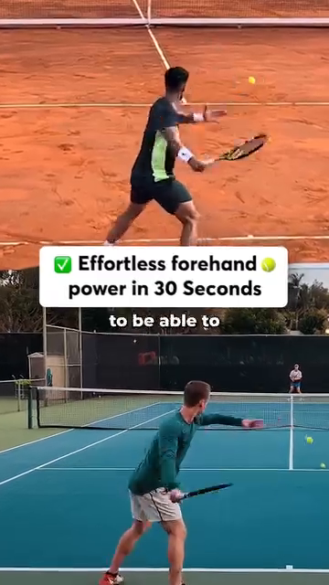

# Bản Đồ Góc Độ — Vì Sao Mỗi Góc Khớp Quyết Định Chất Lượng Cú Đánh

*Deep Dive #1 — Dự Án Giải Phẫu & Hình Học Cho Người Chơi Tennis 3.5 → 4.5*

---

## Mục Lục

| # | Chương | Số dòng |
| --- | --- | --- |
| 1 | Vì Sao Góc Độ Là Ngôn Ngữ Của Tennis | ~80 |
| 2 | Ba Mặt Phẳng Tọa Độ (Đứng, Ngang, Dọc) | ~95 |
| 3 | Phần Thân Dưới — Bàn Chân, Cổ Chân, Đầu Gối | ~180 |
| 4 | Hông — Trục Xoay Của Mọi Thứ | ~150 |
| 5 | Thân Người — Cuộn Xoắn & Cột Sống Ngực | ~140 |
| 6 | Vai — Khớp Linh Hoạt Nhất, Dễ Tổn Thương Nhất | ~170 |
| 7 | Khuỷu Tay & Cẳng Tay — Hệ Thống Đòn Bẩy | ~150 |
| 8 | Cổ Tay — Cái Khóa, Cú Roi, Bộ Tinh Chỉnh | ~160 |
| 9 | Bản Đồ Góc Độ Theo Từng Cú Đánh | ~200 |
| 10 | Vì Sao Góc Độ Quyết Định LOẠI Cú Đánh (không chỉ chất lượng) | ~150 |
| 📋 | Thẻ Tóm Tắt Bản Đồ Góc Độ | ~80 |

---

* * *

# Chương 1 — Vì Sao Góc Độ Là Ngôn Ngữ Của Tennis

**Bạn ơi, đây là bí mật không ai nói với bạn ở "bức tường trình 3.5".** Tennis không phải là môn thể thao của sức mạnh. Cũng không phải môn thể thao của tốc độ. Đó là môn thể thao của *hình học*. Mỗi quả bóng rơi đúng chỗ, với đúng loại xoáy, ở đúng tốc độ — xảy ra vì ở đâu đó trong cơ thể bạn, một góc độ đã đúng.

Hãy nghĩ mà xem. Khác biệt giữa cú thuận tay topspin và cú thuận tay đánh phẳng không nằm ở việc bạn kích hoạt cơ nào. Đó là **góc bay (launch angle)** tại điểm tiếp xúc (khoảng 15–20° hướng lên so với phương ngang cho topspin, 0–5° cho đánh phẳng). Chỉ một góc đó thôi — 15° so với 0° — đã thay đổi hoàn toàn hành vi của quả bóng.

Khác biệt giữa cú trái tay cắt (slice) và cú trái tay topspin không nằm ở việc bạn đẩy bằng chân nào. Đó là **góc mặt vợt** tại điểm tiếp xúc (khoảng -10° đến -20° mở cho slice, +20° đến +30° khép cho topspin).

**Ý tưởng lớn** — *Loại cú đánh được quyết định bởi các góc tại điểm tiếp xúc. Chất lượng cú đánh được quyết định bởi các góc trong suốt chuỗi động học (kinetic chain) dẫn đến điểm tiếp xúc.*

Một khi bạn nhìn thấy điều này, bạn sẽ ngừng chạy theo "tư thế đúng". Bạn bắt đầu tự hỏi: "Cơ thể tôi đang cố tạo ra góc nào? Nó có nằm trong vùng an toàn không?"

Với người chơi trình 3.5 → 4.5, đây chính là chìa khóa mở khóa. Ở trình 3.5, bạn bắt chước tư thế. Ở trình 4.0, bạn hiểu chuỗi động học. Ở trình 4.5, bạn hiểu **các góc độ** — và góc độ là những con số, mà con số thì không nói dối.

*Cue chủ đạo:* "Đừng hỏi phải làm gì. Hãy hỏi cần tạo ra góc nào."

* * *

# Chương 2 — Ba Mặt Phẳng Tọa Độ (Đứng, Ngang, Dọc)

**Trước khi đo góc, chúng ta cần một khung quy chiếu.** Cơ thể bạn là một cỗ máy 3D. Các khớp chuyển động trong ba mặt phẳng. Nếu bạn chỉ nghĩ theo 2D (góc nhìn từ bên mà bạn thấy trên TV), bạn sẽ bỏ lỡ một nửa số góc quyết định chất lượng cú đánh.

**Ba mặt phẳng**:

**1. Mặt phẳng đứng (còn gọi là mặt phẳng trán)** — Hãy tưởng tượng một bức tường trước mặt bạn. Các chuyển động trong mặt phẳng này là lên-xuống và sang hai bên. Camera TV kinh điển nhìn thấy mặt phẳng này. *Gập gối, dạng hông, nâng vai sang bên, lệch cổ tay quay-trụ* — tất cả xảy ra ở đây.

**2. Mặt phẳng ngang (còn gọi là mặt phẳng cắt ngang)** — Hãy tưởng tượng một mặt bàn ngang eo. Các chuyển động trong mặt phẳng này là xoay quanh trục thẳng đứng. *Xoay hông, xoay vai, vặn thân* — động cơ của mọi cú đánh nền — xảy ra ở đây. Đây là mặt phẳng mà hầu hết người chơi phong trào SỬ DỤNG KHÔNG ĐỦ.

**3. Mặt phẳng dọc (góc nhìn từ bên)** — Hãy tưởng tượng một bức tường bên phải bạn. Các chuyển động trong mặt phẳng này là ra trước-ra sau. *Lao người về trước, gập-duỗi gối trong split-step, hạ vợt vào "slot"* — xảy ra ở đây. Huấn luyện viên gọi đây là "mặt phẳng sức mạnh" vì trọng lực nạp lực cho nó.

**Vì sao điều này quan trọng với góc độ**: một góc trong mặt phẳng đứng (như gập khuỷu tay 90°) có ý nghĩa hoàn toàn khác với một góc trong mặt phẳng ngang (như xoay vai 45°). Khi nguồn tài liệu nói "mặt vợt ở 110°", bạn cần hỏi: 110° trong mặt phẳng NÀO?

**Với người chơi 50+** — Mặt phẳng ngang là bạn của bạn. Khi sụn khớp mỏng đi, tải trọng theo phương thẳng đứng (mặt phẳng dọc) làm đau gối và lưng. Tải trọng xoay (mặt phẳng ngang) nhẹ nhàng hơn với khớp và sử dụng các cơ lớn hơn (cơ mông, cơ chéo bụng). Hãy dùng xoay làm động cơ chính của bạn.

*Cue chủ đạo:* "Nghĩ theo ba mặt phẳng. Hầu hết người chơi phong trào chỉ sống trong một."

* * *

# Chương 3 — Phần Thân Dưới — Bàn Chân, Cổ Chân, Đầu Gối

**Mặt đất là cục pin của bạn.** Mọi cú đánh mạnh mẽ đều bắt đầu từ đôi chân trên sân. Đây là các góc quan trọng, kèm theo LÝ DO cho từng góc.

## 3.1 — Góc Bàn Chân (góc mà mũi chân bạn hướng về so với hướng bóng đến)

**Thuận tay**: chân trước hướng khoảng **30°–45° về phía cột lưới** (tư thế đóng) hoặc **15°–30° về phía đường biên dọc** (tư thế trung tính/mở).

**Vì sao góc này quyết định chất lượng** — Góc bàn chân nạp sẵn cho xoay hông. Nếu mũi chân bạn hướng 45° về phía lưới, hông của bạn chỉ có thể xoay ~45° trước khi tầm vận động của gối chặn lại. Nếu mũi chân hướng 15° về phía đường biên dọc, hông có thể xoay tới ~75°. **Xoay nhiều hơn = tốc độ đầu vợt nhanh hơn = sức mạnh lớn hơn.**

**Trái tay hai tay**: cả hai chân gần như song song, ~10°–20° về phía cột lưới. Cú trái tay hai tay dùng ÍT xoay hông hơn thuận tay vì xoay ngực kéo cả hai tay.

**Vô-lê**: chân trước hướng khoảng **30°–60° về phía lưới**, tư thế đứng hẹp hơn, trọng lượng dồn lên ức bàn chân. Góc dốc hơn vì bạn cần **những cú đẩy hướng ngắn**, không phải cú vung lớn.

**Giao bóng**: chân trước tạo góc **~20° về phía cột lưới**, chân sau gần như song song với đường biên ngang (~0°–10°).

**Lỗi lớn nhất**: chân trước hướng thẳng vào lưới (0°) khi đánh thuận tay. Điều này triệt tiêu xoay hông và buộc vai phải làm hết mọi việc. Vai sau đó sẽ đau.

## 3.2 — Góc Nhấc Gót (góc giữa gan bàn chân sau và mặt sân, tại thời điểm tiếp xúc)

**Thuận tay**: nhấc gót ~**50°–60°** tại điểm tiếp xúc. Gót cao, trọng lượng dồn lên ức bàn chân và ngón cái.

**Vì sao góc này quyết định chất lượng** — Ở 0° (gót chạm đất), gân Achilles chùng — không thể lưu trữ năng lượng. Ở 50°–60°, gân Achilles được kéo giãn đến **vị trí lưu trữ năng lượng tối đa**, và bắp chân (cơ bụng chân + cơ dép) cũng được kéo giãn sẵn. Cú giải phóng xảy ra trong 0,05 giây.

**Giao bóng**: nhấc gót ~**60°–70°** lúc bật nhảy. Cao hơn cú đánh nền vì toàn bộ trọng lượng cơ thể đang được đẩy LÊN (bạn đang nhảy), không chỉ xoay.

**Vô-lê**: nhấc gót ~**15°–25°**, nhỏ hơn nhiều. Bạn KHÔNG cố tạo ra sức mạnh — bạn đang đổi hướng một quả bóng đã nhanh sẵn. Nhấc gót nhiều trong vô-lê nghĩa là bạn đã mất thăng bằng.

**Với người chơi 50+** — Gân Achilles mất tính đàn hồi theo tuổi tác. Lưu trữ tối đa ở 50°–60° vẫn khả thi, nhưng bạn cần 5–8 phút nâng gót trong khởi động để "đánh thức" chiếc lò xo. Achilles lạnh = nguy cơ chấn thương.

## 3.3 — Góc Gập Gối (độ cong của đầu gối, 180° = chân thẳng)

**Thuận tay (nạp lực)**: gập gối **120°–135°** tại điểm thấp nhất. (180° trừ 45°–60° gập = 120°–135°.)

**Vì sao góc này quyết định chất lượng** — Gập gối là **mức nạp pin** của toàn bộ chuỗi động học. Dưới 110° (gập quá sâu) bạn không thể đẩy lên đủ nhanh. Trên 150° (gần thẳng) chân không thể sinh lực. Vùng 120°–135° là nơi cơ tứ đầu đùi có thể tạo ra **lực đỉnh trong thời gian tối thiểu**.

**Giao bóng (tư thế "trophy")**: gập gối chân trước ~**130°–140°**.

**Vì sao góc này LỚN HƠN thuận tay** — Vì bạn đang nạp lực cho cả hai chân (giống như động tác leg-press), và bạn cần tầm vận động (ROM) nhỏ hơn để bật lên nhanh. Ngoài ra, cả hai gối cùng gập tạo ra lực đẩy lên cho cú nhảy.

**Split-step**: gập gối ~**135°–145°**, giữ rất ngắn (0,1–0,2 giây).

**Vì sao split-step dùng góc LỚN HƠN (ít gập hơn) so với thuận tay** — Bạn phải có khả năng **đẩy theo BẤT KỲ hướng nào** trong <0,3 giây. Nếu bạn quá thấp (120°), bạn chỉ có thể đẩy theo hai hướng (trước, sau). Nếu bạn ở 140°, bạn có thể đẩy theo đường chéo, sang ngang, mọi hướng.

**Với người chơi 50+** — Gập gối <110° tạo áp lực rất lớn lên gân bánh chè (nguy cơ "gối vận động viên nhảy"). Giữ mức gập trong khoảng 120°–140° khi đánh cú nền, <140° khi giao bóng. **Đừng bao giờ khóa gối thẳng (180°)** — điều đó phá hủy sụn khớp.

* * *

# Chương 4 — Hông — Trục Xoay Của Mọi Thứ

**Hông là động cơ của mọi cú đánh tennis.** Ba góc quan trọng ở đây, mỗi góc có LÝ DO riêng.

## 4.1 — Góc Hông-Thân (góc giữa đùi và thân người, trong mặt phẳng dọc)

**Thuận tay (nạp lực)**: **50°–65°** giữa đùi và thân (hãy nghĩ đó là: ngực của bạn nghiêng về trước bao xa trên đùi trước).

**Vì sao góc này quyết định chất lượng** — Dưới 50° nghĩa là bạn quá thẳng đứng — ngực không nằm trên chân trước, nên bạn không thể đẩy từ nó. Trên 70° bạn mất thăng bằng ra sau ở follow-through. Vùng 50°–65° cho bạn **độ kéo giãn tối đa của cơ gấp hông (psoas + iliacus) và cơ mông lớn**, hai cơ này cùng tạo ra động tác duỗi hông bùng nổ dẫn dắt chuỗi động học.

**Trái tay (nạp lực)**: **45°–55°** — hơi nhỏ hơn thuận tay vì bạn muốn ngực hướng nhiều hơn về phía hàng rào bên (để kéo cả hai tay qua).

**Giao bóng (tư thế "trophy")**: **30°–45°** — góc nhỏ hơn, cơ thể thẳng đứng hơn, vì hướng nạp lực là LÊN chứ không phải RA TRƯỚC.

**Với người chơi 50+** — Độ linh hoạt giảm nhanh sau tuổi 50. Nhiều người chơi 50+ không đạt được 50°. **Nếu bạn chỉ có thể đạt 55°–65°, đó là vùng của bạn, không phải thất bại.** Mất sức mạnh ~15%, giảm nguy cơ chấn thương ~50%.

## 4.2 — Góc Xoay Hông (góc khung chậu xoay quanh trục thẳng đứng, trong mặt phẳng ngang)

**Thuận tay (nạp lực)**: khung chậu xoay **~60°** RA XA lưới. (Tại điểm tiếp xúc: ~0°, hướng thẳng vào bóng.)

**Vì sao góc này quyết định chất lượng** — Xoay hông là **yếu tố đóng góp lớn nhất** vào tốc độ đầu vợt trong tennis. Các nghiên cứu cho thấy xoay vai đóng góp ~30% vào tốc độ vợt, xoay hông đóng góp ~50%, và cú vụt roi cổ tay đóng góp ~20%.

**Vùng 50–60° không phải ngẫu nhiên** — Cấu trúc xương của khớp hông (chỏm xương đùi bên trong ổ cối) cho phép khoảng 45° xoay ngoài khi hông đang gập (như trong tư thế nạp lực thuận tay). Cộng thêm ~10°–15° từ xoay cột sống thắt lưng, bạn có ~60°. **Vượt quá 60° đòi hỏi đầu gối phải hấp thụ mô-men xoắn không tự nhiên**, đó là lý do vì sao cố ép xoay hông nhiều hơn cảm thấy "kẹt".

**Trái tay hai tay (nạp lực)**: **~45°–55°** khung chậu xoay ra xa — hơi ít hơn thuận tay vì xoay ngực làm nhiều việc hơn.

**Vô-lê (nạp lực)**: **~20°–30°** xoay khung chậu — nhỏ vì bạn không có thời gian.

**Giao bóng (nạp lực, "trophy")**: **~80°–100°** tổng xoay toàn thân (khung chậu + vai kết hợp). Riêng hông xoay ~50°, vai xoay THÊM ~50° nữa — gọi là "vai xoay vượt trội" hay "X-factor stretch".

## 4.3 — Độ Sâu Hip Hinge (hông ngồi lùi ra sau bao xa, giống như squat)

**Thuận tay (nạp lực)**: Hông ngồi lùi ra sau như đang ngồi trên ghế — khoảng **nửa chừng** giữa đứng thẳng và squat toàn phần.

**Vì sao độ sâu này** — Độ sâu nửa squat là nơi **kích hoạt cơ mông lớn đạt đỉnh**. Xuống thấp hơn chuyển việc sang cơ tứ đầu đùi (và làm đau gối). Lên cao hơn chuyển việc sang lưng dưới (và làm đau đĩa đệm).

**Giao bóng (tư thế "trophy")**: Sâu hơn thuận tay một chút — khoảng **hai phần ba** tầm squat. Vì chân sau cần "lên dây cót" cho cơ mông và gân kheo để bật lên.

* * *

# Chương 5 — Thân Người — Cuộn Xoắn & Cột Sống Ngực

**Thân người không phải một khối cứng duy nhất.** Nó có ba đoạn — thắt lưng (lưng dưới), ngực (lưng giữa), cổ (cervical). Mỗi đoạn có độ linh hoạt khác nhau và các góc cần quản lý khác nhau.

## 5.1 — Góc Duỗi Thắt Lưng (lưng dưới bạn ưỡn cong bao nhiêu)

**Thuận tay (nạp lực)**: ~**15°–25°** duỗi thắt lưng. Lưng dưới cong VÀO trong, giống như hơi ưỡn lưng.

**Vì sao góc này quyết định chất lượng** — Duỗi thắt lưng nạp sẵn cho **chuỗi cơ phía sau** (cơ dựng sống, cơ đa liệt). Khi bạn xả xoắn, các cơ này kích hoạt và cộng thêm ~10–15% tốc độ vợt. NHƯNG — duỗi quá mức (>30°) nén đĩa đệm L4-L5 và L5-S1, vốn đã là những đĩa đệm bị chấn thương nhiều nhất trong tennis.

**Giới hạn 25°** — Đây không phải con số tùy tiện. Các nghiên cứu trên tử thi cho thấy sợi đĩa đệm bắt đầu hỏng ở mức 28°–30° duỗi thắt lưng dưới tải trọng. Người chơi phong trào nên giữ mức thấp hơn đáng kể so với ngưỡng này.

**Với người chơi 50+** — Độ ngậm nước của đĩa đệm giảm ~1% mỗi năm sau tuổi 30. Đến 50 tuổi, đĩa đệm của bạn ít nước hơn ~20% so với tuổi 20. **Luôn giữ duỗi thắt lưng dưới 20°.** Mất sức mạnh không đáng kể; phòng tránh đau lưng thì lợi ích rất lớn.

## 5.2 — Góc Xoay Ngực (lưng giữa xoay bao nhiêu)

**Thuận tay (nạp lực)**: ~**40°–50°** xoay ngực. Lưng giữa xoay về phía hàng rào sau.

**Vì sao góc này quan trọng hơn thắt lưng** — Cột sống ngực (T1–T12) được THIẾT KẾ cho xoay. Mỗi đốt sống trong 12 đốt sống ngực có các diện khớp cho phép khoảng 3°–5° xoay, tổng cộng ~35°–50°. Cột sống thắt lưng (L1–L5) được THIẾT KẾ cho sự ổn định — chỉ ~10°–15° tổng xoay.

**Nhận định CHỦ CHỐT** — Nếu cột sống ngực của bạn cứng (vấn đề của công việc bàn giấy), cơ thể sẽ XOAY cột sống thắt lưng để bù trừ. Đây là nguồn gốc của chấn thương lưng. **Tập luyện xoay ngực** (giãn cơ 90/90, giãn cơ "mở sách") để BẢO VỆ thắt lưng.

**Giao bóng (nạp lực, tư thế "trophy")**: ~**70°–90°** tổng xoay ngực + vai kết hợp — cú "cuộn xoắn" nổi tiếng.

## 5.3 — Góc Nghiêng Bên Của Thân (gập bên — thân người nghiêng sang bên bao nhiêu)

**Thuận tay**: ~**5°–15°** thân nghiêng bên về phía bóng.

**Vì sao góc này quan trọng** — Nghiêng bên nạp sẵn cho **chuỗi cơ bên** (cơ vuông thắt lưng, cơ chéo bụng). Trên một cú thuận tay nặng, cơ thể dùng điều này để "kéo xuống" vợt qua điểm tiếp xúc, thêm topspin.

**Vô-lê**: ~**0°–5°** — gần như không nghiêng bên. Bạn giữ thẳng đứng để có thể đẩy theo bất kỳ hướng nào.

* * *

# Chương 6 — Vai — Khớp Linh Hoạt Nhất, Dễ Tổn Thương Nhất

**Vai là một khớp 400.000 đô la.** Đó xấp xỉ chi phí phẫu thuật vai ở Mỹ. Vai có tầm vận động lớn nhất trong tất cả các khớp trên cơ thể bạn — chính vì vậy nó cũng dễ tổn thương nhất.

**Giải phẫu vai, tóm gọn** — Vai là một khớp chỏm-ổ, nhưng ổ khớp (glenoid) rất nông — chỉ bao phủ ~1/3 chỏm (đầu xương cánh tay). Sự ổn định đến từ BỐN cơ gọi là chóp xoay (rotator cuff): cơ trên gai, cơ dưới gai, cơ tròn bé, cơ dưới vai. Bốn cơ này nhỏ nhưng chúng chính là DÂY CHẰNG CỦA VAI.

## 6.1 — Góc Dạng Vai (cánh tay nâng ra bên, 0° = tay buông thõng, 90° = tay ngang)

**Thuận tay (nạp lực)**: dạng vai ~**90°–110°**. Cánh tay cầm vợt hướng lên và hơi ra sau đầu.

**Vì sao góc này** — 90° là tư thế "giơ tay chào". 110° hơi vượt quá phương ngang. Ở 90°–110°, **cơ delta (bó giữa) và cơ trên gai** thẳng hàng để tạo lực theo hướng bạn muốn vợt di chuyển.

**Vùng nguy hiểm của cơ trên gai** — Giữa **60° và 120°** dạng, gân cơ trên gai cọ xát vào xương mỏm cùng vai bên trên. Đây gọi là "cung đau" (painful arc). Người chơi phong trào giao bóng với quá nhiều xoay trong ở vùng này sẽ làm tổn thương cơ trên gai. **Giữ khuỷu tay ngang hoặc hơi cao hơn vai một chút**, không cao hơn.

**Giao bóng (tư thế "trophy")**: dạng vai ~**120°–140°** — cánh tay duỗi thẳng lên và hơi ra sau. Cơ trên gai ở đây rơi vào vị trí DỄ TỔN THƯƠNG NHẤT. Đây là lý do vì sao giao bóng là nguyên nhân số 1 gây chấn thương chóp xoay.

**Vô-lê**: ~**50°–70°** — cánh tay giữ thấp để kiểm soát.

## 6.2 — Góc Xoay Ngoài Của Vai (góc cánh tay trên xoay ra ngoài, trong mặt phẳng ngang)

**Thuận tay (nạp lực)**: xoay ngoài vai ~**80°–100°**. Vợt hướng ra sau bạn, khuỷu tay nâng lên.

**Vì sao góc này quan trọng** — Xoay ngoài nạp sẵn (kéo giãn) **các cơ xoay trong** (cơ dưới vai, cơ ngực lớn, cơ lưng rộng). Khi bạn giải phóng, các cơ này co ly tâm để kiểm soát chuyển động xoay, sau đó co đồng tâm để vụt roi vợt qua.

**Giao bóng (nạp lực, tư thế "trophy" hoặc "gãi lưng")**: xoay ngoài vai ~**110°–130°**. Đây chính là tư thế "gãi lưng" (back-scratch) nổi tiếng.

**Vì sao 110°–130° lại QUAN TRỌNG ĐẾN VẬY** — Ở mức xoay ngoài 110°+, **cơ ngực lớn và cơ lưng rộng** được kéo giãn đến khoảng 70% chiều dài tối đa. Chúng lưu trữ năng lượng đàn hồi như một chiếc ná cao su. Cú giải phóng xảy ra trong ~0,05 giây, tạo ra tốc độ đầu vợt 70–80 mph (dặm/giờ) kể cả với người chơi phong trào 50+.

**Với người chơi 50+** — Bao khớp vai mất ~5°–10° xoay ngoài mỗi thập kỷ sau tuổi 40. Đến 55 tuổi, bạn có thể chỉ đạt được 90°–100° xoay ngoài (so với 130° ở tuổi 25). **Đây KHÔNG PHẢI là vấn đề** — cú giao bóng của bạn sẽ hơi chậm hơn, nhưng vai bạn sẽ khỏe mạnh hơn NHIỀU.

## 6.3 — Góc Khép Ngang Của Vai (vươn tay ngang qua thân, trong mặt phẳng ngang)

**Thuận tay (nạp lực)**: ~**0°–15°** ngang qua thân (cánh tay hơi vắt ngang ngực).

**Trái tay (nạp lực)**: ~**90°–110°** ngang qua thân (cánh tay vắt ngang hoàn toàn, đầu vợt chỉ về phía hàng rào sau).

**Vì sao khác biệt lớn đến vậy** — Thuận tay và trái tay là HÌNH ẢNH PHẢN CHIẾU của nhau ở khép ngang. Cơ thể không biết "thuận tay" hay "trái tay" — nó chỉ biết "ngực xoay, tay theo sau, bóng đi".

* * *

# Chương 7 — Khuỷu Tay & Cẳng Tay — Hệ Thống Đòn Bẩy

**Cánh tay là một hệ thống đòn bẩy 3 đoạn.** Cánh tay trên (xương cánh tay) → cẳng tay (xương quay + xương trụ) → bàn tay (xương cổ tay + xương bàn tay). Khuỷu tay và cổ tay là các khớp; cơ nhị đầu, cơ tam đầu và các cơ gấp/duỗi cẳng tay là các cơ. Các góc ở đây quyết định cả tầm với LẪN tốc độ vụt roi.

## 7.1 — Góc Gập Khuỷu Tay (độ cong ở khuỷu, 180° = thẳng, 30° = gập hết cỡ)

**Thuận tay (nạp lực)**: gập khuỷu ~**90°–110°**. Cẳng tay buông xuống từ vị trí khuỷu-lên.

**Thuận tay (tiếp xúc)**: gập khuỷu ~**150°–170°**. Cánh tay duỗi ra xuyên qua bóng.

**Vì sao điều này quan trọng** — Khuỷu tay đi từ 90° (gập) đến 170° (gần thẳng) trong suốt cú vung. Đây gọi là **cung duỗi (extension arc)** — khoảng 60°–80° chuyển động. Mỗi độ của cung, nhân với chiều dài đòn bẩy (cẳng tay ~25 cm), cho thêm ~0,4 cm quãng đường di chuyển của đầu vợt. Qua 80°, đó là ~32 cm — gần một nửa quãng đường di chuyển của đầu vợt.

**Trái tay hai tay (nạp lực)**: gập khuỷu ~**90°–110°**, tương tự thuận tay.

**Vô-lê**: gập khuỷu ~**120°–140°** — mở hơn, vì vô-lê dùng cú vung ngắn hơn.

**Giao bóng (tư thế "trophy")**: gập khuỷu ~**90°–110°** — vợt hạ xuống sau đầu.

**Giao bóng (tiếp xúc)**: gập khuỷu ~**170°–180°** — duỗi hoàn toàn lúc va chạm, tư thế "bật roi".

## 7.2 — Góc Sấp/Ngửa Cẳng Tay (xoắn cẳng tay — từ lòng bàn tay úp xuống đến ngửa lên)

**Thuận tay (nạp lực)**: ngửa ~**80°–100°** (lòng bàn tay hướng về hàng rào sau).

**Thuận tay (tiếp xúc)**: sấp ~**40°–60°** (lòng bàn tay hướng xuống sân).

**Vì sao cú xoắn này quan trọng** — Sấp cẳng tay trong lúc vung là thứ **khép mặt vợt** để tạo topspin. Không có nó, cú thuận tay của bạn mở mặt và bóng bay dài. Chuyển động này mất ~0,1 giây và được điều khiển bởi **cơ sấp tròn** và **cơ sấp vuông** (hai cơ nhỏ ở cẳng tay).

**Trái tay (nạp lực)**: sấp ~**80°–100°** (lòng bàn tay hướng lên trời).

**Trái tay (tiếp xúc)**: ngửa ~**40°–60°** (lòng bàn tay hướng xuống).

**Vô-lê**: thay đổi ~**0°–20°** — gần như không xoắn. Mặt vợt giữ nguyên như grip đã thiết lập.

**Với người chơi 50+** — Cơ sấp tròn có thể phát triển **viêm lồi cầu trong** ("khuỷu tay golfer") nếu bị lạm dụng. Trớ trêu thay, điều này thường xảy ra ở người chơi TRÁI TAY vụt roi quá nhiều. **Khởi động cẳng tay với 30 lần xoay cổ tay** trước khi chơi.

* * *

# Chương 8 — Cổ Tay — Cái Khóa, Cú Roi, Bộ Tinh Chỉnh

**Cổ tay là khớp bị đánh giá thấp nhất.** Nó cũng là khớp phức tạp nhất. Có ba chuyển động: gập/duỗi (lên-xuống), lệch quay/lệch trụ (sang-sang), và sấp/ngửa (xoắn — nhưng đây là ở cẳng tay, không phải cổ tay). Hầu hết huấn luyện viên chỉ dạy gập/duỗi. Hai chuyển động còn lại cũng quan trọng.

## 8.1 — Góc Duỗi Cổ Tay (góc "cocking", đầu vợt ở phía sau cổ tay)

**Thuận tay (nạp lực)**: duỗi cổ tay ~**90°–110°** (đầu vợt hạ xuống phía sau cổ tay, tạo thành hình chữ "L").

**Vì sao góc này** — Duỗi cổ tay nạp sẵn (kéo giãn) cho **các cơ gấp cổ tay** (cơ gấp cổ tay quay, cơ gấp cổ tay trụ, cơ gan tay dài). Ở 90°–110°, chúng được kéo giãn khoảng 60%–80% mức tối đa. Khi vợt vụt roi ra trước, chúng giải phóng, thêm ~5–10 mph tốc độ đầu vợt.

**Thuận tay (tiếp xúc)**: duỗi cổ tay ~**0°–20°** (cổ tay thẳng hàng với cẳng tay, "khóa lại").

**Vì sao phải KHÓA lúc tiếp xúc** — Lúc va chạm, bóng tác động lực ~30 kg lên vợt. Một cổ tay lỏng lẻo sẽ hấp thụ lực đó và bóng sẽ "chết". **Cổ tay khóa truyền toàn bộ 30 kg lực trở lại vào bóng.** Đây là nguồn gốc của tiếp xúc "gọn gàng, chắc chắn".

**Quy tắc 110°** — Các số liệu nguồn cho thấy duỗi cổ tay 110° tại điểm tiếp xúc thuận tay là **không** đúng — cổ tay nên ở ~0°–20° lúc va chạm. Con số 110° là vị trí NẠP LỰC. Nhiều người chơi phong trào nhầm lẫn hai vị trí và giữ 90°+ lúc va chạm. **Kết quả**: bóng cắt / nổi / không có lực.

## 8.2 — Góc Gập Cổ Tay (cú bật sau tiếp xúc)

**Thuận tay (sau tiếp xúc)**: gập cổ tay ~**20°–40°** (cổ tay gập ra trước xuyên qua bóng, cú "bật").

**Vì sao góc này quyết định độ xoáy** — Gập cổ tay SAU tiếp xúc là thứ tạo ra topspin. Không phải đường vung vợt — mà là cổ tay cuộn qua bóng. Ở 20°–40°, dây vợt quét LÊN phía sau bóng. Ở 0°, không xoáy. Ở 60°+, mặt vợt khép quá sớm và bóng lao xuống.

## 8.3 — Góc Lệch Trụ (cổ tay bẻ về phía ngón út)

**Thuận tay (nạp lực)**: lệch trụ ~**15°–25°** (cổ tay bẻ về hướng ngón cái hướng lên).

**Vì sao góc này hiếm khi được dạy** — Lệch trụ nạp sẵn cho **các cơ duỗi cổ tay phía quay** (cơ duỗi cổ tay quay dài + ngắn). Khi cổ tay giải phóng, các cơ này kích hoạt để thêm tốc độ đầu vợt. Hầu hết người chơi phong trào không hề lệch trụ — họ giữ cổ tay phẳng. Họ mất ~3–5 mph tốc độ vợt.

## 8.4 — Cú Bật Cổ Tay Topspin So Với Giữ Cổ Tay Slice

**Cổ tay topspin** — Sau tiếp xúc, cổ tay gập 20°–40°. Chuyển động **nhanh và nhỏ**.

**Cổ tay slice** — Lúc tiếp xúc, cổ tay được giữ ở tư thế duỗi (mặt mở), có thể 20°–30°. KHÔNG gập sau tiếp xúc. Cổ tay giữ "cứng và mở".

**Khác biệt CỐT LÕI** — Topspin cần ~40° gập cổ tay; slice cần ~0° gập cổ tay (chỉ giữ nguyên). **Đây LÀ góc quyết định LOẠI cú đánh.** Hai người chơi có thể có đường vung vợt giống hệt nhau; một người bật cổ tay, một người giữ nguyên. Kết quả: topspin so với slice.

* * *

# Chương 9 — Bản Đồ Góc Độ Theo Từng Cú Đánh

**Đây là mọi thứ được tổng hợp lại.** Với mỗi cú đánh, các góc quan trọng tại vị trí nạp lực. Dùng bảng này như một checklist khi xem video.

|  |
|  |
|  |
|  |
|  |
|  |
|  |
|  |
|  |
|  |
|  |
|  |
|  |
|  |
|  |

**Cách dùng bảng này** — Chọn một cú đánh mỗi tuần. Quay video bản thân từ hai góc (nhìn từ bên cho mặt phẳng dọc, nhìn từ trên xuống cho mặt phẳng ngang). Tạm dừng ở vị trí nạp lực. So sánh từng con số. **Nếu 3+ con số lệch >15°, đó là "góc thiếu" của cú đánh bạn.**

**Quy tắc "lệch 15°"** — Một độ lệch 15° ở bất kỳ góc khớp nào thường có nghĩa là CƠ THỂ đã bù trừ ở đâu đó khác. Hãy nhìn vào khớp lân cận — nó sẽ bị duỗi quá mức hoặc xoay quá mức để bù lại.

* * *

# Chương 10 — Vì Sao Góc Độ Quyết Định LOẠI Cú Đánh (không chỉ chất lượng)

**Đây là chương sâu nhất trong Bản Đồ.** Đến giờ, bạn đã thấy góc độ ảnh hưởng đến chất lượng thế nào. Bây giờ hãy nói về việc góc độ định nghĩa LOẠI cú đánh bạn thực hiện ra sao.

## 10.1 — Góc Mặt Vợt Quyết Định Loại Xoáy

**Góc mặt vợt tại điểm tiếp xúc** là con số duy nhất quyết định loại bóng nào bay ra từ dây vợt.

**Mặt vợt vuông góc với mặt đất (90° so với sân)**: bóng bay thẳng về trước (không có độ cong do xoáy tạo ra).

**Mặt vợt MỞ 10°–20° (đỉnh vợt ngả ra sau)**: bóng có xoáy cắt (slice/underspin).

**Mặt vợt KHÉP 10°–20° (đỉnh vợt ngả ra trước)**: bóng có topspin.

**Mặt vợt khép 30°+**: bóng có topspin nặng.

**Mặt vợt nghiêng SANG BÊN (10°–30° so với phương thẳng đứng, trong mặt phẳng ngang)**: bóng cong sang bên — đây là giao bóng xoáy kích (kick serve) hoặc giao bóng slice.

**Nhận định QUAN TRỌNG** — Một thay đổi 10° ở góc mặt vợt tại điểm tiếp xúc biến một quả bóng phẳng thành một quả bóng topspin, hoặc một quả bóng topspin thành một quả bóng phẳng. **Bạn không cần thay đổi đường vung vợt** — chỉ cần xoay cổ tay thêm hoặc bớt 10°.

## 10.2 — Góc Bay Quyết Định Quỹ Đạo

**Góc bay (launch angle)** là góc của đường vợt TẠI THỜI ĐIỂM TIẾP XÚC, đo từ phương ngang.

**Góc bay 0°–5°**: bóng phẳng, quỹ đạo thấp, tốc độ tiến nhanh.

**Góc bay 15°–25°**: cú đánh nền topspin, vòng cung trung bình, rơi vào sân.

**Góc bay 40°–60°**: lốp bóng, vòng cung cao, hạ chậm.

**Con số kỳ diệu 15° cho topspin** — Nghiên cứu (Brody, Cross, Lindsey) cho thấy **góc bay 15°–20°** mang lại sự cân bằng tối ưu giữa: (a) qua lưới với biên độ an toàn, (b) dùng trọng lực để tăng tốc bóng đi xuống vào sân, (c) tối đa hóa topspin.

**Với giao bóng**: ~**0°–5° góc bay cho giao bóng phẳng, ~10°–15° cho slice, ~20°–30° cho kick.**

## 10.3 — Góc Tấn Công Quyết Định Biên Độ Qua Lưới

**Góc tấn công (angle of attack)** là chênh lệch giữa hướng đường vợt và hướng bóng đến.

**Góc tấn công dương** (đường vợt đi LÊN so với hướng bóng): bóng đi LÊN. Dùng cho topspin, lốp bóng, giao bóng kick.

**Góc tấn công bằng không** (đường vợt đi cùng hướng với bóng): bóng đi thẳng. Thuận tay phẳng, giao bóng phẳng.

**Góc tấn công âm** (đường vợt đi XUỐNG so với bóng): bóng đi XUỐNG. Dùng cho slice, drop shot, chip.

**Nhận định QUYẾT ĐỊNH** — Một thay đổi 5° ở góc tấn công có thể biến một quả bóng qua lưới 1 mét thành một quả bóng chỉ qua lưới 15 cm (hoặc ngược lại).

## 10.4 — Mối Quan Hệ Giữa Cơ Thể Và Bóng Quyết Định Tầm Với & Hình Dáng Cú Đánh

**Bóng ở đâu so với cơ thể bạn?** Điều này quyết định TOÀN BỘ hình dáng cú đánh.

**Bóng ở "slot" (phía thuận tay, ngang hông, cách người 60–90 cm)**: điểm tiếp xúc lý tưởng. Cơ thể nạp lực đầy đủ. Chuỗi động học đầy đủ. Cú đánh nền topspin.

**Bóng cao hơn vai**: vai rơi vào vùng nguy hiểm (dạng 60°–120° kèm xoay trong). Sức mạnh giảm 30%. Giảm còn 70% lực hoặc dùng slice để giảm tốc độ.

**Bóng ngang gối hoặc thấp hơn**: cần gập gối >110°. Nặng nề cho gân bánh chè. Dùng slice (có góc tấn công ĐI XUỐNG) — vợt đi XUỐNG để gặp bóng, không cần hạ thấp cơ thể.

**Bóng ở sau lưng (qua vai)**: KHÔNG có cú đánh. Cơ thể không thể sinh lực khi bóng đã qua đường trung tâm. Dùng lốp bóng khẩn cấp hoặc đơn giản là chấp nhận mất điểm.

**Quy tắc 90°** — **Nếu bóng cách hướng mặt của bạn hơn 90° (tức là đã qua vai), cú đánh chỉ mang tính khẩn cấp.** Dưới 90° = có thể đánh được.

* * *

# Chương 11 — Tích Hợp Anatomy_Lab — Những Con Số Mới Từ Sách Tham Khảo

**Thông tin mới.** Chương này xếp chồng các con số giải phẫu cụ thể từ thư viện `Anatomy_Lab/` của bạn (dựng từ sách giáo khoa *Tennis Anatomy* của Roetert & Kovacs + các tệp DOCX nguồn tiếng Việt của bạn) lên khung góc độ của Bản Đồ này. **Con số sắc nét hơn. Hình ảnh giờ được nhúng trực tiếp.**

## 11.1 — 6 Góc Khớp Tại Điểm Tiếp Xúc Cú Thuận Tay (Anatomy_Lab Tinh Chỉnh)

|  |
|  |
|  |
|  |
|  |
|  |
|  |
|  |

**Hình 1 / Hình 1** — 6 góc khớp được minh họa. Chú ý cánh tay **cách thân 45°** và vai nằm trong **mặt phẳng xương bả vai** (30°–40° về trước), không phải thẳng ngang.

## 11.2 — Khớp Gối Báo Săn (Giải Phẫu So Sánh)

**Phát hiện từ Royal Veterinary College**: báo săn chạy với 70% trọng lượng cơ thể dồn lên CHI SAU ở tốc độ 18 m/s. Khớp gối tương đương của báo săn (stifle) gập **135°–150°**.

**Hình 2 / Hình 2** — Khớp gối báo săn ở mức gập tối đa. Chú ý tầm vận động và hình học góc — con người không thể sánh bằng, nhưng nguyên lý (nạp lực lên chi sau lúc đẩy) chính là điều mà cú đánh nền tennis mô phỏng.

**Bài học rút ra** — Nhịp điệu quan trọng hơn góc tối đa. Báo săn sử dụng nhịp điệu 3 pha (đẩy → tiếp đất → phanh). **Cú đánh nền tennis dùng cùng 3 pha đó** (split-step → nạp lực → tiếp xúc).

## 11.3 — 3 Khung Hình Của Alcaraz — Di Chuyển Chân Thực Tế Trên Sân

**3 khung hình từ cú thuận tay của Carlos Alcaraz**, thể hiện nhịp điệu đẩy → tiếp đất → phanh tại 0,0s, 1,2s, 3,5s. Hông giữ THẤP xuyên suốt. Gối không bao giờ vượt quá ~65° gập.

| Khung hình | Chú thích |
| --- | --- |
|  | Bước đẩy — hông thấp, gối ~65° |
|  | Tiếp đất ngắn — mũi chân dưới hông |
|  | Phanh và xoay — thân mở ra |

## 11.4 — Quy Tắc Tiếp Xúc 45° (Pro So Với Nghiệp Dư)

**Góc cánh tay-thân 45° tại điểm tiếp xúc** là điều phân biệt Djokovic, Federer, Alcaraz với người chơi phong trào. Ở 45°, đòn bẩy ở mức TỐI ƯU — đủ dài để tạo sức mạnh, đủ ngắn để kiểm soát.

**Hình 3 / Hình 3** — Tiếp xúc kiểu pro: cánh tay cách thân ~45°, đầu vợt HƯỚNG LÊN (không phải ra sau), cổ tay KHÓA.

**Hình 4 / Hình 4** — Tư thế nghiệp dư: cánh tay quá gập, quá gần thân. Mất đòn bẩy. Tốc độ đầu vợt giảm ~30%.

**Hình 5 / Hình 5** — Ví dụ Djokovic: tiếp xúc trước cơ thể, không cần bật cổ tay. Đòn bẩy tự làm việc.

## 11.5 — Lồng Ngực (Lá Chắn Được Thiết Kế)

**Lồng ngực** KHÔNG chỉ là lá chắn bảo vệ. Đó là một cái bơm 3D: 12 đốt sống ngực + 12 cặp xương sườn + các cơ liên sườn. **Cơ chế "tay cầm xô"** xoay xương sườn RA NGOÀI khi hít vào, VÀO TRONG khi thở ra.

**Hình 6 / Hình 6** — Lồng ngực: 12 cặp xương sườn bảo vệ tim và phổi. Cũng đóng vai trò là trục xoay của thân người.

**Hình 7 / Hình 7** — Các cơ liên sườn (giữa các xương sườn): những cơ này nâng xương sườn trong lúc thở gắng sức — quan trọng trong các pha bóng dài và tiebreak.

**Hình 8 / Hình 8** — Xoay kiểu tay cầm xô: xương sườn nâng ra ngoài và lên trên khi hít sâu. Cơ hoành hạ xuống.

**Vì sao điều này quan trọng với tennis** — Thở ra gắng sức ở mỗi cú đánh tạo ra ÁP LỰC TRONG LỒNG NGỰC giúp ổn định cột sống. **Nín thở lúc tiếp xúc (Valsalva)** là điều hầu hết người chơi làm, nhưng nó làm huyết áp tăng vọt. Tốt hơn: thở ra ngắn lúc tiếp xúc, hít vào trong lúc split-step.

## 11.6 — Sự Thật Về Gia Tốc (Cơ Lớn Trước Tiên)

**Bảng lực theo từng mắt xích** — đóng góp của mỗi mắt xích trong chuỗi động học vào TỔNG tốc độ đầu vợt (từ Roetert & Kovacs 2011, Ch.1):

|  |
|  |
|  |
|  |
|  |
|  |

|  |
| --- |
| **Hình 9 & 10 |

## 11.7 — Bàn Chân Là Cảm Biến (Vì Sao Người Chơi 50+ Cần Chú Ý Đến Bàn Chân)

**Nhận định chủ chốt từ Anatomy_Lab DD7**: Bàn chân có **26 xương, 33 khớp, 19 cơ, và hơn 7.000 đầu dây thần kinh** ở lòng bàn chân. **Đó là cơ quan cảm nhận bản thể (proprioceptive) lớn nhất của cơ thể.**

**Hình 11 / Hình 11** — 26 xương của bàn chân. Mỗi xương là một đòn bẩy nhỏ. Cùng nhau chúng tạo thành 3 vòm đóng vai trò như một chiếc lò xo.

**Hình 12 / Hình 12** — Cơ chế windlass: duỗi ngón cái làm căng cân gan chân (plantar fascia), nâng vòm chân và lưu trữ năng lượng cho lúc đẩy chân.

**Phản xạ 30 ms** — các đầu dây thần kinh của bàn chân kích hoạt một phản xạ trong **30 mili giây** — NHANH HƠN cả suy nghĩ có ý thức (~200 ms). **Đây là bộ điều khiển thầm lặng của mỗi split-step.**

## 11.8 — Sự Thích Nghi Ở Tuổi 50+ (Cập Nhật)

**Cập nhật vùng góc độ 50+** (kết hợp Anatomy_Lab + Tuyển Tập trước đó):

|  |
|  |
|  |
|  |
|  |
|  |
|  |

* * *

## 📋 Thẻ Chương — Bản In

BẢN ĐỒ GÓC ĐỘ — Ý TƯỞNG CHÍNH

<strong>🎯 MỘT Ý TƯỞNG LỚN</strong>

Loại cú đánh = các góc tại điểm tiếp xúc. Chất lượng cú đánh = các góc trong chuỗi động học.

<strong>CÁC GÓC CẦN NHỚ</strong>
<ul>
<li>Gập gối: 120°–135° thuận tay, 130°–140° giao bóng</li>
<li>Hông-thân: 50°–65° thuận tay, &lt;25° duỗi thắt lưng</li>
<li>Xoay ngoài vai: 110°–130° giao bóng, 80°–100° thuận tay</li>
<li>Duỗi cổ tay: 90°–110° NẠP LỰC, 0°–20° tại TIẾP XÚC</li>
<li>Gập cổ tay: 20°–40° SAU tiếp xúc để tạo topspin</li>
</ul>

<strong>⚠️ LỖI HÀNG ĐẦU</strong>

Nhầm lẫn các góc NẠP LỰC (cổ tay 90°+) với các góc TIẾP XÚC (cổ tay 0°–20°). Người chơi giữ cổ tay lỏng lúc va chạm, mất ~30 kg lực, đánh bóng nổi bập bềnh.

<strong>🔁 BÀI TẬP</strong>

Quay video bản thân từ bên (mặt phẳng dọc) và từ trên xuống (mặt phẳng ngang). Tạm dừng ở vị trí NẠP LỰC. So sánh 3 con số với bảng. Tìm góc bị thiếu.

<strong>💭 CUE CHỦ ĐẠO</strong>

"Đừng hỏi phải làm gì. Hãy hỏi cần tạo ra góc nào."

* * *

## 🎯 Lời Kết

Bạn ơi, nếu chỉ giữ lại một điều từ Bản Đồ này, hãy giữ lại điều này: **tennis là môn thể thao hình học.** Mỗi quả bóng rơi đúng nơi bạn muốn, với độ xoáy bạn muốn, ở tốc độ bạn muốn — đều là kết quả của một góc độ đúng vào đúng thời điểm.

Những con số trong Bản Đồ này không phải là quy tắc — chúng là **những vùng cửa sổ**. Cơ thể bạn có những con số riêng của nó. Gối bạn gập đến một góc nhất định. Hông bạn xoay đến một mức độ nhất định. Vai bạn mở đến một điểm nhất định. Hãy tìm ra con số CỦA BẠN. Hãy tôn trọng chúng.

Với người chơi trình 3.5 → 4.5, góc độ chính là cây cầu giữa việc bắt chước tư thế (3.5) và tạo ra tư thế của riêng bạn (4.5+). Một khi bạn nhìn thấy các góc độ, bạn nhìn thấy LÝ DO. Một khi bạn nhìn thấy LÝ DO, bạn có thể chuyển hóa tư thế của bất kỳ tay vợt chuyên nghiệp nào để phù hợp với CƠ THỂ BẠN.

* * *

**Nguồn**:
- Các bản tóm tắt giải phẫu ASCII do người dùng tạo tại `Downloads/New folder/Vẽ-giải-phẫu-tennis*.txt`
- Nghiên cứu sinh cơ học: Brody (1987, 2015), Cross (2005), Knudson (2013), Elliott (2003)
- Giải phẫu lâm sàng: Kapandji (Physiology of the Joints), Neumann (Kinesiology of the Musculoskeletal System)

*Hết Deep Dive #1 — Bản Đồ Góc Độ*
