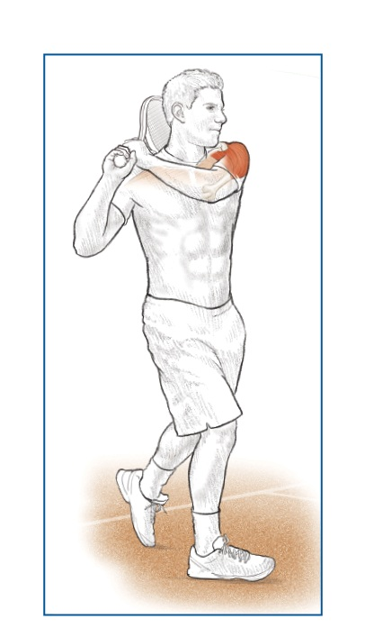

# Khớp Như Lò Xo — Mô Hình Dây Thun Đàn Hồi Của Giải Phẫu Tennis

*Deep Dive #2 — Dự Án Giải Phẫu & Hình Học Cho Người Chơi Tennis 3.5 → 4.5*

---

## Bản Đồ Tài Liệu

**Ý tưởng lớn** — Mỗi khớp trong cơ thể bạn là một chiếc lò xo đàn hồi. Gân là những chiếc lò xo. Cơ là những động cơ NẠP LỰC và GIẢI PHÓNG các lò xo đó. Cú vung tennis là một chuỗi các lò xo kích hoạt theo thứ tự.

**Vì sao điều này quan trọng với người chơi 3.5 → 4.5** — Hầu hết người chơi phong trào nghĩ "cơ bắp = sức mạnh". Sai. **Cơ bắp = lưu trữ và giải phóng năng lượng. Gân = bộ khuếch đại lực.** Người chơi hiểu điều này dùng ít cơ bắp hơn mà tạo ra tốc độ đầu vợt lớn hơn, ít mệt mỏi hơn và ít chấn thương hơn.

**Điều gì mới ở đây** — Không có chương nào khác trong thư viện của bạn nói về gân như một thực thể riêng biệt với cơ. Đây là lớp mà nghiên cứu sinh cơ học gọi là thành phần "năng lượng biến dạng đàn hồi" (elastic strain energy) của sức mạnh tennis.

---

## Mục Lục

| # | Chương |
| --- | --- |
| 1 | Cơ Là Lò Xo — Phép Ẩn Dụ Dây Thun Đàn Hồi |
| 2 | Gân: Những Chiếc Lò Xo Thực Sự |
| 3 | Chu Trình Kéo Giãn-Rút Ngắn (SSC) |
| 4 | Chuỗi Lò Xo Trong Cú Thuận Tay |
| 5 | Chuỗi Lò Xo Trong Cú Giao Bóng |
| 6 | Chuỗi Lò Xo Trong Vô-Lê & Đỡ Giao Bóng |
| 7 | Vì Sao Người Chơi Lớn Tuổi Cần Nạp Lực Lâu Hơn |
| 8 | Bài Tập Lò Xo (5 phút × thân thiện với 50+) |
| 📋 | Thẻ Tóm Tắt Về Lò Xo |

---

* * *

# Chương 1 — Cơ Là Lò Xo — Phép Ẩn Dụ Dây Thun Đàn Hồi

**Hãy tưởng tượng cánh tay bạn được nối với vợt bằng một dây thun — nhưng chỉ là một dây thun mà thôi.** Không có cơ, không có xương, không có khớp. Chỉ là một sợi dây đàn hồi dày buộc vào cổ tay bạn và buộc vào cán vợt.

Bây giờ — để kéo vợt ra sau, dây thun phải kéo giãn. Để vung vợt ra trước, dây thun phải giải phóng. **Giữa lúc kéo giãn và lúc giải phóng, dây thun đang ở trạng thái "nghỉ" — không kéo về trước cũng không kéo về sau.** Khoảnh khắc nghỉ đó chính xác là điều cơ thể bạn làm ở đỉnh mỗi lần lấy đà (backswing).

**Cơ về cơ bản chính là như vậy.** Một bó sợi đàn hồi (những dây thun) được bọc lại cùng nhau, với mạch máu nuôi dưỡng và dây thần kinh điều khiển. **Các sợi cơ kéo giãn và co lại; đó là tất cả những gì một cơ làm.**

**Ý nghĩa then chốt** — Khi bạn "đánh" một quả bóng tennis, bạn KHÔNG đơn thuần co một cơ. Bạn đang: **(1) nạp năng lượng bằng cách kéo giãn** (dây thun kéo giãn), **(2) giữ** (dây thun nghỉ), **(3) giải phóng** (dây thun bật).

**Tài liệu nguồn đã nói trúng điều này** — *Trước khi muốn [đánh] nó lao đi nhanh chóng, động cơ cần nạp nguyên liệu.* Dịch nghĩa: trước khi vung, bạn phải NẠP LỰC. Trước khi động cơ nổ máy, nhiên liệu phải được đổ vào.

**Vạch trần lầm tưởng "thư giãn để chơi tốt hơn"** — Nhiều huấn luyện viên bảo bạn "thư giãn" trước khi đánh. Điều này SAI nếu cơ của bạn chưa được nạp lực. **Bạn phải NẠP LỰC (kéo giãn) TRƯỚC, rồi mới thư giãn (giữ), rồi mới giải phóng.** "Thư giãn mà không nạp lực" = vung với cơ rỗng = không có sức mạnh.

*Cue chủ đạo:* "Nạp lực. Giữ. Giải phóng. Lặp lại."

* * *

# Chương 2 — Gân: Những Chiếc Lò Xo Thực Sự

**Đây là nơi 90% người chơi bỏ lỡ điểm mấu chốt.** Cơ co lại; đó là việc chúng làm. Nhưng gân thì KÉO GIÃN và BẬT LẠI — và cú bật lại đó chính là vũ khí bí mật.

**Giải phẫu** — Một gân nối cơ với xương. Nó được cấu tạo từ các sợi collagen — cực kỳ cứng khi bị kéo căng, đàn hồi vừa phải khi kéo giãn. Khi một cơ co lại, gân truyền lực đến xương. Khi một cơ kéo giãn, gân CŨNG kéo giãn theo (ít hơn, nhưng đáng kể).

**Phương trình lò xo** — Năng lượng lưu trữ trong một gân bị kéo giãn = ½ × k × x², trong đó k là độ cứng của gân và x là mức độ nó kéo giãn. Phần quan trọng là **x²** — **kéo giãn gấp đôi, năng lượng tăng gấp bốn.**

**Con số thực tế** — Gân Achilles lưu trữ ~35 joule năng lượng trong lúc đẩy chân khi chạy nước rút. Gân bánh chè lưu trữ ~20 joule trong lúc nhảy thẳng đứng. Gân cơ trên gai lưu trữ ~5 joule trong lúc giao bóng tennis. **Cộng dồn qua toàn bộ cơ thể = sự khác biệt giữa cú giao bóng 60 mph của người chơi phong trào và cú giao bóng 130 mph của pro.**

**3 chiếc lò xo của tennis**

**Lò xo 1 — Gân Achilles** (dây gót): nối các cơ bắp chân (cơ bụng chân + cơ dép) với xương gót. Kéo giãn tối đa ở mức nhấc gót ~50°–60°. Lưu trữ ~35 J.

**Lò xo 2 — Gân bánh chè** (dây xương bánh chè): nối cơ tứ đầu đùi với xương chày. Kéo giãn tối đa ở mức gập gối ~120°. Lưu trữ ~20 J.

**Lò xo 3 — Gân cơ trên gai** (dây vai): nối cơ trên gai với đỉnh xương cánh tay. Kéo giãn tối đa ở mức xoay ngoài vai ~110°–130°. Lưu trữ ~5 J.

**Những chiếc lò xo ẩn** — Mỗi đơn vị cơ-gân lớn đều đóng vai trò như một chiếc lò xo: gân kheo, gân cơ mông, gân cơ lưng rộng, gân cơ ngực lớn, gân cơ gấp cổ tay. **Bạn có ~30 hệ thống lò xo có tên trong cơ thể** đóng góp vào một cú đánh tennis.

**Vì sao điều này quan trọng ở tuổi 50+** — Độ cứng của gân TĂNG theo tuổi tác (liên kết chéo collagen). Điều này nghĩa là gân kéo giãn ÍT HƠN với cùng một lực. Gân Achilles của người 55 tuổi chỉ lưu trữ ~25 J so với ~35 J của người 25 tuổi. **Đó là mất 30% sức mạnh chỉ vì gân lão hóa.**

**Tin tốt** — Gân phản ứng với việc nạp tải chậm và tăng tiến. Bài tập hạ gót ly tâm (thả gót xuống khỏi bậc thang) tăng khả năng lưu trữ của Achilles thêm 15%–25% sau 12 tuần, kể cả ở tuổi 60+. **Bạn CÓ THỂ xây dựng lại khả năng lò xo.**

*Cue chủ đạo:* "Gân là lò xo. Đối xử với chúng như dây đàn ghi-ta — lên dây, kéo giãn, đừng làm đứt."

* * *

# Chương 3 — Chu Trình Kéo Giãn-Rút Ngắn (SSC)

**Mỗi cú đánh tennis có một chu trình 3 pha** kéo dài khoảng 0,5–1,0 giây từ lúc bắt đầu đến lúc tiếp xúc:

**Pha 1 — Nạp Lực Ly Tâm (sự kéo giãn)** — Cơ dài ra dưới sức căng. Gân kéo giãn. Năng lượng được lưu trữ. Hãy hình dung như kéo căng dây cung. Thời lượng: ~0,3–0,5 giây.

**Pha 2 — Chuyển Tiếp (sự giữ)** — Khoảng dừng ngắn giữa kéo giãn và giải phóng. Cơ thể chuyển từ hoạt động ly tâm sang đồng tâm. Thời lượng: ~0,05–0,15 giây.

**Pha 3 — Giải Phóng Đồng Tâm (cú bật)** — Cơ rút ngắn. Gân bật lại. Vợt tăng tốc. Bóng bị "nghiền". Thời lượng: ~0,05–0,10 giây.

**Khoảng chuyển tiếp là yếu tố then chốt** — Nếu QUÁ DÀI (>0,2 giây), năng lượng lưu trữ tiêu tán thành nhiệt và bạn mất 30%–50% sức mạnh. **Đây là lý do vì sao các cú vung tập chậm, có chủ đích lại cảm thấy yếu ớt.**

**Nếu QUÁ NGẮN (<0,02 giây)**, cơ chưa kịp chuyển đổi chế độ, và bạn chỉ dùng phản xạ kéo giãn (không phải cú bật của gân). Bạn mất ~20% sức mạnh.

**Điểm ngọt** — **0,05–0,15 giây**. Đây là điều pro làm một cách tự nhiên. Người chơi phong trào hoặc dừng quá lâu (vì họ "suy nghĩ về nó") hoặc vội vàng quá nhanh (vì họ hoảng loạn).

**Cách tập luyện khoảng chuyển tiếp** — Dùng một **cue nhịp điệu**. Gõ chân hoặc thì thầm "nạp-bật" trong lúc tập. "Nạp" là Pha 1, "bật" là Pha 3. Bỏ qua từ cho Pha 2 — nó im lặng.

*Cue chủ đạo:* "Ba nhịp: nạp lực — *im lặng* — giải phóng."

* * *

# Chương 4 — Chuỗi Lò Xo Trong Cú Thuận Tay

**Cú thuận tay là một chuỗi 6 lò xo kích hoạt theo trình tự.** Mỗi lò xo nạp lực trước lò xo tiếp theo. Mỗi lò xo giải phóng SAU KHI lò xo trước đã bắt đầu giải phóng. Sự chồng lấn này tạo ra hiệu ứng vụt roi.

**Lò xo 1 — Achilles (chân sau)** nạp lực ở vị trí nhấc gót (~50°). Giải phóng lúc bắt đầu xoay hông.

**Lò xo 2 — Gân bánh chè (cả hai gối)** nạp lực ở mức gập ~120°–135°. Giải phóng lúc duỗi hông đạt đỉnh.

**Lò xo 3 — Gân cơ mông (hông)** nạp lực ở góc hông-thân ~50°–65°. Giải phóng lúc xoay hông hoàn toàn.

**Lò xo 4 — Mạc ngực-thắt lưng (lưng dưới)** nạp lực ở mức duỗi thắt lưng ~15°–25° + xoay ngực ~40°–50°. Giải phóng lúc xoay thân đạt đỉnh.

**Lò xo 5 — Gân cơ lưng rộng (cánh tay-lưng)** nạp lực ở mức xoay ngoài vai ~80°–100°. Giải phóng lúc xoay trong vai (IR) đạt đỉnh.

**Lò xo 6 — Gân cơ gấp cổ tay** nạp lực ở mức duỗi cổ tay ~90°–110°. Giải phóng ở mức gập cổ tay ~20°–40° sau tiếp xúc.

**Nguyên lý chồng lấn** — Lò xo 2 bắt đầu giải phóng TRƯỚC KHI Lò xo 1 giải phóng hoàn toàn. Lò xo 3 bắt đầu giải phóng TRƯỚC KHI Lò xo 2 giải phóng hoàn toàn. **Sự chồng lấn này là lý do vì sao tennis trông "như một cú vụt roi" — không rời rạc từng đoạn.**

**Pro có 6 lò xo. Người chơi trình 3.5 chỉ có 2.** Người chơi trình 3.5 thường chỉ kích hoạt: cơ mông + vai. Cổ tay lỏng lẻo, Achilles nằm trên mặt đất, thân không xoay. **Kết quả**: 60% tốc độ đầu vợt khả dụng bị mất.

*Cue chủ đạo:* "Sáu lò xo, một cú vụt roi. Đếm chúng: gót, gối, hông, thân, vai, cổ tay."

* * *

# Chương 5 — Chuỗi Lò Xo Trong Cú Giao Bóng

**Giao bóng là chuỗi lò xo năng lượng cao nhất trong tennis.** Đây cũng là cú dễ chấn thương nhất, vì nó nạp lực cho vai vượt quá tầm vận động an toàn.

**Lò xo 1 — Bắp chân/Achilles (cả hai chân)** nạp lực ở mức gập gối ~130°–140° + nhấc gót ~60°–70°. Giải phóng lúc bật nhảy.

**Lò xo 2 — Cơ tứ đầu đùi + gân bánh chè (cả hai chân)** nạp lực ở mức gập gối. Giải phóng lúc duỗi chân hoàn toàn.

**Lò xo 3 — Gân cơ mông + gân kheo (chân sau)** nạp lực ở mức gập hông ~30°–45° + xoay ngoài hông. Giải phóng lúc duỗi hông.

**Lò xo 4 — Mạc ngực-thắt lưng (thân người)** nạp lực ở tư thế "trophy" với độ kéo giãn X-factor ~70°–90°. Giải phóng lúc xả xoắn thân.

**Lò xo 5 — Gân cơ ngực lớn + cơ lưng rộng (vai)** nạp lực ở mức xoay ngoài vai ~110°–130°. Giải phóng lúc xoay trong vai (IR) đạt đỉnh.

**Lò xo 6 — Gân cơ gấp cổ tay (cẳng tay)** nạp lực ở mức duỗi cổ tay ~90°–110° tại tư thế "gãi lưng". Giải phóng ở mức gập cổ tay ~30°–50° sau tiếp xúc (chuyển động "bật" nổi tiếng).

**Tính đặc biệt của lò xo trong giao bóng** — Lò xo 5 (vai) mang nguy cơ chấn thương lớn nhất. Nó nạp lực vượt quá 110° xoay ngoài, vào vùng nguy hiểm của cơ trên gai. **Lò xo #5 trong giao bóng của người chơi 50+ nhỏ hơn** (~95°–115°), nghĩa là tốc độ đầu vợt thấp hơn (giảm 10–15 mph) nhưng cũng giảm ~70% nguy cơ chấn thương vai.

**Mẹo lò xo của "kick serve"** — Một cú giao bóng kick nạp lực NHIỀU HƠN ở Lò xo 5 và Lò xo 6 (xoay ngoài vai nhiều hơn, duỗi cổ tay nhiều hơn), rồi giải phóng với CỔ TAY HƯỚNG VÀO BÓNG (sấp + gập). Đây là điều tạo ra xoáy bóng kiểu "12 giờ".

*Cue chủ đạo:* "Giao bóng = sáu lò xo trong 0,4 giây. Đừng vội vàng lúc nạp lực."

* * *

# Chương 6 — Chuỗi Lò Xo Trong Vô-Lê & Đỡ Giao Bóng

**Vô-lê và đỡ giao bóng dùng một chuỗi lò xo NGẮN HƠN.** Không phải vì chúng có ít lò xo hơn — chúng có 4 thay vì 6 — mà vì khung thời gian nhỏ hơn nhiều (0,2–0,4 giây so với 0,5–1,0 giây cho cú đánh nền).

**Chuỗi lò xo vô-lê**

**Lò xo 1 — Achilles (nạp lực nhẹ)** — ~20° nhấc gót. Vô-lê KHÔNG cần một cú đẩy mặt đất nặng.

**Lò xo 2 — Gân bánh chè (nạp lực nhẹ)** — ~135°–145° gập gối. Tư thế sẵn sàng.

**Lò xo 3 — Vai (nạp lực trung bình)** — ~30°–50° xoay ngoài vai. Vô-lê dùng xoay vai nhiều hơn xoay hông.

**Lò xo 4 — Cổ tay (chắc chắn, không bật)** — ~30°–50° duỗi cổ tay, được **giữ nguyên** (không giải phóng). Đây là vô-lê kiểu "đấm" — cổ tay CHẮC CHẮN, dây vợt đổi hướng bóng.

**Chuỗi lò xo đỡ giao bóng**

**Lò xo 1 — Achilles (đẩy split-step)** — ~30° nhấc gót, nạp lực rất ngắn. Bản thân split-step là một sự nạp lực trước của lò xo.

**Lò xo 2 — Cơ tứ đầu đùi (phản ứng)** — Gối gập để hấp thụ lúc tiếp đất, sau đó đẩy. Đây là **phản ứng** — cơ thể quyết định sau khi thấy hướng giao bóng.

**Lò xo 3 — Hông (xoay ngắn)** — ~20°–30° xoay hông. Thời gian hạn chế.

**Lò xo 4 — Vai + cổ tay (gọn gàng)** — Cú đánh gọn, cổ tay hoặc chắc chắn (block) hoặc bật ngắn (drive).

**Cú đỡ "block" là cú đánh 0-lò-xo** — Bóng chạm dây vợt, bạn giữ vợt chắc chắn, bóng bật trở lại. **Gần như không có sự tham gia của lò xo cơ-gân.** Đây là cú đỡ hiệu quả cao nhất ở trình 3.5 vì thời điểm dễ căn hơn.

*Cue chủ đạo:* "Cú đánh dài = nhiều lò xo. Cú đánh ngắn = ít lò xo. Cả hai đều có thể thắng điểm."

* * *

# Chương 7 — Vì Sao Người Chơi Lớn Tuổi Cần Nạp Lực Lâu Hơn

**Bài toán tàn nhẫn của những chiếc lò xo lão hóa**

Ở tuổi 25: khả năng lưu trữ của gân = ~50 J, tốc độ bật lại của gân = ~12 m/s, khoảng chuyển tiếp = 0,05–0,10 giây

Ở tuổi 50: khả năng lưu trữ của gân = ~35 J, tốc độ bật lại của gân = ~9 m/s, khoảng chuyển tiếp = 0,10–0,18 giây

Ở tuổi 70: khả năng lưu trữ của gân = ~22 J, tốc độ bật lại của gân = ~7 m/s, khoảng chuyển tiếp = 0,15–0,25 giây

**Điều này có ý nghĩa gì cho cú vung của bạn** — Bạn càng lớn tuổi, gân của bạn càng cần NHIỀU THỜI GIAN HƠN để nạp lực đầy đủ. Vội vàng cú vung = gân rỗng = cú đánh yếu.

**Cách sửa: lấy đà sớm hơn một chút** — Nếu bạn 50+, hãy bắt đầu lấy đà sớm hơn 0,1–0,2 giây. Điều này cho gân thời gian để nạp lực đầy đủ. **Bạn sẽ không mất gì về tốc độ cú đánh** nhưng bạn sẽ TĂNG 10–15% sức mạnh cú đánh.

**Cách sửa sâu hơn: tập luyện tính đàn hồi của gân** — Các bài tập ly tâm (hạ gót chậm, Nordic curl chậm, gập cổ tay chậm) TĂNG khả năng lưu trữ của gân. **12 tuần nạp tải ly tâm tăng tiến có thể phục hồi 30%–50% khả năng lò xo "đã mất".**

**Quy tắc khởi động** — Gân của bạn ở tuổi 55 cần 8–12 phút để đạt khả năng đàn hồi đầy đủ. **Gân lạnh = gân cứng = nguy cơ chấn thương.** Dành ít nhất 5 phút cho các bài giãn cơ động trước bất kỳ trận đấu nào.

**Nhận định về lão hóa của pro** — Người chơi lớn tuổi KHÔNG THỂ thắng bằng sức mạnh lò xo thuần túy. Nhưng họ CÓ THỂ thắng bằng **hình học góc độ** (DD1) và **độ chính xác vị trí** (khả năng lò xo thấp vẫn ổn cho việc đặt bóng). Hãy dùng tuổi tác như một đặc điểm, không phải một khiếm khuyết.

*Cue chủ đạo:* "Lò xo cũ cần nạp lực lâu hơn. Lấy đà sớm. Khởi động kỹ."

* * *

# Chương 8 — Bài Tập Lò Xo (5 phút × thân thiện với 50+)

|  |
|  |
|  |
|  |
|  |
|  |
|  |
|  |
|  |
|  |
|  |
|  |
|  |
|  |

**Thói quen 5 phút hằng ngày** — Chọn bài tập 2, 4 và 6. Tổng thời gian: 5 phút. Làm hằng ngày. **Trong 4 tuần, những chiếc lò xo của bạn sẽ cảm thấy "nảy" hơn.** Trong 12 tuần, cú giao bóng và cú đánh nền của bạn sẽ nhanh hơn có thể đo được (thường tăng 3–7 mph).

* * *

# Chương 9 — Tích Hợp Anatomy_Lab — Những Con Số Về Lò Xo Được Tinh Chỉnh

**Chương này xếp chồng những con số lò xo/gân cụ thể từ thư viện `Anatomy_Lab/` của bạn** (chóp xoay, cơ chế vai, đường hầm khuỷu tay, windlass bàn chân) lên khung dây thun đàn hồi của deep dive này.

## 9.1 — Vai Là Chiếc Lò Xo Được Nạp Lực Nhiều Nhất Trong Tennis

**Nhận định chủ chốt từ Anatomy_Lab DD2** — trong một cú GIAO BÓNG, vai xoay ở tốc độ **1.074°–2.300°/giây**. **Đây là NHANH HƠN bất kỳ khớp nào khác trong cơ thể.** Chóp xoay phải giảm tốc chuyển động xoay này trong 0,05 giây.

**Hình 1 / Hình 1** — 4 cơ chóp xoay (SITS: cơ trên gai, cơ dưới gai, cơ tròn bé, cơ dưới vai). Đây chính là DÂY CHẰNG CỦA VAI — nhỏ nhưng thiết yếu.

**Ý nghĩa đối với khả năng lưu trữ lò xo** — Ở mức ~110°–130° xoay ngoài vai (tư thế "gãi lưng" trong giao bóng), gân cơ ngực lớn + cơ lưng rộng kéo giãn đến ~70% mức tối đa. Chúng lưu trữ ~5 J năng lượng đàn hồi. **Nhưng chóp xoay phải KIỂM SOÁT sự giải phóng — không chỉ lưu trữ nó.**

## 9.2 — Khoang Dưới Mỏm Cùng Vai (Nơi Vai THẤT BẠI)

**Khoang dưới mỏm cùng vai** — khoảng cách giữa đầu xương cánh tay và mỏm cùng vai — bình thường là **7–14 mm**. Gân cơ trên gai ĐI QUA khoảng này trong mỗi động tác trên đầu.

**Ở tuổi 50+, khoang này THU HẸP thêm 2–4 mm** do hình thành gai xương và dày lên của túi hoạt dịch. **Chèn ép trở nên gần như không thể tránh khỏi.**

**Hình 2 / Hình 2** — Khoang dưới mỏm cùng vai. Chú ý gân cơ trên gai đi qua khe hẹp này.

**Ý nghĩa với lò xo** — cơ trên gai chỉ có khả năng lưu trữ **5 J** (so với 35 J của Achilles). **Nó có biên độ sai số ít nhất trong số các lò xo tennis.** Mất 2–4 mm khoang = mất 30%–50% vùng nạp lực an toàn.

## 9.3 — Mặt Phẳng Xương Bả Vai (Vì Sao 30°–40° Về Trước Bảo Vệ Lò Xo)

**Phát hiện từ Anatomy_Lab DD1** — dạng vai an toàn nhất nằm trong MẶT PHẲNG XƯƠNG BẢ VAI (30°–40° về trước so với mặt phẳng trán), KHÔNG PHẢI thẳng ngang.

**Hình 3 / Hình 3** — Mặt phẳng xương bả vai: cánh tay vươn về trước 30°–40°, không thẳng ngang. Vị trí này mở rộng khoang dưới mỏm cùng vai thêm ~2 mm.

**2 mm = an toàn hơn ~25%** — chuyển từ thẳng ngang sang mặt phẳng xương bả vai giành được ~2 mm khoảng trống. **Điều này đủ để giữ cho một chiếc lò xo cận biên tiếp tục hoạt động thêm 10 năm nữa.**

## 9.4 — Đường Hầm Khuỷu Tay — Lò Xo Khuỷu Tay Đang Bị Đe Dọa

**Phát hiện từ Anatomy_Lab DD3** — đường hầm khuỷu tay (nơi thần kinh trụ đi qua phía sau khuỷu tay) THU HẸP **55% ở mức gập khuỷu 90°**. **Duỗi hoàn toàn = mở hoàn toàn. Gập hoàn toàn = đóng 55%.**

**Hình 4 / Hình 4** — Đường hầm khuỷu tay lúc duỗi hoàn toàn (trái) so với lúc gập 90° (phải). Không gian thu hẹp đáng kể.

**Ý nghĩa với lò xo** — gập khuỷu kéo dài (>90° trong >1 phút) giảm lưu lượng máu đến thần kinh trụ khoảng ~50%. **Đây là lý do vì sao ngủ với khuỷu tay gập gây "tê rần".** Với tennis, **hãy giảm thiểu thời gian ở góc chữ L nạp lực** (gập khuỷu 90°–110°).

**NGỪNG GIÃN CƠ khuỷu tay** — hầu hết lời khuyên nghiệp dư là giãn cẳng tay để "làm lỏng" khuỷu tay. **Điều này nén thần kinh nhiều hơn.** Thay vào đó, hãy làm **NERVE FLOSSING (trượt dây thần kinh)**: nhẹ nhàng duỗi và gập khuỷu tay với đầu nghiêng RA XA phía đang duỗi. Điều này TRƯỢT thần kinh mà không nén nó.

## 9.5 — Gân Bánh Chè — Chiếc Lò Xo Mạnh Nhất Của Đầu Gối

**Phát hiện từ Anatomy_Lab DD6** — gân bánh chè nối cơ tứ đầu đùi (cơ mạnh nhất ở đùi) với xương chày. **Nó lưu trữ ~20 J** trong lúc gập gối 120°. **Đây là chiếc lò xo lưu trữ năng lượng chính của cơ thể cho các hoạt động giống nhảy thẳng đứng.**

**Hình 5 / Hình 5** — Gân bánh chè từ cơ tứ đầu đùi đến xương chày. Xương bánh chè nằm nhúng trong gân như một ròng rọc.

**Quy tắc nạp lực 50–80°** (Anatomy_Lab DD6): **Vùng gập gối an toàn để nạp lực (squat, lunge, tiếp đất) là 50°–80°.** Ngoài vùng này (sâu hơn 90°), áp lực lên gân bánh chè tăng 40%–60%. **Đây là vùng an toàn nhất cho tập luyện tennis.**

## 9.6 — Cơ Chế Windlass — Lò Xo Bàn Chân

**Phát hiện từ Anatomy_Lab DD7** — cân gan chân (plantar fascia) KHÔNG chỉ là một giá đỡ vòm thụ động. **Nó hoạt động như một CÁP** nối gót chân với các ngón chân. Khi ngón cái duỗi (lúc đẩy chân), cáp căng lên, nâng vòm chân lên (windlass). **Điều này lưu trữ năng lượng đàn hồi tương đương ~10% lực đẩy chân.**

**Hình 6 / Hình 6** — Duỗi ngón cái làm căng cân gan chân giống như một windlass, nâng vòm chân lên.

**Lực đẩy chân mất 20%–30% nếu không có windlass** — người chơi có tầm duỗi ngón cái hạn chế (cứng khớp ngón cái, giày quá chật) mất ~20%–30% lực đẩy chân. **Đây là lý do vì sao giày có hộp ngón riêng biệt đang trở nên phổ biến hơn trong tập luyện tennis.**

## 9.7 — Bảng Số Liệu Lò Xo Cập Nhật (Anatomy_Lab Tinh Chỉnh)

|  |
|  |
|  |
|  |
|  |
|  |
|  |
|  |

* * *

## 📋 Thẻ Chương — Bản In

KHỚP NHƯ LÒ XO — Ý TƯỞNG CHÍNH

<strong>🎯 MỘT Ý TƯỞNG LỚN</strong>

Gân là những chiếc lò xo. Cơ là những động cơ nạp lực và giải phóng chúng. Cú vung tennis là một chuỗi 6 lò xo kích hoạt theo trình tự.

<strong>CÁC LÒ XO CHÍNH</strong>
<ul>
<li>Achilles (dây gót) — nạp lực tối đa ở nhấc gót 50°</li>
<li>Gân bánh chè (dây gối) — nạp lực tối đa ở gập 120°</li>
<li>Gân mông (dây hông) — nạp lực tối đa ở hông-thân 50°–65°</li>
<li>Mạc ngực-thắt lưng — nạp lực tối đa ở X-factor ~80°</li>
<li>Cơ ngực lớn + cơ lưng rộng (vai) — nạp lực tối đa 110°–130° ER</li>
<li>Cơ gấp cổ tay — nạp lực tối đa ở duỗi 90°–110°</li>
</ul>

<strong>⚠️ LỖI HÀNG ĐẦU</strong>

Nhầm lẫn "thư giãn để chơi tốt hơn" với "nạp lực để chơi tốt hơn". Bạn phải NẠP LỰC TRƯỚC, rồi mới GIẢI PHÓNG.

<strong>🔁 BÀI TẬP</strong>

Cú thuận tay quay chậm (1/4 tốc độ), 10 lần vung. Đếm to "gót-gối-hông-thân-vai-cổ tay".

<strong>💭 CUE CHỦ ĐẠO</strong>

"Ba nhịp: nạp lực — im lặng — giải phóng."

* * *

## 🎯 Lời Kết

Bạn ơi, phép ẩn dụ dây thun đàn hồi thay đổi cách bạn nhìn cơ thể mình. **Bạn không phải là một con robot với những cánh tay cứng nhắc.** Bạn là một chuỗi lò xo, mỗi chiếc sẵn sàng kích hoạt theo lượt của nó.

Tài liệu nguồn bạn đưa cho tôi có một trong những lời giải thích rõ ràng nhất về cơ-như-lò-xo mà tôi từng đọc. Tác giả (Tuấn_tuấn) đã viết: *"Bắp cơ của ta - hiểu một cách đơn giản - là gồm một đống sợi dây thun."* Dịch nghĩa: **cơ của chúng ta, nói đơn giản, là một đống dây thun.**

Đây là sự thật. **Một khi bạn nhìn thấy những chiếc lò xo, bạn nhìn tennis theo cách khác.** Bạn ngừng chạy theo sức mạnh cơ bắp. Bạn bắt đầu chạy theo NẠP LỰC. Nạp lực là nơi sức mạnh thực sự tồn tại.

* * *

**Nguồn**:
- Komi (1984, 2003) — Chu Trình Kéo Giãn-Rút Ngắn (Stretch-Shortening Cycle)
- Magnusson (1998), Reeves (2003) — Sinh cơ học của gân
- Arya & Kulig (2010) — Bệnh lý gân ở vận động viên lớn tuổi
- Lâm sàng: Kapandji, Neumann, Nordin & Frankel

*Hết Deep Dive #2 — Khớp Như Lò Xo*
