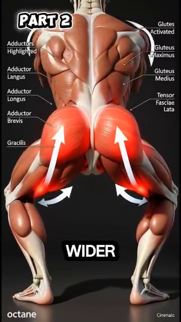
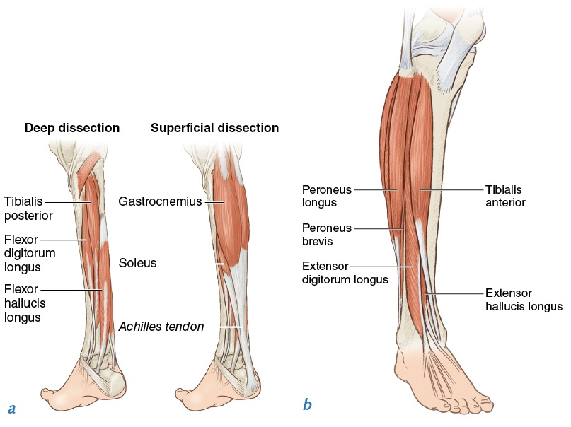

# Thứ Bậc Cơ Bắp — Cơ Nào Kích Hoạt Khi Nào, Theo Từng Đoạn Cơ Thể

*Deep Dive #4 — Dự Án Giải Phẫu & Hình Học Cho Người Chơi Tennis 3.5 → 4.5*

---

## Bản Đồ Tài Liệu

**Deep dive này bao quát điều gì** — Một chuyến tham quan theo từng đoạn cơ thể, qua mọi cơ quan trọng trong tennis. Với mỗi cơ, bạn sẽ có: tên, vị trí, thời điểm nó kích hoạt trong mỗi cú đánh, lý do nó kích hoạt, chuyện gì xảy ra nếu nó không kích hoạt, và một lưu ý nhận thức dành cho người 50+.

**Đây KHÔNG PHẢI là** — Không phải một cẩm nang cơ chế cú đánh. Không phải một sách giáo khoa giải phẫu. Không phải một hướng dẫn tập luyện. **Đây là lớp nằm giữa GÓC ĐỘ (DD1) và LÒ XO (DD2) — những cơ thực sự di chuyển các góc và nạp lực cho những chiếc lò xo.**

**Vì sao điều này quan trọng ở trình 3.5 → 4.5** — Hầu hết người chơi biết "dùng chân của bạn". Ít ai biết rằng cơ mông lớn kích hoạt trước cơ tứ đầu đùi 0,1 giây trong một cú thuận tay. **Biết cơ nào kích hoạt theo thứ tự nào chính là khác biệt giữa "cố gắng hết sức" và "bắn với độ chính xác".**

---

## Mục Lục

| # | Chương |
| --- | --- |
| 1 | Nhận Định Lớn Của Nguồn — Sức Mạnh Cơ ≠ Thứ Tự Cơ |
| 2 | Đoạn Thân Dưới — Hông, Gối, Cổ Chân |
| 3 | Đoạn Thân Người — Các Cơ Core |
| 4 | Đoạn Vai — Chóp Xoay & Cơ Delta |
| 5 | Đoạn Cánh Tay — Cơ Nhị Đầu, Tam Đầu, Cẳng Tay |
| 6 | Đoạn Cổ Tay & Bàn Tay |
| 7 | Trình Tự Cơ Theo Từng Cú Đánh |
| 8 | Vì Sao Cơ Thất Bại Theo Những Cách Khác Nhau Ở Tuổi 50+ |
| 📋 | Thẻ Tóm Tắt Bản Đồ Cơ |

---

* * *

# Chương 1 — Nhận Định Lớn Của Nguồn — Sức Mạnh Cơ ≠ Thứ Tự Cơ

**Tài liệu nguồn có một nhận định mạnh mẽ** mà gần như không huấn luyện viên tennis nào dạy: **sức mạnh cơ không phải là yếu tố quan trọng nhất — THỨ TỰ KÍCH HOẠT cơ mới là.**

Nguồn nói (diễn giải): *"Cấu trúc cơ thể phân bố các cơ mạnh yếu không đều nhau, và các nhóm cơ này cũng không phải tham gia bằng nhau trong lúc đánh bóng. Mỗi khi động tác của chúng ta đi đến một vùng giới hạn nào đó của cơ thể, thì nhóm lực mạnh ban đầu lại trở nên yếu đi, và sẽ có một nhóm cơ tiếp quản nguồn lực mạnh này (nếu ta biết cách sử dụng)."*

**Dịch nghĩa** — Cơ thể có một thứ bậc cơ. Các cơ mạnh khởi động chuyển động. Khi chúng đạt đến giới hạn tầm vận động, các cơ yếu hơn nhưng nhanh hơn sẽ tiếp quản. **Cú vung tennis là một cuộc chạy tiếp sức** — từ mạnh-đến-nhanh, theo từng đoạn.

**Trình tự tiếp sức trong tennis**

**Chặng 1 — Mạnh, chậm** (cơ mông lớn, cơ tứ đầu đùi, cơ lưng rộng, cơ ngực lớn). Cơ lớn, kích hoạt chậm (trễ ~0,10–0,15 giây), nhưng tạo ra lực lớn nhất.

**Chặng 2 — Trung bình, trung bình** (cơ delta, cơ bụng, gân kheo). Kích thước trung bình, tốc độ trung bình (trễ ~0,05–0,10 giây).

**Chặng 3 — Nhỏ, nhanh** (chóp xoay, cơ gấp/duỗi cổ tay, các cơ nội tại của bàn tay). Nhỏ, nhanh (trễ ~0,02–0,05 giây), tạo ra sự tinh chỉnh.

**Lỗi "cơ mạnh ở sai vị trí"** — Nhiều người chơi phong trào cố dùng các cơ MẠNH của họ (cơ delta, cơ nhị đầu) để ĐÁNH bóng. Nhưng cơ delta chỉ có ~70° tầm xoay hữu ích. **Quá 70°, cơ delta yếu về mặt cơ học.** Đó là lúc các cơ NHỎ NHANH tiếp quản — chóp xoay.

**Ý nghĩa với việc tập luyện** — Đừng chỉ tập luyện các cơ MẠNH. Hãy tập luyện CUỘC TIẾP SỨC — việc căn thời gian trình tự. **Tập tạ nặng chậm** (squat, đẩy ngực) tập luyện các cơ mạnh. **Bài tập phối hợp nhanh** (ném bóng y tế, búng vợt) tập luyện việc căn thời gian tiếp sức.

*Cue chủ đạo:* "Từ mạnh đến nhanh, theo từng đoạn. Đừng để một cơ làm hết toàn bộ cuộc tiếp sức."

* * *

# Chương 2 — Đoạn Thân Dưới — Hông, Gối, Cổ Chân

**Các cơ hông** (động cơ của mọi cú đánh)

**Cơ mông lớn** — Cơ lớn nhất, mạnh nhất trong cơ thể. Cơ DUỖI HÔNG chính (đưa đùi ra sau). Kích hoạt trong lúc nạp lực thuận tay (kéo giãn) và tiếp xúc (co bùng nổ). **Kích hoạt: ~30%–50% mức tối đa khi đánh thuận tay, ~50%–70% khi giao bóng.**

**Cơ mông nhỡ** — Bên hông. Cơ DẠNG HÔNG (đưa đùi ra ngoài). Then chốt cho ổn định bên trong lúc split-step và bước ngang. **Kích hoạt: ~40%–60% trong split-step, ~30%–40% khi đánh thuận tay.**

**Cơ thắt lưng-chậu (psoas major + iliacus)** — Các cơ GẤP HÔNG (đưa đùi ra trước). Kích hoạt trong lúc hồi phục (sau tiếp xúc) để đưa chân trở lại. Cũng kích hoạt trong pha NẠP LỰC của cú trái tay (kéo giãn hông vào tư thế duỗi). **Kích hoạt: ~20%–30% khi đánh thuận tay, ~50%–70% khi hồi phục chạy nước rút.**

**6 cơ xoay sâu của hông** (cơ hình lê, cơ sinh đôi trên, cơ sinh đôi dưới, cơ bịt trong, cơ bịt ngoài, cơ vuông đùi). Xoay đùi RA NGOÀI. **Then chốt cho xoay hông trong lúc nạp lực thuận tay (~60°).** Cơ nhỏ, nhưng thiết yếu.

**Các cơ gối** (hệ thống truyền lực)

**Cơ tứ đầu đùi** (4 cơ: cơ thẳng đùi, cơ rộng ngoài, cơ rộng trong, cơ rộng giữa). Các cơ DUỖI GỐI. Kích hoạt trong nửa sau của duỗi gối (pha đẩy). **Kích hoạt: ~30%–50% khi nhảy giao bóng, ~50%–80% khi tiếp đất split-step.**

**Gân kheo** (3 cơ: cơ nhị đầu đùi, cơ bán gân, cơ bán màng). Các cơ GẬP GỐI và DUỖI HÔNG. Kích hoạt trong gập gối lúc split-step VÀ trong duỗi hông lúc đánh cú nền. **Kích hoạt: ~40%–60% trong split-step, ~30%–50% khi đánh thuận tay.**

**Các cơ cổ chân + bàn chân**

**Cơ bụng chân + cơ dép** — Các cơ bắp chân. Các cơ GẤP LÒNG BÀN CHÂN (chĩa ngón chân xuống). Kích hoạt trong lúc nhấc gót (nạp lực) và trong lúc đẩy chân (giải phóng). **Kích hoạt: ~50%–80% khi bật nhảy giao bóng, ~40%–60% trong split-step.**

**Cơ chày trước** — Phía trước ống chân. Cơ GẤP MU CHÂN (kéo ngón chân lên). Kích hoạt khi bàn chân cần tiếp đất nhẹ nhàng. **Kích hoạt: ~30%–50% khi tiếp đất từ split-step hoặc bật nhảy.**

**Các cơ nội tại của bàn chân** — Hơn 20 cơ nhỏ ngay trong bàn chân. Chúng tạo VÒM CHÂN, phân bố trọng lượng, và cung cấp sự thăng bằng tinh tế. **Kích hoạt: ~10%–30% liên tục, cao hơn nhiều trong các cú đánh thử thách thăng bằng.**

* * *

# Chương 3 — Đoạn Thân Người — Các Cơ Core

**"Core" không phải một cơ đơn lẻ**. Đó là ít nhất 12 cơ hoạt động cùng nhau. Nhiệm vụ của core trong tennis là TRUYỀN lực từ chân sang tay. **Nếu core thất bại, chuỗi động học đứt gãy.**

**4 cơ bụng**

**Cơ thẳng bụng** — "Múi bụng sáu múi." Cơ GẬP THÂN (gập thân về trước). Kích hoạt trong nửa sau của cú thuận tay (follow-through). **Kích hoạt: ~20%–40% khi đánh thuận tay, ~40%–60% khi giao bóng.**

**Cơ chéo bụng ngoài** — Bên hông bụng. Cơ XOAY THÂN (vặn thân) và gập bên. **Là cơ xoay thân CHÍNH trong tennis. Kích hoạt: ~40%–60% khi đánh thuận tay, ~50%–70% khi giao bóng.**

**Cơ chéo bụng trong** — Sâu hơn cơ chéo ngoài, chạy theo hướng chéo NGƯỢC LẠI. Phối hợp VỚI cơ chéo ngoài để xoay thân. **Kích hoạt: ~40%–60% khi đánh thuận tay.**

**Cơ ngang bụng** — Cơ bụng sâu nhất. Hoạt động như một CHIẾC ĐAI quanh thân. **Ổn định cột sống trong mọi chuyển động xoay.** Kích hoạt trước bất kỳ chuyển động chi nào — đây là cơ "kích hoạt trước". **Kích hoạt: ~10%–30% liên tục, ~30%–50% khi giao bóng.**

**Các cơ lưng**

**Cơ dựng sống** (3 cột: cơ chậu sườn, cơ dài nhất, cơ gai). Chạy dọc cột sống. Cơ DUỖI THÂN (giữ thân thẳng đứng) và XOAY (ở cột sống ngực). Kích hoạt trong pha NẠP LỰC thuận tay để giữ thân thẳng, và trong lúc giải phóng để tạo lực cho thân đi về trước. **Kích hoạt: ~30%–50% khi đánh thuận tay, ~50%–70% khi giao bóng.**

**Cơ đa liệt** — Cơ lưng sâu. Các cơ ổn định TỪNG ĐOẠN cột sống. Mỗi bó cơ đa liệt kiểm soát 1–2 đốt sống. Then chốt để ngăn chấn thương lưng trong lúc xoay. **Kích hoạt: mức thấp liên tục, ~20%–40% trong lúc xoay.**

**Cơ vuông thắt lưng** — Bên lưng dưới. Cơ GẬP BÊN (nghiêng thân sang bên). Kích hoạt khi đánh thuận tay kèm nghiêng bên để thêm topspin. **Kích hoạt: ~30%–50% khi đánh thuận tay, ~40%–60% khi giao bóng.**

**Kết nối hông-thân**

**Cơ lưng rộng** — "Cơ lat." Chạy từ lưng dưới đến cánh tay trên. Nối thân người với cánh tay. **Vừa là cơ thân VỪA là cơ cánh tay**. Kích hoạt khi đánh trái tay để kéo cánh tay ngang qua thân. **Kích hoạt: ~40%–60% khi đánh trái tay, ~50%–70% khi giao bóng.**

* * *

# Chương 4 — Đoạn Vai — Chóp Xoay & Cơ Delta

**Vai là khớp phức tạp nhất** trong cơ thể, với 9 cơ bắc qua nó. Mỗi cơ có một vai trò cụ thể.

**4 cơ chóp xoay** (DÂY CHẰNG CỦA VAI)

**Cơ trên gai** — Đỉnh của vai. Khởi động DẠNG cánh tay (15°–30° đầu tiên của việc nâng lên). Cũng ỔN ĐỊNH đầu xương cánh tay trong ổ khớp. **Cơ tennis bị chấn thương phổ biến nhất.** Kích hoạt: ~30%–50% khi đánh thuận tay, ~50%–70% khi giao bóng.

**Cơ dưới gai** — Phía sau vai. Cơ XOAY NGOÀI (xoay cánh tay ra ngoài). Kích hoạt trong pha NẠP LỰC thuận tay (chuẩn bị cho xoay ngoài) và trong tư thế "gãi lưng" khi giao bóng. **Kích hoạt: ~40%–60% khi nạp lực thuận tay, ~60%–80% khi nạp lực giao bóng.**

**Cơ tròn bé** — Phía sau dưới của vai. Hỗ trợ cơ dưới gai trong xoay ngoài. Nhỏ hơn, lực ít hơn. **Kích hoạt: ~20%–40% trong xoay ngoài.**

**Cơ dưới vai** — Phía trước vai (bạn không thể thấy nó từ bên ngoài). Cơ XOAY TRONG (xoay cánh tay vào trong). Kích hoạt trong lúc TIẾP XÚC thuận tay để vụt roi vợt qua. **Kích hoạt: ~50%–70% khi tiếp xúc thuận tay, ~60%–80% khi tiếp xúc giao bóng.**

**3 phần của cơ delta**

**Cơ delta trước** — Phía trước vai. GẬP CÁNH TAY VỀ TRƯỚC (nâng tay ra trước). Cơ chính cho vô-lê. **Kích hoạt: ~50%–70% khi vô-lê, ~30%–50% khi đánh thuận tay.**

**Cơ delta giữa** — Bên hông vai. DẠNG CÁNH TAY (nâng tay sang bên). Cơ chính cho chiều cao vai. **Kích hoạt: ~40%–60% khi đánh thuận tay, ~50%–70% khi giao bóng.**

**Cơ delta sau** — Phía sau vai. DUỖI CÁNH TAY (kéo tay ra sau). Kích hoạt khi giao bóng ở tư thế "gãi lưng" để đặt vợt sau đầu. **Kích hoạt: ~30%–50% khi nạp lực giao bóng.**

**Các cơ lớn xung quanh vai**

**Cơ ngực lớn** — Vùng ngực. KHÉP NGANG CÁNH TAY (kéo tay ngang qua thân). Là cơ CHÍNH của cú trái tay và cú vụt roi giao bóng. **Kích hoạt: ~60%–80% khi đánh trái tay, ~70%–90% khi giao bóng.**

**Cơ lưng rộng** (cũng được tính vào thân). "Cơ lat." DUỖI + KHÉP + XOAY TRONG cánh tay. Phối hợp với cơ ngực lớn để vụt roi cánh tay. **Kích hoạt: ~50%–70% khi đánh trái tay, ~60%–80% khi giao bóng.**

**Cảnh báo về vai ở tuổi 50+** — Gân cơ trên gai có nguồn cung cấp máu KÉM. **Sau tuổi 50, nó thoái hóa ~1% mỗi năm kể cả khi không chấn thương.** Kết hợp với động tác giao bóng lặp lại, đây là lý do vì sao chấn thương vai liên quan đến giao bóng tăng vọt sau tuổi 50. **Cách sửa**: khởi động chóp xoay một cách chuyên biệt (bài tập dây kháng lực, tối thiểu 5 phút).

* * *

# Chương 5 — Đoạn Cánh Tay — Cơ Nhị Đầu, Tam Đầu, Cẳng Tay

**Cơ nhị đầu cánh tay** — Phía trước cánh tay trên. Cơ GẬP KHUỶU (gập khuỷu tay) + cơ NGỬA CẲNG TAY (xoắn lòng bàn tay lên). Kích hoạt trong lúc lấy đà để gập khuỷu tay. **Kích hoạt: ~20%–30% khi nạp lực thuận tay, ~10%–20% khi tiếp xúc.**

**Lưu ý quan trọng của nguồn** — Cơ nhị đầu KHÔNG PHẢI là cơ sinh lực chính trong tennis. Nó gập khuỷu tay, nhưng khuỷu tay chủ yếu đang duỗi thẳng ra (cơ tam đầu) trong lúc vung. **Dùng cơ nhị đầu trong lúc lấy đà; giải phóng nó trước khi tiếp xúc.**

**Cơ cánh tay quay** — Sâu hơn cơ nhị đầu. Cơ gập khuỷu "thuần túy". Được dùng khi lòng bàn tay ở vị trí trung tính. Mức kích hoạt tương tự cơ nhị đầu nhưng hơi cao hơn trong các cú vung với grip trung tính.

**Cơ tam đầu cánh tay** — Phía sau cánh tay trên. Cơ DUỖI KHUỶU (làm thẳng khuỷu tay). **Là cơ chính của chính cú vung.** Kích hoạt từ giữa cú vung đến tiếp xúc, duỗi thẳng cánh tay xuyên qua bóng. **Kích hoạt: ~30%–50% khi tiếp xúc thuận tay, ~50%–70% khi tiếp xúc giao bóng.**

**Cơ tam đầu = cơ VUNG. Cơ nhị đầu = cơ CHUẨN BỊ.** Đây là tóm tắt đơn giản.

**Các cơ cẳng tay** (đòn bẩy và bộ tinh chỉnh)

**Cơ cánh tay quay** (brachioradialis) — Phía trên cẳng tay (phía ngón cái). Cơ gập khuỷu khi cẳng tay ở vị trí trung tính. Hỗ trợ trong pha đầu của cú vung. **Kích hoạt: ~20%–30% khi lấy đà, ~10%–20% khi tiếp xúc.**

**Cơ sấp tròn + cơ sấp vuông** — Phía trước cẳng tay. SẤP cẳng tay (xoắn lòng bàn tay xuống). Kích hoạt trong downswing của cú thuận tay để khép mặt vợt. **Kích hoạt: ~30%–50% khi tiếp xúc thuận tay.**

**Cơ ngửa** — Sâu trong cẳng tay. NGỬA cẳng tay (xoắn lòng bàn tay lên). Kích hoạt khi đánh trái tay để mở mặt vợt. **Kích hoạt: ~30%–50% khi tiếp xúc trái tay.**

* * *

# Chương 6 — Đoạn Cổ Tay & Bàn Tay

**Cổ tay có ~15 cơ nhỏ bắc qua nó**. Đây là những cơ CUỐI CÙNG kích hoạt trong chuỗi. **Chúng tinh chỉnh góc mặt vợt tại điểm tiếp xúc.**

**Nhóm cơ gấp cổ tay** (5 cơ ở phía lòng bàn tay)

**Cơ gấp cổ tay quay** — GẬP CỔ TAY + LỆCH QUAY. Là cơ chính BẬT cổ tay xuyên qua tiếp xúc để tạo topspin. **Kích hoạt: ~50%–70% sau tiếp xúc trong cú thuận tay topspin.**

**Cơ gấp cổ tay trụ** — GẬP CỔ TAY + LỆCH TRỤ. Phối hợp với cơ gấp cổ tay quay trong lúc bật cổ tay.

**Cơ gan tay dài** — GẬP CỔ TAY + căng da. Hỗ trợ trong việc cầm nắm. Khoảng 11% người không có cơ này (biến thể giải phẫu — không vấn đề gì).

**Cơ gấp ngón nông + cơ gấp ngón sâu** — Các cơ GẤP NGÓN TAY (gập các ngón tay). Kích hoạt để duy trì grip. Then chốt để không đánh rơi vợt trong lúc vung. **Kích hoạt: ~30%–50% grip liên tục, ~50%–70% khi tiếp xúc.**

**Nhóm cơ duỗi cổ tay** (4–5 cơ ở mặt sau cẳng tay)

**Cơ duỗi cổ tay quay dài + ngắn** — DUỖI CỔ TAY + LỆCH QUAY. **Là cơ chính "COCK" cổ tay ra sau trong lúc lấy đà.** Kích hoạt: ~50%–70% khi lấy đà.

**Cơ duỗi cổ tay trụ** — DUỖI CỔ TAY + LỆCH TRỤ. Hỗ trợ việc "cock" cổ tay lúc lấy đà.

**Cơ duỗi ngón chung** — Các cơ DUỖI NGÓN (làm thẳng các ngón tay). Kích hoạt khi bạn thả lỏng grip giữa các cú đánh. Giúp bàn tay hồi phục.

**Các cơ nội tại của bàn tay** (hơn 20 cơ nhỏ ngay trong bàn tay)

**Nhóm cơ ô mô cái (thenar)** (3 cơ ở gốc ngón cái). Kiểm soát áp lực NGÓN CÁI lên grip.

**Nhóm cơ ô mô út (hypothenar)** (3 cơ ở gốc ngón út). Kiểm soát áp lực NGÓN ÚT.

**Cơ giun + cơ liên cốt** (hơn 10 cơ giữa các xương bàn tay). Kiểm soát tinh vi vị trí các ngón tay trên grip.

**Cảnh báo về bàn tay ở tuổi 50+** — Các cơ nội tại của bàn tay mất ~15% khối lượng sau tuổi 60. **Đây là lý do vì sao lực cầm nắm giảm.** Nó cũng giảm khả năng kiểm soát tinh vi góc mặt vợt. **Tập luyện với dụng cụ tăng lực cầm nắm + xô gạo** để duy trì.

* * *

# Chương 7 — Trình Tự Cơ Theo Từng Cú Đánh

**Đây là trình tự cơ cho mỗi cú đánh**, từ lúc nạp lực qua tiếp xúc đến follow-through. Đây là bản đồ tổng hợp gắn kết DD1 (góc độ), DD2 (lò xo), và DD4 (cơ) lại với nhau.

| Pha | Thuận tay (topspin) | Trái tay 2 tay | Giao bóng | Vô-lê | Đỡ giao bóng |
| --- | --- | --- | --- | --- | --- |
| **Nạp lực (ly tâm, ~0,3–0,5 giây)** | Cơ mông lớn (kéo giãn), cơ tứ đầu đùi (kéo giãn), cơ dựng sống (giữ), cơ trên gai (nạp lực), cơ dưới gai (nạp lực), cơ gấp cổ tay quay (kéo giãn), cơ chày trước (kiểm soát) | Cơ mông lớn (kéo giãn), gân kheo (kéo giãn), cơ dựng sống (giữ), cơ lưng rộng (nạp lực), cơ ngực lớn (nạp lực), cơ gấp cổ tay quay (kéo giãn) | Cơ bụng chân + cơ dép (nạp lực), cơ tứ đầu đùi (nạp lực), cơ mông lớn (nạp lực), cơ dựng sống (giữ), cơ lưng rộng (nạp lực), cơ ngực lớn (nạp lực), cơ dưới gai (nạp lực), cơ trên gai (nạp lực) | Cơ chày trước (kiểm soát), cơ bụng chân (nạp lực nhẹ), cơ tứ đầu đùi (nạp lực nhẹ), cơ delta trước (giữ), cơ nhị đầu (nạp lực nhẹ) | Cơ bụng chân + cơ dép (đẩy), cơ tứ đầu đùi (hấp thụ tiếp đất), cơ thắt lưng-chậu (phản ứng), cơ mông nhỡ (ổn định bên), cơ delta trước (vị trí sẵn sàng) |
| **Giải phóng (đồng tâm, ~0,05–0,10 giây)** | Cơ mông lớn (kích hoạt), cơ tứ đầu đùi (kích hoạt), cơ chéo ngoài (kích hoạt), cơ chéo trong (kích hoạt), cơ đa liệt (kích hoạt), cơ dưới vai (kích hoạt), cơ ngực lớn (kích hoạt), cơ tam đầu (kích hoạt), cơ sấp tròn (kích hoạt), cơ gấp cổ tay quay (bật) | Cơ mông lớn (kích hoạt), gân kheo (kích hoạt), cơ chéo ngoài (kích hoạt), cơ lưng rộng (kích hoạt), cơ ngực lớn (kích hoạt), cơ tam đầu (kích hoạt), cơ sấp vuông (kích hoạt, ngược chiều), cơ gấp cổ tay quay (bật) | Cơ bụng chân + cơ dép (đẩy), cơ tứ đầu đùi (duỗi), cơ mông lớn (duỗi), cơ chéo ngoài (xoay), cơ đa liệt (xoay), cơ dưới vai (kích hoạt), cơ ngực lớn (kích hoạt), cơ tam đầu (duỗi), cơ sấp tròn (bật) | Cơ delta trước (kích hoạt), cơ ngực lớn (nhẹ), cơ nhị đầu (giữ đẳng trường), cơ tam đầu (duỗi, nhỏ) | Cơ mông lớn (kích hoạt), cơ chéo ngoài (kích hoạt), cơ lưng rộng HOẶC cơ ngực lớn (tùy trường hợp), cơ tam đầu (kích hoạt), cơ gấp ngón (giữ grip chắc) |
| **Follow-through** | Cơ chéo ngoài (tiếp tục), cơ lưng rộng (giảm tốc cánh tay), cơ gấp cổ tay trụ (giảm tốc cổ tay), cơ đa liệt (giảm tốc thân) | Cơ lưng rộng (tiếp tục), cơ ngực lớn (giảm tốc), cơ vuông thắt lưng (ổn định bên) | Cơ chéo ngoài (tiếp tục), cơ thẳng bụng (tiếp tục), cơ đa liệt (giảm tốc) | Cơ delta trước (giữ), các cơ gấp cổ tay (grip chắc) | Cơ tam đầu (giảm tốc), cơ chéo ngoài (giảm tốc) |

**Cách đọc bảng này** — Mỗi hàng là một pha. Mỗi cột là một cú đánh. Mỗi ô liệt kê các **cơ chính kích hoạt trong pha đó**.

**Quy tắc "cơ lớn trước tiên"** — Trong mọi cú đánh, cơ ĐẦU TIÊN kích hoạt luôn là một cơ LỚN, CHẬM (cơ mông, cơ tứ đầu đùi, cơ ngực, cơ lưng rộng). Cơ CUỐI CÙNG kích hoạt là một cơ NHỎ, NHANH (cơ gấp cổ tay, cơ nội tại bàn tay). **Đừng bao giờ đảo ngược thứ tự này.** Các cơ lớn đến trước để nạp lực; các cơ nhỏ đến sau để tinh chỉnh.

**Kiểm tra "cơ thiếu"** — Nếu một cơ trong bảng trên không kích hoạt khi bạn thực hiện một cú đánh, bạn có một lỗ hổng trong chuỗi động học. **Bạn sẽ mất sức mạnh bằng đúng đóng góp của cơ đó.** Thiếu cơ mông lớn = mất 30% sức mạnh. Thiếu cơ ngực lớn trong cú trái tay = mất 50% sức mạnh.

* * *

# Chương 8 — Vì Sao Cơ Thất Bại Theo Những Cách Khác Nhau Ở Tuổi 50+

**Mất cơ theo tuổi tác (sarcopenia)** — Sau tuổi 30, bạn mất ~3%–8% khối lượng cơ mỗi thập kỷ. **Đến tuổi 50, bạn đã mất ~10%–15% khối lượng cơ so với tuổi 30.** Đến tuổi 70, ~30%–40%. Đây là lý do chính khiến tennis phong trào chậm lại ở tuổi 50+.

**NHƯNG — không phải tất cả các cơ đều mất đều nhau**

**Cơ co giật chậm (Type I) mất ÍT HƠN** — Đây là các cơ bền bỉ (cơ dép, các cơ tư thế). Chúng giữ lại ~85%–90% khối lượng ở tuổi 70. **Đây là lý do vì sao việc đứng và đi bộ của bạn vẫn khỏe.**

**Cơ co giật nhanh (Type II) mất NHIỀU HƠN** — Đây là các cơ sức mạnh (cơ mông lớn, cơ bụng chân, cơ ngực lớn). Chúng mất ~30%–50% đến tuổi 70. **Đây là lý do vì sao cú GIAO BÓNG của bạn mất tốc độ và bước chạy nước rút của bạn chậm lại.**

**Ý nghĩa** — Tỷ lệ SỨC MẠNH-BỀN BỈ của bạn thay đổi theo tuổi tác. Bạn trở thành "vận động viên marathon nhiều hơn, vận động viên nước rút ít hơn". **Tập luyện các cơ co giật nhanh của bạn một cách chuyên biệt** (nhảy, chạy nước rút, plyometric — điều chỉnh cho 50+).

**Vì sao cơ lớn tuổi mất nhiều thời gian hơn để kích hoạt** — Các sợi cơ Type II lớn tuổi có sự giải phóng canxi chậm hơn và chu kỳ cầu nối chéo chậm hơn. **Thời gian kích hoạt tăng từ 0,05 giây ở tuổi 25 lên 0,10–0,15 giây ở tuổi 60.** Đây là cảm giác "tôi luôn luôn trễ".

**Mẹo "kích hoạt cơ dự đoán trước"** — Người chơi lớn tuổi có thể bù đắp cho sự kích hoạt chậm hơn bằng cách **kích hoạt trước cơ tiếp theo sớm hơn một chút.** Đây là một kỹ năng học được. Tập luyện với các bài tập bóng ngẫu nhiên nơi bạn dự đoán cú đánh tiếp theo.

**Thay đổi mô liên kết** — Gân, dây chằng, và bao khớp đều trở nên CỨNG HƠN theo tuổi tác (liên kết chéo collagen tăng). **Gân cứng hơn = lưu trữ đàn hồi ít hơn = sức mạnh lò xo ít hơn.** Đã được bàn đến trong DD2.

**Nguyên lý tập luyện cơ 50+** — Dùng **tải nhẹ hơn, nhiều lần lặp hơn, nhịp độ chậm hơn** để tập luyện các sợi co giật chậm mà bạn vẫn còn, trong khi NHẸ NHÀNG duy trì các sợi co giật nhanh. **Nâng tạ nặng (trên 80% 1RM) có nguy cơ cao** với người chơi 50+ chưa được huấn luyện.

*Cue chủ đạo:* "Type I (chậm) giữ bạn tiếp tục chơi. Type II (nhanh) giữ bạn thắng cuộc. Tập luyện cả hai, theo cách khác nhau."

* * *

# Chương 9 — Tích Hợp Anatomy_Lab — Những Con Số Cơ Theo Từng Đoạn

**Chương này xếp chồng những con số cơ theo từng đoạn cụ thể từ thư viện `Anatomy_Lab/` của bạn** (cơ mông lớn, 6 cơ xoay sâu, CARs hông, thần kinh trụ, cơ nội tại bàn tay) lên khung thứ bậc cơ của deep dive này.

## 9.1 — Cơ Mông Lớn — Cơ Lớn Nhất (50% Sức Mạnh Tennis)

**Nhận định từ Anatomy_Lab DD5** — cơ mông lớn là **cơ lớn nhất trong cơ thể con người**. Nó có thể tạo ra ~30 kg lực tiềm năng. **Khoảng 50% sức mạnh tennis đến từ đôi chân**, và cơ mông lớn là cơ chân chi phối.



**Hình 1 / Hình 1** — Cơ mông lớn nhìn từ phía sau. Cơ lớn nhất trong cơ thể.

**Sự chuyển hóa của tư thế đứng rộng** — Một tư thế tennis tiêu chuẩn (chân rộng bằng vai) nạp lực chủ yếu cho CƠ TỨ ĐẦU ĐÙI. **Một tư thế rộng hơn (1,5× chiều rộng vai) nạp lực cho CƠ MÔNG LỚN** nhiều hơn ~30%–40%. Đây là nhận định từ Anatomy_Lab: tư thế rộng hơn = nhiều cơ mông hơn = nhiều sức mạnh hơn + ít áp lực gối hơn.

## 9.2 — 6 Cơ Xoay Sâu Của Hông (Hệ Thống "Định Tâm Hông")

**Nhận định từ Anatomy_Lab DD5** — có **6 cơ xoay ngoài sâu** của hông (cơ hình lê, cơ sinh đôi trên, cơ sinh đôi dưới, cơ bịt trong, cơ bịt ngoài, cơ vuông đùi). Nhiệm vụ của chúng **KHÔNG PHẢI là tạo lực** — chúng **ĐỊNH TÂM chỏm xương đùi** trong ổ cối (ổ khớp hông).


**Hình 2 / Hình 2** — 6 cơ xoay sâu của hông nhìn từ phía sau. Chúng quấn quanh cổ xương đùi.

**Ý nghĩa** — "Cứng hông" thường KHÔNG phải là vấn đề linh hoạt. **Đó là vấn đề KIỂM SOÁT** — 6 cơ xoay không kích hoạt theo đúng trình tự để định tâm hông. **Bài tập Hip CARs (Xoay Khớp Có Kiểm Soát) phục hồi khả năng kiểm soát, tăng 12–18° xoay trong sau 2–3 tuần.**

## 9.3 — Hip CARs (Bài Tập Kích Hoạt, Không Phải Giãn Cơ)

**Quy trình từ Anatomy_Lab DD5** — Hip CARs là câu trả lời KÍCH HOẠT cho vấn đề cứng hông. Không phải giãn cơ.


**Hình 3 / Hình 3** — Hip CARs: xoay chậm khớp hông qua TOÀN BỘ tầm vận động khả dụng, có kiểm soát, cả hai hướng. **Các vị trí cuối tầm vận động quan trọng nhất** — đó là nơi các cơ xoay kích hoạt mạnh nhất.

**Quy trình** — 5 lần lặp × 2 hướng × 2 set × hằng ngày. Sau 2–3 tuần, xoay trong hông tăng thêm 12°–18° MÀ KHÔNG cần bất kỳ động tác giãn cơ tĩnh nào. **Đây là ý nghĩa của "được kích hoạt, không phải được giãn".**

## 9.4 — Lưng: 3 Lớp (Hơn 40 Cơ)

**Nhận định từ Anatomy_Lab DD4** — lưng KHÔNG PHẢI là một cơ. Nó có **3 lớp với tổng cộng hơn 40 cơ**:

|  |
|  |
|  |
|  |
|  |

|  |
| --- |
| **Hình 4 & 5 |

**Quy tắc về cơ đa liệt** — **Cơ đa liệt teo đi 10% chỉ trong 24 giờ sau khi bị đau lưng cấp.** Não "quên" cách kích hoạt nó. **Bạn không cần bài tập chung — bạn cần tái kích hoạt CHUYÊN BIỆT cho cơ đa liệt.** Đây là lý do vì sao đau lưng trở thành mãn tính: cơ ổn định bị tắt, nhưng hầu hết liệu pháp lại nhắm vào các cơ vận động lớn.

**Bài tập "Bird Dog"** là bài tái kích hoạt cơ đa liệt kinh điển: duỗi tay đối diện + chân đối diện, giữ 5 giây, lặp lại 10× mỗi bên. Hằng ngày.

## 9.5 — Cơ Tứ Đầu Đùi (4 Cơ, Quy Tắc Nạp Lực 50–80°)

**Nhận định từ Anatomy_Lab DD6** — cơ tứ đầu đùi thực chất là 4 cơ (cơ thẳng đùi, cơ rộng ngoài, cơ rộng trong, cơ rộng giữa). Cơ thẳng đùi là cơ duy nhất bắc qua CẢ hông và gối (nó có thể gập hông VÀ duỗi gối).



**Hình 6 / Hình 6** — Cơ tứ đầu đùi: cơ thẳng đùi (giữa) + 3 cơ rộng.

**Quy tắc nạp lực an toàn 50–80°** — áp lực lên gân bánh chè ở mức TỐI THIỂU tại 50°–80° gập gối. **Dưới 50° (chân quá thẳng):** gân bánh chè chùng, không có lực. **Trên 80°:** áp lực tăng nhanh. **Trên 90°:** áp lực tăng 40%–60% và nguy cơ viêm gân bánh chè tăng vọt.

## 9.6 — Squat Ly Tâm Chữa Viêm Gân Bánh Chè (Không Phải Nghỉ Ngơi!)

**Nhận định từ Anatomy_Lab DD6** — viêm gân bánh chè (gối vận động viên nhảy) được chữa bằng **squat ly tâm trên bục nghiêng 25°**, 3 set × 15 lần lặp, 3 ngày/tuần, trong 12 tuần. **NGHỈ NGƠI KHÔNG chữa được các vết rách vi mô của gân.** Nạp tải ly tâm kích thích tái tạo collagen.


**Hình 7 / Hình 7** — Squat ly tâm trên bục nghiêng 25°. Độ nghiêng chuyển tải trọng sang gân bánh chè.

**Quy trình từ Purdam 2009** — 3×15 lần lặp, 3 ngày/tuần, 12 tuần, chỉ ly tâm (hạ xuống chậm dưới tải, dùng cả hai chân để đứng lên). Tỷ lệ thành công: ~80% trở lại thi đấu.

## 9.7 — Bàn Tay: 27 Xương, 8 Xương Cổ Tay, 9 Gân

**Nhận định từ Anatomy_Lab DD3** — bàn tay có **27 xương** (8 xương cổ tay + 5 xương bàn tay + 14 xương ngón tay). **Đường hầm cổ tay** có diện tích mặt cắt chỉ khoảng **~2 cm²** nhưng chứa **9 gân gấp + 1 dây thần kinh giữa**.


**Hình 8 / Hình 8** — 27 xương của bàn tay. 8 xương cổ tay trong 2 hàng, 5 xương bàn tay, 14 xương ngón tay.


**Hình 9 / Hình 9** — Mặt cắt đường hầm cổ tay: 9 gân + 1 dây thần kinh giữa nhồi trong 2 cm².

**Quy tắc áp lực grip** — **3/10 lúc nghỉ → 7/10 lúc tiếp xúc → 3/10 lúc follow-through.** Hầu hết người chơi phong trào cầm 8/10 liên tục. **Kết quả là mỏi cẳng tay và mất khả năng kiểm soát tinh tế mặt vợt.**

* * *

## 📋 Thẻ Chương — Bản In

```
╔═══════════════════════════════════════════════════════════╗
║  THỨ BẬC CƠ BẮP — Ý TƯỞNG CHÍNH                            ║
╠═══════════════════════════════════════════════════════════╣
║                                                            ║
║  🎯 MỘT Ý TƯỞNG LỚN
║     Cơ mạnh kích hoạt TRƯỚC, cơ nhanh kích hoạt SAU.       ║
║     Cú vung tennis là một CUỘC TIẾP SỨC: chậm-mạnh →       ║
║     nhanh-nhỏ.                                              ║
║                                                            ║
║  ────────────────────────────────────────────────────────  ║
║  CÁC CƠ CHÍNH THEO TỪNG CÚ ĐÁNH
║                                                            ║
║  Thuận tay: Cơ mông lớn, cơ chéo ngoài, cơ ngực lớn,      ║
║             cơ tam đầu, cơ gấp cổ tay quay                 ║
║  Trái tay: Cơ ngực lớn, cơ lưng rộng, cơ chéo ngoài,      ║
║             cơ tam đầu, cơ gấp cổ tay quay                 ║
║  Giao bóng: Cơ bụng chân, cơ tứ đầu đùi, cơ ngực lớn,     ║
║             cơ lưng rộng, cơ tam đầu, cơ gấp cổ tay quay   ║
║  Vô-lê:    Cơ delta trước, cơ nhị đầu (giữ), cơ tam đầu   ║
║                                                            ║
║  ────────────────────────────────────────────────────────  ║
║  ⚠️ LỖI HÀNG ĐẦU
║     Cố dùng cơ CÁNH TAY để tạo sức mạnh cho cú đánh nền.  ║
║     Cánh tay là cơ "chặng 3" (nhỏ/nhanh). Chân và core là ║
║     "chặng 1" (lớn/mạnh). Hãy dùng cuộc tiếp sức.          ║
║                                                            ║
║  ────────────────────────────────────────────────────────  ║
║  🔁 BÀI TẬP
║     Cú thuận tay quay chậm kèm cue âm thanh. Nói to tên   ║
║     các cơ khi bạn vung: "mông, chéo bụng, ngực, tam đầu,  ║
║     cổ tay." 20 lần lặp mỗi ngày.                          ║
║                                                            ║
║  ────────────────────────────────────────────────────────  ║
║  💭 CUE CHỦ ĐẠO
║     "Từ mạnh đến nhanh, theo từng đoạn."                   ║
║                                                            ║
╚═══════════════════════════════════════════════════════════╝
```

* * *

## 🎯 Lời Kết

Bạn ơi, cơ thể bạn có ~640 cơ có tên. Tennis sử dụng khoảng **80 cơ trong số đó một cách có ý nghĩa**. Biết 80 cơ nào — và chúng kích hoạt theo thứ tự nào — biến "tập thể dục" thành "tennis".

Nguồn tài liệu đã nói điều này hay nhất: **cơ thể có một thứ bậc cơ, và chúng không tham gia bằng nhau.** Cơ mạnh khởi động, cơ yếu hoàn thiện. Cú vung tennis là một cuộc tiếp sức — và một cuộc tiếp sức có một trình tự. **Hãy biết trình tự đó.**

* * *

**Nguồn**:
- Behnke (2006) — Giải Phẫu Vận Động
- Calais-Germain (2012) — Giải Phẫu Chuyển Động
- Knudson (2013) — Sinh Cơ Học Tennis
- Lieber (2009) — Cấu Trúc & Chức Năng Cơ Xương
- Faulkner và cộng sự (2007) — Lão hóa và cơ xương

*Hết Deep Dive #4 — Thứ Bậc Cơ Bắp*
