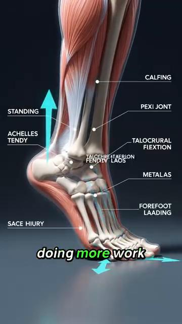
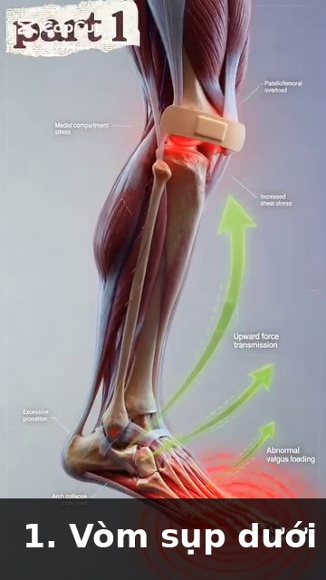

# Kiến Trúc Xương & Mô Liên Kết — Đòn Bẩy Xương Và Thiết Kế Khớp Trong Tennis

*Deep Dive #5 — Dự Án Giải Phẫu & Hình Học Cho Người Chơi Tennis 3.5 → 4.5*

---

## Mục Lục

| # | Chương |
| --- | --- |
| 1 | Bộ Xương Là Một Hệ Thống Đòn Bẩy |
| 2 | Xương Thân Dưới — Xương Đùi, Xương Chày, Bàn Chân |
| 3 | Khung Chậu & Xương Cùng — Nền Tảng Ẩn Giấu |
| 4 | Cột Sống — Chuỗi 33 Đốt Sống |
| 5 | Đai Vai — Xương Đòn, Xương Bả Vai, Xương Cánh Tay |
| 6 | Xương Cánh Tay & Cổ Tay — Xương Trụ, Xương Quay, Xương Cổ Tay |
| 7 | Mô Liên Kết — Dây Chằng, Sụn, Mạc |
| 8 | Vì Sao Giải Phẫu Xương Quyết Định Giới Hạn Cú Đánh |
| 📋 | Thẻ Tóm Tắt Về Xương |

---

* * *

# Chương 1 — Bộ Xương Là Một Hệ Thống Đòn Bẩy

**Mỗi xương là một đòn bẩy**. Đòn bẩy là một thanh cứng xoay quanh một điểm cố định (gọi là ĐIỂM TỰA/FULCRUM). Xương của bạn xoay quanh các khớp.

**3 loại đòn bẩy**

**Loại 1 — Điểm tựa ở giữa** (như bập bênh). Ví dụ trong cơ thể: đầu tựa trên đốt sống atlas. Điểm tựa là khớp giữa hộp sọ và cột sống.

**Loại 2 — Tải trọng ở giữa** (như xe cút kít). Ví dụ trong cơ thể: đứng nhón chân. Điểm tựa là ức bàn chân, tải trọng là trọng lượng cơ thể tại cổ chân, lực tác động là cơ bắp chân kéo lên. **Lợi thế cơ học > 1 — lực cơ được khuếch đại.**

**Loại 3 — Lực tác động ở giữa** (như nhíp). **Ví dụ trong cơ thể: GẦN NHƯ MỌI THỨ**. Cơ bám vào giữa khớp (điểm tựa) và tải trọng (bàn tay). Lợi thế cơ học < 1 — lực cơ bị GIẢM nhưng TỐC ĐỘ được khuếch đại. **Cánh tay là một đòn bẩy loại 3.**

**Vì sao điều này quan trọng** — Cánh tay CHẬM trong việc sinh lực (vì nó là đòn bẩy Loại 3) nhưng NHANH trong việc tạo tốc độ đầu vợt (vì sự co cơ được khuếch đại thành tốc độ ở bàn tay). **Đây là lý do vì sao các cơ chân (nằm gần cơ thể hơn) là NGUỒN SỨC MẠNH** — chúng có đòn bẩy tốt hơn. Cánh tay là nguồn TỐC ĐỘ.

**Tỷ lệ đòn bẩy cẳng tay** — Chiều dài cẳng tay (~25 cm) ÷ điểm bám cơ nhị đầu (~5 cm từ khuỷu tay) = **bất lợi cơ học 5:1 cho lực, lợi thế cơ học 5:1 cho tốc độ.**

**Vì sao cơ nhị đầu "yếu" trong tennis** — Cơ nhị đầu có bất lợi 5:1. **Nó cần tạo ra gấp 5 lần lực tại bàn tay để giữ chống lại một tải trọng 1 lần.** Hầu hết người chơi phong trào "cảm thấy" cơ nhị đầu nóng rát sau một trận đấu dài vì cơ nhị đầu đang cố làm công việc của các cơ lớn hơn, hiệu quả hơn.

**Ý nghĩa với tennis** — **Tập luyện các CƠ LỚN (chân, hông, core) để lấy sức mạnh**. Cánh tay chỉ chuyển hóa sức mạnh đó thành tốc độ đầu vợt. Một bài tập gập cơ nhị đầu SẼ KHÔNG cải thiện cú thuận tay của bạn. **Một bài squat thì có thể.**

*Cue chủ đạo:* "Chân là động cơ. Cánh tay là hộp số. Vợt là bánh xe."

* * *

# Chương 2 — Xương Thân Dưới — Xương Đùi, Xương Chày, Bàn Chân

**Xương đùi** (xương đùi) — Xương dài nhất, mạnh nhất trong cơ thể. ~45–50 cm ở nam giới trưởng thành, ~40–45 cm ở nữ giới. Chịu toàn bộ trọng lượng cơ thể lúc đứng và hầu hết trọng lượng lúc chạy. Chỏm xương đùi nằm trong ổ khớp hông (ổ cối).

**Góc cổ xương đùi** — Góc giữa cổ xương đùi và thân xương đùi là ~125°–135° ở người trưởng thành. Góc này, gọi là **góc nghiêng**, quyết định cách hông của bạn xoay. **Coxa vara** (góc <120°) giới hạn xoay. **Coxa valga** (góc >140°) tăng xoay nhưng có thể gây mất ổn định.

**Góc xoắn xương đùi** — Góc giữa cổ xương đùi và LỒI CẦU xương đùi (mấu dưới gặp gối). Bình thường là ~10°–15° NGHIÊNG RA TRƯỚC (anteversion).

**Vì sao nghiêng ra trước quan trọng với tennis** — Độ nghiêng ra trước cao hơn (~15°–20°) nghĩa là gối và bàn chân tự nhiên hướng VÀO TRONG khi đứng. Điều này làm cho xoay NGOÀI hông dễ hơn và xoay TRONG hông khó hơn. **Người chơi có độ nghiêng ra trước cao có thể có cú thuận tay tư thế mở "tự nhiên".**

**Xương chày** (xương ống chân) — Xương dài thứ hai. Chịu hầu hết tải trọng của cơ thể dưới gối. Có một độ XOẮN XƯƠNG CHÀY nhẹ (~20°–30° xoay ngoài của phần dưới so với phần trên). Đây là lý do vì sao bàn chân của bạn tự nhiên hướng hơi ra ngoài khi đứng.

**Xương bánh chè** (đầu gối) — Xương VỪNG (xương nhúng trong gân) lớn nhất. Nhúng trong gân cơ tứ đầu đùi. **Hoạt động như một ròng rọc** cho cơ tứ đầu đùi, tăng đòn bẩy của nó thêm ~30%–50%.

**Vì sao xương bánh chè quan trọng với tennis** — Không có xương bánh chè, cơ tứ đầu đùi sẽ cần tạo ra ~30% lực nhiều hơn để duỗi gối. **Xương bánh chè là bộ khuếch đại lực.** Nó cũng là lý do vì sao các chấn thương xương bánh chè (viêm gân bánh chè, "gối vận động viên nhảy") phổ biến trong tennis.

**Bàn chân** — 26 xương ở mỗi bàn chân. **Đó là 26 đòn bẩy NHỎ hoạt động cùng nhau.** Chúng tạo thành 3 vòm: vòm dọc trong (mặt trong), vòm dọc ngoài (mặt ngoài), và vòm ngang (qua ức bàn chân).

**Các vòm** hoạt động như một LÒ XO. Khi bạn tiếp đất trên bàn chân, các vòm hơi phẳng ra và lưu trữ năng lượng. Khi bạn đẩy chân, các vòm bật lại và trả lại năng lượng. **Bàn chân là một chiếc lò xo, giống như gân Achilles.**

**Bàn chân bẹt so với vòm cao** — **Bàn chân bẹt**: linh hoạt hơn, lưu trữ nhiều năng lượng hơn, nhưng ít ổn định hơn. **Vòm cao**: kém linh hoạt hơn, lưu trữ ít năng lượng hơn, nhưng ổn định hơn. **Người chơi 50+ có bàn chân bẹt có nhiều lò xo hơn nhưng có thể cần đế chỉnh hình để ổn định.**

* * *

# Chương 3 — Khung Chậu & Xương Cùng — Nền Tảng Ẩn Giấu

**Khung chậu là nền tảng của toàn bộ phần thân trên**. Đó cũng là cấu trúc xương lớn nhất trong cơ thể. Được tạo thành từ 3 xương hợp nhất: xương chậu (cánh lớn), xương ngồi (xương ngồi), xương mu (phía trước).

**Xương cùng** — 5 đốt sống hợp nhất ở đáy cột sống. Nằm giữa hai xương chậu. **Viên đá đỉnh vòm của khung chậu.**

**Khớp cùng-chậu (khớp SI)** — Nơi xương cùng gặp xương chậu. **Một khớp nổi tiếng cứng** với chỉ ~2°–4° chuyển động. Nhưng chuyển động đó lại QUAN TRỌNG — đó là nơi chân truyền lực vào cột sống. **Một khớp SI không di chuyển = không có chuỗi động học.**

**Vì sao khớp SI quan trọng với tennis** — Trong lúc thực hiện cú thuận tay, chân trước đẩy vào mặt đất, lực di chuyển LÊN qua xương chày, qua xương đùi, vào ổ khớp hông, qua khớp SI, vào cột sống, vào vai, vào cánh tay. **Nếu khớp SI bị khóa cứng, lực dừng lại tại hông.**

**Cảnh báo về khớp SI ở tuổi 50+** — Khớp SI trở nên CỨNG HƠN theo tuổi tác (liên kết chéo collagen trong dây chằng). Đến tuổi 60, khớp SI có thể chỉ di chuyển ~1°–2°. **Đây là một lý do khiến người chơi lớn tuổi mất sức mạnh — khớp SI không truyền lực tốt.**

**Bài tập di động khớp SI** — Xoay hông đứng (10 lần mỗi hướng), giữ thăng bằng một chân (30 giây mỗi bên), và xoay hông 90/90 (chậm, 10 lần lặp) giúp duy trì chuyển động của khớp SI. **Hãy làm điều này hằng ngày với người chơi 50+.**

**Độ nghiêng khung chậu** — Khung chậu có thể nghiêng ra trước (nghiêng trước, ~10°–15°) hoặc nghiêng ra sau (nghiêng sau, ~5°–10°). Hầu hết người chơi tennis có độ nghiêng trước nhẹ, làm tăng tầm gập hông (tốt cho bóng thấp) nhưng có thể gây áp lực lên cột sống thắt lưng.

*Cue chủ đạo:* "Giải phóng khớp SI. Giải phóng chuỗi động học."

* * *

# Chương 4 — Cột Sống — Chuỗi 33 Đốt Sống

**Cột sống là 33 đốt sống xếp chồng lên nhau**. 24 đốt có thể di chuyển (7 đốt cổ, 12 đốt ngực, 5 đốt thắt lưng). 9 đốt hợp nhất (5 đốt cùng, 4 đốt cụt).

**Cột sống cổ (C1-C7)** — Cổ. Linh hoạt nhất. ~80° tổng xoay (chủ yếu ở C1-C2), ~50° tổng gập/duỗi. **Đây là nơi đầu xoay để theo dõi bóng.**

**C1 (đốt atlas)** — Một đốt sống hình vòng. Đỡ hộp sọ. Cho phép ~15° gập/duỗi (chuyển động "gật đầu đồng ý").

**C2 (đốt axis)** — Có một mấu RĂNG (mấu răng hay mấu odontoid) khớp vào C1. Cho phép ~80° xoay (chuyển động "lắc đầu không đồng ý").

**Vì sao C1-C2 quan trọng với tennis** — Khi bạn xoay đầu để theo dõi bóng đang bay đến, bạn chủ yếu đang xoay C1 trên C2. **C1-C2 cứng giới hạn khả năng theo dõi thị giác của bạn.** Đây là lý do vì sao bạn có thể đánh một quả bóng bay đến từ phía bên nhưng không thể theo dõi một quả bóng đi ngang qua đường thân của bạn.

**Cột sống ngực (T1-T12)** — Lưng giữa. **ĐƯỢC THIẾT KẾ cho xoay**. Mỗi đốt sống có ~3°–5° xoay, tổng cộng ~35°–50°. **Đây là nơi phát sinh xoay thân trong tennis.**

**Vì sao cột sống ngực quan trọng với tennis** — Mỗi cú thuận tay cần ~40°–50° xoay ngực. Nếu cột sống ngực cứng (công việc bàn giấy, lão hóa), cơ thể sẽ bù trừ bằng XOAY THẮT LƯNG, làm hỏng các đĩa đệm thắt lưng. **Hãy tập luyện độ linh hoạt của cột sống ngực.**

**Bài tập độ linh hoạt cột sống ngực** — Giãn "mở sách" (nằm nghiêng, xoay tay trên ra sau, giữ 30 giây × 3 lần mỗi bên). Duỗi trên con lăn foam (nằm dọc theo con lăn, tay giơ trên đầu, 10 lần lặp).

**Cột sống thắt lưng (L1-L5)** — Lưng dưới. **ĐƯỢC THIẾT KẾ cho sự ổn định, KHÔNG PHẢI cho xoay**. Chỉ ~10°–15° tổng xoay, ~50° gập, ~25°–30° duỗi.

**Quy tắc xoay thắt lưng** — Bất cứ điều gì vượt quá ~15° xoay thắt lưng = **áp lực cắt trượt lên đĩa đệm**. Đĩa đệm L4-L5 và L5-S1 là những đĩa đệm bị thoát vị phổ biến nhất trong tennis. **Quy tắc: xoay ở trên (thắt lưng), gập/duỗi ở thắt lưng. ĐỪNG BAO GIỜ đảo ngược điều này.**

**Đĩa đệm gian đốt sống** — Một miếng đệm dạng gel giữa mỗi đốt sống. **KHÔNG có nguồn cung cấp máu trực tiếp** — nó nhận dinh dưỡng qua KHUẾCH TÁN thông qua chuyển động. **ĐÂY LÀ LÝ DO VÌ SAO CHUYỂN ĐỘNG CỘT SỐNG THIẾT YẾU CHO SỨC KHỎE ĐĨA ĐỆM.** Ngồi yên hàng giờ = đĩa đệm đói dinh dưỡng. Tennis = dinh dưỡng đĩa đệm.

**Thực tế đĩa đệm ở tuổi 50+** — Độ ngậm nước của đĩa đệm giảm ~1% mỗi năm sau tuổi 30. Đến tuổi 50, đĩa đệm ít nước hơn ~20% so với tuổi 20. **Chúng dễ tổn thương hơn, dễ thoát vị hơn.** Hãy dùng xoay thắt lưng một cách cẩn thận. **Giữ dưới 15° xoay.**

*Cue chủ đạo:* "Xoay ở trên, gập/duỗi ở dưới. Đừng đảo ngược quy tắc."

* * *

# Chương 5 — Đai Vai — Xương Đòn, Xương Bả Vai, Xương Cánh Tay

**Vai thực chất là 4 khớp**, không phải 1. Hầu hết mọi người chỉ nghĩ đến khớp ổ chảo-cánh tay (khớp chỏm-ổ), nhưng xương bả vai, xương đòn, và xương ức cũng có các khớp quan trọng.

**Khớp 1 — Ổ chảo-cánh tay** — Khớp vai chính. Chỏm (đầu xương cánh tay) + ổ khớp (glenoid). Ổ khớp chỉ bao phủ ~1/3 chỏm. **Hy sinh sự ổn định để lấy độ linh hoạt.**

**Khớp 2 — Cùng vai-đòn (AC)** — Nơi xương đòn gặp mỏm cùng vai (đỉnh xương bả vai). Cung cấp ~5°–8° chuyển động. **Bị chấn thương khi ngã — "trật khớp vai" nổi tiếng.**

**Khớp 3 — Ức-đòn (SC)** — Nơi xương đòn gặp xương ức. **LÀ kết nối xương DUY NHẤT giữa cánh tay và thân người.** Cung cấp ~30°–40° chuyển động. **Then chốt cho giao bóng và cú đánh trên cao.**

**Khớp 4 — Bả vai-lồng ngực** — Không phải một khớp thực sự, mà là một BỀ MẶT TRƯỢT giữa xương bả vai và lồng ngực. **Xương bả vai "nổi" trên các xương sườn.** Sự "nổi" này là điều cho phép cánh tay vươn lên cao.

**Nhịp bả vai-cánh tay** — Với mỗi 2° xương cánh tay nâng lên, xương bả vai xoay 1° (tỷ lệ 2:1). Tổng độ nâng cánh tay: 180°, trong đó 120° đến từ khớp ổ chảo-cánh tay + 60° từ khớp bả vai-lồng ngực.

**Vì sao nhịp bả vai quan trọng với tennis** — Một xương bả vai CỨNG không thể xoay lên 60°. Điều này buộc khớp ổ chảo-cánh tay phải làm toàn bộ 180° độ nâng cánh tay — đưa nó vào "vùng chèn ép cơ trên gai" nguy hiểm. **Đây là nguyên nhân số 1 gây đau vai liên quan đến giao bóng.**

**Xương đòn** (xương quai xanh) — Một xương dài hình chữ S. Hoạt động như một THANH CHỐNG giữ vai ra xa khỏi ngực. **Không có xương đòn, vai sẽ sập vào trong.**

**Vì sao gãy xương đòn quan trọng** — Xương đòn là xương bị gãy phổ biến nhất ở phần thân trên. Ngã trên vai (thường gặp trong trượt ngã khi chơi tennis) làm gãy phần giữa xương đòn. **Việc lành xương mất tối thiểu 6–8 tuần.**

**Xương cánh tay** (xương cánh tay trên) — Một đòn bẩy dài. ĐẦU nằm trong ổ khớp glenoid. MẤU LỚN (greater tuberosity) là nơi 3 trong 4 cơ chóp xoay bám vào (cơ trên gai, cơ dưới gai, cơ tròn bé).

**Rãnh nhị đầu** — Một kênh phía trước xương cánh tay nơi gân đầu dài cơ nhị đầu chạy qua. **Nếu rãnh này nông** (biến thể giải phẫu), gân cơ nhị đầu có thể trượt ra và gây đau vai.

*Cue chủ đạo:* "Giải phóng xương bả vai. Bảo vệ vai."

* * *

# Chương 6 — Xương Cánh Tay & Cổ Tay — Xương Trụ, Xương Quay, Xương Cổ Tay

**Xương trụ** — Xương dài hơn, ổn định hơn trong hai xương cẳng tay. Tạo thành mỏm khuỷu (xương nhọn ở phía sau khuỷu tay). Mỏm khuỷu KHỚP VÀO hố mỏm khuỷu của xương cánh tay trong lúc duỗi khuỷu tay hoàn toàn — **đây là điều khóa khuỷu tay thẳng.**

**Vì sao khuỷu tay khóa lại** — Ở 180° duỗi khuỷu, mỏm khuỷu khớp vào hố mỏm khuỷu. **Đây là vị trí "tâm chết" của khuỷu tay**. Khóa bằng xương. Không cần cơ.

**Xương quay** — Xương ngắn hơn, linh hoạt hơn trong hai xương cẳng tay. **Xoay quanh xương trụ** trong lúc sấp/ngửa (xoắn lòng bàn tay). Đầu xương quay gặp lồi cầu xương cánh tay tại khuỷu tay.

**Các khớp quay-trụ** — Hai khớp: GẦN (gần khuỷu) và XA (gần cổ tay). Cùng nhau chúng cho phép ~150° sấp/ngửa. **Đây là điều xoắn mặt vợt.**

**Vì sao "khuỷu tay tennis" xảy ra** — Gân ECRB (cơ duỗi cổ tay quay ngắn) bám vào lồi cầu ngoài của xương cánh tay. **Duỗi cổ tay lặp lại + sấp cẳng tay** (chính xác những gì một cú thuận tay tennis làm) làm quá tải gân này. Kết quả: viêm lồi cầu ngoài = "khuỷu tay tennis".

**Cổ tay** — 8 xương cổ tay trong 2 hàng. **Hàng gần (gần cẳng tay hơn)**: xương thuyền, xương nguyệt, xương tháp, xương đậu. **Hàng xa (gần ngón tay hơn)**: xương thang, xương thê, xương cả, xương móc.

**Xương thuyền** — Xương cổ tay bị gãy phổ biến nhất. Ngã chống tay duỗi ra. **Việc lành rất chậm** vì xương thuyền có nguồn cung cấp máu kém.

**TFCC** (phức hợp sụn sợi tam giác) — Một cấu trúc giống như sụn chêm ở phía TRỤ của cổ tay. **Đệm và ổn định cổ tay trong lúc chuyển động bật.** Dễ tổn thương trong tennis (đặc biệt trong trái tay hai tay và slice).

**Xương bàn tay** (5 xương dài trong lòng bàn tay). Mỗi xương kết thúc bằng một khớp đốt ngón tay. **Xương bàn tay thứ 1 (phía ngón cái) có một khớp yên ngựa độc đáo** với xương thang, cho phép ngón cái đối diện với 4 ngón còn lại. **Đây là lý do vì sao con người có thể cầm nắm một cây vợt.**

**Các xương ngón tay** (xương ngón). Mỗi ngón tay có 3 xương ngón (gần, giữa, xa). Ngón cái có 2. **Tổng cộng: 14 xương ngón mỗi bàn tay.**

*Cue chủ đạo:* "Tám xương cổ tay, mười bốn xương ngón, một công cụ — bàn tay cầm nắm của bạn."

* * *

# Chương 7 — Mô Liên Kết — Dây Chằng, Sụn, Mạc

**Mô liên kết là ĐỐI TÁC THẦM LẶNG** của bộ xương. Nó giữ các xương lại với nhau, đệm cho khớp, và truyền lực giữa các cơ.

**Dây chằng** — Nối XƯƠNG với XƯƠNG. Được cấu tạo từ collagen dày đặc. **Giới hạn chuyển động khớp trong phạm vi an toàn**. Ví dụ: ACL (dây chằng chéo trước) ở gối, MCL (dây chằng bên trong), UCL (dây chằng bên trụ) ở khuỷu tay, các dây chằng ổ chảo-cánh tay ở vai.

**UCL trong tennis** — Dây chằng bên trụ ở khuỷu tay CHÍNH LÀ dây chằng mà phẫu thuật Tommy John thay thế. **Áp lực valgus** (lực đẩy cẳng tay ra ngoài) nạp lực cho dây chằng này. Giao bóng và thuận tay tạo ra áp lực valgus. **UCL là tuyến phòng thủ cuối cùng của khuỷu tay.**

**Sụn** — Phủ đầu xương bên trong khớp. Hai loại: HYALINE (sụn khớp, trong suốt, phủ đầu xương) và SỢI (sụn chêm ở gối, sụn viền ở vai/hông).

**Sụn khớp KHÔNG có dây thần kinh** — Đây là lý do vì sao tổn thương sụn "âm thầm". Bạn không cảm thấy đau cho đến khi sụn đã mất và xương cọ vào xương. **Đến lúc bạn cảm thấy đau gối do mất sụn, bạn đã mất 30%–50% lượng sụn.**

**Sụn KHÔNG có nguồn cung cấp máu** — Một khi bị tổn thương, nó lành RẤT KÉM (hoặc không lành). Đây là lý do vì sao thoái hóa khớp không thể đảo ngược. **Phòng ngừa = bảo vệ sụn suốt đời**.

**Sụn chêm** ở gối — Hai miếng sụn sợi hình chữ C giữa xương đùi và xương chày. **Hoạt động như bộ giảm xóc**. Phân bố ~50% tải trọng khắp khớp gối. **Cắt bỏ sụn chêm = tăng nguy cơ thoái hóa khớp lên 4–6 lần**.

**Sụn viền** ở vai — Một vòng sụn sợi quanh ổ khớp glenoid. **Làm sâu ổ khớp thêm ~50%**. Then chốt cho sự ổn định của vai. Rách sụn viền phổ biến trong tennis (đặc biệt khi giao bóng).

**Mạc** — Các lớp mô liên kết BỌC các cơ và nối chúng với nhau. **Mạc ngực-thắt lưng** (lưng dưới) then chốt cho tennis — nó truyền lực từ cơ mông lớn và cơ lưng rộng đến cánh tay đối diện (một sự truyền lực "chéo mẫu").

**Vai trò của mạc ngực-thắt lưng** — Khi bạn đánh một cú thuận tay, cơ mông lớn BÊN TRÁI và cơ lưng rộng BÊN PHẢI của bạn đều kéo trên mạc ngực-thắt lưng. Mạc truyền lực này LÊN và SANG vai BÊN PHẢI (tay cầm vợt). **Đây là một lý do vì sao cơ mông trái khỏe cải thiện sức mạnh cú thuận tay của người thuận tay phải.**

**Thực tế về mạc ở tuổi 50+** — Mạc mất nước và cứng lại theo tuổi tác. **Đến tuổi 60, mạc có thể cứng hơn ~20%–30% so với tuổi 25.** Đây là một lý do khiến người chơi lớn tuổi mất linh hoạt. **Lăn con lăn foam và giãn cơ động giúp duy trì độ dẻo của mạc.**

*Cue chủ đạo:* "Xương là khung. Mô liên kết là keo dán. Đừng bỏ qua keo dán."

* * *

# Chương 8 — Vì Sao Giải Phẫu Xương Quyết Định Giới Hạn Cú Đánh

**Bộ xương của bạn định nghĩa tầm vận động TỐI ĐA**. Không có lượng giãn cơ nào thay đổi hình dạng xương của bạn. Bạn có thể giãn các mô mềm (cơ, mạc, gân) nhưng bạn không thể giãn xương.

**Độ sâu ổ khớp hông quyết định xoay hông** — Ổ khớp sâu = ổn định nhưng xoay hạn chế. Ổ khớp nông = xoay nhiều hơn nhưng ít ổn định hơn. Bạn không có quyền lựa chọn.

**Xoắn xương đùi quyết định tư thế tự nhiên của bạn** — Nghiêng ra trước cao (15°–20°) = bàn chân tự nhiên hướng VÀO TRONG = xoay ngoài hông dễ, xoay trong hông khó. Nghiêng ra trước thấp (~5°) = bàn chân tự nhiên hướng RA NGOÀI = xoay trong hông dễ, xoay ngoài hông khó. **Đây là lý do vì sao một số người chơi là người chơi thuận tay tư thế mở "tự nhiên" và những người khác là tư thế đóng tự nhiên.**

**Độ sâu ổ khớp vai quyết định độ linh hoạt vai** — Ổ khớp nông = có thể nâng cánh tay nhiều hơn nhưng kém ổn định hơn. Ổ khớp sâu = nâng cánh tay ít hơn nhưng ổn định hơn.

**Độ xoắn xương cánh tay quyết định grip "tự nhiên" của bạn** — Độ xoắn ngược xương cánh tay cao hơn (phổ biến hơn ở người ném bóng và người chơi tennis từ nhỏ) nghĩa là có thể xoay ngoài nhiều hơn. **Đây là lý do vì sao một số người chơi có thể giao bóng với xoay ngoài cực đoan (120°+) và những người khác thì không.**

**Cú đánh phù hợp với CƠ THỂ BẠN** — Làm việc với bộ xương của bạn nghĩa là chọn cú đánh phù hợp với giải phẫu của bạn. Ví dụ:

**Nghiêng ra trước cao → thuận tay tư thế mở hoạt động tự nhiên.**

**Nghiêng ra trước thấp → thuận tay tư thế đóng hoạt động tự nhiên.**

**Độ xoắn ngược xương cánh tay cao → giao bóng kick với xoay ngoài 130°+ có hiệu quả.**

**Độ xoắn ngược xương cánh tay thấp → giao bóng phẳng hoặc slice an toàn hơn.**

**Cơ gấp hông cứng → dùng nhiều xoay thân trên hơn trong cú thuận tay.**

**Cơ gấp hông lỏng → dùng nhiều xoay hông hơn trong cú thuận tay.**

**Ý nghĩa với người 50+** — Khi sụn mỏng đi, tầm vận động khớp giảm ~5°–10° mỗi thập kỷ. **Cú đánh hiệu quả ở tuổi 40 có thể không hiệu quả ở tuổi 60.** Hãy điều chỉnh kỹ thuật theo bộ xương HIỆN TẠI của bạn, không phải bộ xương của bạn ở tuổi 30.

*Cue chủ đạo:* "Tôn trọng bộ xương. Điều chỉnh cú đánh. Đừng chống lại xương."

* * *

# Chương 9 — Tích Hợp Anatomy_Lab — Những Con Số Xương Được Tinh Chỉnh

**Chương này xếp chồng những con số xương cụ thể từ thư viện `Anatomy_Lab/` của bạn** (26 xương bàn chân, đĩa đệm L4-L5, cột sống ngực, 27 xương cổ tay) lên khung xương của deep dive này.

## 9.1 — Bàn Chân: 26 Xương, 33 Khớp, 19 Cơ (Cấu Trúc Phức Tạp Nhất)

**Nhận định từ Anatomy_Lab DD7** — bàn chân là **cấu trúc phức tạp nhất trong cơ thể con người**. 26 xương, 33 khớp, 19 cơ nội tại, và hơn 7.000 đầu dây thần kinh ở lòng bàn chân.

**Hình 1 / Hình 1** — Bàn chân 26 xương, nhìn từ trên. Chú ý 3 vòm hoạt động như một chiếc lò xo.

**Hình 2 / Hình 2** — Bàn chân nhìn từ lòng bàn chân. Có thể thấy các đầu dây thần kinh dày đặc trong lòng bàn chân.

**Hình 3 / Hình 3** — Bàn chân mặt trong. Vòm dọc trong là vòm nổi bật nhất.

**Vì sao điều này quan trọng với tennis** — mỗi split-step, mỗi lần đẩy chân, mỗi lần đổi hướng đều xảy ra qua cấu trúc 26 xương này. **Bàn chân VỪA là cảm biến VỪA là bộ truyền động.** Nó cảm nhận mặt đất (hơn 7.000 dây thần kinh) VÀ nó truyền lực (26 xương + windlass).

## 9.2 — Cơ Chế Windlass (Chiếc Cáp Cung Cấp Năng Lượng Cho Lúc Đẩy Chân)

**Nhận định từ Anatomy_Lab DD7** — cân gan chân hoạt động như một **CHIẾC CÁP** từ gót đến các ngón chân. Khi ngón cái duỗi (lúc đẩy chân), chiếc cáp căng lên, nâng vòm chân lên (windlass). **Điều này lưu trữ năng lượng đàn hồi tương đương ~10% lực đẩy chân.**

**Hình 4 / Hình 4** — Cơ chế windlass: duỗi ngón cái làm căng cân gan chân giống như một windlass, nâng vòm chân lên.

## 9.3 — Ổ Khớp Hông: Độ Xoắn Xương Đùi Quyết Định Tư Thế Tự Nhiên Của Bạn

**Nhận định từ Anatomy_Lab DD5** — góc xoắn xương đùi (góc giữa cổ xương đùi và lồi cầu xương đùi) **bình thường là 10°–15° nghiêng ra trước**. Điều này mang tính di truyền và KHÔNG THỂ thay đổi.

**Hình 5 / Hình 5** — Khớp hông: chỏm xương đùi trong ổ cối, với góc xoắn có thể nhìn thấy.

**Ý nghĩa** — **Nghiêng ra trước cao hơn (~15°–20°) = bàn chân hướng VÀO TRONG = xoay ngoài hông dễ hơn, xoay trong hông khó hơn.** Người chơi có độ nghiêng ra trước cao tự nhiên thích cú thuận tay TƯ THẾ MỞ. **Nghiêng ra trước thấp hơn (~5°) = bàn chân hướng RA NGOÀI = xoay trong hông dễ hơn.** Người chơi tự nhiên thích cú thuận tay TƯ THẾ ĐÓNG.

## 9.4 — Cột Sống: Đĩa Đệm L4-L5 Và Sự Giảm Áp Khi Đi Bộ

**Nhận định chủ chốt từ Anatomy_Lab DD4** — **L4-L5 là đĩa đệm chịu áp lực nhiều nhất** trong cột sống. Nó hấp thụ ~30% tải trọng nhiều hơn bất kỳ đĩa đệm thắt lưng nào khác. Đi bộ giảm áp cho nó ~30% (so với nằm, vốn không giảm áp theo cùng cách).

**Hình 6 / Hình 6** — Đĩa đệm L4-L5 giữa đốt sống L4 và L5. Đĩa đệm chịu áp lực nhiều nhất trong tennis.

**Hình 7 / Hình 7** — Đường đi thần kinh tọa: từ L4-L5 xuống qua mông và chân. **Bị chẩn đoán nhầm là "hội chứng cơ hình lê" trong 80% trường hợp** — sự chèn ép thực sự nằm ở L5-S1, không phải cơ hình lê.

**Đi bộ giảm áp cho L4-L5** — ở tốc độ đi bộ ~3 mph trên máy chạy bộ, đĩa đệm L4-L5 trải qua ~30% GIẢM lực nén so với lúc nghỉ. **Điều này là vì hoạt động nhịp nhàng của cơ gấp/duỗi hông bơm chất lỏng vào và ra khỏi đĩa đệm.** Ngồi tennis + gập người về trước = nén. Đi bộ giữa các điểm bóng trong tennis = giảm áp.

## 9.5 — Vai: 4 Khớp Trong Một

**Nhận định từ Anatomy_Lab DD2** — "vai" thực chất là **4 khớp**:

|  |
|  |
|  |
|  |
|  |
|  |

|  |
| --- |
| **Hình 8 & 9 |
| **Nhịp bả vai-cánh tay** — **với mỗi 2° nâng cánh tay, xương bả vai xoay 1°.** Tổng độ nâng cánh tay 180° = 120° từ khớp ổ chảo-cánh tay + 60° từ khớp bả vai-lồng ngực. **Xương bả vai cứng = khớp ổ chảo-cánh tay làm toàn bộ 180° = chèn ép chắc chắn xảy ra.** |

## 9.6 — Cổ Tay: 27 Xương Trong Bàn Tay Và 8 Xương Cổ Tay

**Nhận định từ Anatomy_Lab DD3** — cổ tay là **8 xương cổ tay trong 2 hàng** + đường hầm cổ tay. **2 cm² không gian chứa 9 gân gấp + 1 dây thần kinh giữa.** Bất cứ điều gì làm sưng đường hầm này (sử dụng quá mức, giữ nước, tiểu đường) đều nén dây thần kinh — **hội chứng ống cổ tay**.

**Hình 10 / Hình 10** — 8 xương cổ tay trong 2 hàng: hàng gần (xương thuyền, xương nguyệt, xương tháp, xương đậu) + hàng xa (xương thang, xương thê, xương cả, xương móc).

**TFCC** — Phức Hợp Sụn Sợi Tam Giác ở phía trụ của cổ tay. **Đệm và ổn định cổ tay trong lúc chuyển động bật.** Dễ tổn thương trong tennis (đặc biệt trái tay hai tay).

* * *

## 📋 Thẻ Chương — Bản In

KIẾN TRÚC XƯƠNG — Ý TƯỞNG CHÍNH

<strong>🎯 MỘT Ý TƯỞNG LỚN</strong>

Cánh tay là đòn bẩy Loại 3 (lực tác động ở giữa). Nó hy sinh lực để lấy tốc độ. Chân và core tạo ra lực; cánh tay khuếch đại tốc độ.

<strong>CÁC XƯƠNG CHÍNH THEO TỪNG VÙNG</strong>

Thân dưới: Xương đùi (đòn bẩy 5:1), xương chày, xương bánh chè (ròng rọc) Khung chậu: Xương chậu + xương ngồi + xương mu + xương cùng (khớp SI) Cột sống: 24 di động + 9 hợp nhất = 33 đốt sống Vai: Xương đòn + xương bả vai (tổng 4 khớp) Cánh tay: Xương cánh tay + xương trụ + xương quay (xoắn cẳng tay) Cổ tay: 8 xương cổ tay trong 2 hàng + đệm TFCC Bàn tay: 5 xương bàn tay + 14 xương ngón

<strong>⚠️ LỖI HÀNG ĐẦU</strong>

Tập luyện cánh tay để lấy sức mạnh (gập cơ nhị đầu, duỗi cơ tam đầu) thay vì chân (squat, lunge). Cánh tay là đòn bẩy loại 3 — chúng khuếch đại tốc độ, không phải lực. Hãy tập luyện chân để lấy sức mạnh.

<strong>🔁 BÀI TẬP</strong>

Giữ thăng bằng một chân, nhắm mắt, 30 giây × 3 lần mỗi bên. Tập luyện khớp SI + cảm nhận bản thể.

<strong>💭 CUE CHỦ ĐẠO</strong>

"Tôn trọng bộ xương. Điều chỉnh cú đánh."

* * *

## 🎯 Lời Kết

Bạn ơi, bạn có ~206 xương trong cơ thể. Mỗi xương là một đòn bẩy. Mỗi khớp là một điểm tựa. Mỗi mô liên kết là một ràng buộc. **Bạn là một cỗ máy 206 đòn bẩy phải phối hợp thành một cú vung duy nhất.**

Bộ xương là ràng buộc của bạn. Các cơ (DD4) là động cơ của bạn. Những chiếc lò xo (DD2) là kho lưu trữ của bạn. Các góc độ (DD1) là hình học của bạn. **Cả bốn cùng hoạt động — và không cái nào có thể bị bỏ qua.**

* * *

**Nguồn**:
- Calais-Germain (2012) — Giải Phẫu Chuyển Động
- Neumann (2010) — Kinesiology Của Hệ Xương Cơ
- Kapandji (2009) — Sinh Lý Học Khớp
- Standring (2016) — Gray's Anatomy
- McGinnis (2013) — Sinh Cơ Học Thể Thao

*Hết Deep Dive #5 — Kiến Trúc Xương & Mô Liên Kết*
