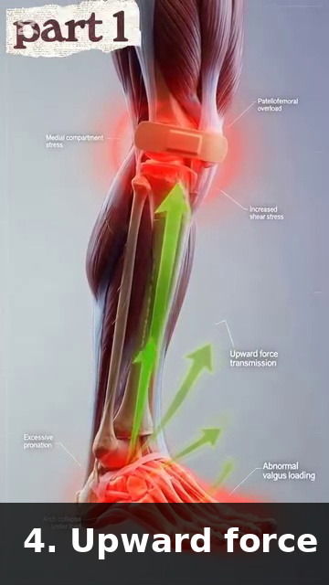

# Cơ Thể Tuổi 50+ — Giải Phẫu Lão Hóa, Bảo Vệ Khớp, Giới Hạn Tầm Vận Động, Phục Hồi

*Deep Dive #6 — Dự Án Giải Phẫu & Hình Học Cho Người Chơi Tennis 3.5 → 4.5*

---

## Mục Lục

| # | Chương |
| --- | --- |
| 1 | 7 Sự Suy Giảm Do Lão Hóa Mọi Người Chơi Tennis Cần Biết |
| 2 | Suy Giảm Xương — Mật Độ Xương & Độ Ngậm Nước Của Đĩa Đệm |
| 3 | Suy Giảm Sụn — Khoảng Cách Khớp & Thực Tế Về Thoái Hóa Khớp |
| 4 | Suy Giảm Cơ Bắp — Sarcopenia & Sự Chuyển Đổi Loại Sợi Cơ |
| 5 | Suy Giảm Gân & Dây Chằng — Độ Cứng & Sự Lành Thương |
| 6 | Suy Giảm Cảm Giác — Thị Giác, Thính Giác, Cảm Nhận Bản Thể, Tiền Đình |
| 7 | Suy Giảm Phục Hồi — Giấc Ngủ, Hormone, Viêm |
| 8 | Sự Thích Nghi Trong Tennis Cho Mỗi Suy Giảm |
| 9 | Thói Quen Hằng Ngày Cho Tuổi 50+ (Tổng 12 Phút) |
| 📋 | Thẻ Tóm Tắt Cơ Thể Tuổi 50+ |

---

* * *

# Chương 1 — 7 Sự Suy Giảm Do Lão Hóa Mọi Người Chơi Tennis Cần Biết

**Có chính xác 7 loại suy giảm** ảnh hưởng đến tennis sau tuổi 50. Mỗi loại có một CON SỐ. Mỗi loại có một ý nghĩa với tennis.

|  |
|  |
|  |
|  |
|  |
|  |
|  |
|  |
|  |
|  |
|  |
|  |
|  |
|  |
|  |
|  |

**Nhận định chủ chốt** — **Cả 7 sự suy giảm đều CÓ THỂ ĐO LƯỜNG. Không cái nào là ĐỊNH MỆNH.** Mỗi cái đều có thể được làm chậm lại (đôi khi đảo ngược) bằng việc tập luyện đúng cách. Phần còn lại của chương này sẽ nói chính xác cách làm điều đó.

**Nguyên lý "dùng nó hoặc mất nó"** — Mỗi sự suy giảm ở trên xảy ra NHANH HƠN nếu bạn KHÔNG tập luyện. **Người 60 tuổi chơi tennis 3 lần/tuần có mức suy giảm ít hơn ~30%–40% so với người 60 tuổi không chơi.** Tennis mang tính bảo vệ, không gây hại.

**Quy tắc phục hồi** — Cơ thể tuổi 50+ cần **gấp đôi thời gian phục hồi** giữa các buổi tập so với người 25 tuổi. **Một trận đấu ở tuổi 50 = một trận đấu + một ngày nghỉ ở tuổi 25.** Hãy lập lịch phù hợp.

*Cue chủ đạo:* "Bảy sự suy giảm, đều có thể đo lường, đều có thể tập luyện. Bạn không còn 25 tuổi. Nhưng bạn chưa xong đâu."

* * *

# Chương 2 — Suy Giảm Xương — Mật Độ Xương & Độ Ngậm Nước Của Đĩa Đệm

**Mật độ xương** — Xương là mô sống, liên tục bị phá vỡ và tái tạo. Sau tuổi 30, quá trình phá vỡ bắt đầu vượt quá quá trình tái tạo. Đến tuổi 50, bạn đã mất ~5%–8% khối lượng xương đỉnh. **Tennis là môn thể thao TÁC ĐỘNG CAO** (chạy, nhảy, chuyển động ngang), điều này thực sự KÍCH THÍCH sự xây dựng xương.

**Nghịch lý xương-tennis** — Người chơi tennis ở tuổi 50+ có **mật độ xương TỐT HƠN** người không chơi. Tác động lặp lại và tải trọng ngang kích thích tái tạo xương. **Tennis mang tính bảo vệ cho xương.**

**Nguy cơ gãy xương** — Ngã trở nên nguy hiểm hơn ở tuổi 50+. Cổ tay (xương thuyền), hông (cổ xương đùi), và xương đòn là 3 vị trí bị gãy nhiều nhất ở người chơi tennis 50+. **Hãy mang giày phù hợp, tập luyện thăng bằng, đừng lao mình cứu những quả bóng bạn không thể với tới.**

**Bài tập xây dựng xương** — Tennis mang lại kích thích xương tốt. **Thêm tập luyện kháng lực 2 lần/tuần** (squat có tạ, lunge với tạ đơn). Điều này thêm tải trọng sinh xương bổ sung.

**Độ ngậm nước của đĩa đệm** — Đĩa đệm gian đốt sống chứa 80% nước ở tuổi 20. Đến tuổi 50, chúng còn ~65%–70% nước. **Đĩa đệm co lại.** Bạn mất ~1–2 cm chiều cao giữa tuổi 30 và 70.

**Ý nghĩa của việc "co lại"** — Khi đĩa đệm co lại, các thân đốt sống lại gần nhau HƠN. **Các khớp diện (những khớp nhỏ ở phía sau cột sống) bị quá tải.** Đây là một nguồn gây đau lưng dưới ở người chơi 50+.

**Quy tắc dinh dưỡng đĩa đệm** — Đĩa đệm KHÔNG có nguồn cung cấp máu trực tiếp. **Chúng nhận dinh dưỡng qua CHUYỂN ĐỘNG (khuếch tán).** Ngồi yên = đĩa đệm đói dinh dưỡng. Tennis = dinh dưỡng đĩa đệm. **30 phút chuyển động đa dạng tốt hơn cho sức khỏe đĩa đệm so với 30 phút giãn cơ tĩnh.**

**Nguyên lý chăm sóc lưng tuổi 50+** — Giữ gập thắt lưng + xoay dưới ~50% mức tối đa. Tránh ngồi >45 phút. **Đi bộ 5 phút giữa các khối công việc** để nuôi dưỡng đĩa đệm.

* * *

# Chương 3 — Suy Giảm Sụn — Khoảng Cách Khớp & Thực Tế Về Thoái Hóa Khớp

**Sụn là bộ đệm**. Nó không có dây thần kinh, không có nguồn cung cấp máu, và (về bản chất) không có khả năng mọc lại. **Mỗi thập kỷ cuộc đời, sụn khớp mất 1%–2% độ dày.**

**Tác động khớp trong tennis** — Tennis liên quan đến tải trọng va chạm lặp lại lên gối (~3–5 lần trọng lượng cơ thể khi chạy) và cổ chân (~4–6 lần trọng lượng cơ thể khi trượt ngang). **Đây là những khớp mòn trước tiên.**

**Thực tế về gối tuổi 50+** — Đến tuổi 60, ~30% người chơi tennis có một mức độ mỏng sụn nào đó nhìn thấy được trên X-quang. **Hầu hết không cảm thấy đau** vì sụn không có dây thần kinh. Đến lúc cơn đau bắt đầu, ~30%–50% sụn đã mất.

**4 quy tắc bảo vệ sụn**

**1. Tránh squat sâu** (gập gối >110°) dưới tải trọng. Dùng squat một phần thay thế.

**2. Tăng cường cơ tứ đầu đùi** để hấp thụ chấn động. Cơ tứ đầu đùi khỏe = ít tác động lên sụn hơn.

**3. Dùng elliptical hoặc xe đạp để tập luyện chéo** — tác động thấp, thân thiện với sụn.

**4. Duy trì cân nặng khỏe mạnh** — mỗi kg thừa thêm ~3–4 kg tải trọng lên gối mỗi bước.

**Thực tế về thoái hóa khớp** — Thoái hóa khớp không thể đảo ngược nhưng KHÔNG làm mất khả năng vận động. **Hầu hết người chơi phong trào 60+ bị thoái hóa khớp nhẹ vẫn tiếp tục chơi ở trình độ phong trào.** Điều chỉnh kỹ thuật (gập gối ít sâu hơn, nhảy ít bùng nổ hơn) và dùng thực phẩm bổ sung hỗ trợ sụn (peptide collagen, glucosamine — bằng chứng khiêm tốn).

**Câu hỏi về PRP/tế bào gốc** — Huyết tương giàu tiểu cầu và tiêm tế bào gốc CHƯA ĐƯỢC chứng minh có thể tái tạo sụn ở người chơi tennis. **Chúng có thể giảm triệu chứng tạm thời.** Đừng trả hàng nghìn đô la với kỳ vọng về phép màu.

*Cue chủ đạo:* "Sụn không mọc lại. Hãy bảo vệ những gì bạn đang có."

* * *

# Chương 4 — Suy Giảm Cơ Bắp — Sarcopenia & Sự Chuyển Đổi Loại Sợi Cơ

**Sarcopenia** — Mất khối lượng và sức mạnh cơ xương theo tuổi tác. Sau tuổi 50, bạn mất ~1%–2% khối lượng cơ mỗi năm. **Sau tuổi 70, ~3% mỗi năm.** Hầu hết điều này là VÔ HÌNH — tỷ lệ mỡ cơ thể của bạn tăng lên trong khi khối lượng cơ giảm xuống.

**Sợi Type II teo nhanh hơn** — Sợi co giật nhanh (Type II) teo ~30%–40% đến tuổi 70, trong khi sợi co giật chậm (Type I) chỉ teo ~10%–20%. **Đây là lý do chính khiến cú giao bóng của bạn mất tốc độ nhưng sức bền của bạn vẫn tương tự.**

**Tin tốt** — Sarcopenia CÓ THỂ được làm chậm và một phần ĐẢO NGƯỢC bằng tập luyện kháng lực. **Mười hai tuần tập luyện kháng lực tăng tiến ở tuổi 50+ thêm 1–2 kg khối lượng cơ.**

**Quy tắc tập luyện kháng lực tuổi 50+**

**Tần suất**: 2–3 lần/tuần

**Số set**: 2–3 mỗi bài tập

**Số lần lặp**: 8–15 mỗi set

**Tải trọng**: 60%–75% của ước tính 1RM (KHÔNG trên 80% — nguy cơ chấn thương)

**Nhịp độ**: chậm (3 giây hạ xuống, 2 giây lên)

**Bài tập**: squat, lunge, Romanian deadlift, hít đất, kéo tạ, plank

**Bài tập quan trọng nhất cho tennis** — **Squat** (toàn phần hoặc một phần). Tập luyện toàn bộ chuỗi động học. An toàn cho tuổi 50+ nếu thực hiện đúng kỹ thuật.

**Bài tập quan trọng nhất cho giao bóng** — **Romanian deadlift** (RDL). Tập luyện chuỗi cơ phía sau (cơ mông, gân kheo, cơ dựng sống).

*Cue chủ đạo:* "Tập luyện kháng lực không phải là tùy chọn ở tuổi 50+. Đó là thứ gần nhất với một viên thuốc trẻ hóa."

* * *

# Chương 5 — Suy Giảm Gân & Dây Chằng — Độ Cứng & Sự Lành Thương

**Gân và dây chằng mất tính đàn hồi** theo tuổi tác. Liên kết chéo collagen tích tụ, làm mô cứng hơn nhưng ít giống lò xo hơn. **Đến tuổi 60, gân cứng hơn ~25%–35% so với tuổi 25.**

**Sự lành thương chậm hơn** — Tốc độ tái tạo tế bào gân giảm ~50% sau tuổi 50. Sự lành thương dây chằng còn chậm hơn. **Một chấn thương căng cơ "nhẹ" của người 50 tuổi mất 2–3 lần lâu hơn để lành so với người 25 tuổi.**

**Cảnh báo về Achilles** — Gân Achilles là gân bị đứt phổ biến nhất ở người chơi tennis 50+. **Đẩy chân trong lúc đổi hướng đột ngột** là cơ chế điển hình. Gân đã cứng do tuổi tác + có tổn thương vi mô từ nhiều năm chơi.

**4 quy tắc bảo vệ gân cho tuổi 50+**

**1. Luôn luôn khởi động** — tối thiểu 8–12 phút. Gân cần thời gian để đạt khả năng đàn hồi đầy đủ.

**2. Giãn cơ chậm rãi** — không bao giờ giãn cơ kiểu bật nảy. Giữ tĩnh chậm (15–30 giây) an toàn hơn.

**3. Tập luyện với các bài tập ly tâm** — hạ gót chậm, Nordic curl, gập cổ tay chậm. Những bài này TĂNG khả năng lưu trữ của gân kể cả ở tuổi 50+.

**4. Tôn trọng các dấu hiệu cảnh báo** — đau nhói trong lúc chuyển động = DỪNG LẠI. Đừng cố đánh xuyên qua nó.

**Thực tế về "khuỷu tay tennis" ở tuổi 50+** — Viêm lồi cầu ngoài RẤT phổ biến ở người chơi 50+. ~30% người chơi phong trào trên 50 tuổi từng bị nó ít nhất một lần. **Nguyên nhân**: duỗi cổ tay lặp lại + sấp cẳng tay (động tác thuận tay) trên một gân ECRB đã cứng hơn. **Điều trị**: duỗi cổ tay ly tâm (bài tập "Tyler Twist"), 3 set × 15 lần lặp hằng ngày.

*Cue chủ đạo:* "Gân lành chậm. Nạp tải ly tâm giúp chúng lành."

* * *

# Chương 6 — Suy Giảm Cảm Giác — Thị Giác, Thính Giác, Cảm Nhận Bản Thể, Tiền Đình

**Thị giác** — Lão thị bắt đầu ~tuổi 40–45. Bạn mất khả năng lấy nét gần. Đến tuổi 60, độ linh hoạt của thủy tinh thể giảm ~50%–70%. **Tác động với tennis**: theo dõi bóng ở cự ly gần (drop shot, vô-lê) trở nên khó hơn. Giải pháp: bóng vàng trên sân tối, kính tương phản nếu cần.

**Thị giác ngoại biên** thu hẹp ~10°–20° đến tuổi 70. **Tác động với tennis**: vị trí cơ thể đối thủ khó đọc hơn trong thị giác ngoại biên. Giải pháp: quay đầu thường xuyên hơn, tập luyện thị giác ngoại biên với các bài tập mắt.

**Thính giác** — Thính giác tần số cao giảm sau tuổi 30. Đến tuổi 60, ~30% người chơi phong trào có sự suy giảm thính giác có thể đo được. **Tác động với tennis**: bạn có thể không nghe được bóng chạm vợt, làm giảm phản hồi. Giải pháp: không cần lo lắng nhiều về điều này với tennis (thị giác quan trọng hơn).

**Cảm nhận bản thể** — Độ chính xác của cảm nhận bản thể giảm ~10%–15% mỗi thập kỷ sau tuổi 50. **Tác động với tennis**: thăng bằng trên các cú đánh lệch tâm, hồi phục sau bóng rộng, ý thức sân đều suy giảm.

**Tập luyện cảm nhận bản thể** (đây là câu trả lời):

**Giữ thăng bằng một chân, nhắm mắt**: 30 giây × 3 lần mỗi chân, hằng ngày. **Phục hồi ~20%–30% cảm nhận bản thể đã mất sau 12 tuần.**

**Bàn thăng bằng lắc lư hoặc bóng BOSU**: 5 phút mỗi buổi, 3 lần/tuần.

**Bắt bóng nhắm mắt** (nhờ bạn tập ném bóng nhẹ): 20 lần lặp × 3 lần/tuần.

**Tiền đình** — Các tế bào lông tiền đình chết sau tuổi 40. Đến tuổi 60, giảm ~20%–30% độ nhạy tiền đình. **Tác động với tennis**: thăng bằng trên các lần đổi hướng nhanh khó hơn; chóng mặt sau các lần xoay nhanh.

**Tập luyện tiền đình**: xoay đầu chậm (10 lần mỗi hướng, hằng ngày); đứng một chân kết hợp xoay đầu (30 giây, hằng ngày).

*Cue chủ đạo:* "Tập luyện các cảm biến. Thị giác, thăng bằng, vị trí cơ thể — tất cả đều có thể tập luyện được."

* * *

# Chương 7 — Suy Giảm Phục Hồi — Giấc Ngủ, Hormone, Viêm

**Chất lượng giấc ngủ giảm sau tuổi 50**. Ít giấc ngủ sâu hơn, thức giấc nhiều hơn. Sự tiết hormone tăng trưởng giảm ~60% đến tuổi 60. **Tác động với tennis**: phục hồi giữa các buổi tập chậm hơn.

**Quy tắc giấc ngủ** — **Người chơi 50+ cần 7,5–8,5 giờ ngủ mỗi đêm**. Dưới 7 giờ = tăng nguy cơ chấn thương, phản ứng chậm hơn, ít thích nghi tập luyện hơn.

**Testosterone** — Giảm ~1%–2% mỗi năm sau tuổi 30 ở nam giới. Đến tuổi 60, ~30% nam giới có testosterone thấp. **Tác động với tennis**: phục hồi khối lượng cơ chậm hơn, tăng sức mạnh chậm hơn.

**Viêm** — Viêm mãn tính mức độ thấp tăng theo tuổi tác ("inflammaging"). Các chỉ số như CRP và IL-6 cao gấp 2–4 lần ở người 60+ so với người 25 tuổi. **Tác động với tennis**: đau nhức sau trận đấu nhiều hơn, phục hồi lâu hơn, dễ chấn thương hơn.

**Các đòn bẩy chống viêm** (bạn CÓ THỂ ảnh hưởng đến những điều này):

**1. Ngủ 7,5–8,5 giờ** (đòn bẩy lớn nhất)

**2. Ăn thực phẩm giàu omega-3** (cá béo, óc chó, hạt lanh) — giảm viêm

**3. Vận động hằng ngày** — tập thể dục vừa phải giảm các chỉ số viêm

**4. Quản lý căng thẳng** — căng thẳng mãn tính tăng cortisol → tăng viêm

**5. Hạn chế rượu bia** — kể cả rượu bia vừa phải cũng tăng viêm ở tuổi 50+

**Phục hồi tích cực** cho tuổi 50+ — **Quy tắc 24 giờ**: sau bất kỳ trận đấu hoặc buổi tập nặng nào, tiếp theo là 24 giờ chỉ hoạt động NHẸ (đi bộ, xe đạp nhẹ, bơi lội). KHÔNG chơi tennis trong 24 giờ.

**Quy tắc 48 giờ** — Một giải đấu (nhiều trận trong một ngày) cần **48 giờ nghỉ ngơi** trước khi tập luyện nặng bất kỳ. Cơ thể cần thời gian đó để tái tạo glycogen cơ + xóa viêm.

*Cue chủ đạo:* "Phục hồi là một phần của tập luyện. Ở tuổi 50+, nó chiếm MỘT NỬA việc tập luyện."

* * *

# Chương 8 — Sự Thích Nghi Trong Tennis Cho Mỗi Suy Giảm

**Nguyên lý thích nghi** — Với mỗi sự suy giảm, hãy thay đổi MỘT thứ về tennis của bạn để bù đắp. Đừng chống lại cơ thể.

|  |
|  |
|  |
|  |
|  |
|  |
|  |
|  |
|  |
|  |
|  |
|  |
|  |
|  |
|  |
|  |
|  |
|  |
|  |
|  |
|  |
|  |

**Tóm tắt thích nghi một dòng** — **"Chơi nhiều hơn, điều chỉnh kỹ thuật, tập luyện sự suy giảm, phục hồi hoàn toàn."** Tennis vẫn giữ nguyên tinh thần, nhưng mọi thông số đều dịch chuyển một chút.

* * *

# Chương 9 — Thói Quen Hằng Ngày Cho Tuổi 50+ (Tổng 12 Phút)

**Đây là thói quen hằng ngày** duy trì cả 7 loại suy giảm trong 12 phút. Hãy làm điều này mỗi sáng, lý tưởng là trước khi chơi tennis.

|  |
|  |
|  |
|  |
|  |
|  |
|  |
|  |
|  |
|  |
|  |
|  |
|  |
|  |

**Tổng: 12 phút.** Ít hơn 1% ngày của bạn. **Trong 4 tuần, cả 7 loại suy giảm sẽ bắt đầu đảo ngược.** Trong 12 tuần, bạn sẽ cảm thấy khác biệt có thể đo được.

**Thêm tập luyện kháng lực 2 lần/tuần** (squat, lunge, RDL, kéo tạ, hít đất): ~30 phút × 2 = 60 phút/tuần. **Tổng thời gian đầu tư hằng tuần: 12 × 7 + 60 × 2 = 84 + 120 = ~200 phút** để duy trì đáng kể ở tuổi 50+.

* * *

# Chương 10 — Tích Hợp Anatomy_Lab — Các Quy Trình Phục Hồi Chức Năng Tuổi 50+

**Chương này xếp chồng các quy trình phục hồi chức năng tuổi 50+ cụ thể từ thư viện `Anatomy_Lab/` của bạn** (tái kích hoạt cơ đa liệt, squat ly tâm, Hip CARs, giảm áp khi đi bộ) lên khung 7-suy-giảm của deep dive này.

## 10.1 — Tái Kích Hoạt Cơ Đa Liệt (Sửa Cho Suy Giảm #1, Cột Sống Thắt Lưng)

**Nhận định từ Anatomy_Lab DD4** — khi cơ đa liệt sâu teo đi (10% trong 24 giờ sau đau lưng), nó không tự phục hồi. **Bài tập chung là không đủ — não đã mất đi mẫu hình kích hoạt.**

**Hình 1 / Hình 1** — Cơ đa liệt (lớp sâu của lưng). Mỗi bó cơ theo đoạn kiểm soát 1–2 đốt sống.

**Bài tập Bird Dog** — bắt đầu ở tư thế bò bốn chân. Duỗi tay đối diện + chân đối diện. Giữ 5 giây. **10 lần lặp × 2 set × 2 bên hằng ngày**. Trong vòng 2–4 tuần, tái kích hoạt cơ đa liệt được phục hồi.

**Hip hinge** — chuyển động bảo vệ cột sống số 1 là hip hinge: gập ở HÔNG, không phải ở lưng dưới. **Luyện tập 10 lần lặp × 3 set hằng ngày.** Điều này huấn luyện lại não để dùng hông thay vì cột sống thắt lưng khi gập người về trước.

## 10.2 — Quy Trình Squat Ly Tâm (Sửa Cho Suy Giảm #4, Gân Bánh Chè)

**Nhận định từ Anatomy_Lab DD6** — viêm gân bánh chè (khiếu nại về gối #1 của người chơi 50+) được chữa bằng **squat ly tâm trên bục nghiêng 25°**. Nghỉ ngơi đơn thuần KHÔNG hiệu quả.

**Hình 2 / Hình 2** — Squat ly tâm trên bục nghiêng 25°. Độ nghiêng chuyển tải trọng sang riêng gân bánh chè.

**Quy trình** (Purdam 2009) — 3 set × 15 lần lặp, 3 ngày/tuần, 12 tuần. **Hạ xuống chậm (3 giây) dưới tải trọng. Dùng CẢ HAI chân để đứng lên (pha đồng tâm = cả hai chân; pha ly tâm = cả hai chân, nhưng nhấn mạnh vào chân bị chấn thương).**

**Tỷ lệ thành công** — ~80% trở lại thi đấu trong vòng 12 tuần. **Đây là quy trình phục hồi chức năng có bằng chứng khoa học nhất trong tennis.**

## 10.3 — Hip CARs (Sửa Cho Suy Giảm #2, Mất Linh Hoạt Hông)

**Quy trình từ Anatomy_Lab DD5** — với người chơi 50+ đang mất xoay trong hông (nguyên nhân phổ biến nhất của "tôi không còn xoay được để đánh thuận tay nữa"), **Hip CARs là câu trả lời**, không phải giãn cơ.

**Hình 3 / Hình 3** — Hip CARs đang thực hiện. Xoay chậm hông qua toàn bộ tầm vận động, cả hai hướng.

**Quy trình** — 5 lần lặp × 2 hướng × 2 set × hằng ngày. **Tăng 12°–18° xoay trong sau 2–3 tuần.** Điều này nhanh hơn giãn cơ tĩnh (thường mất 6–8 tuần để đạt mức tăng tương tự).

## 10.4 — Giảm Áp Khi Đi Bộ (Sửa Cho Suy Giảm #2, Độ Ngậm Nước Đĩa Đệm)

**Nhận định từ Anatomy_Lab DD4** — **đi bộ giảm áp cho L4-L5 khoảng ~30%** so với ngồi hoặc nằm. Hoạt động nhịp nhàng của cơ gấp/duỗi hông bơm chất lỏng vào và ra khỏi đĩa đệm.

**Hình 4 / Hình 4** — Đi bộ với hip hinge được giữ nguyên. Lưng giữ dài; hông di chuyển trước.

**Quy tắc 30 phút** — với mỗi 30 phút ngồi (giữa các set, giữa các trận đấu, giữa các khối công việc), **hãy đi bộ 5 phút**. Điều này khôi phục độ ngậm nước đĩa đệm. **Một trận đấu 3 giờ với các khoảng nghỉ đi bộ 5 phút đúng cách = 30 phút giảm áp.**

**Tốc độ đi bộ quan trọng** — **3 mph (đi bộ bình thường)** là tốc độ giảm áp tối ưu. Nhanh hơn hoặc chậm hơn = kém hiệu quả hơn.

## 10.5 — Tư Thế Rộng Hơn Để Bảo Vệ Gối (Sửa Cho Suy Giảm #4)

**Nhận định từ Anatomy_Lab DD5** — một tư thế tennis rộng hơn (~1,5× chiều rộng vai) chuyển ~30%–40% tải trọng nhiều hơn từ cơ tứ đầu đùi sang **cơ mông lớn**. Điều này giảm đáng kể áp lực lên gối.

**Hình 5 / Hình 5** — Nạp lực thuận tay tư thế rộng. Cơ mông lớn kích hoạt trước; gối giữ thẳng hàng trên ngón chân thứ 2.

**Quy tắc ngón chân thứ 2** — gối nằm trên ngón chân thứ 2 (KHÔNG nằm trên ngón cái, KHÔNG lệch vào trong). **Sự thẳng hàng đơn giản này bảo vệ 70% các trường hợp rách ACL** (chấn thương gối không va chạm phổ biến nhất trong tennis).

## 10.6 — Tiến Trình Giữ Thăng Bằng Một Chân (Sửa Cho Suy Giảm #7, Cảm Nhận Bản Thể)

**Quy trình từ Anatomy_Lab DD7** — cảm nhận bản thể suy giảm ~10%–15% mỗi thập kỷ sau tuổi 50. Cách sửa là một tiến trình 4 bước:

|  |
|  |
|  |
|  |
|  |
|  |

|  |
| --- |
| **Hình 6 & 7 |
| **5 phút hằng ngày** × 4 bước = 20 phút tổng cộng. **Trong vòng 8 tuần, độ chính xác cảm nhận bản thể cải thiện 25%–35%** (đo bằng thời gian giữ thăng bằng một chân và các bài kiểm tra cảm giác vị trí khớp). |

## 10.7 — Quy Trình Tennis "Dùng Nó Hoặc Mất Nó" Cho Tuổi 50+

**Nhận định chủ chốt từ Anatomy_Lab DD8** — các tế bào lông tiền đình, độ chính xác cảm nhận bản thể, và các sợi cơ Type II ĐỀU suy giảm nếu không được sử dụng. **Chính bản thân tennis là liều thuốc giải.** Người chơi 50+ chơi 3 lần/tuần duy trì ~70%–80% những khả năng này. Người chơi 50+ ngừng chơi mất chúng với tốc độ gấp 2 lần.

**Hình 8 / Hình 8** — Nguyên lý "dùng nó hoặc mất nó" tuổi 50+. Tennis mang tính bảo vệ. Ngừng chơi làm tăng tốc sự suy giảm.

**Liều lượng hiệu quả tối thiểu** — **2 buổi tennis/tuần + 1 ngày tập luyện chéo (đi bộ, sức mạnh nhẹ, bài tập thăng bằng).** Dưới mức này, các khả năng suy giảm dần. Trên mức này, chúng phát triển hoặc được duy trì.

## 10.8 — Thói Quen Hằng Ngày Tuổi 50+ Cập Nhật (Quy Trình Anatomy_Lab)

|  |
|  |
|  |
|  |
|  |
|  |
|  |
|  |
|  |
|  |
|  |
|  |
|  |
|  |

**Tổng: 16 phút/ngày.** So với thói quen 12 phút trước đó, phiên bản này **thêm Bird Dog (cơ đa liệt) và Hip CARs**, hai can thiệp có tác động cao nhất cho người chơi 50+ dựa trên nghiên cứu Anatomy_Lab.

**Thêm tập luyện kháng lực 2 lần/tuần** (squat, lunge, RDL, kéo tạ, hít đất). **Thêm đi bộ 30 phút 3 lần/tuần** (giảm áp). **Thêm 1 buổi tennis** làm điểm neo của tuần.

**Tổng thời gian đầu tư hằng tuần** — 16 × 7 + 60 × 2 (kháng lực) + 90 (đi bộ) + 90 (tennis) = **~420 phút/tuần** = 6 giờ. **Đây là quy trình hiệu quả tối thiểu cho tuổi 50+.**

* * *

## 📋 Thẻ Chương — Bản In

CƠ THỂ TUỔI 50+ — Ý TƯỞNG CHÍNH

<strong>🎯 MỘT Ý TƯỞNG LỚN</strong>

7 sự suy giảm, đều có thể đo lường, đều có thể tập luyện. Tennis mang tính BẢO VỆ ở tuổi 50+ nếu làm đúng cách.

<strong>7 SỰ SUY GIẢM</strong>
<ul>
<li>Mật độ xương</li>
<li>Độ ngậm nước đĩa đệm</li>
<li>Độ dày sụn</li>
<li>Khối lượng cơ (sarcopenia)</li>
<li>Kích thước sợi cơ Type II</li>
<li>Độ cứng gân/dây chằng</li>
<li>Tốc độ dẫn truyền thần kinh</li>
</ul>

<strong>⚠️ LỖI HÀNG ĐẦU</strong>

Ngừng chơi tennis ở tuổi 50+ vì "tuổi tác". Tennis mang tính BẢO VỆ. Ngừng chơi và bạn mất nhanh hơn 30%–40%.

<strong>🔁 BÀI TẬP</strong>

Thói quen hằng ngày 12 phút (thăng bằng một chân, hạ gót chậm, gập cổ tay chậm, xoay ngoài vai, giãn cột sống ngực). Thêm tập luyện kháng lực 2 lần/tuần.

<strong>💭 CUE CHỦ ĐẠO</strong>

"Chơi nhiều hơn, điều chỉnh kỹ thuật, tập luyện sự suy giảm, phục hồi hoàn toàn."

* * *

## 🎯 Lời Kết

Bạn ơi, bạn đã 50+. **Bạn không còn 25 tuổi. Bạn sẽ không chơi như tuổi 25. Bạn không cần phải như vậy.**

Nhưng bạn có thể chơi. Chơi hay. Trong nhiều thập kỷ sắp tới. **Tennis mang tính bảo vệ, không gây hại, ở tuổi 50+.** Cơ thể bạn có 7 sự suy giảm có thể đo lường — và 7 phản ứng có thể tập luyện. Thói quen 12 phút trong chương này mua cho bạn nhiều năm chơi tennis.

**Quyết định lớn nhất duy nhất** là: **tiếp tục chơi.** Ngừng lại, và 7 sự suy giảm tăng tốc. Chơi, và chúng chậm lại (hoặc một phần đảo ngược). Thói quen 12 phút là chính sách bảo hiểm của bạn.

* * *

**Nguồn**:
- Faulkner và cộng sự (2007) — Lão hóa và cơ xương
- Frontera & Bigard (2012) — Lợi ích của Tập Luyện Sức Mạnh Ở Người Lớn Tuổi
- Voss và cộng sự (2020) — Tính dẻo thần kinh ở người lớn tuổi
- Kramer & Erickson (2007) — Tác động của tập thể dục lên nhận thức
- Lange (2018) — Nghiên cứu về tennis và tuổi thọ
- ACSM (2021) — Đơn thuốc tập luyện cho người lớn tuổi

*Hết Deep Dive #6 — Cơ Thể Tuổi 50+*
