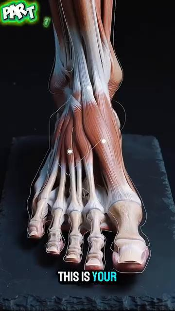
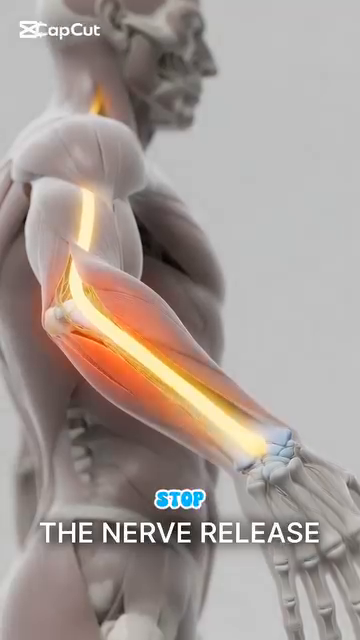
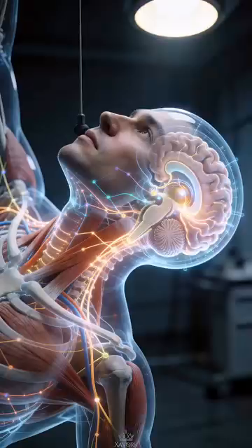

# DD7 — Hệ Thống Cảm Biến — Vòng Phản Hồi, PV So Với SV, Và Sửa Lỗi

*Deep Dive #7 — Dự Án Giải Phẫu & Hình Học Cho Người Chơi Tennis 3.5 → 4.5*

*Được xây dựng từ cẩm nang 20 chương về cảm nhận cơ thể tại `Cẩm nang về cảm nhận cơ thể trong tennis/` và `Proprioception in Tennis`*

---

## Bản Đồ Tài Liệu

**Lớp còn thiếu.** Các deep dive trước của bạn (DD1–DD6) bao quát **phần cứng** (góc độ, lò xo, thần kinh, cơ, xương) và **bộ điều khiển** (vùng não, các lớp quyết định). DD này bao quát **các cảm biến** — 5 kênh phản hồi về những gì cơ thể ĐANG THỰC SỰ làm, để bộ điều khiển có thể so sánh **Giá Trị Thực Tế (PV — Process Value)** với **Giá Trị Đặt (SV — Set Value)** và sửa lỗi.

**5 kênh cảm biến** — **cảm nhận bản thể** (khớp của tôi đang ở đâu), **bàn chân** (mặt đất đang ở đâu), **bàn tay** (vợt đang làm gì), **mắt** (bóng đang ở đâu + sân đang ở đâu), **tai + tiền đình** (đầu tôi đang ở đâu trong không gian + âm thanh tiếp xúc đến từ đâu).

**Vòng điều khiển PV/SV** — mỗi cú đánh là một bộ điều khiển đang cố làm cho PV khớp với SV. **Khi PV ≠ SV, có một lỗi.** Cơ thể có 3 cách để sửa: (1) phản hồi trực tiếp (tốt — thấy được trong lúc đánh), (2) phản hồi sau cú đánh (tốt hơn — qua nhiều cú đánh), (3) sửa lỗi dự đoán trước (tốt nhất — trước khi cú đánh bắt đầu).

---

## Mục Lục

| # | Chương |
| --- | --- |
| 1 | Góc Nhìn Kỹ Thuật Điều Khiển Về Tennis |
| 2 | 5 Kênh Cảm Biến |
| 3 | Kênh 1 — Cảm Nhận Bản Thể (Giác Quan Thứ 6 Ẩn Giấu) |
| 4 | Kênh 2 — Bàn Chân (Tiếp Xúc Mặt Đất Như PV) |
| 5 | Kênh 3 — Bàn Tay (Grip Vợt Như PV) |
| 6 | Kênh 4 — Mắt (Thị Giác Như Nguồn PV + SV) |
| 7 | Kênh 5 — Tai + Tiền Đình (Âm Thanh + Vị Trí Đầu) |
| 8 | 3 Loại Vòng Phản Hồi |
| 9 | Sửa Lỗi: Từ Lỗi Đến Tinh Chỉnh |
| 10 | Chu Trình Cảm Nhận Cơ Thể 5 Pha (Tập Trung Nội Tại So Với Ngoại Tại) |
| 11 | Tập Luyện Các Cảm Biến (Bài Tập) |
| 📋 | Thẻ Tóm Tắt Hệ Thống Cảm Biến |

---

* * *

# Chương 1 — Góc Nhìn Kỹ Thuật Điều Khiển Về Tennis

**Mỗi cú đánh tennis là một hành động được điều khiển bằng phản hồi.** Não bạn đặt một Giá Trị Đặt (SV) — "tôi muốn một cú thuận tay dọc dây, tốc độ 70%, có topspin." Cơ thể bạn thực thi. Các CẢM BIẾN của bạn báo cáo lại Giá Trị Thực Tế (PV) — "Mặt vợt có khép đúng lúc không? Cổ tay có khóa không? Bàn chân có tiếp đất dưới hông không?"

**Chuỗi** — **SV (mục tiêu của não) → Bộ điều khiển (vỏ não vận động) → Bộ truyền động (cơ) → Hành động cơ thể (cú vung) → Môi trường (đường bay bóng) → Cảm biến (mắt, tai, cảm nhận bản thể) → Phản hồi về não → Sửa lỗi → SV được cập nhật.**

**Nhận định chủ chốt** — hầu hết hướng dẫn tennis tập trung vào SV và Bộ điều khiển ("vung từ thấp lên cao", "xoay hông của bạn"). Nó KHÔNG tập trung vào CÁC CẢM BIẾN. **Người chơi cải thiện cảm biến của họ tiến bộ nhanh hơn** so với người chơi cải thiện bộ điều khiển của họ.

**Tài liệu nguồn nói trúng điều này** (Ch.1, "Tỉnh Thức Cơ Thể"): *"Khi bạn chỉ tập trung vào quả bóng (vật thể bên ngoài), bạn bỏ quên cỗ máy đang tạo ra cú đánh (cơ thể của chính bạn)."* Dịch nghĩa: khi bạn chỉ tập trung vào bóng (tập trung ngoại tại), bạn quên mất cơ thể (các cảm biến nội tại).

**5 kênh cảm biến** là 5 nguồn PV. Não nhận PV từ cả 5, so sánh với SV, và hoặc là (a) xác nhận khớp (không cần sửa), (b) phát hiện lỗi (sửa trực tiếp), hoặc (c) điều chỉnh SV cho cú đánh tiếp theo (sửa dự đoán trước).

*Cue chủ đạo:* "Tập luyện các cảm biến, không chỉ cú vung."

* * *

# Chương 2 — 5 Kênh Cảm Biến

| # |
| --- |
| **1** |
| **Kênh 4 — Bàn chân |
|  |
| **Hình 0a |
|  |
| **Hình 0b |
|  |
| **Hình 0c |
|  |
| **Hình 0d |
|  |
| **Hình 0e |
|  |
| **Hình 0f |
| **3** |
| **4** |
| **5** |

**5 kênh độc lập nhưng được tích hợp.** Mỗi kênh chạy ở tốc độ riêng. Não CÂN NHẮC chúng theo mức độ liên quan:

**Với cú đỡ giao bóng (tốc độ cao, hướng chưa biết)**: mắt (bóng sẽ rơi ở đâu) > bàn chân (phản xạ split-step) > cảm nhận bản thể (vị trí cơ thể) > bàn tay (grip vào phút chót) > tai (âm thanh tiếp xúc)

**Với vô-lê (cự ly gần, đã ở vị trí sẵn sàng)**: bàn tay (mặt vợt) > mắt (đối thủ) > cảm nhận bản thể (góc cánh tay) > tai (âm thanh tiếp xúc để đặt bóng) > bàn chân (đã ở vị trí)

**Với giao bóng (kiểm soát hoàn toàn)**: cảm nhận bản thể (căn thời gian chuỗi động học) > bàn tay (grip và giải phóng) > mắt (mục tiêu) > bàn chân (tung bóng) > tai (xác nhận)

*Cue chủ đạo:* "5 cảm biến. 5 tốc độ. Não cân nhắc chúng theo từng cú đánh."

* * *

# Chương 3 — Kênh 1 — Cảm Nhận Bản Thể (Giác Quan Thứ 6 Ẩn Giấu)

**Cơ thể có 5 giác quan ai cũng biết** (thị giác, thính giác, xúc giác, vị giác, khứu giác) **+ 1 giác quan mà hầu như không người chơi phong trào nào nghĩ đến**: **cảm nhận bản thể (proprioception)** — cảm giác về vị trí cơ thể bạn trong không gian, mà không cần nhìn.

**Nhắm mắt lại. Giơ tay phải lên trên đầu.** Bạn biết tay mình ở đâu mà không cần nhìn thấy nó. Đó là cảm nhận bản thể. **Nó hoạt động 24/7** — kể cả khi bạn đang ngủ.

**Phần cứng của cảm nhận bản thể** (đã được bàn chi tiết ở DD3 Ch.3 và DD5 Ch.7):

|  |
|  |
|  |
|  |
|  |
|  |

**Độ chính xác của cảm nhận bản thể theo từng khớp** (người chơi trình 4.0 điển hình, từ DD1 Ch.3 và DD3 Ch.3):

|  |
|  |
|  |
|  |
|  |
|  |
|  |
|  |

**Vì sao cảm nhận bản thể quan trọng hơn thị giác lúc tiếp xúc** — tại thời điểm tiếp xúc, mắt bạn KHÔNG THỂ theo dõi bóng (VOR ổn định chúng, nhưng xử lý thị giác vẫn mất 30–50 ms). **Cảm nhận bản thể của bạn nói cho bạn biết vợt ở đâu trong mili giây đó** — và đó là phản hồi duy nhất bạn có.

**Khoảng cách cảm nhận bản thể giữa trình 3.5 và 4.5** — người chơi trình 3.5 có cảm nhận bản thể kém hơn ~30%–40% so với người chơi trình 4.5. **Khoảng cách này thu hẹp khi tập luyện.** Các bài tập cụ thể (giữ thăng bằng nhắm mắt, đứng một chân, khớp vị trí vợt) cải thiện cảm nhận bản thể 30%–50% sau 8 tuần.

**Sự suy giảm ở tuổi 50+** — cảm nhận bản thể suy giảm ~10%–15% mỗi thập kỷ sau tuổi 50. **Đây là lý do vì sao người chơi lớn tuổi mất thăng bằng.** Đó không phải là một "vấn đề thăng bằng" — đó là một vấn đề CẢM BIẾN. Hãy tập luyện cảm biến đó.

*Cue chủ đạo:* "Nhắm mắt lại. Tin tưởng khớp của bạn. Chúng biết."

* * *

# Chương 4 — Kênh 2 — Bàn Chân (Tiếp Xúc Mặt Đất Như PV)

**Bàn chân VỪA là cảm biến VỪA là bộ truyền động.** Nó cảm nhận mặt đất (PV) VÀ nó truyền lực (hành động). Hầu hết người chơi chỉ tập luyện nửa bộ truyền động. Họ quên nửa cảm biến.

**Phần cứng cảm biến của bàn chân** (từ Anatomy_Lab DD7):

|  |
|  |
|  |
|  |
|  |
|  |

**Phản xạ bàn chân 30 ms** — các đầu dây thần kinh của bàn chân kích hoạt một phản xạ trong **30 mili giây** — **NHANH HƠN suy nghĩ có ý thức (~200 ms)**. **Phản xạ này CHÍNH LÀ cơ chế split-step.**

**Góc nhìn kỹ thuật điều khiển** — cảm biến bàn chân chạy VÒNG PHẢN HỒI NHANH NHẤT trong cơ thể bạn. **SV: "hãy thăng bằng."** PV từ bàn chân: "tôi có thăng bằng không?" **Nếu PV ≠ SV, phản xạ bàn chân kích hoạt trong vòng 30 ms.** Não có ý thức (vỏ não) chỉ biết về sự mất thăng bằng 170 ms sau đó.

**3 nguồn PV của bàn chân**:

**1. Phân bố áp lực (PV-áp lực)** — trọng lượng của bạn nằm ở đâu trên mỗi bàn chân. **Đứng một chân**: bạn cảm thấy áp lực dồn về ức bàn chân và ngón cái. **Đây là cách cơ thể bạn báo cho bạn biết trọng tâm của bạn ở đâu.**

**2. Kết cấu bề mặt (PV-kết cấu)** — sân đất nện, sân cứng, sân cỏ. Mỗi bề mặt có ma sát khác nhau. **Bàn chân bạn cảm nhận điều này và điều chỉnh lực đẩy chân.**

**3. Thời điểm rung động (PV-tác động)** — khi bàn chân bạn tiếp đất, bạn CẢM NHẬN thời điểm tiếp xúc. **PV về thời điểm này then chốt cho việc căn thời gian split-step.**

**Cue "bén rễ"** — tài liệu nguồn (Ch.1) dùng thuật ngữ "Rooting" (Nghệ Thuật Rễ Cây). **Hãy tưởng tượng bàn chân bạn như rễ cây** — lan rộng, bám chặt, cảm nhận. **Mỗi lần đẩy chân đều bắt đầu bằng việc bàn chân cảm nhận**.

*Cue chủ đạo:* "Bàn chân là cảm biến trước, động cơ sau."

* * *

# Chương 5 — Kênh 3 — Bàn Tay (Grip Vợt Như PV)

**Bàn tay báo cáo lại những gì vợt đang làm.** Áp lực grip, góc mặt vợt, độ rung, vị trí trong không gian. **Không có PV từ bàn tay, bạn không thể tinh chỉnh vợt.**

**Phần cứng cảm biến của bàn tay**:

|  |
|  |
|  |
|  |
|  |
|  |
|  |

**4 nguồn PV của bàn tay**:

**1. Áp lực grip (PV-grip)** — bàn tay báo cáo lại bạn đang siết chặt bao nhiêu. **3/10 lúc nghỉ, 7/10 lúc tiếp xúc, 3/10 lúc follow-through** (quy tắc áp lực grip từ Anatomy_Lab DD3). **Hầu hết người chơi phong trào cầm 8/10 liên tục** — họ MẤT PV áp lực vì họ luôn ở mức tối đa.

**2. Góc mặt vợt (PV-mặt vợt)** — ngón cái + ngón trỏ cảm nhận hướng của mặt vợt. **Mở = slice, khép = topspin, thẳng đứng = phẳng.** PV này được xử lý ~50 ms trước tiếp xúc — bạn điều chỉnh trong lúc vung.

**3. Rung động lúc tiếp xúc (PV-tác động)** — tại thời điểm tiếp xúc, độ rung của bóng truyền qua vợt đến tay bạn. **Điểm ngọt = rung nhẹ (tiếp xúc sạch). Lệch tâm = rung lớn (bị vặn).** PV này được xử lý trong ~10–30 ms.

**4. Vị trí vợt (PV-vị trí)** — bàn tay biết vợt đang ở đâu trong không gian (cảm nhận bản thể). **Lúc tiếp xúc, bạn biết vợt cao, thấp, trái, hay phải so với trung tâm cơ thể bạn** — mà không cần nhìn.

**Vấn đề "bàn tay chết"** — nhiều huấn luyện viên nói "thư giãn grip của bạn." Nhưng nếu bàn tay HOÀN TOÀN thư giãn, **bạn mất cả PV-grip LẪN PV-mặt vợt**. Cue tốt hơn: "Bàn tay hoạt bát, ngón tay mềm." **Bàn tay nên SỐNG ĐỘNG** — liên tục nhận PV — kể cả giữa các cú đánh.

**Quy tắc "bàn tay mềm, tiếp xúc chắc"** — tài liệu nguồn (Ch.12 trái tay) viết: "Bàn tay mềm, tiếp xúc chắc." **Bàn tay đủ mềm để hấp thụ phản hồi, đủ chắc để truyền lực.** Đây là sự cân bằng căng thẳng tối đa hóa cả độ nhạy PV LẪN sức mạnh.

*Cue chủ đạo:* "Bàn tay hoạt bát, ngón tay mềm. PV mỗi mili giây."

* * *

# Chương 6 — Kênh 4 — Mắt (Thị Giác Như Nguồn PV + SV)

**Mắt là kênh đầu vào DUY NHẤT trong tennis.** Não KHÔNG có tiếp xúc trực tiếp với bóng. Mọi thứ não biết về bóng đều đến qua thị giác (và đôi khi qua âm thanh để phân xử bóng ra biên).

**Thị giác có vai trò kép** — nó cung cấp CẢ SV (nơi tôi muốn đánh) LẪN PV (chuyện gì đang xảy ra). **Đây là điều độc đáo trong số 5 kênh.** Cảm nhận bản thể, bàn chân, bàn tay, tai chỉ cung cấp PV. **Mắt cung cấp CẢ HAI hướng.**

**PV thị giác (đầu vào)**:

**1. Quỹ đạo bóng (PV-bóng)** — bóng đang ở đâu, sẽ ở đâu, nhanh bao nhiêu, xoáy bao nhiêu. **Được cập nhật mỗi 30–50 ms trong thị giác có ý thức**, nhưng mỗi 15 ms trong tiềm thức (tiền đình + lưới thần kinh).

**2. Vị trí sân (PV-sân)** — đường biên ở đâu, đối thủ ở đâu, bạn ở đâu. **Được cập nhật ít thường xuyên hơn** (~200 ms) nhưng luôn nằm trong thị giác ngoại biên.

**3. Cơ thể đối thủ (PV-đối thủ)** — đối thủ đang làm gì? Vị trí vợt, chuyển trọng lượng, xoay vai. **Đây là nguồn SV cho cú đánh CỦA BẠN** (bạn chọn dựa trên những gì họ cho bạn).

**SV thị giác (mục tiêu)**:

**1. Vị trí mục tiêu (SV-mục tiêu)** — nơi bạn muốn bóng rơi. **SV này được đặt TRƯỚC cú đánh** (~200 ms trước). Đó là mục tiêu mà toàn bộ cơ thể cố gắng đạt được.

**2. Ý định quỹ đạo (SV-quỹ đạo)** — phẳng, topspin, slice, lốp bóng. **Được đặt bởi grip + góc mặt vợt + đường vợt.**

**3. Ý định tốc độ (SV-tốc độ)** — hết lực, 70%, 50%, chạm nhẹ. **Được đặt bởi tốc độ vung.**

**Mắt Tĩnh Lặng** (đã được bàn ở DD3 Ch.2 và được xác nhận bởi Anatomy_Lab DD8): người chơi đỉnh cao khóa ánh nhìn vào vùng tiếp xúc trong **0,3–0,5 giây**. Người chơi phong trào: 0,1–0,2 giây. **Mắt tĩnh lặng càng dài = độ căn thời điểm càng tốt = chất lượng cú đánh càng tốt.**


**Hình 4 / Hình 4** — Theo dõi thị giác và mắt tĩnh lặng trong thực tế. Người chơi đỉnh cao khóa ánh nhìn vào vùng tiếp xúc trong 0,3–0,5 giây, lâu hơn người chơi phong trào (0,1–0,2 giây). Ánh nhìn duy trì này là điều cho phép căn thời điểm chính xác.


**Hình 5 / Hình 5** — Chu trình thị giác 5 pha: Nhận thức rộng → Khóa vào → Tập trung hẹp → Mắt tĩnh lặng → Mở rộng lại. Mỗi pha có một thời gian có thể đo được (0,5 giây / 0,3 giây / 0,1 giây / 0,05–0,1 giây / 0,2 giây).


**Hình 6 / Hình 6** — Phản ứng thị giác tại thời điểm tiếp xúc. Lúc va chạm, mắt không thể theo dõi — VOR ổn định chúng. **Cảm nhận bản thể tiếp quản** trong 50 ms cuối cùng trước tiếp xúc.

**Sự suy giảm thị giác ở tuổi 50+** — lão thị (mất khả năng lấy nét gần) bắt đầu ở tuổi 40–45. Thị giác ngoại biên thu hẹp ~10°–20° đến tuổi 70. **Dùng bóng vàng trên sân tối** để có độ tương phản tối đa. **Quay đầu thường xuyên hơn** để bù cho việc thu hẹp ngoại biên.

*Cue chủ đạo:* "Mắt đặt mục tiêu. Mắt kiểm tra kết quả. Cả hai mắt, cả hai nhiệm vụ."

* * *

# Chương 7 — Kênh 5 — Tai + Tiền Đình (Âm Thanh + Vị Trí Đầu)


**Hình 1 / Hình 1** — 3 ống bán khuyên (trước, sau, ngang) phát hiện xoay đầu. 2 cơ quan sỏi tai phát hiện gia tốc tuyến tính và nghiêng đầu. Đây là giải phẫu tiền đình HOÀN CHỈNH — một trong những cảm biến tinh vi nhất của cơ thể.


**Hình 2 / Hình 2** — Cận cảnh giải phẫu tiền đình cho thấy các bóng cảm giác (ampullae — cơ quan cảm giác tại đáy mỗi ống bán khuyên) và các cơ quan sỏi tai (soan nang + cầu nang). Các bóng cảm giác chứa các tế bào lông uốn cong khi dịch nội bạch huyết di chuyển trong lúc đầu xoay.

**Tai cung cấp hai kênh** — âm thanh (cho chất lượng tiếp xúc + tín hiệu đối thủ) VÀ tiền đình (cho vị trí đầu + thăng bằng). **Chúng chạy song song nhưng cảm thấy khác nhau.**

**PV-âm thanh của tai** (âm thanh lúc tiếp xúc):

|  |
|  |
|  |
|  |
|  |
|  |
|  |
|  |

**Thời gian PV-âm thanh của tai** — âm thanh là kênh cảm giác NHANH NHẤT sau các phản xạ. **~10–15 ms từ tiếp xúc đến não.** Đây là lý do vì sao bạn biết NGAY LẬP TỨC liệu cú đánh có sạch hay không.

**Tín hiệu âm thanh của đối thủ** — âm thanh di chuyển chân của đối thủ báo cho bạn biết họ đang ở đâu. **Âm thanh tiếp xúc của đối thủ báo cho bạn biết độ xoáy và tốc độ.**


**Hình 3 / Hình 3** — Sỏi tai (otoconia): những tinh thể canxi cacbonat nhỏ trong cơ quan sỏi tai. **Chúng di chuyển theo trọng lực** và báo cho não biết hướng nào là LÊN. Mất sỏi tai (hoặc bị bong ra do chấn động roi) = chóng mặt (BPPV — chóng mặt tư thế kịch phát lành tính).


**Hình 3a / Hình 3a** — **HỆ THỐNG KIỂM SOÁT THĂNG BẰNG HOÀN CHỈNH** (hình ảnh bạn cung cấp — "HỆ THỐNG KIỂM SOÁT THĂNG BẰNG CƠ THỂ"). 6 thành phần theo trình tự: **Vị trí đầu → Hệ tiền đình → VOR → Mắt → Não bộ → Các bộ phận cơ thể**, với một vòng phản hồi cong trở lại vị trí đầu. **Đây là sơ đồ chủ đạo cho toàn bộ chương.** Khi cảm biến tiền đình thay đổi (ví dụ đầu xoay), nó kích hoạt VOR (ổn định mắt), gửi PV thị giác đến não, tích hợp với cảm nhận bản thể, ra lệnh phản ứng cơ, thay đổi vị trí đầu — khép kín vòng lặp. **Mỗi khoảnh khắc thăng bằng trong tennis là vòng lặp này đang chạy trong thời gian thực.**

**PV-thăng bằng tiền đình** (vị trí đầu trong không gian):

|  |
|  |
|  |
|  |
|  |
|  |

**PV-xoay tiền đình** — ở mỗi cú giao bóng, đầu xoay ~120° trong <0,5 giây. **Hệ tiền đình theo dõi sự xoay này theo thời gian thực.**

**Vì sao "giữ đầu yên" quan trọng** — khi đầu bạn ổn định, mắt bạn có thể khóa vào vùng tiếp xúc (mắt tĩnh lặng). Khi đầu bạn nảy, mắt bạn cũng nảy. **VOR (phản xạ tiền đình-mắt) giữ ánh nhìn của bạn ổn định TRONG LÚC đầu chuyển động.**

**Sự suy giảm tiền đình ở tuổi 50+** — các tế bào lông chết sau tuổi 40. Đến tuổi 60, giảm ~20%–30% độ nhạy tiền đình. **Đây là lý do vì sao người chơi lớn tuổi mất thăng bằng khi đổi hướng nhanh.** Tập luyện tiền đình: xoay đầu chậm (10 lần mỗi hướng hằng ngày) + đứng một chân kèm xoay đầu (30 giây hằng ngày).

**Sự kết hợp tai + tiền đình cho thăng bằng** — tai + tiền đình hoạt động cùng nhau cho thăng bằng. **Tai nghe cơ thể đang ngã, tiền đình phát hiện đầu đang xoay.** Tennis đòi hỏi CẢ HAI cùng lúc.

*Cue chủ đạo:* "Nghe cú đánh. Cảm nhận đầu. Cả hai đều cho bạn PV."

* * *

## 7.1 — Đọc Vòng Kiểm Soát Thăng Bằng (Đi Từng Bước)

Sơ đồ (Hình 3a) cho thấy **vòng kiểm soát thăng bằng hoàn chỉnh**. Hãy để tôi dẫn bạn đi qua từng bước, trong bối cảnh tennis — sử dụng một khoảnh khắc thực tế từ trận đấu của bạn.

**Khoảnh khắc** — đối thủ đánh một cú thuận tay chéo sân sắc bén. Bạn thực hiện split-step, đẩy chân trái, và xoay đầu để theo dõi bóng. **Chuyện gì xảy ra trong cơ thể bạn trong 200 ms tiếp theo?**

**Bước 1 — Vị trí đầu (Head position)** — đầu bạn xoay ~90° sang phải trong 0,15 giây. Các ống bán khuyên trong tai trong phát hiện sự xoay này theo thời gian thực. **PV ở đây là: "đầu đang di chuyển với tốc độ 600°/giây sang phải."**

**Bước 2 — Hệ tiền đình (Vestibular system)** — 3 ống (trước, sau, ngang) mỗi ống kích hoạt theo trục nào chứa sự xoay. Ống ngang kích hoạt mạnh nhất (đó là một xoay yaw). Não nhận 3 tín hiệu PV: ống ngang (tối đa), ống trước (nhỏ), ống sau (nhỏ).

**Bước 3 — VOR (Phản xạ tiền đình-mắt)** — não gửi một tín hiệu bù trừ đến các cơ mắt: xoay mắt SANG TRÁI với tốc độ 600°/giây, để bù cho đầu đang xoay sang phải. **Mắt vẫn khóa vào bóng, mặc dù đầu đang xoay.** Đây chính là cơ chế mắt tĩnh lặng.

**Bước 4 — Mắt (Eye)** — võng mạc của mắt nhận hình ảnh bóng. **Nó KHÔNG di chuyển** (VOR đang giữ nó ổn định). Thần kinh thị giác kích hoạt: "bóng ở vị trí X, Y trên võng mạc, di chuyển chậm về phía ngoại biên." **PV là: "bóng vẫn còn 0,3 giây nữa mới đến tôi, đang tiến gần với tốc độ 1,2 m/giây."**

**Bước 5 — Não bộ (Brain)** — não TÍCH HỢP toàn bộ PV: tiền đình (đầu đang xoay phải), VOR (mắt ổn định), mắt (vị trí bóng). Nó so sánh với SV (nơi tôi muốn đánh). **Quyết định: "đây là một cú thuận tay, đỡ chéo sân, tốc độ 70%."**

**Bước 6 — Các bộ phận cơ thể (Body parts)** — não gửi lệnh qua vỏ não vận động → tủy sống → cơ. **Các cơ kích hoạt theo trình tự**: đẩy chân phải, xoay thân, cocking cánh tay phải, vung. Hệ cảm nhận bản thể báo cáo lại PV: "vai ở 90°, khuỷu tay ở 110°, cổ tay đã khóa."

**Bước 7 — Vòng phản hồi (Feedback loop)** — cơ thể thay đổi vị trí đầu (cú vung làm đầu di chuyển), điều này thay đổi PV tiền đình, điều này kích hoạt lại VOR, điều này ổn định lại mắt, điều này nhận được vị trí bóng mới, điều này quay lại não. **Vòng lặp chạy LIÊN TỤC, ~50 ms mỗi chu kỳ.**

**Ý nghĩa với tennis** — nếu BẤT KỲ liên kết nào trong vòng lặp này bị đứt gãy, thăng bằng của bạn thất bại. **Sự suy giảm tuổi 50+ tác động mạnh nhất đến liên kết tiền đình** (tế bào lông chết, độ nhạy giảm 20–30%). Đó là lý do vì sao người chơi lớn tuổi cảm thấy "mất thăng bằng" khi đổi hướng nhanh.

**3 điểm rút ra từ sơ đồ này** — (1) **Thăng bằng không phải là một thứ đơn lẻ** — đó là một hệ thống 6 thành phần, (2) **VOR là anh hùng thầm lặng** — không có nó, mắt bạn sẽ nảy mỗi khi đầu bạn di chuyển, (3) **Vòng phản hồi nghĩa là thăng bằng không bao giờ "hoàn thành"** — nó chạy liên tục, kể cả khi bạn nghĩ mình đang đứng yên.

*Cue chủ đạo:* "Sơ đồ chính là chương. Hãy đọc nó chậm rãi. Mỗi ô là một cảm biến. Mỗi mũi tên là một vòng phản hồi. Mỗi khoảnh khắc trên sân là vòng lặp này đang chạy."

* * *

# Chương 8 — 3 Loại Vòng Phản Hồi

**Mỗi cú đánh tennis tạo ra 3 loại phản hồi**. Chúng xảy ra ở những thời điểm khác nhau và có tác động khác nhau.

|  |
|  |
|  |
|  |
|  |

**Lỗi của người chơi trình 3.5** — hầu hết người chơi trình 3.5 tập trung vào **LOẠI 2 (sau cú đánh)** vì đó là điều họ được bảo phải nhìn. "Nhìn bóng" = phản hồi thị giác sau cú đánh.

**Sự tập trung của người chơi trình 4.5** — họ dùng **LOẠI 1 (trực tiếp) VÀ LOẠI 3 (dự đoán trước)**. **Trực tiếp**: họ cảm nhận lỗi giữa cú vung qua cảm nhận bản thể của bàn tay. **Dự đoán trước**: họ nhớ "3 cú thuận tay vừa rồi đều dài" và điều chỉnh cú đánh tiếp theo TRƯỚC KHI nó bắt đầu.

**Ý nghĩa với việc tập luyện** — để trở thành trình 4.5, bạn cần:

|  |
|  |
|  |
|  |
|  |

**Loại bị bỏ qua nhiều nhất** — LOẠI 3 (dự đoán trước) là loại ít được tập luyện nhất. **Hầu hết người chơi lặp lại CÙNG một cú đánh 1000 lần mà không thích nghi.** Họ chỉ thích nghi khi có người bảo họ làm vậy. **Sự thích nghi tự chủ** đến từ việc tập luyện Loại 3.

*Cue chủ đạo:* "Ba vòng phản hồi. Tập luyện cả ba. Hầu hết chỉ tập luyện một."

* * *

# Chương 9 — Sửa Lỗi: Từ Lỗi Đến Tinh Chỉnh

**Lỗi là NGUỒN của việc học.** Mỗi lỗi đánh hỏng không cần thiết đều chứa thông tin. **PV ≠ SV. Cơ thể học để làm chúng khớp nhau.**

**Thứ bậc sửa lỗi** (từ nhanh nhất đến chậm nhất):

|  |
|  |
|  |
|  |
|  |
|  |
|  |

**Vấn đề "chết dần bởi những sai lệch nhỏ"** — hầu hết người chơi trình 3.5 phạm những lỗi NHỎ qua 1000 cú đánh. **Mỗi lỗi lệch < 5% so với SV.** Tác động tích lũy: một mẫu hình cú đánh lệch 30% so với SV, nhưng người chơi không NHẬN RA vì mỗi lỗi riêng lẻ đều nhỏ.

**Cách sửa — những lỗi lớn có chủ đích** — luyện tập tạo ra những lỗi LỚN (lệch 50% so với SV) có chủ đích, rồi sửa trở lại SV. **Điều này huấn luyện não NHẬN RA tín hiệu lỗi.** Không có sự tập luyện này, các lỗi 5% vẫn ở trạng thái vô hình.

**"Quy tắc 10.000 lần lặp" được xem lại** — từ DD3 Ch.4: hạch nền lưu sẵn một mẫu hình vận động sau ~3.000–10.000 lần lặp. **Nhưng bộ nhớ lưu sẵn chỉ tốt tương đương với quá trình SỬA LỖI trong những lần lặp đó.** Lần lặp không có phản hồi = không có học tập.

**Quy tắc "luyện tập có chủ đích"** — nghiên cứu của Anders Ericsson (1993): **sự khác biệt giữa chuyên gia và người nghiệp dư KHÔNG PHẢI là lượng thời gian luyện tập. Đó là CHẤT LƯỢNG phản hồi trong lúc luyện tập.** Pro luyện tập với sự tập trung hoàn toàn + sửa lỗi ngay lập tức. Người nghiệp dư luyện tập theo chế độ lái tự động.

*Cue chủ đạo:* "Lỗi là những người thầy. Hãy làm chúng to lên. Rồi sửa."

* * *

# Chương 10 — Chu Trình Cảm Nhận Cơ Thể 5 Pha (Tập Trung Nội Tại So Với Ngoại Tại)

**Tài liệu nguồn (cẩm nang 20 chương về cảm nhận cơ thể) định nghĩa một chu trình 5 pha** cho nhận thức cơ thể nội tại trong lúc chơi tennis. Đây là mối liên kết giữa lớp cảm biến và lớp bộ điều khiển.

| Pha |
| --- |
| **1. NHẬN THỨC RỘNG (0,5 giây trước) |
| **2. BÉN RỄ (0,3 giây trước) |
| **3. TẠO KHÔNG GIAN (0,1 giây trước) |
| **4. VUNG (trong lúc)** |
| **5. TIẾP XÚC + SAU ĐÓ (0,1 giây sau) |

**Cue "tập trung nội tại"** — tài liệu nguồn (Ch.1) nhấn mạnh: **"Tư duy hướng nội"** (Nhận Thức Vận Động Nội Tại). Các huấn luyện viên bậc thầy Federer, Nadal, Djokovic — khi được hỏi họ quyết định đánh gì như thế nào, họ mô tả các CẢM GIÁC NỘI TẠI (trọng lượng, thăng bằng, cảm giác vung), KHÔNG PHẢI các mục tiêu ngoại tại (bóng bay đi đâu).

**Nghiên cứu của Wulf** — Gabriele Wulf (2007, 2013) cho thấy **tập trung nội tại (vào cơ thể) tạo ra việc học NHANH HƠN so với tập trung ngoại tại (vào kết quả)** đối với các kỹ năng vận động. **Đây là điều ngược với những gì hầu hết huấn luyện viên dạy.**

**Ngoại lệ — cho các quyết định chiến thuật** — Wulf cũng cho thấy tập trung NGOẠI TẠI tốt hơn cho các QUYẾT ĐỊNH CHIẾN THUẬT (đánh vào đâu, khi nào đổi hướng). **Dùng NỘI TẠI cho cơ chế cú đánh, NGOẠI TẠI cho chiến thuật.**

**Cue thở 3-3-3** — tài liệu nguồn (Ch.5) khuyến nghị: **hít vào 3 giây trong lúc nhận thức rộng, giữ 3 giây trong lúc bén rễ, thở ra 3 giây trong lúc vung.** **Điều này đồng bộ hơi thở với việc thu nhận PV.** Thở ra trong lúc vung cũng ổn định cột sống thông qua áp lực trong lồng ngực.

*Cue chủ đạo:* "Nội tại cho cơ thể, ngoại tại cho bóng. Chuyển đổi tại tiếp xúc."

* * *

# Chương 11 — Tập Luyện Các Cảm Biến (Bài Tập)

**5 bài tập cảm biến** (1 cho mỗi kênh, hằng ngày). 5 phút × 5 cảm biến = 25 phút/ngày. Kết hợp với thói quen 16 phút từ DD6 = ~40 phút/ngày. **Đây là chương trình cảm nhận cơ thể đầy đủ.**

|  |
|  |
|  |
|  |
|  |
|  |
|  |

**"Bài tập nhắm mắt"** (từ nguồn Ch.1) — bài tập trực tiếp nhất để "buộc" cảm nhận bản thể hoạt động khi thị giác bị loại bỏ:

**Các bước** — bạn tập tung bóng. Bạn theo dõi bóng bình thường. **Ở 0,5 giây trước tiếp xúc, NHẮM MẮT LẠI.** Đánh bóng với mắt nhắm. Giữ tư thế kết thúc 2 giây. Mở mắt. Kiểm tra vị trí bóng.

**Điều nó tiết lộ** — độ chính xác của cảm nhận bản thể của bạn. **Nếu hình dạng cú đánh của bạn giống hệt nhau khi nhắm mắt so với mở mắt, cảm nhận bản thể của bạn đã được hiệu chỉnh.** Nếu hình dạng sụp đổ, cảm nhận bản thể của bạn cần được tập luyện.

* * *

# Chương 12 — Bản Đồ Cảm Biến — Tổng Hợp Trực Quan Của 5 Kênh

**Chương này là một bản tóm tắt trực quan** — mỗi hình còn lại minh họa một khái niệm chính từ các chương trước. In chương này ra như một trang duy nhất cho túi vợt của bạn.

## 12.1 — Chuỗi Thời Gian Phản Ứng (Cảm Biến Đang Lão Hóa)


**Hình 7 / Hình 7** — Chuỗi thời gian phản ứng theo tuổi tác: 25 tuổi = 400 ms, 50 tuổi = 500 ms, 65 tuổi = 600 ms, 75 tuổi = 700 ms. Đây là **GIỚI HẠN TRÊN** về tốc độ giao bóng mà mỗi độ tuổi có thể đỡ được.

## 12.2 — Bộ Ba Cảm Giác Tuổi 50+ (Ba Cảm Biến Suy Giảm Cùng Nhau)


**Hình 8 / Hình 8** — Bộ ba cảm giác tuổi 50+: thị giác, tiền đình, VÀ cảm nhận bản thể đều suy giảm ĐỒNG THỜI. Hầu hết chương trình tập luyện chỉ tập trung vào một — các chương trình tập luyện thông minh tập luyện cả ba.


**Hình 9 / Hình 9** — Cách bù đắp: khi một cảm biến suy giảm, hãy tập luyện các cảm biến khác chăm chỉ hơn. Ví dụ, nếu tiền đình giảm → dựa nhiều hơn vào thị giác + cảm nhận bản thể. **Sự dự phòng là vũ khí bí mật của người chơi 50+.**

## 12.3 — Tích Hợp Vùng Não (Kết Nối Cảm Biến + Bộ Điều Khiển)



**Hình 10 / Hình 10** — Cách tất cả các vùng não hoạt động cùng nhau: vỏ não thị giác (PV-mắt) → tiểu não (căn thời gian) → vỏ não vận động (bộ điều khiển) → cơ (bộ truyền động) → cảm nhận bản thể (PV quay lại). **Vòng lặp khép kín qua phản hồi cảm giác.**


**Hình 11 / Hình 11** — Đường dẫn thần kinh: neuron cảm giác → tủy sống → thân não → đồi thị → vỏ não cảm giác → vỏ não vận động → tủy sống → cơ. **Tổng thời gian khứ hồi: ~50 ms.** Đây là tốc độ nhanh nhất mà cơ thể bạn có thể sửa một cú đánh.

## 12.4 — Nguyên Lý Dùng Nó Hoặc Mất Nó (Tennis Mang Tính Bảo Vệ)


**Hình 12 / Hình 12** — Nguyên lý "dùng nó hoặc mất nó" tuổi 50+. **Chính bản thân tennis là liều thuốc giải** cho sự suy giảm cảm giác. Người chơi 50+ chơi 3 lần/tuần duy trì 70-80% khả năng. Người chơi 50+ ngừng chơi mất chúng với tốc độ gấp 2 lần.

## 12.5 — Bản Đồ Hệ Thống Cảm Biến Hoàn Chỉnh (Một Trang)

**5 kênh cảm biến** được hình dung như một hệ thống hoàn chỉnh:

|  |
|  |
|  |
|  |
|  |
|  |
|  |

**Vòng phản hồi** — mỗi cảm biến nạp PV cho não, so sánh với SV và điều chỉnh:

```
SV (mục tiêu) → Bộ điều khiển (vỏ não vận động) → Bộ truyền động (cơ) → Cơ thể (cú vung)
   ↑                                                                              ↓
   └────────── Cảm biến (5 kênh) ←── Môi trường (bóng/sân) ←─────────────────────┘
```

**Thói quen hằng ngày** — 5 phút × 5 cảm biến = 25 phút/ngày tập luyện cảm biến. Kết hợp với thói quen 16 phút từ DD6 = **40 phút tổng chương trình cảm nhận cơ thể.** Đây là điều pro làm một cách tự nhiên. Người chơi phong trào phải làm điều này một cách có chủ đích.

**Điều cấp thiết ở tuổi 50+** — đến tuổi 50, bạn đã mất 10–30% mỗi cảm biến. **Bạn không thể chơi tennis giống như trước.** Nhưng bạn có thể chơi tennis TỐT HƠN bằng cách ĐIỀU CHỈNH hỗn hợp cảm biến: dựa nhiều hơn vào thị giác (bóng vàng, độ tương phản), nhiều hơn vào cảm nhận bản thể (bài tập quay chậm), nhiều hơn vào tiền đình (thăng bằng kèm xoay đầu).

*Cue chủ đạo:* "Năm cảm biến, ba vòng lặp, một cơ thể. Tập luyện cả năm, tập luyện cả ba, rồi chơi tennis."

* * *

## 📋 Thẻ Chương — Bản In

<div class="pocket-card">

<div class="pocket-card-title">HỆ THỐNG CẢM BIẾN — Ý TƯỞNG CHÍNH</div>

<div class="pocket-card-section">
<strong>🎯 MỘT Ý TƯỞNG LỚN</strong>
<p>Tennis là một hành động được điều khiển bằng phản hồi. PV (chuyện gì đang xảy ra) so với SV (bạn muốn gì) điều khiển mỗi cú đánh. Tập luyện 5 CẢM BIẾN.</p>
</div>

<div class="pocket-card-section">
<strong>5 CẢM BIẾN</strong>
<ul>
<li>Cảm nhận bản thể — góc khớp, sức căng cơ</li>
<li>Bàn chân — tiếp xúc mặt đất, phân bố áp lực</li>
<li>Bàn tay — grip vợt, góc mặt vợt, rung động</li>
<li>Mắt — vị trí bóng, mục tiêu, đối thủ</li>
<li>Tai + Tiền đình — âm thanh, vị trí đầu, thăng bằng</li>
</ul>
</div>

<div class="pocket-card-section">
<strong>3 VÒNG PHẢN HỒI</strong>
<ul>
<li>Trực tiếp (trong lúc đánh) — 10–50 ms — tay + chân + tiền đình</li>
<li>Sau cú đánh (sau khi bóng rơi) — 200–500 ms — mắt</li>
<li>Dự đoán trước (qua nhiều cú đánh) — vài phút — mẫu hình</li>
</ul>
</div>

<div class="pocket-card-section">
<strong>⚠️ LỖI HÀNG ĐẦU</strong>
<p>Chỉ tập luyện phản hồi LOẠI 2 (sau cú đánh, "nhìn bóng"). Hãy tập luyện CẢ 3 — đặc biệt là LOẠI 1 (trực tiếp) và LOẠI 3 (dự đoán trước).</p>
</div>

<div class="pocket-card-section">
<strong>🔁 BÀI TẬP</strong>
<p>BÀI TẬP NHẮM MẮT — bạn tập tung bóng. Nhắm mắt 0,5 giây trước tiếp xúc. Đánh. Mở mắt. Kiểm tra. 20 lần lặp hằng ngày. Kiểm tra độ chính xác cảm nhận bản thể.</p>
</div>

<div class="pocket-card-section">
<strong>💭 CUE CHỦ ĐẠO</strong>
<p>"Năm cảm biến, ba vòng lặp. Tập luyện sự khác biệt."</p>
</div>

</div>

* * *

## 🎯 Lời Kết

Bạn ơi, DD7 này hoàn thiện bức tranh. **DD1–DD6 = phần cứng (khớp, cơ, não). DD7 = các cảm biến (5 kênh phản hồi).** Cùng nhau: một hệ thống điều khiển hoàn chỉnh.

Tài liệu nguồn diễn đạt điều này hoàn hảo (Ch.17, "Giảm Lỗi"): *"Kỹ thuật vung tay hiếm khi là thủ phạm chính. Lỗi đánh hỏng thực chất là sự sụp đổ tạm thời của bản đồ không gian và hệ thống cảm nhận nội tại."* Dịch nghĩa: **lỗi đánh hỏng không cần thiết không phải là thất bại cơ chế cú đánh. Đó là những THẤT BẠI CẢM BIẾN.**

Điều này thay đổi cách bạn nên tập luyện. **Ngừng chạy theo cú vung hoàn hảo. Bắt đầu mài sắc các cảm biến của bạn.**

* * *

**Nguồn**:

- **Nguồn chính**: Cẩm nang 20 chương về cảm nhận cơ thể (`Cẩm nang về cảm nhận cơ thể trong tennis/Vi_Nhan_Thuc_Co_The_Tennis_20_Chuong.docx` và các MD theo từng chương Ch.1–Ch.20) — nguồn chủ đạo của bạn về cảm nhận bản thể, tiếp đất bằng chân, split-step như một sự tái khởi động hệ thống, nhận thức chuỗi động học, hơi thở, và phản hồi xúc giác của vợt.
- **Nguồn hỗ trợ**: `proprioception_in_tennis.md` + `proprioception_in_tennis_detailed_vi.md`.
- **Tham chiếu chéo**: DD1 (Bản Đồ Góc Độ), DD2 (Khớp Như Lò Xo), DD3 (Nền Tảng Thần Kinh), DD4 (Thứ Bậc Cơ Bắp), DD5 (Kiến Trúc Xương), DD6 (Cơ Thể Tuổi 50+), Anatomy_Lab DD7 (bàn chân + 7.000 dây thần kinh), Anatomy_Lab DD8 (hệ thống điều khiển).
- **Nghiên cứu**: Gabriele Wulf (2007, 2013) về tập trung nội tại so với ngoại tại; Anders Ericsson (1993) về luyện tập có chủ đích; Vickers (1996, 2007) về mắt tĩnh lặng.

*Hết Deep Dive #7 — Hệ Thống Cảm Biến*
